---
hide:
  - toc
---

# Browse all assets

Choose a picture to review its inspiration, 3D model and available animations. The longer garden and Besties playgrounds reuse this cast, equipment and scenery. Each chapter has four ordinary enemy encounters, friendly residents and a boss. The revised courses add safe raised practice areas and memory checkpoints; the Besties can take hits throughout their routine. Source assets, review versions and thumbnail references are unchanged; the [playtest guide](playtest.md) describes their placement and gameplay.

**25 completed models · 1 partial model · 1 concept awaiting a model · 4 sound auditions · 6 fictional memory pictures**

The joint Besties concept is approved. Exact model and sound candidates remain available for review. [See what is in the playtest](playtest.md).

<nav class="catalog-jumps" aria-label="Asset categories">
<a href="#parody-characters">Parody characters</a>
<a href="#travelers">Travelers</a>
<a href="#world-and-keepsakes">World and keepsakes</a>
<a href="#equipment">Equipment</a>
<a href="#friendly-characters">Friendly characters</a>
<a href="#reference-sheets">Reference sheets</a>
<a href="#fictional-memories">Fictional memories</a>
<a href="#sound-auditions">Sound auditions</a>
</nav>

## Parody characters {#parody-characters}

The two Besties actors join four completed parody characters in the playtest library. Nap Captain and The One-Star Diva are paused.

[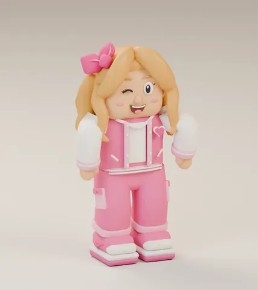{ .catalog-preview loading="lazy" decoding="async" width="640" height="480" }](reviews/bickering-besties/v001.md#bestie-pink)

### [Bestie Pink](reviews/bickering-besties/v001.md#bestie-pink)

3D model · v001 · In playtest

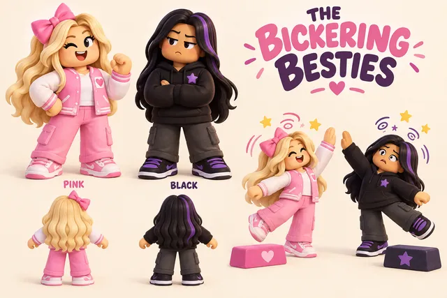Approved inspiration included

[{ .catalog-preview loading="lazy" decoding="async" width="640" height="480" }](reviews/bickering-besties/v001.md#bestie-black)

### [Bestie Black](reviews/bickering-besties/v001.md#bestie-black)

3D model · v001 · In playtest

Approved inspiration included

[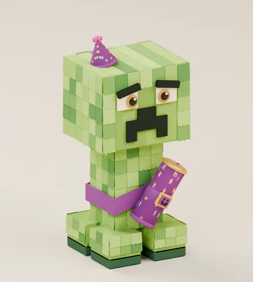{ .catalog-preview loading="lazy" decoding="async" width="640" height="480" }](reviews/mister-hiss/v001.md)

### [Mister Hiss](reviews/mister-hiss/v001.md)

3D model · v001 · In playtest

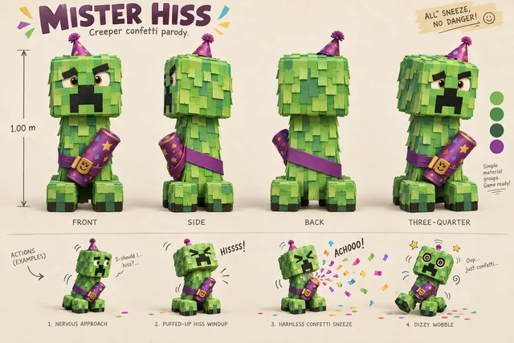Inspiration included

[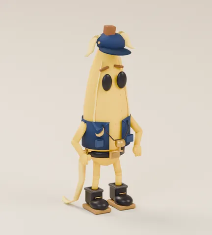{ .catalog-preview loading="lazy" decoding="async" width="640" height="480" }](reviews/peel-patrol/v001.md)

### [Peel Patrol](reviews/peel-patrol/v001.md)

3D model · v001 · In playtest

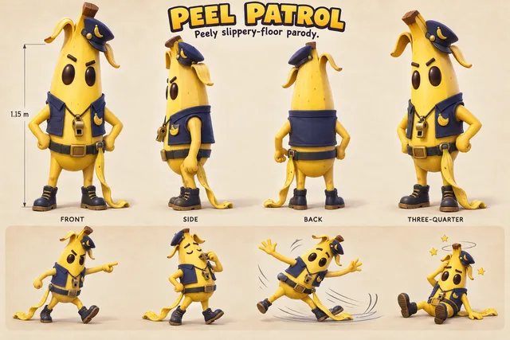Inspiration included

[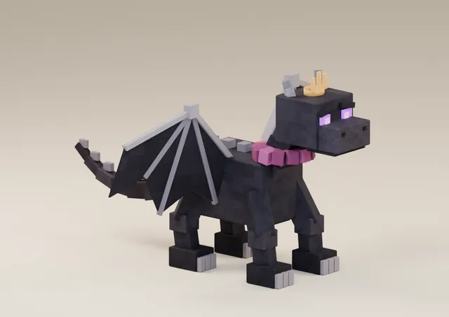{ .catalog-preview loading="lazy" decoding="async" width="640" height="480" }](reviews/drama-dragon/v001.md)

### [The Drama Dragon](reviews/drama-dragon/v001.md)

3D model · v001 · In playtest

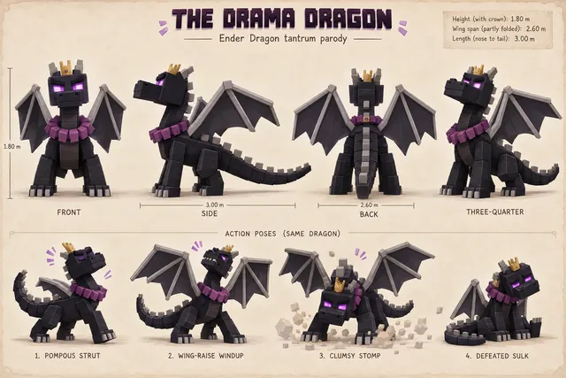Inspiration included

[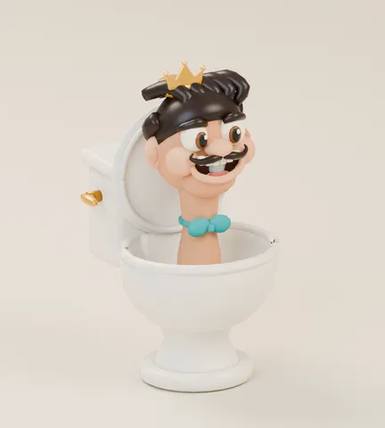{ .catalog-preview loading="lazy" decoding="async" width="640" height="480" }](reviews/sir-flush-a-lot/v001.md)

### [Sir Flush-a-Lot](reviews/sir-flush-a-lot/v001.md)

3D model · v001 · In playtest

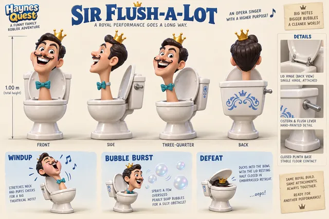Inspiration included

[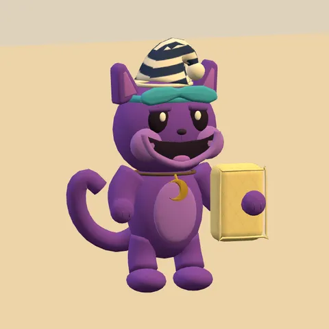{ .catalog-preview loading="lazy" decoding="async" width="640" height="480" }](reviews/nap-captain/v001.md#paused-checkpoint)

### [Nap Captain](reviews/nap-captain/v001.md#paused-checkpoint)

Partial model · v001 · Paused

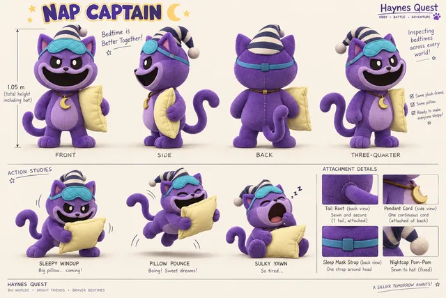Inspiration included

[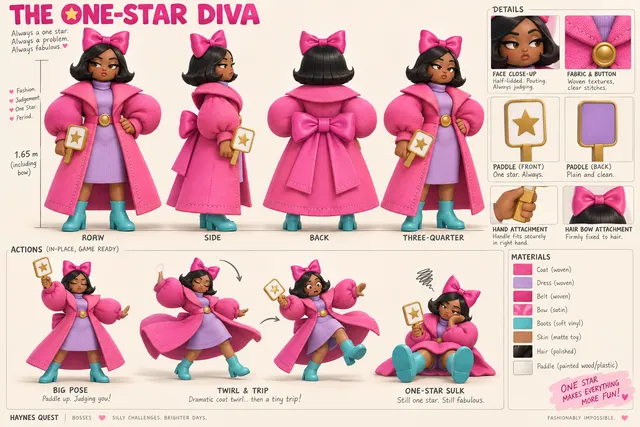{ .catalog-preview loading="lazy" decoding="async" width="640" height="480" }](reviews/one-star-diva/v001.md)

### [The One-Star Diva](reviews/one-star-diva/v001.md)

Concept only · v001 · Paused

## Travelers {#travelers}

The two existing age stages share a costume and a common inspiration sheet. Each review includes movement previews and a comparison of both ages.

[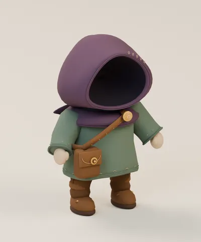{ .catalog-preview loading="lazy" decoding="async" width="640" height="480" }](reviews/traveler-infant/v001.md)

### [Infant traveler](reviews/traveler-infant/v001.md)

3D model · v001 · In playtest

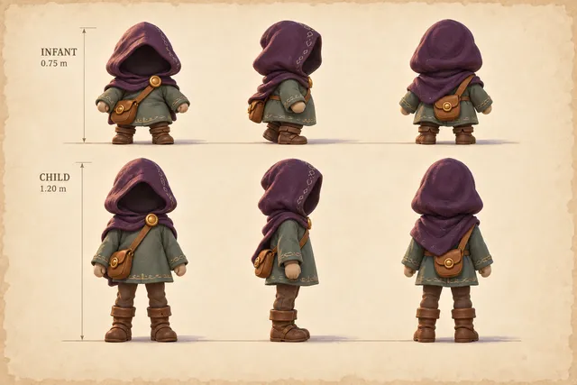Inspiration included

[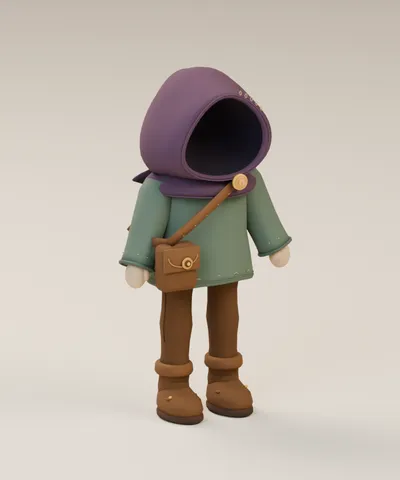{ .catalog-preview loading="lazy" decoding="async" width="640" height="480" }](reviews/traveler-child/v001.md)

### [Child traveler](reviews/traveler-child/v001.md)

3D model · v001 · In playtest

Inspiration included

## World and keepsakes {#world-and-keepsakes}

Browse every clearing piece separately. The keepsake review uses the corrected inspiration image with the rear wedge visible.

[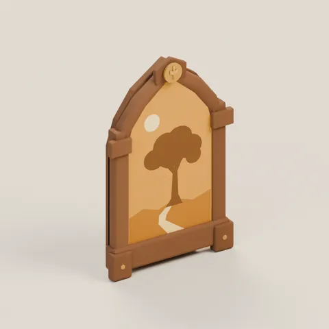{ .catalog-preview loading="lazy" decoding="async" width="640" height="480" }](reviews/memory-keepsake/v001.md)

### [Memory keepsake](reviews/memory-keepsake/v001.md)

3D model · v001 · In playtest

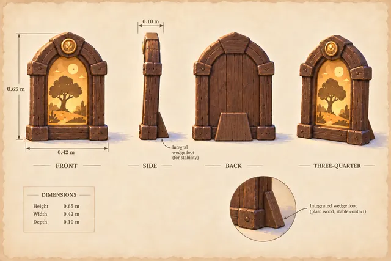Inspiration included

[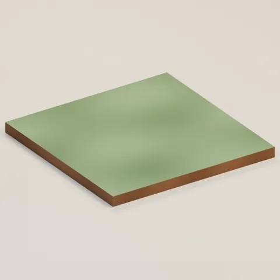{ .catalog-preview loading="lazy" decoding="async" width="640" height="480" }](reviews/clearing-path-kit/v001.md#grass-and-soil)

### [Grass tile](reviews/clearing-path-kit/v001.md#grass-and-soil)

3D model · v001 · Ready to review

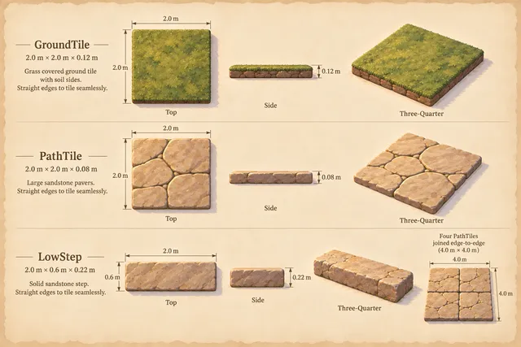Inspiration included

[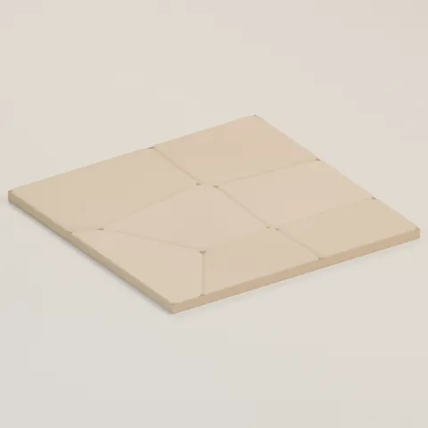{ .catalog-preview loading="lazy" decoding="async" width="640" height="480" }](reviews/clearing-path-kit/v001.md#pale-pavers)

### [Path tile](reviews/clearing-path-kit/v001.md#pale-pavers)

3D model · v001 · In playtest

Inspiration included

[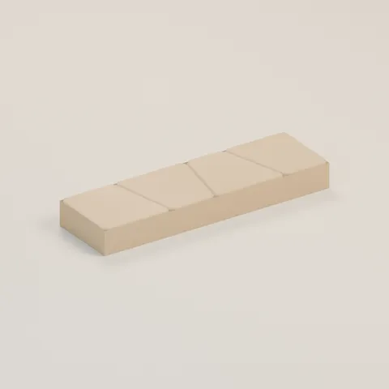{ .catalog-preview loading="lazy" decoding="async" width="640" height="480" }](reviews/clearing-path-kit/v001.md#one-low-rise)

### [Low step](reviews/clearing-path-kit/v001.md#one-low-rise)

3D model · v001 · Ready to review

Inspiration included

[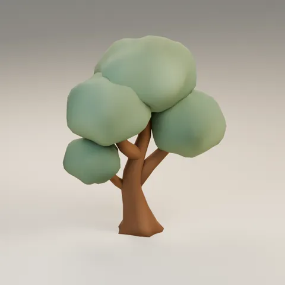{ .catalog-preview loading="lazy" decoding="async" width="640" height="480" }](reviews/clearing-tree/v001.md)

### [Clearing tree](reviews/clearing-tree/v001.md)

3D model · v001 · In playtest

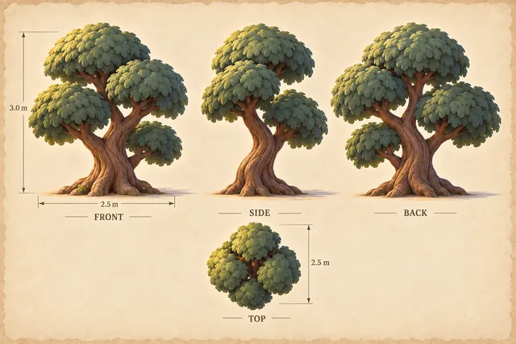Inspiration included

[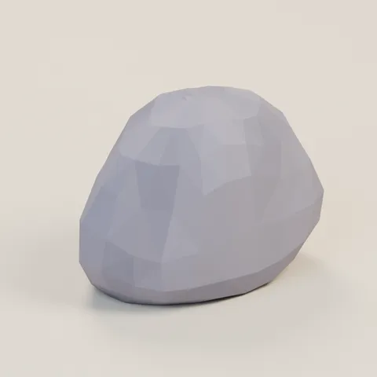{ .catalog-preview loading="lazy" decoding="async" width="640" height="480" }](reviews/clearing-stone/v001.md)

### [Clearing stone](reviews/clearing-stone/v001.md)

3D model · v001 · In playtest

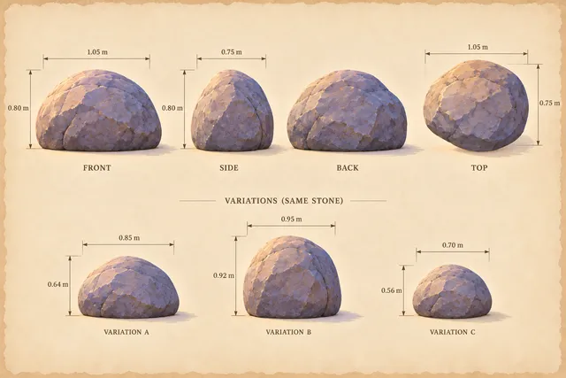Inspiration included

[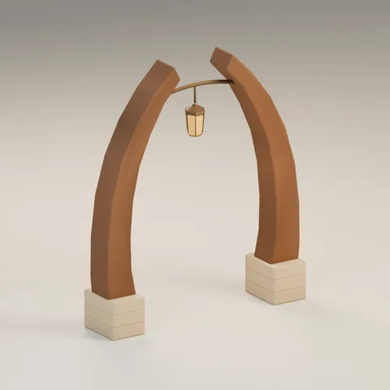{ .catalog-preview loading="lazy" decoding="async" width="640" height="480" }](reviews/arrival-landmark/v001.md)

### [Lantern gateway](reviews/arrival-landmark/v001.md)

3D model · v001 · In playtest

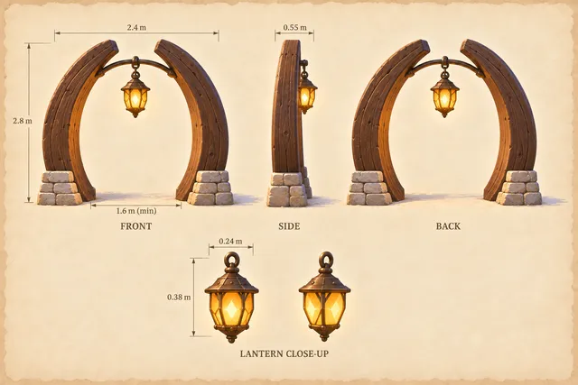Inspiration included

## Equipment {#equipment}

Four tools to find during a level. Each review includes the inspiration sheet, an interactive model and front/back views.

[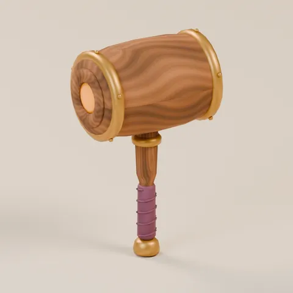{ .catalog-preview loading="lazy" decoding="async" width="640" height="480" }](reviews/era-equipment/v001.md#spark-mallet)

### [Spark Mallet](reviews/era-equipment/v001.md#spark-mallet)

3D model · v001 · In playtest

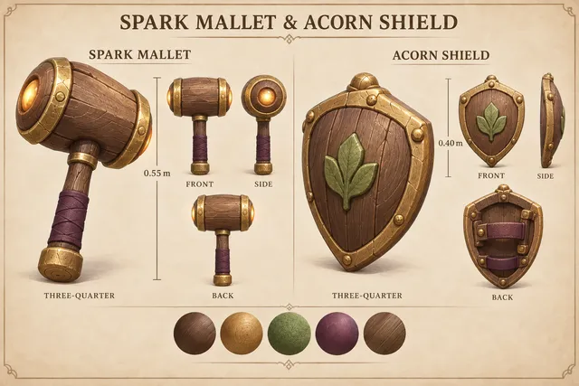Inspiration included

[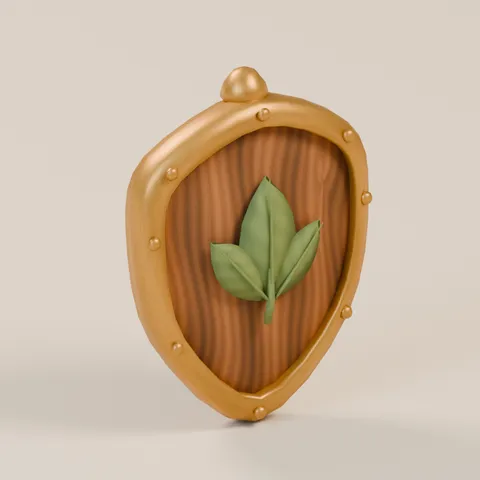{ .catalog-preview loading="lazy" decoding="async" width="640" height="480" }](reviews/era-equipment/v001.md#acorn-shield)

### [Acorn Shield](reviews/era-equipment/v001.md#acorn-shield)

3D model · v001 · In playtest

Inspiration included

[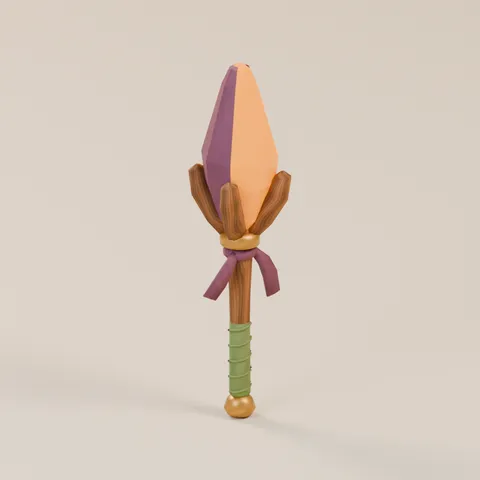{ .catalog-preview loading="lazy" decoding="async" width="640" height="480" }](reviews/era-equipment/v001.md#prism-wand)

### [Prism Wand](reviews/era-equipment/v001.md#prism-wand)

3D model · v001 · In playtest

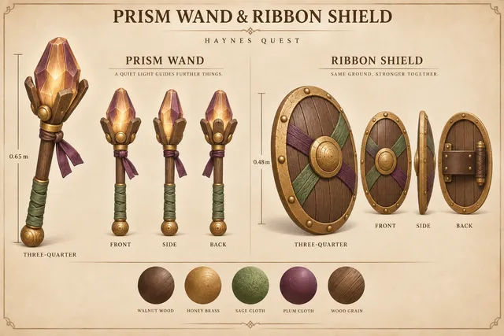Inspiration included

[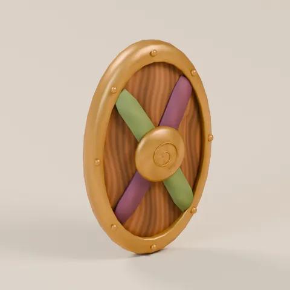{ .catalog-preview loading="lazy" decoding="async" width="640" height="480" }](reviews/era-equipment/v001.md#ribbon-shield)

### [Ribbon Shield](reviews/era-equipment/v001.md#ribbon-shield)

3D model · v001 · In playtest

Inspiration included

## Friendly characters {#friendly-characters}

Meet the helpful residents of the journey. Their greetings provide healing bonuses. Treat them kindly: harming a friend costs hearts and withholds their help until you make amends. These friendly roles are included in the PLAN006 playtest.

[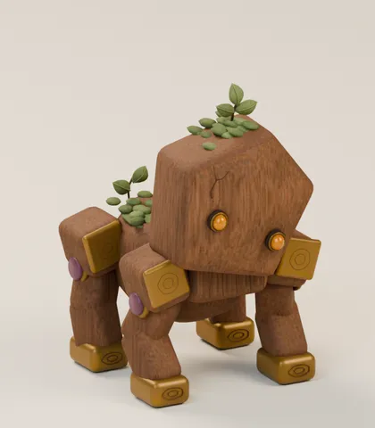{ .catalog-preview loading="lazy" decoding="async" width="640" height="480" }](reviews/blockling/v001.md)

### [Blockling](reviews/blockling/v001.md)

3D model · v001 · Friendly · In playtest

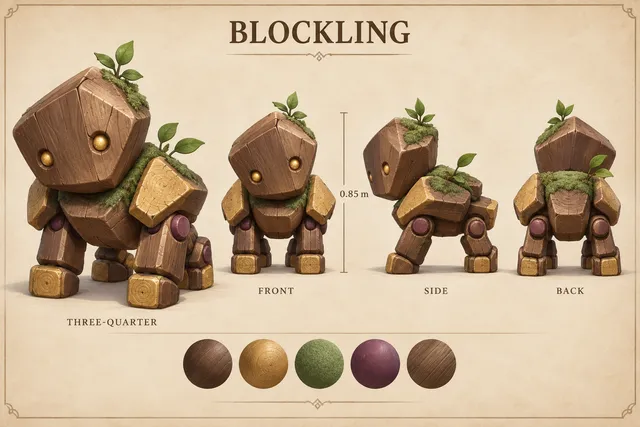Inspiration included

[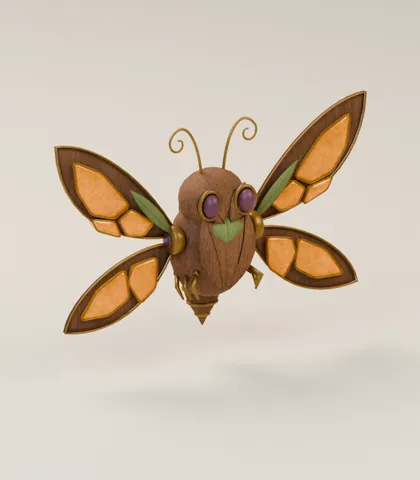{ .catalog-preview loading="lazy" decoding="async" width="640" height="480" }](reviews/signal-moth/v001.md)

### [Signal Moth](reviews/signal-moth/v001.md)

3D model · v001 · Friendly · In playtest

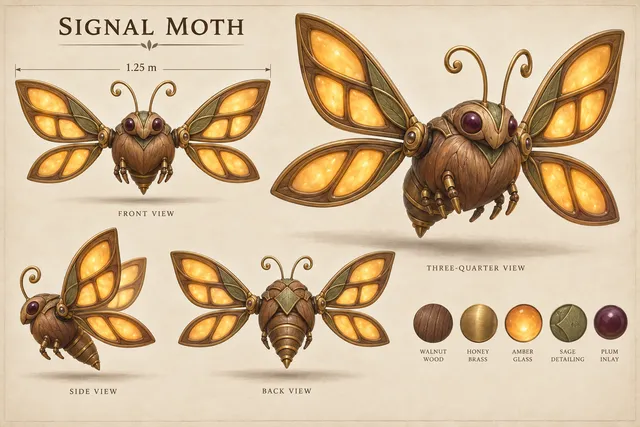Inspiration included

[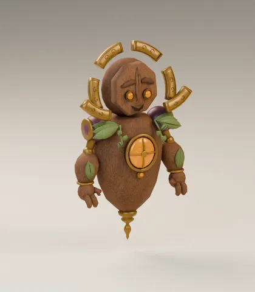{ .catalog-preview loading="lazy" decoding="async" width="640" height="480" }](reviews/buffer-baron/v001.md)

### [Buffer Baron](reviews/buffer-baron/v001.md)

3D model · v001 · Friendly · In playtest

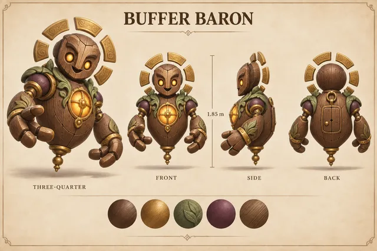Inspiration included

[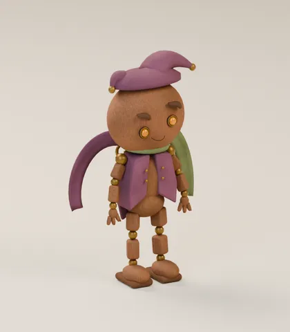{ .catalog-preview loading="lazy" decoding="async" width="640" height="480" }](reviews/loop-dancer/v001.md)

### [Loop Dancer](reviews/loop-dancer/v001.md)

3D model · v001 · Friendly · In playtest

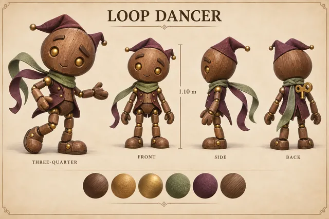Inspiration included

[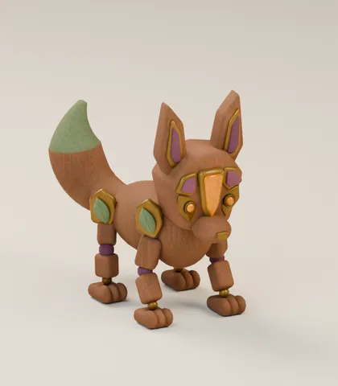{ .catalog-preview loading="lazy" decoding="async" width="640" height="480" }](reviews/prism-mimic/v001.md)

### [Prism Mimic](reviews/prism-mimic/v001.md)

3D model · v001 · Friendly · In playtest

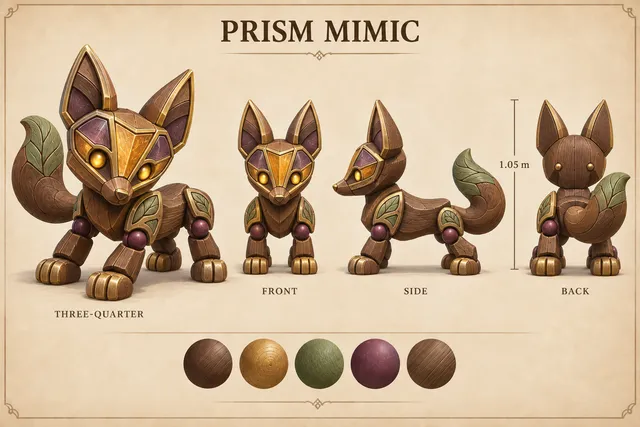Inspiration included

[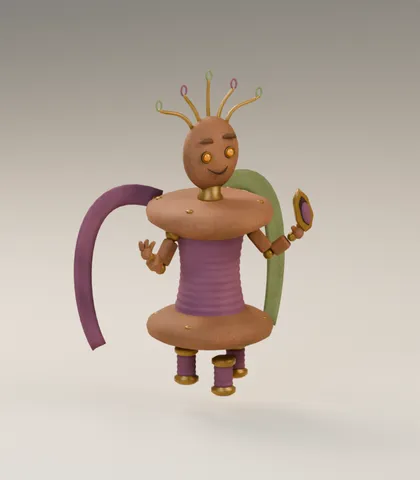{ .catalog-preview loading="lazy" decoding="async" width="640" height="480" }](reviews/trendweaver/v001.md)

### [Trendweaver](reviews/trendweaver/v001.md)

3D model · v001 · Friendly · In playtest

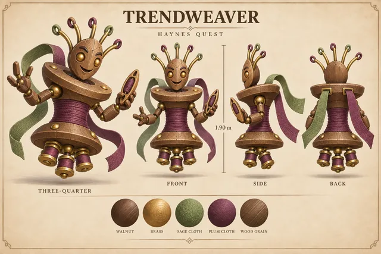Inspiration included

## Reference sheets {#reference-sheets}

Original inspiration and construction images. These are illustrations; related model reviews appear in the groups above.

[{ .catalog-preview loading="lazy" decoding="async" width="640" height="480" }](reviews/bickering-besties/v001.md)

### [The Bickering Besties](reviews/bickering-besties/v001.md)

Reference · v001 · Look approved

[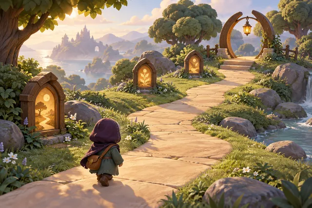{ .catalog-preview loading="lazy" decoding="async" width="640" height="480" }](reviews/storybook-reference/v001.md#the-clearing)

### [The storybook clearing](reviews/storybook-reference/v001.md#the-clearing)

Inspiration sheet · v001

[{ .catalog-preview loading="lazy" decoding="async" width="640" height="480" }](reviews/storybook-reference/v001.md#a-traveler-who-grows)

### [Traveler age reference](reviews/storybook-reference/v001.md#a-traveler-who-grows)

Inspiration sheet · v001

[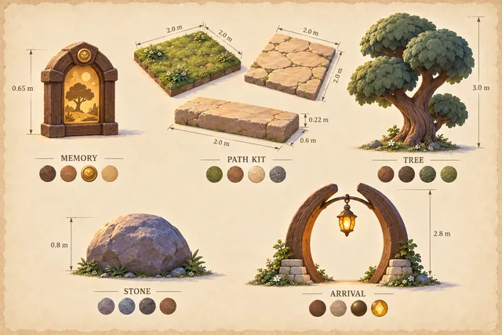{ .catalog-preview loading="lazy" decoding="async" width="640" height="480" }](reviews/storybook-reference/v001.md#a-shared-set-of-materials)

### [Props and materials](reviews/storybook-reference/v001.md#a-shared-set-of-materials)

Inspiration sheet · v001

[{ .catalog-preview loading="lazy" decoding="async" width="640" height="480" }](reviews/era-combat/v001.md)

### [Earlier construction sheets](reviews/era-combat/v001.md)

Inspiration sheet · v001

## Sound auditions {#sound-auditions}

Four existing sound candidates, with waveform thumbnails and playable reviews. The playtest uses these cues for actions, landings, memories and growth. Final listening review remains open.

[{ .catalog-preview loading="lazy" decoding="async" width="640" height="480" }](reviews/memory-collected/v001.md#audition)

### [A memory found · v001](reviews/memory-collected/v001.md#audition)

Sound cue · v001 · In playtest · Review open

[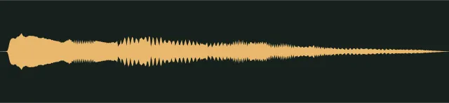{ .catalog-preview loading="lazy" decoding="async" width="640" height="480" }](reviews/ability-unlocked/v001.md#audition)

### [A little more possible · v001](reviews/ability-unlocked/v001.md#audition)

Sound cue · v001 · In playtest · Review open

[{ .catalog-preview loading="lazy" decoding="async" width="640" height="480" }](reviews/movement-landed/v001.md#audition)

### [Back on the path · v001](reviews/movement-landed/v001.md#audition)

Sound cue · v001 · In playtest · Review open

[{ .catalog-preview loading="lazy" decoding="async" width="640" height="480" }](reviews/ui-confirmed/v001.md#audition)

### [A quiet yes · v001](reviews/ui-confirmed/v001.md#audition)

Sound cue · v001 · In playtest · Review open

## What comes next

The Besties duo now has two animated model candidates and its agreed obstacle routine. FNAF-inspired options remain a later design discussion. [Player and encounter curation](../designs/012-player-journey-curation.md) remains future work.

For production history and earlier delivery checks, see the [catalog history](catalog-history.md). Exact files, versions, source images, downloads and decisions remain on each review page.

## Fictional memories {#fictional-memories}

Six distinct pictures mark the two test chapters: two small memories on each route, then a major memory after its boss.

[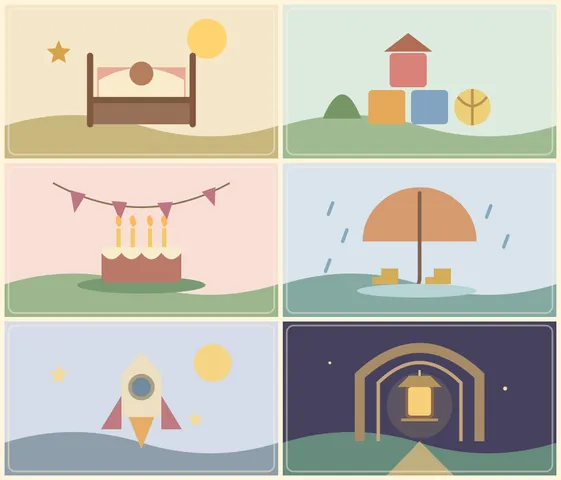{ .catalog-preview loading="lazy" decoding="async" width="640" height="480" }](reviews/fixture-route-memories/v001.md)

### [Six little windows into a life](reviews/fixture-route-memories/v001.md)

Fictional illustrations · v001 · In playtest

Original SVG pictures for the memory route. No family photos or 3D model.

