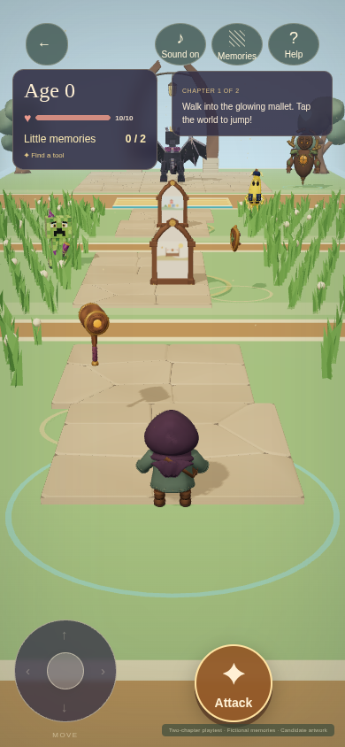
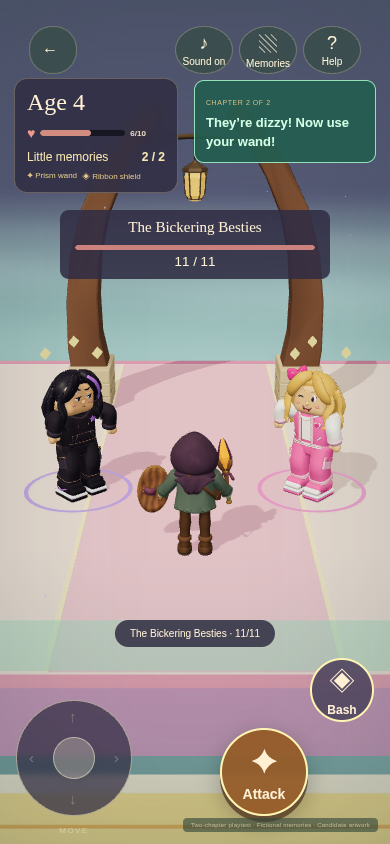
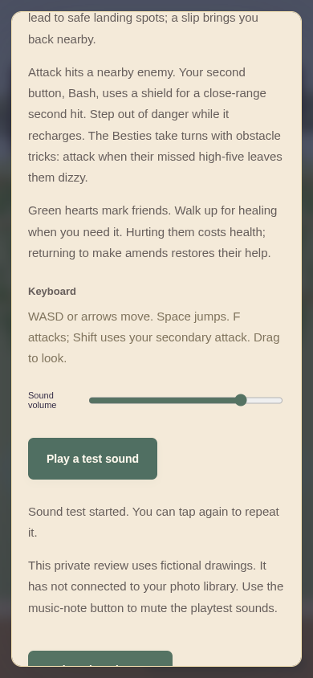

# A fresh two-chapter playtest

Choose **Play from the beginning** for the full age 0 → 4 → 7 route, or **Try the Besties chapter** to jump straight to chapter two. Every test starts fresh. Leaving or reloading resets the run; there is no save or resume list in this playtest.

This private review uses [six fictional pictures](reviews/fixture-route-memories/v001.md). Your family’s photo library and sign-in remain separate work.

## How to play

| Action | Touch | Keyboard |
| --- | --- | --- |
| Move | Left stick | WASD or arrow keys |
| Jump, at every age | Tap the world | Space |
| Look around | Drag the world | Drag with the mouse |
| Attack | Large **Attack** button | F |
| Secondary attack | Smaller **Bash** button, after finding a shield | Shift |
| Collect gear or memories | Walk into them | Walk into them |

Hold the movement stick while tapping elsewhere to jump or attack. Dragging the camera and touching a menu do not jump. Bash adds a close-range hit with a separate recharge; future gear can add other secondary attacks.

Find two little memories along each route. Their keepsakes disappear on collection; a brief picture confirms the pickup without stopping the action or aging the player. You can revisit collected pictures in Memories. Beat the boss, then walk into the big memory beyond it: collecting all three advances your age and opens the next chapter. Missing little memories remain on the path after victory.

## What changed for this test

Collected keepsakes now disappear, attacks clear the brief pickup picture, and the permanent jump hint is gone. The Besties face you, move through their routine, show hit reactions and finish with a defeat animation. Their warnings follow your position when the warning starts, giving you time to dodge; each hit is gentler in this fresh playtest.

- Fresh starts replace the artwork-update, save-and-leave loop. A missing model shows a retryable warning while play continues.
- Jumping works from age zero. Gear, memories and available friendly healing are collected on contact.
- Two labeled combat buttons replace the four-button cluster. Movement is faster, slow rendering no longer automatically halves game speed, and attacks and pickups have more visible motion.
- Grass and flowers grow along the visible edges of the path and on the landings.
- Sound starts with a confirming cue after a touch or key press. **Sound on/off** controls mute; **Help → Play a test sound** auditions the output. Help also has a volume slider and confirms each test tap or offers a retry. Audio rebuilds after an interruption; the source cues and mix are unchanged in this update. Physical iPhone speaker output still needs listening.

## In the game

{ width="300" }

The first route starts with grass-lined landings, a glowing tool and two little memories before the dragon.

{ width="300" }

The Besties share a recovery window after their missed high-five. The small Bash button appears after you collect a shield. These are actual browser captures from the mobile repair candidate; their [capture record](media/playtest/v004/captures.json) identifies the tested versions.

{ width="300" }

Help scrolls on touch, and the sound button confirms a test or offers a retry. Artwork retries also update their result while a menu or the game-over screen is open; they do not require a second tap. The [sound check](media/playtest/v004/mobile-audio-local.json) verifies button input and browser playback; listening on your iPhone remains part of the next check.

## The encounters

Watch the padded sweepers and short gaps. A slip returns you to a nearby safe spot with your gear and collected memories. If you keep holding the stick, movement resumes after you recover. Green hearts mark friends who can heal you. Deliberately hurting one costs health; returning to make amends restores their help. Friends never block chapter progression.

If you lose all your health, retrying keeps your gear, memories and defeated enemies. Enemies still standing regain their health, so you can try the boss again without repeating the earlier fights.

The Besties alternate a pink foam sweeper and a purple floor lane. Each warning chooses your position once, then stays fixed: jump or move to clear ground. The pair turn toward you, step into their tricks, react to hits and disappear after their defeat animation. When they miss their high-five, both become dizzy for five seconds: that is your chance to attack.

Please judge how the controls feel, whether you can hear the actions, and whether the route and jokes are fun. The [hosted route check](media/release/v004/final-live-route.json) completed both chapters and all six memories, including one-tap artwork recovery on the game-over screen. Separate [touch](media/release/v004/final-live-controls.json), [landscape](media/release/v004/final-live-landscape.json) and [sound-button recovery](media/release/v004/final-live-audio.json) checks pass on the deployed build. Physical iPhone/iPad Safari, device performance, listening and the children’s response remain the next inspection.

## Still to come

More chapters, the full baby-to-adult journey, difficulty and abilities that grow throughout life, a modular level builder, freely placed integrated or uploaded memories, period suggestions with Show more, birthday setup and sign-in remain future work. The Besties shortcut prepares the first chapter for testing; it is not a saved journey.

## Cast and artwork

| Chapter in a new journey | Ordinary enemies | Boss | Friendly residents |
| --- | --- | --- | --- |
| The Block Party | [Mister Hiss](reviews/mister-hiss/v001.md), [Peel Patrol](reviews/peel-patrol/v001.md) | [Drama Dragon](reviews/drama-dragon/v001.md) | [Blockling](reviews/blockling/v001.md), [Signal Moth](reviews/signal-moth/v001.md), [Buffer Baron](reviews/buffer-baron/v001.md) |
| Besties Obby | [Sir Flush-a-Lot](reviews/sir-flush-a-lot/v001.md), returning Peel Patrol | [The Bickering Besties](reviews/bickering-besties/v001.md) | [Loop Dancer](reviews/loop-dancer/v001.md), [Prism Mimic](reviews/prism-mimic/v001.md), [Trendweaver](reviews/trendweaver/v001.md) |

[Browse the full visual catalog](catalog.md) for inspiration images, models, motion, the six fictional pictures and sound previews. The playtest uses the same 23 GLBs and four source WAVs recorded in the [artwork list](media/playtest/v002/artwork.json), with a revised runtime sound mix. The [hosted phone and desktop catalog audit](media/release/v004/final-catalog-live.json) checks the thumbnails, reviews and model viewers. The joint Besties look is approved; exact model and sound versions remain available for final review.
