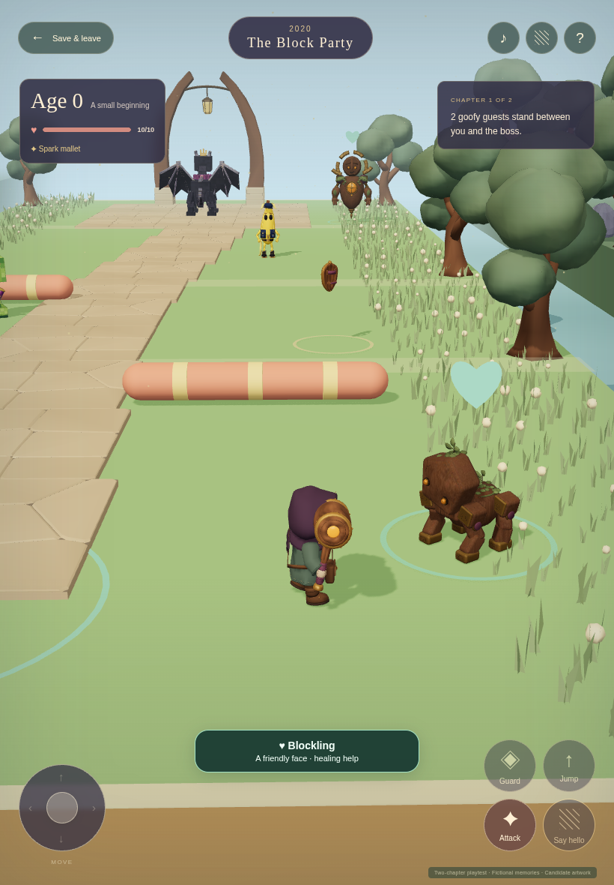
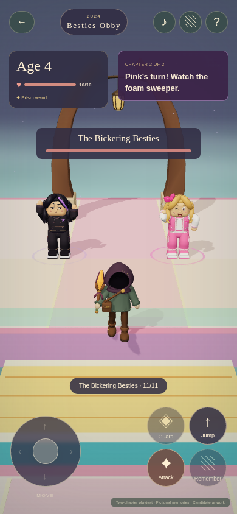

# Two-chapter playtest

Continue your saved journey to try the repaired wand and dragon fight. **Start a new Demo Adventurer journey for the Besties boss in chapter two.** Existing journeys keep their original cast and progress.

This private review uses fictional pictures. Your family’s photo library and sign-in are still separate work. Look for **Playtest · Two chapters · Fictional memories** on the home screen.

## What changed

- The Prism wand reaches nearby enemies, aims toward them and shows a bright beam. Attack explains when you need to move closer or wait. Holding the movement stick while pressing Attack should keep you moving.
- The dragon can reach the second chapter’s saved landing and retaliate. Watch the full red warning circle, step clear or guard.
- Four sound cues now accompany actions, landings, memories and growth. Sound starts after a touch or key press. The music-note button mutes it; Help contains the volume control.
- Trees, flowers and grass fill out both chapters while the main route and landing areas stay clear.
- Six friendly residents offer healing. Look for green hearts. Harming a friend requires a deliberate confirmation, costs health and pauses their help; **Make amends** restores the friendship, even after knocking them out.
- The Besties alternate a pink foam sweeper and a purple floor lane. Jump or move aside. Their missed high-five leaves both dizzy for five seconds: that is your chance to attack.

## What to try

Find your attack tool and shield, dodge the moving hazards and defeat the first boss. Open its released pictures, then absorb the bundle to grow from age zero to four and unlock jumping. Cross the short gaps and moving platform in chapter two, beat its boss and absorb the next bundle to reach age seven. Save and leave at any point to check that your progress returns.

The loop is **gear → obstacles and fights → boss → memories → growth → next period**. Falls return you to a nearby safe spot with equipment and victories retained. Friendly help is optional and never blocks a chapter. Please judge whether the controls feel comfortable, the route is clear and the jokes and fights are fun.

| Included now | Still to come |
| --- | --- |
| Two chapters, equipment, ordinary enemies and bosses | More chapters and the full baby-to-adult journey |
| Gentle obby hazards, checkpoints and jumping after growth | Difficulty and abilities that expand throughout a lifetime |
| Besties duo, six healing friends and recoverable harm penalties | Parent-curated favorites and additional enemies such as FNAF-inspired characters |
| Sound cues, fictional pictures and saved keyboard/touch play | Your family’s Immich photos, birthday setup and sign-in |
| Automated browser and touch checks | Physical iPhone/iPad Safari and the children’s next playtest |

## Actual game views

These are captures from the running game, using its actual models.

<figure><figcaption>Friendly help along the journey</figcaption></figure>
<figure><figcaption>The Besties on a small screen</figcaption></figure>

The [first complete touch journey](media/playtest/v002/first-touch-evidence.json) passed both chapters, bosses, visible fictional pictures, age 0 → 4 → 7 and saved resume. That run preceded the final high-five pose and camera refinements. The [final focused touch check](media/playtest/v002/focused-touch-final.json) verifies friendly help and penalties, sound controls, held-stick wand damage, dragon retaliation and the Besties opening on the reviewed build. The exact artwork files are listed below. Automated Chromium touch and software graphics checks do not establish physical Safari performance or the children’s response.

## Cast and artwork

| Chapter in a new journey | Ordinary enemies | Boss | Friendly residents |
| --- | --- | --- | --- |
| The Block Party | [Mister Hiss](reviews/mister-hiss/v001.md), [Peel Patrol](reviews/peel-patrol/v001.md) | [Drama Dragon](reviews/drama-dragon/v001.md) | [Blockling](reviews/blockling/v001.md), [Signal Moth](reviews/signal-moth/v001.md), [Buffer Baron](reviews/buffer-baron/v001.md) |
| Besties Obby | [Sir Flush-a-Lot](reviews/sir-flush-a-lot/v001.md), returning Peel Patrol | [The Bickering Besties](reviews/bickering-besties/v001.md) | [Loop Dancer](reviews/loop-dancer/v001.md), [Prism Mimic](reviews/prism-mimic/v001.md), [Trendweaver](reviews/trendweaver/v001.md) |

The Besties require jumping. A journey beginning in 2024 without that ability keeps the compatible remix roster. Existing v2 journeys retain the returning Drama Dragon. Nap Captain and One-Star Diva remain paused; the playtest cast does not decide the children’s permanent favorites.

The [exact playtest artwork list](media/playtest/v002/artwork.json) records 23 GLBs and four sound cues with their checksums. [Browse the full visual catalog](catalog.md) for inspiration images, models, motion and sound previews. The joint Besties look is approved; final approval of exact model and sound versions remains open.
