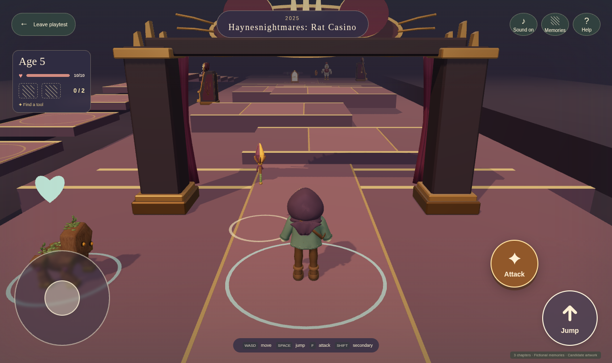
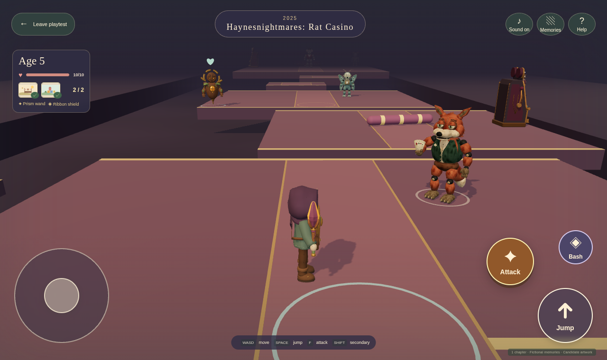
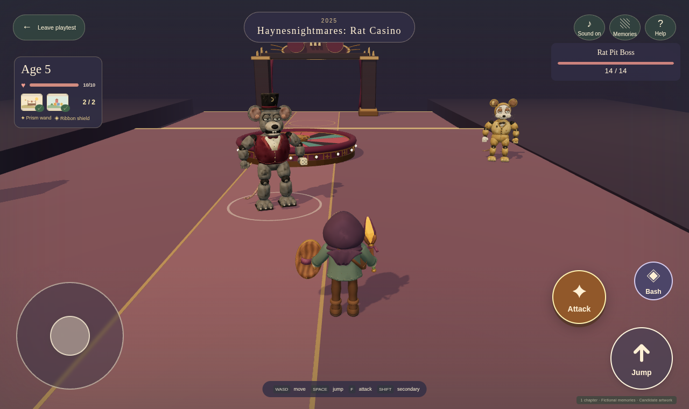
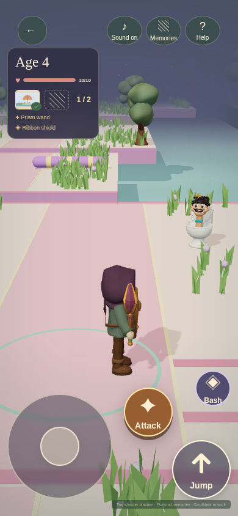
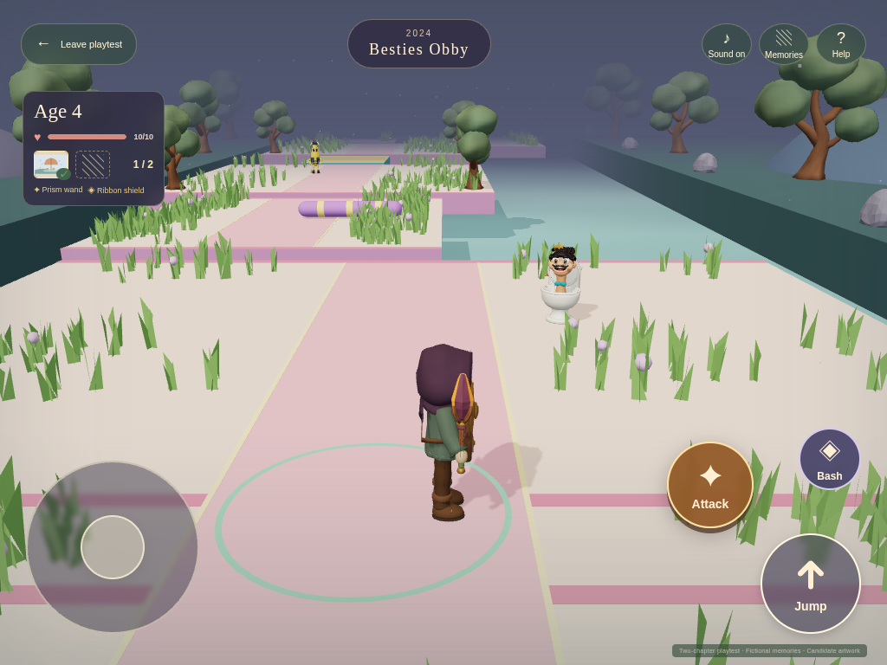
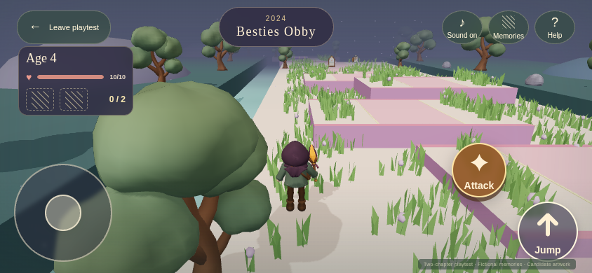
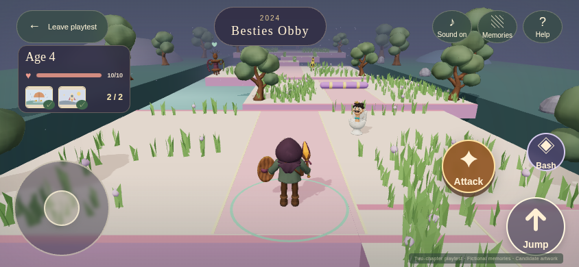

# Fresh playtests and Rat Casino

Open the [private playtest](https://haynes-quest-playtest.haynesops.com/) and choose **Enter Rat Casino** to start the new final level of a separate fictional three-chapter project at recovered age five. Its chapter-only finish shows the three memories earned there; the [level editor](../level-editor.md) can open, inspect, reshape and test the complete project. **Play from the beginning** retains the established age 0 → 4 → 7 route, and **Try the Besties chapter** jumps to its second chapter. Every test starts fresh. Leaving or reloading resets the run; there is no save or resume list in this playtest.

The established two-chapter route uses [six fictional pictures](reviews/fixture-route-memories/v001.md); the separate Rat Casino project adds three more synthetic memories. Familiar controls, memory checkpoints and safe jumping practice for a six-year-old are the current focus. Identity and curated family photos are the next required part of the MVP; every fixture age and picture is fictional.

## How to play

| Action | Touch | Keyboard |
| --- | --- | --- |
| Move | Left stick | WASD or arrow keys |
| Jump, at every age | Arrow button at the lower right | Space |
| Look around | Drag the world | Drag with the mouse |
| Attack | Large **Attack** button | F |
| Secondary attack | Smaller **Bash** button, after finding a shield | Shift |
| Collect gear or memories | Walk into them | Walk into them |

Hold the movement stick with one thumb and press Jump with the other. Attack sits above and to the left of Jump; the smaller Bash button sits above and to the right of Attack. The stick and buttons grow on tablet screens. Dragging or tapping the scenery does not jump. Bash adds a close-range hit with a separate recharge; future gear can add other secondary attacks.

Find two little memories along each route. Their keepsakes disappear on collection and their pictures fill the small indicators beside your health. Collecting a little memory also sets a checkpoint, without stopping movement or aging the player. You can revisit collected pictures in Memories. Beat the boss, then walk into the big memory beyond it: collecting all three advances your age and opens the next chapter. Missing little memories remain on the path after victory.

If the big memory does not collect, check the picture indicators beside your health. After victory, they tell you how many little memories remain. Follow the path back to collect them, then return to the big memory; the defeated boss stays beaten. Once both little pictures are collected, the message tells you to walk into the big memory to finish the chapter.

## What changed for this test

The original two chapters begin with six low steps that climb and descend over solid ground. Rat Casino retains this forgiving practice pattern and adds two optional raised routes. A missed practice hop lets you try again without losing health. Each course mixes short jumping activities with safe stopping places, four enemy encounters, two little memories and a boss. An optional side path lets you visit a friendly resident before rejoining the adventure.

| Chapter | Places to explore |
| --- | --- |
| The Block Party | Practice steps, a picnic clearing, winding padded sweepers, a woodland side path, a raised memory grove and a small ferry to the dragon terrace. |
| Besties Obby | Practice steps, a ribbon lane, a sideways ferry, a choice of stepping pads or a broad side bridge, a slow turnstile and a climb to the Besties court. |
| Rat Casino | An amber-lit foyer, padded token steps, cabinet landing, roulette zigzag, two optional raised side routes, four worn mascots and the Rat Pit Boss's final stage. Golden waits in a noncombat stage alcove. |

{ width="700" }

{ width="700" }

{ width="700" }

These [local browser captures](media/playtest/v007/captures.json) show the checked-in fictional route and exact Blender models. They are headless Chromium images, not physical iPhone/iPad Safari performance evidence.

In the original courses, jump onto the ferries, ride along, then jump to the next landing. Broad platforms leave room to line up a jump. A slip returns you nearby with your gear and memories; there is no lives counter or race timer. Casino scenery stays beside the playable route and leaves clear space around fights and memories.

The sound repairs accepted on Tom's iPhone are retained. The new Jump button replaces world-tap jumping, and empty attacks animate and sound without showing reading prompts over the player. Jumping works from age zero, contact collects things, and recovered little keepsakes disappear. **Sound on/off** controls mute; **Help → Play a test sound** auditions the output and offers a retry if needed. The source cues and mix are unchanged. A missing model still shows a retryable warning while play continues.

## Familiar controls on phones and tablets

The movement stick is larger in portrait and on tablets. Jump has its own lower-right corner; Attack and Bash sit above it. Health and small picture indicators stay at the edges of the view.

{ width="300" }

{ width="700" }

The [landscape phone capture](media/playtest/v006/phone-landscape.png) and [portrait tablet capture](media/playtest/v006/tablet-portrait.png) show the other layouts. These are actual browser captures of the fictional playtest, recorded with the [source and file checksums](media/playtest/v006/captures.json). They are not physical-device performance measurements.

{ width="700" }

The [controls check](media/playtest/v006/controls-check.json) covers all four layouts and a missed jump that preserves health and progress. The [touch check](media/playtest/v006/touch-check.json) covers moving while pressing Jump, release, cancellation, resizing and rotation. Earlier [course captures](media/playtest/v005/captures.json) and the [sound repair check](media/playtest/v005/mobile-audio-local.json) remain available as history; Tom confirmed audible sound on his iPhone during that earlier repair pass.

## The encounters

Watch the padded sweepers and short gaps. A slip returns you to a nearby safe spot with your gear and collected memories. If you keep holding the stick, movement resumes after you recover. Green hearts mark friends who can heal you. Deliberately hurting one costs health; returning to make amends restores their help. Friends never block chapter progression.

If your health runs out, you automatically return to the latest little memory with full health. Before the first memory, you return to the chapter start. Gear, pictures and beaten enemies stay collected or defeated; enemies still standing regain their health. A connection problem offers a checkpoint retry without starting your journey over.

{ width="700" }

The [Besties chapter check](media/playtest/v006/playground-check.json) records this return, both route memories, the side path, ferry, boss damage outside the dizzy pause, visible hit reactions and the final major memory.

The Besties alternate a pink foam sweeper and a purple floor lane. Each warning chooses your position once, then stays fixed: jump or move to clear ground. The pair turn toward you, step into their tricks, react to hits and disappear after their defeat animation. When they miss their high-five, both become dizzy for five seconds. You can attack during that pause or any other phase while in range. Reaching a boss starts its fight even if you passed an earlier small enemy. You still need both little memories and boss victory to advance.

For the next family test, watch whether moving and jumping together feels familiar, whether the safe steps help her practice and whether returning to a memory after defeat is clear. The long automated journey uses keyboard movement with touch combat; the separate touch check uses the actual stick and Jump button together. Browser checks do not establish child enjoyment or physical-device performance. The [current handoff](../../.agents/HANDOFF.md) records release status.

## Still to come

Identity, birthday setup and curated personal photos follow the longer levels as required MVP work. A parent will choose the little memories and the big memory for each chapter; the daughter's actual chronology will replace the fixture's 0 → 4 → 7 sequence. Authorized photo integrations and manual uploads belong to that personalized experience.

The new courses use the shared visual and agent level builder. The Rat Casino sample is a portable fictional project with its own route ID, chapter date and exact model assignments. Parent-prepared memories, authorized family media, shared publishing and the full baby-to-adult journey remain later work. These shortcuts are temporary playtests, not saved journeys.

## Cast and artwork

| Chapter in a new journey | Ordinary enemies | Boss | Friendly residents |
| --- | --- | --- | --- |
| The Block Party | Two [Mister Hiss](reviews/mister-hiss/v001.md) and two [Peel Patrol](reviews/peel-patrol/v001.md) encounters | [Drama Dragon](reviews/drama-dragon/v001.md) | [Blockling](reviews/blockling/v001.md), [Signal Moth](reviews/signal-moth/v001.md), [Buffer Baron](reviews/buffer-baron/v001.md) |
| Besties Obby | Two [Sir Flush-a-Lot](reviews/sir-flush-a-lot/v001.md) and two returning Peel Patrol encounters | [The Bickering Besties](reviews/bickering-besties/v001.md) | [Loop Dancer](reviews/loop-dancer/v001.md), [Prism Mimic](reviews/prism-mimic/v001.md), [Trendweaver](reviews/trendweaver/v001.md) |
| Rat Casino · private project | [Chick-flia](reviews/chick-flia/v001.md), [Jackrabbit Drummer](reviews/jackrabbit-drummer/v001.md), [Fox Card Shark](reviews/fox-card-shark/v001.md), [Moth Projectionist](reviews/moth-projectionist/v001.md) | [Rat Pit Boss v002](reviews/rat-pit-boss/v002.md) | [Golden After-Hours Rat](reviews/golden-after-hours-rat/v001.md) is a noncombat cameo; the standard friendly residents remain separate. |

[Browse the full visual catalog](catalog.md) for inspiration images, models, motion, fictional pictures and sound previews. The established chapters use the 23 GLBs and four source WAVs recorded in the [earlier artwork list](media/playtest/v002/artwork.json); Rat Casino adds the six exact classic mascot GLBs and three static scenery GLBs linked above. The earlier [phone and desktop catalog check](media/playtest/v005/catalog-check.json) remains historical evidence for the established assets. Rat Casino's private trial follows Tom's “Looks great, let’s move forward” direction; physical device and final art acceptance remain open.
