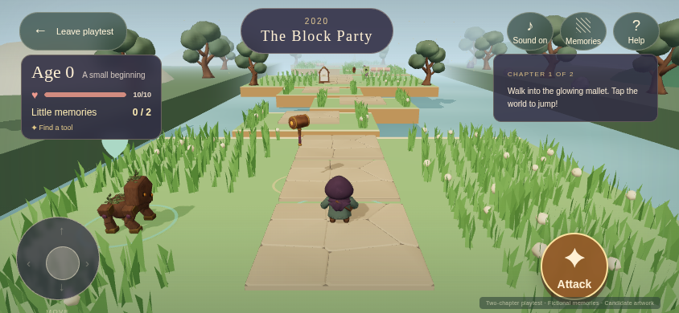
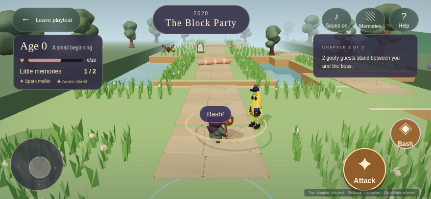
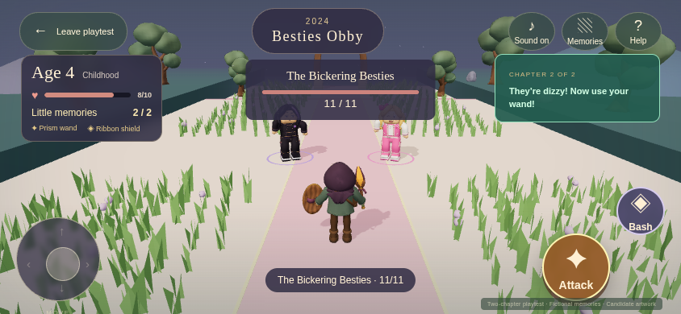
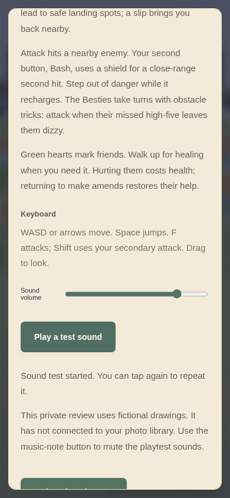

# A fresh two-chapter playtest

Choose **Play from the beginning** for the full age 0 → 4 → 7 route, or **Try the Besties chapter** to jump straight to chapter two. Every test starts fresh. Leaving or reloading resets the run; there is no save or resume list in this playtest.

This private review uses [six fictional pictures](reviews/fixture-route-memories/v001.md). Familiar controls, memory checkpoints and safe jumping practice for a six-year-old are the current focus. Identity and curated family photos are the next required part of the MVP; this fixture's ages and pictures are still fictional.

## How to play

| Action | Touch | Keyboard |
| --- | --- | --- |
| Move | Left stick | WASD or arrow keys |
| Jump, at every age | Arrow button at the lower right | Space |
| Look around | Drag the world | Drag with the mouse |
| Attack | Large **Attack** button | F |
| Secondary attack | Smaller **Bash** button, after finding a shield | Shift |
| Collect gear or memories | Walk into them | Walk into them |

Hold the movement stick with one thumb and press Jump with the other. Attack sits above and to the left of Jump; the smaller Bash button sits above and to the right of Attack. The stick and buttons grow on tablet screens. Dragging or tapping the scenery does not jump. Bash adds a close-range hit with a separate recharge; future gear can add other secondary attacks.

Find two little memories along each route. Their keepsakes disappear on collection and their pictures fill the small indicators beside your health. Collecting a little memory also sets a checkpoint, without stopping movement or aging the player. You can revisit collected pictures in Memories. Beat the boss, then walk into the big memory beyond it: collecting all three advances your age and opens the next chapter. Missing little memories remain on the path after victory.

## What changed for this test

Both chapters begin with six low steps that climb and descend over solid ground. A missed practice hop lets you try again without losing health. Later clearings and boss terraces also rise above the path. Each course mixes short jumping activities with safe stopping places, four goofy enemy encounters, two little memories and a boss. An optional side path lets you visit a friendly resident before rejoining the adventure.

| Chapter | Places to explore |
| --- | --- |
| The Block Party | Practice steps, a picnic clearing, winding padded sweepers, a woodland side path, a raised memory grove and a small ferry to the dragon terrace. |
| Besties Obby | Practice steps, a ribbon lane, a sideways ferry, a choice of stepping pads or a broad side bridge, a slow turnstile and a climb to the Besties court. |

Jump onto the ferries, ride along, then jump to the next landing. Broad platforms leave room to line up a jump. A slip returns you nearby with your gear and memories; there is no lives counter or race timer. Grass, flowers and the existing trees extend through the longer routes, with clear space around fights and memories.

The sound repairs accepted on Tom's iPhone are retained. The new Jump button replaces world-tap jumping, and empty attacks animate and sound without showing reading prompts over the player. Jumping works from age zero, contact collects things, and recovered little keepsakes disappear. **Sound on/off** controls mute; **Help → Play a test sound** auditions the output and offers a retry if needed. The source cues and mix are unchanged. A missing model still shows a retryable warning while play continues.

## Earlier course captures

These v005 captures preserve the preceding release; they do not show the new Jump button or raised course revisions. Current captures and acceptance are recorded with the [handoff](../../.agents/HANDOFF.md).

{ width="600" }

The garden starts with a safe tool pickup and broad stepping pads. Grass and trees continue through the route, with clear space for jumping and fighting.

{ width="600" }

The woodland path offers a friendly visit and rejoins the adventure. The main path continues over the padded bridge.

{ width="600" }

The Besties keep their missed high-five and dizzy pause, but can now take hits throughout the routine. The small Bash button appears after you collect a shield. These are actual browser captures of the preceding playground version; their [capture record](media/playtest/v005/captures.json) identifies the tested version.

{ width="300" }

Help scrolls on touch, and the sound button confirms a test or offers a retry. Artwork retries also update their result while a menu is open; they do not require a second tap. The [sound check](media/playtest/v005/mobile-audio-local.json) records touch scrolling, a failed sound request and a successful retry. Tom confirmed audible sound on his iPhone during the preceding repair pass.

## The encounters

Watch the padded sweepers and short gaps. A slip returns you to a nearby safe spot with your gear and collected memories. If you keep holding the stick, movement resumes after you recover. Green hearts mark friends who can heal you. Deliberately hurting one costs health; returning to make amends restores their help. Friends never block chapter progression.

If your health runs out, you automatically return to the latest little memory with full health. Before the first memory, you return to the chapter start. Gear, pictures and beaten enemies stay collected or defeated; enemies still standing regain their health. A connection problem offers a checkpoint retry without starting your journey over.

The Besties alternate a pink foam sweeper and a purple floor lane. Each warning chooses your position once, then stays fixed: jump or move to clear ground. The pair turn toward you, step into their tricks, react to hits and disappear after their defeat animation. When they miss their high-five, both become dizzy for five seconds. You can attack during that pause or any other phase while in range. Reaching a boss starts its fight even if you passed an earlier small enemy. You still need both little memories and boss victory to advance.

For the next family test, watch whether moving and jumping together feels familiar, whether the safe steps help her practice and whether returning to a memory after defeat is clear. The [playground check](media/playtest/v005/playground-check.json) records both chapters, their side paths, ferry rides, combat and memory collection. The long automated journey uses keyboard movement with touch combat; separate [touch](media/playtest/v005/touch-smoke.json) and [landscape](media/playtest/v005/landscape-controls.json) checks cover the mobile controls. It does not establish child enjoyment or physical-device performance. The [current handoff](../../.agents/HANDOFF.md) records release status.

## Still to come

Identity, birthday setup and curated personal photos follow the longer levels as required MVP work. A parent will choose the little memories and the big memory for each chapter; the daughter's actual chronology will replace the fixture's 0 → 4 → 7 sequence. Authorized photo integrations and manual uploads belong to that personalized experience.

The new courses share validated, reusable pieces as the foundation for a level builder. A visual editor, freely placed memories, period suggestions with Show more, more chapters and the full baby-to-adult journey remain later extensions. The Besties shortcut prepares the first chapter for testing; it is not a saved journey.

## Cast and artwork

| Chapter in a new journey | Ordinary enemies | Boss | Friendly residents |
| --- | --- | --- | --- |
| The Block Party | Two [Mister Hiss](reviews/mister-hiss/v001.md) and two [Peel Patrol](reviews/peel-patrol/v001.md) encounters | [Drama Dragon](reviews/drama-dragon/v001.md) | [Blockling](reviews/blockling/v001.md), [Signal Moth](reviews/signal-moth/v001.md), [Buffer Baron](reviews/buffer-baron/v001.md) |
| Besties Obby | Two [Sir Flush-a-Lot](reviews/sir-flush-a-lot/v001.md) and two returning Peel Patrol encounters | [The Bickering Besties](reviews/bickering-besties/v001.md) | [Loop Dancer](reviews/loop-dancer/v001.md), [Prism Mimic](reviews/prism-mimic/v001.md), [Trendweaver](reviews/trendweaver/v001.md) |

[Browse the full visual catalog](catalog.md) for inspiration images, models, motion, the six fictional pictures and sound previews. The playtest uses the same 23 GLBs and four source WAVs recorded in the [artwork list](media/playtest/v002/artwork.json), with a revised runtime sound mix. The [phone and desktop catalog check](media/playtest/v005/catalog-check.json) verifies thumbnail navigation, reviews and model viewers for this candidate. The joint Besties look is approved; exact model and sound versions remain available for final review.
