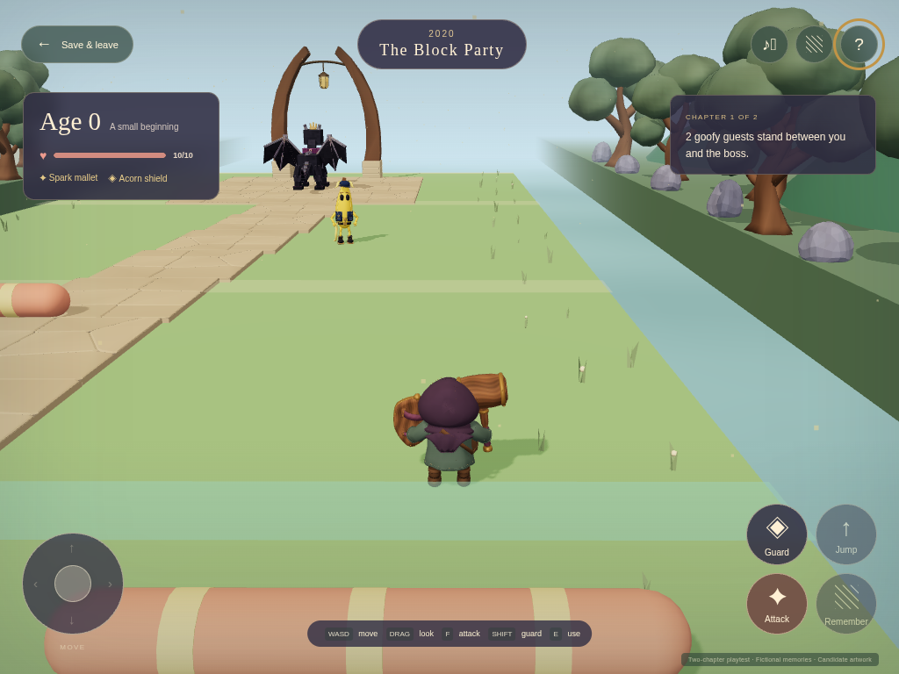
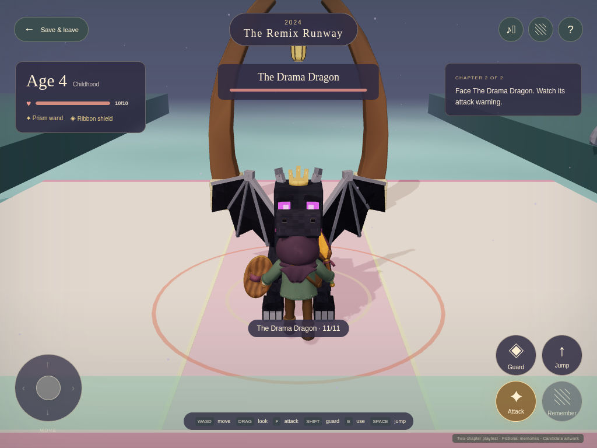

# Two-chapter playtest

This private review candidate tests the corrected game using fictional memories and artwork awaiting review. Look for **Playtest · Two chapters · Fictional memories** on the home screen to identify this build. The earlier prototype does not demonstrate the corrected loop described here.

## What to try

Start a new journey. Find your attack tool and shield, dodge the moving hazards and defeat the first boss. Open the pictures it releases, then absorb those memories to grow and unlock jumping. Cross the short gaps and moving platform in the second chapter, face the returning guests and complete the next memory bundle. Save and leave at any point to check that your progress returns.

The intended loop is **gear → obstacles and fights → boss → memories → growth → next period**. Please judge whether the controls feel comfortable, the route is clear, the characters look right and the fights are fun. Falls should return you to a nearby safe spot without taking away equipment or victories.

| Included in this test | Still to come |
| --- | --- |
| Two chapters, equipment, ordinary enemies and two boss fights | More chapters and the full baby-to-adult journey |
| Gentle hazards, checkpoints and jumping after the first age transition | Difficulty and abilities that expand throughout a lifetime |
| Fictional pictures that appear after a boss | Your family's Immich photos and sign-in |
| Saved progress and keyboard/touch controls | Physical iPhone/iPad Safari and child playtests |
| Four completed character candidates, with returning characters in chapter two | Parent setup, curated photos/encounters, The Besties and FNAF-inspired options |

Sound is currently off while the sound candidates await listening review.

## Actual game views

These captures show the running candidate. They are game screenshots, not concept images or studio renders.

<figure><figcaption>Equipment and the first chapter</figcaption></figure>
<figure><figcaption>Older traveler at the second boss</figcaption></figure>

[Released fictional pictures](media/playtest/v001/keyboard-era-1-released-memories.png) · [Completed two-chapter journey](media/playtest/v001/keyboard-complete.png) · [Keyboard verification](media/playtest/v001/journey-keyboard-evidence.json) · [Touch verification](media/playtest/v001/touch-resumed-verification.json) · [Completed save check](media/playtest/v001/completed-touch-review.json)

The complete keyboard check passed both chapters, both bosses, decoded pictures, age 0 → 4 → 7, saving and resuming, hazard recovery, jumps and the moving platform. A saved-and-resumed touch journey also completed both chapters, then reopened the same completed save twice with all three pictures visible. A separate browser regression verified Help, the album, sound and Save while another finger holds the joystick. Physical iPhone/iPad Safari and child playtests remain open.

## The playtest cast

| Chapter | Ordinary enemies | Boss |
| --- | --- | --- |
| The Block Party | [Mister Hiss](reviews/mister-hiss/v001.md), [Peel Patrol](reviews/peel-patrol/v001.md) | [The Drama Dragon](reviews/drama-dragon/v001.md) |
| The Remix Runway | [Sir Flush-a-Lot](reviews/sir-flush-a-lot/v001.md), returning Peel Patrol | Returning Drama Dragon |

All four use their completed v001 models and five animations. Reusing them makes a full test possible without commissioning more art. This is a temporary test cast; it does not choose your children's permanent favorites. Nap Captain and One-Star Diva are paused and are not selected for new playtest journeys.

## Artwork for review

Alongside the four characters above, the candidate uses the [starting traveler](reviews/traveler-infant/v001.md), [older traveler](reviews/traveler-child/v001.md), [four pieces of equipment](reviews/era-equipment/v001.md), [trees](reviews/clearing-tree/v001.md), [stones](reviews/clearing-stone/v001.md), [path](reviews/clearing-path-kit/v001.md), [keepsakes](reviews/memory-keepsake/v001.md) and [arrival landmark](reviews/arrival-landmark/v001.md). These links show the actual models and available motion previews.

The [exact playtest artwork list](media/playtest/v001/artwork.json) identifies all 15 GLB files and their checksums. These versions are candidates awaiting Tom's review. Playing this review build does not mark its artwork approved. Final versions remain yours to choose.
