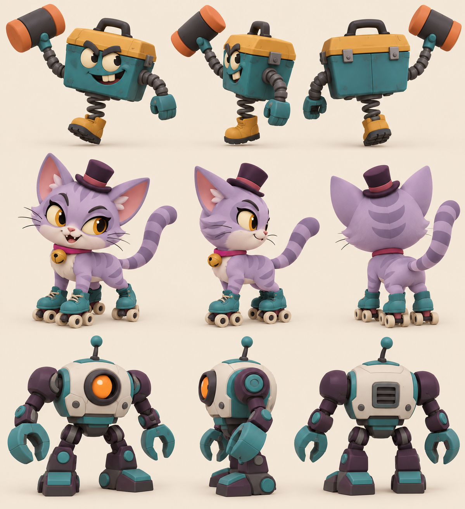

# Action minions A · v001 construction concept

**Concept selected by the coordinator · Blender models in progress · Awaiting Tom's review.**

The [action-world direction](../../../designs/029-action-and-inhabited-worlds.md) adds ordinary enemy variety to the locked chapter cast. The hopper is a runaway toolbox with a spring boot and oversized rubber mallet; the kitten has roller skates and an arched striped tail; the sentry has a broad chest, radar eye and pincer hands. These different silhouettes should remain readable during small-screen fights.

The driving Codex session generated this original construction sheet with OpenAI's built-in image tool on October 4, 2026. [The saved prompt](../../media/action-minions-a/v001/prompt.txt) records the request. No family photo, personal likeness, downloaded franchise model or logo was used. The image is a construction reference, not a render of delivered game models.

Claude Code Opus 5.5 (`claude-opus-5-5`, xhigh) owns Blender instance 1 under [the asset work order](../../../../.agents/work-orders/20261004-opus-action-minions-a.md). Exact model pages and technical evidence will be linked when delivered. Owner approval and technical checks remain separate; [PRD-004 Q-03](../../../prds/004-family-release.md#owner-decisions) permits checked family-release candidates while studio review remains open.

[Gadget Hammer Hopper v001](../gadget-hammer-hopper/v001.md) is the first delivered and coordinator-selected candidate from this sheet. The other two remain in production.
