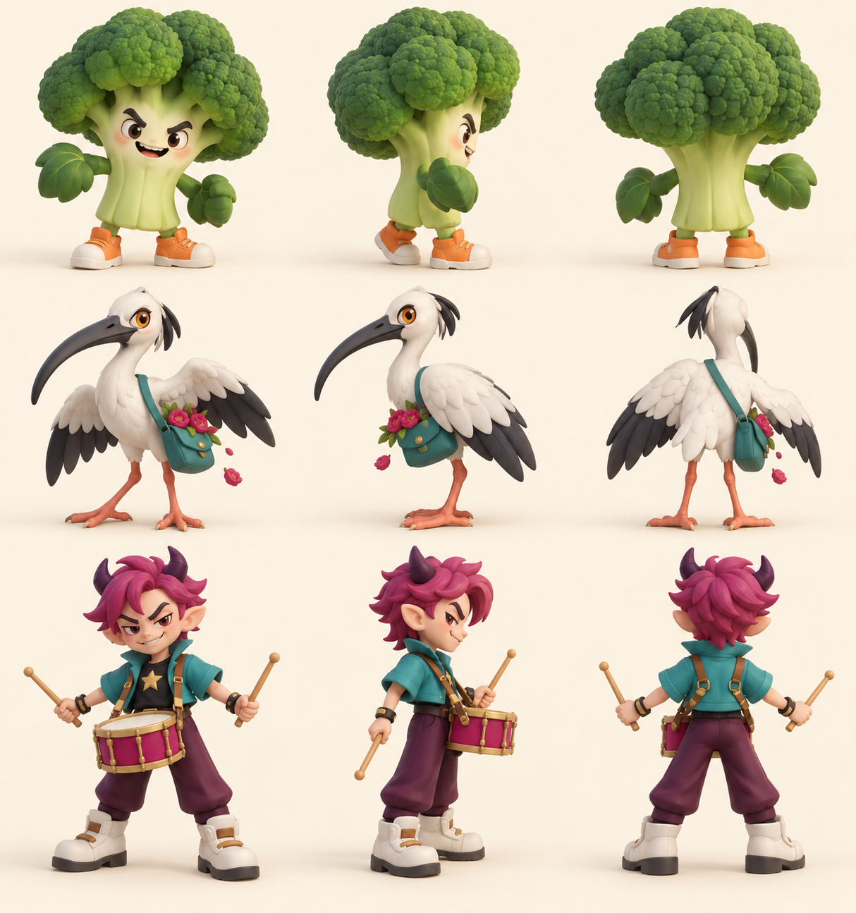

# Action minions B · v001 construction concept

**Concept selected by the coordinator · Blender models in progress · Awaiting Tom's review.**

The [action-world direction](../../../designs/029-action-and-inhabited-worlds.md) gives the Playroom, Magic House and Big Stage a new ordinary silhouette each. The broccoli has a chunky floret crown and sneakers; the long-beaked bird carries stolen flowers; the drummer has a waist snare, sticks and a swept magenta hairstyle. Existing bosses remain the chapter leads.

The driving Codex session generated this original construction sheet with OpenAI's built-in image tool on October 4, 2026. [The saved prompt](../../media/action-minions-b/v001/prompt.txt) records the request. No family photo, personal likeness, downloaded franchise model or logo was used. This image shows intended construction, not completed meshes.

Claude Code Opus 5.5 (`claude-opus-5-5`, xhigh) owns Blender instance 2 under [the asset work order](../../../../.agents/work-orders/20261004-opus-action-minions-b.md). [Broccoli Bouncer v001](../broccoli-bouncer/v001.md) is delivered and coordinator-selected with five clips. The bird and drummer remain in production. [PRD-004 Q-03](../../../prds/004-family-release.md#owner-decisions) permits technically checked family-release candidates with owner review still open.
