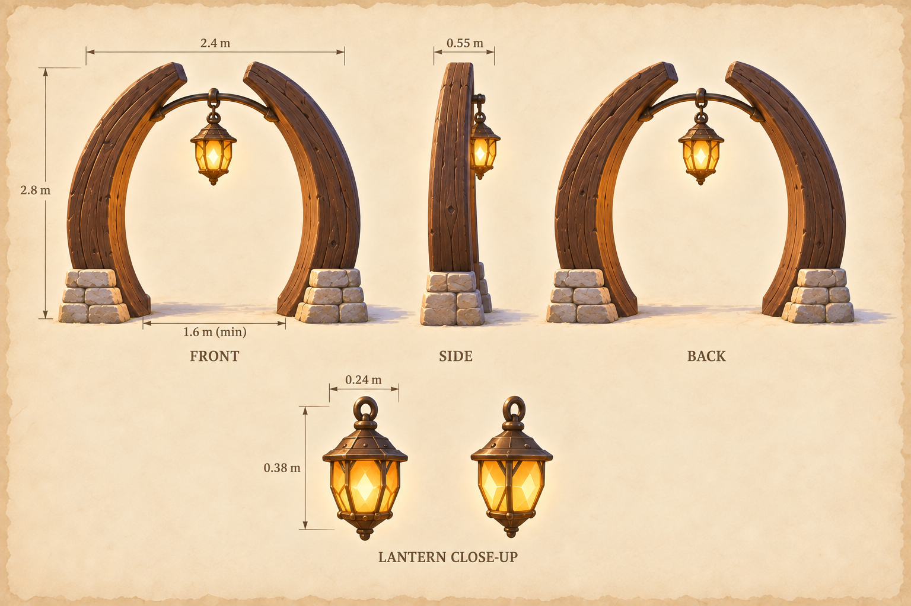
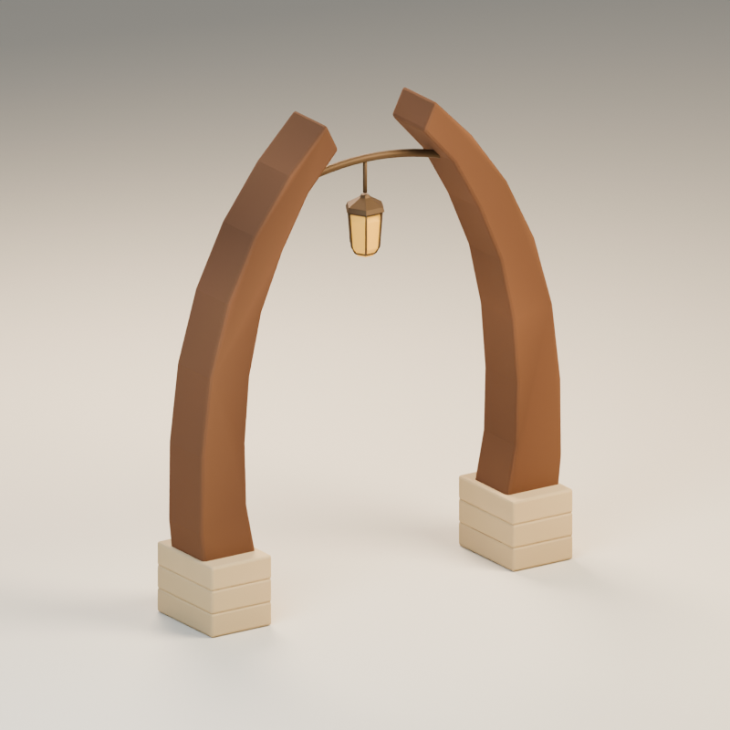
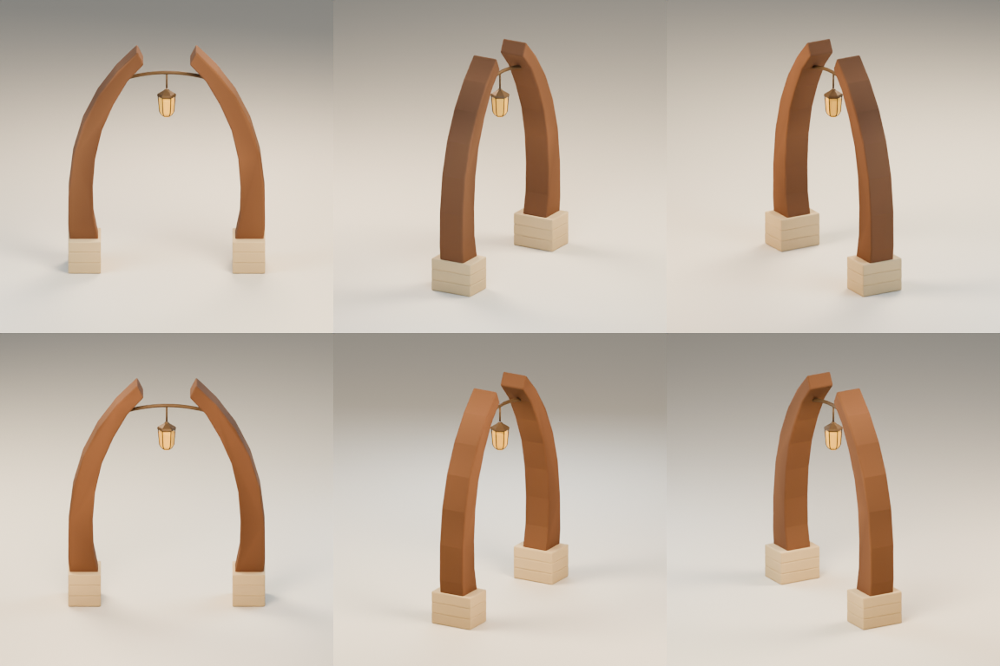
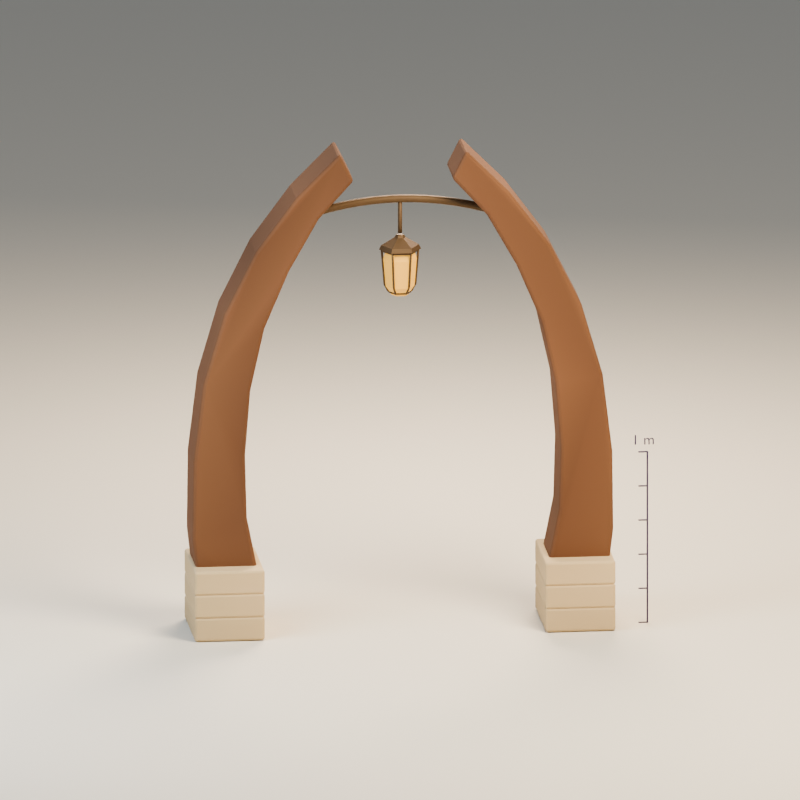

# A lantern at the end of the path

**arrival-landmark · v001 · Ready for Tom · Not approved for gameplay**

Two inward-curving timbers and a small amber lantern mark the clearing’s arrival point.

## From illustration to model

<figure><figcaption>Selected source concept.</figcaption></figure>
<figure><figcaption>Exact exported GLB, re-imported for this view.</figcaption></figure>

The gateway is 2.8 m high, 2.4 m wide and 0.55 m deep. A thin bronze bar carries the lantern between the open walnut crescents. The model uses faceted timber and plain stacked sandstone feet, with much less carved detail than the illustration.

<model-viewer src="../../media/arrival-landmark/v001/arrival-landmark.glb" poster="../../media/arrival-landmark/v001/front.png" alt="Orbit the arrival-landmark candidate" camera-controls touch-action="pan-y" shadow-intensity="0.7" camera-orbit="155deg 70deg auto"></model-viewer>

[Download the GLB](../../media/arrival-landmark/v001/arrival-landmark.glb) · [Still fallback](../../media/arrival-landmark/v001/front.png)

[Front](../../media/arrival-landmark/v001/front.png) · [Side](../../media/arrival-landmark/v001/side.png) · [Back](../../media/arrival-landmark/v001/back.png) · [Top](../../media/arrival-landmark/v001/top.png)

## Construction and use

The exported-mesh scan measured a minimum 1.6 m opening from near ground level to 1.6 m high, within floating-point tolerance. There is no door or blocking platform in this GLB. The author corrected a timber/stone-foot intersection. Restrained lantern emission works without a bloom effect; no light or animated flame is required.

## Technical record

| Check | Exact candidate |
| --- | --- |
| Geometry | 1,880 triangles; 4 materials |
| Size, width × height × depth | 2.400 × 2.800 × 0.550 m |
| Runtime bytes | 118,348 |
| Runtime SHA-256 | `9c151754f84a5df8f03fde12c9047e870a87eef94933e7e5491e066e16cb8c63` |
| Coordinates | Y-up, meters, forward −Z; ground at Y=0 |
| Animation | Static prop; no clips or rig |

Khronos glTF Validator reports zero errors and warnings. Actual GLB re-import and Three.js loading/bounds checks passed. There are no external texture resources or required compression decoders. Chromium 153 loaded and visibly rendered the exact model in a 358 × 358 phone frame; its download matched the manifest hash. Physical iPhone/iPad Safari performance remains untested.

[Format validation](../../media/arrival-landmark/v001/validation.json) · [Re-import inspection](../../media/arrival-landmark/v001/reimport.json) · [Three.js checks](../../media/arrival-landmark/v001/three-inspection.json) · [Construction record](../../media/arrival-landmark/v001/construction.json)

## Source and coordinator intake

Original fictional construction by a fresh **GPT-6 Astra, max** author in **Blender 4.5.13 LTS**, through the dedicated service on September 11, 2026. The driving Astra lead generated and selected the source concepts serially. No private photograph, real-person likeness, third-party mesh or downloaded texture was used. A generator seed/model ID was not returned and is not claimed.

[Full-size concept](../../media/arrival-landmark/v001/concept.png) · [Retained prompt](../../media/arrival-landmark/v001/prompt.txt) · [Concept provenance](../../media/arrival-landmark/v001/concept-provenance.json) · [Exact asset manifest](../../media/arrival-landmark/v001/manifest.json) · [Authoring work order](../../../../.agents/work-orders/010-blender-clearing-kit.md)

Editable master: `haynes-quest/clearing-kit/v001/arrival-landmark/arrival-landmark.blend`, 203,825 bytes, SHA-256 `6787f0f78b03c10f092f59a886934aaf01e23f4975dd5566c90292adf57d4b0a`. Retrieve it from dev-env through the Blender service’s `/artifacts/haynes-quest/clearing-kit/v001/arrival-landmark/arrival-landmark.blend` route and verify the checksum. Masters remain on the dedicated authoring PVC.

The lead compared the exact beauty and six-angle sheet with the concept, then inspected the complete kit. The open arch and suspended lantern stay readable. Timber facets, plain stone courses and a simpler lantern are retained first-pass differences.

[Complete browser audit](../../media/storybook-reference/v001/browser-intake/catalog-local-report.json) · [Independent master retrieval check](../../media/storybook-reference/v001/browser-intake/prop-master-check.json) · [Actual browser view](../../media/storybook-reference/v001/browser-intake/arrival-landmark-model-1-phone.png)

## Tom’s review

Review the open crescent silhouette, the lantern’s scale and the simpler stone-foot finish.

- **Decision:** Pending.
- **Approved version/checksums:** None.
- **Integration:** Studio only. Gameplay uses temporary shapes. Changed geometry or materials require a new candidate version before approval or use.
