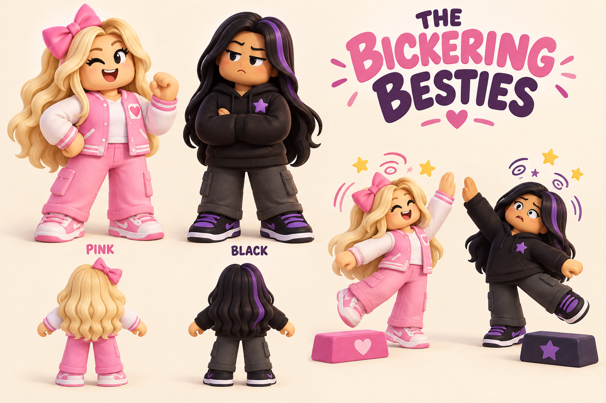
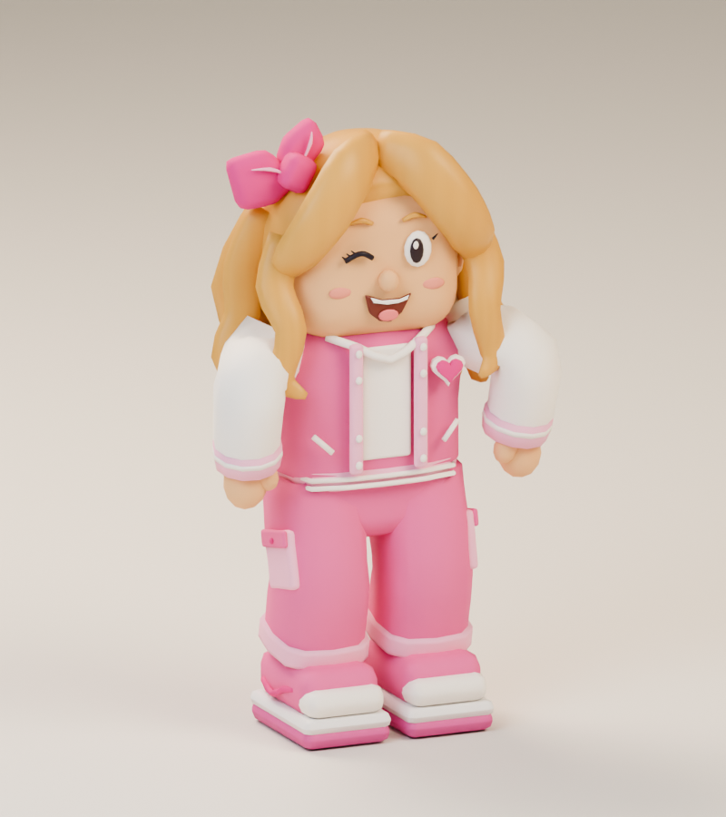
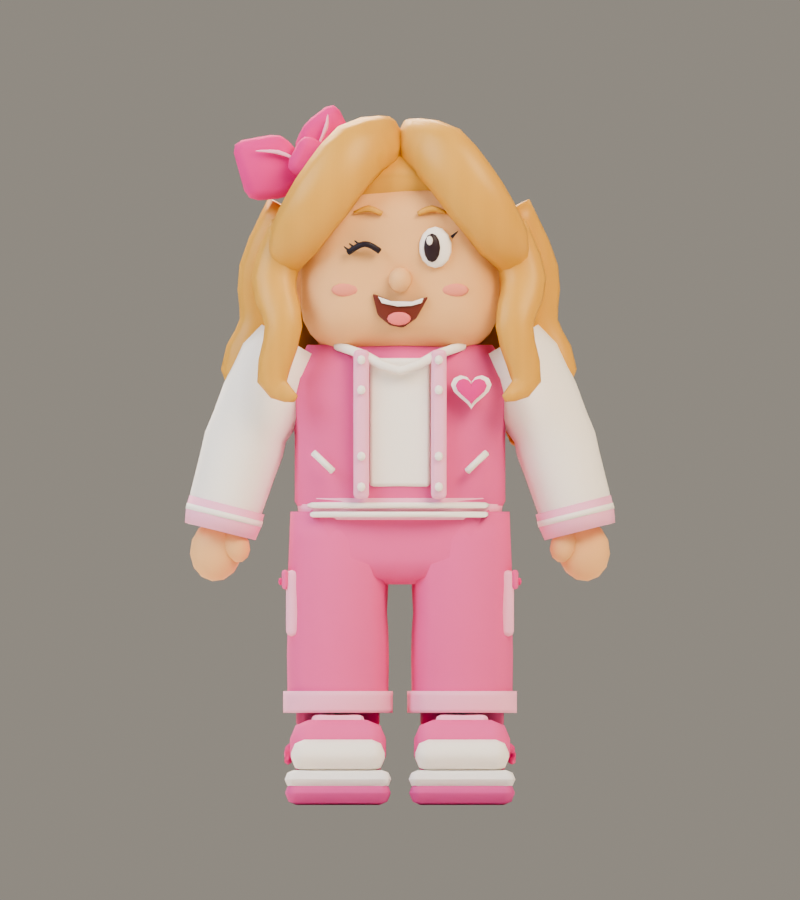
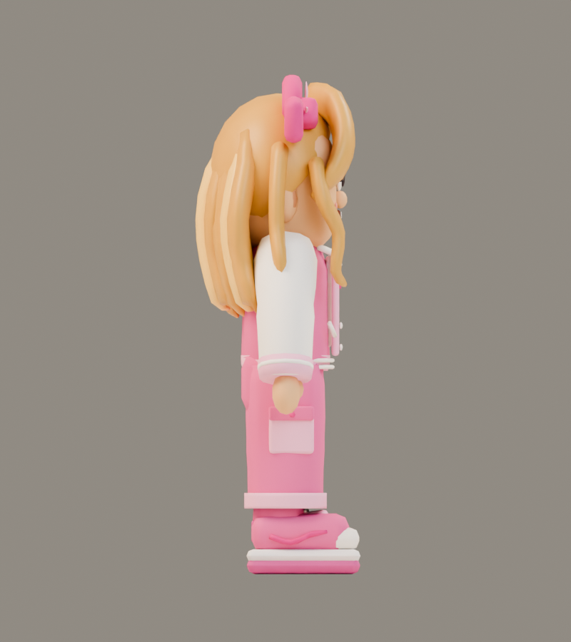
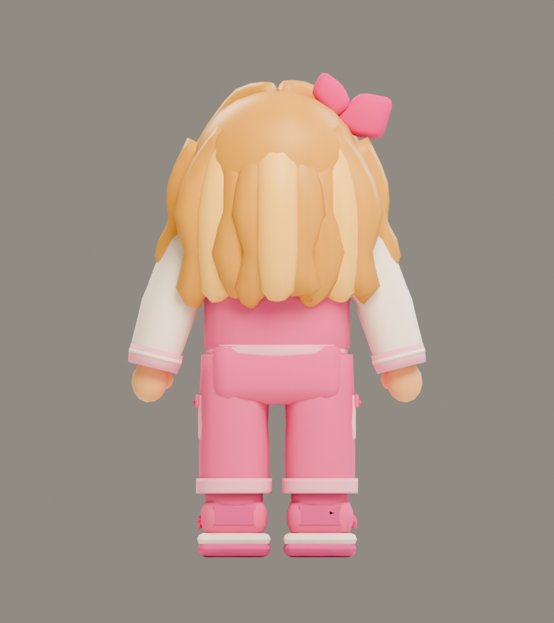
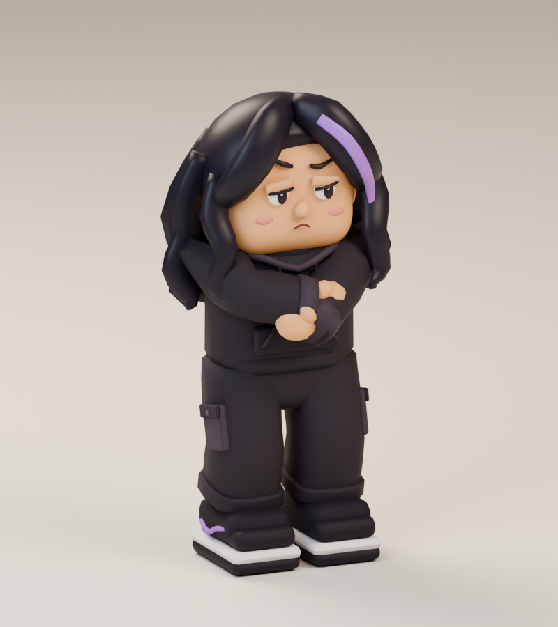
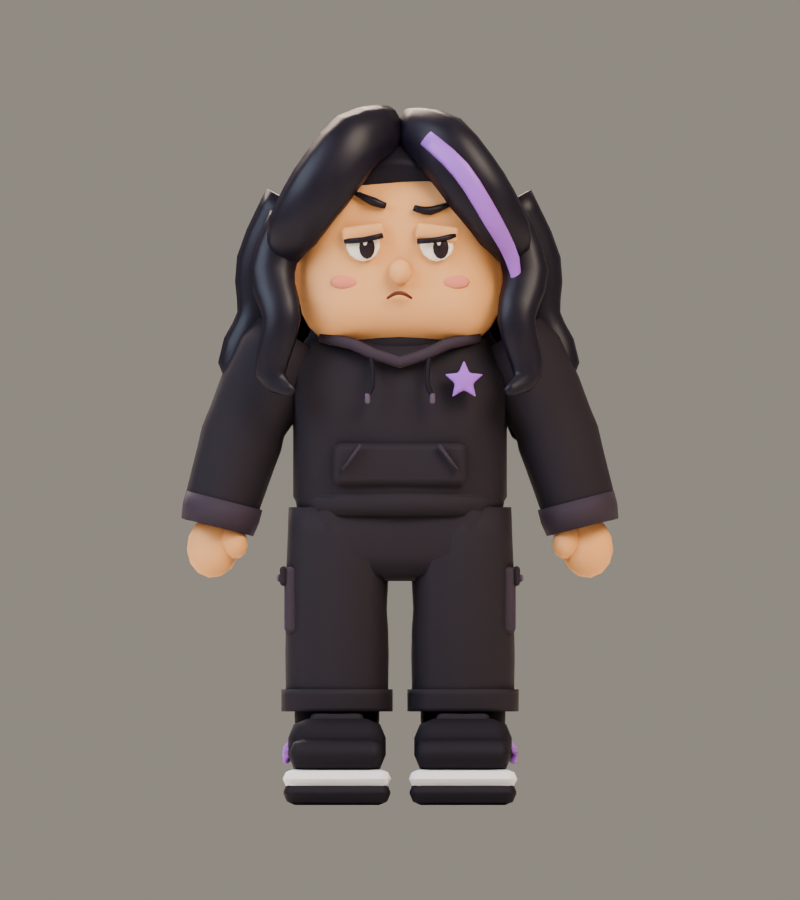
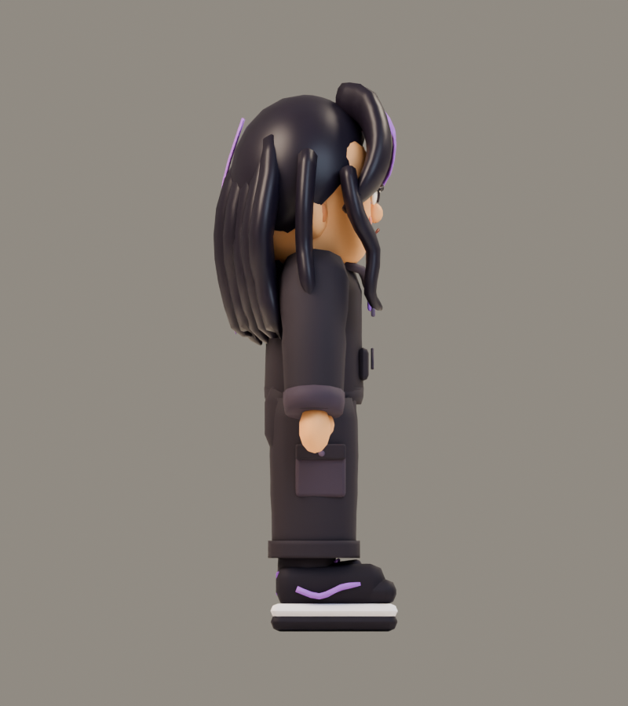
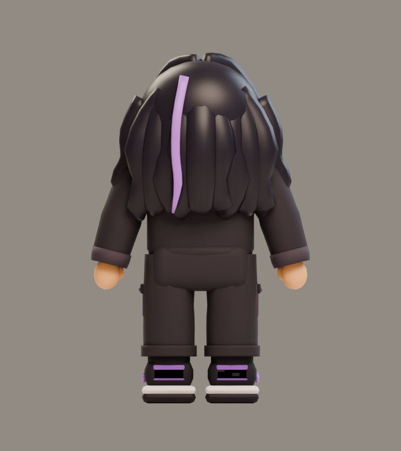
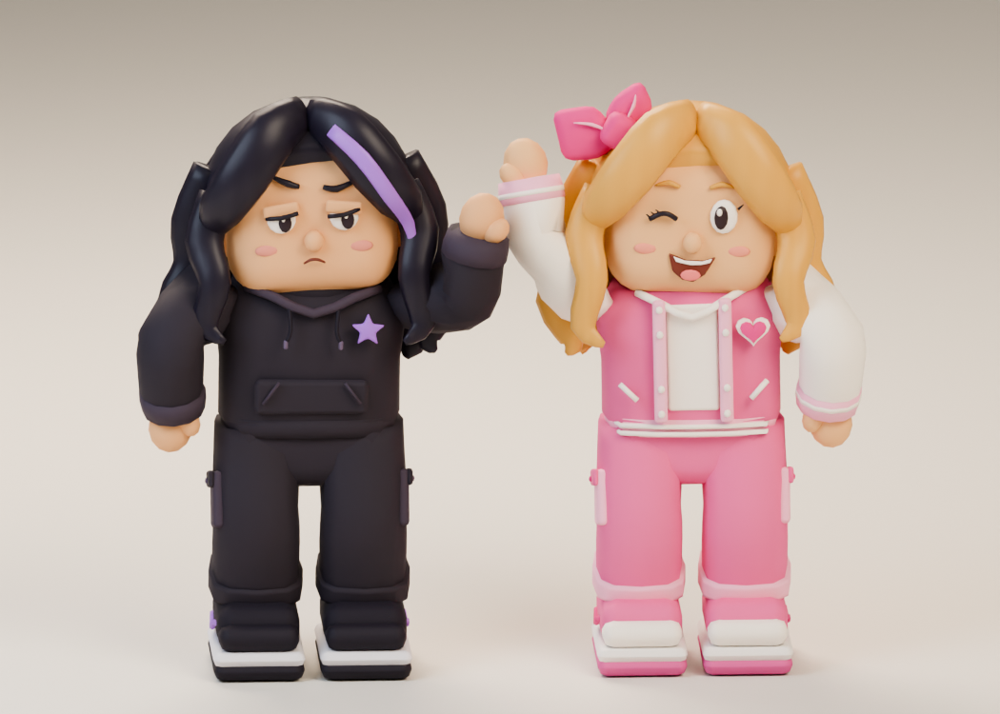

# The Bickering Besties

**Two animated model candidates · v001 · Approved joint look · In the private playtest**

Two competitive best friends turn a pink-versus-black building challenge into a goofy obstacle-course boss fight. One builds while the other cheers, then they swap. Their missed high-five leaves both dizzy for five seconds. The current gameplay revision allows hits in every phase when in range; dizziness is a safe pause, not a damage requirement. They share one health bar, one boss victory and one memory reward.

## Approved inspiration

Tom selected this look on September 11, 2026: “Use this look for the duo.” Pink wears a large bow and a pink-and-white varsity outfit with blonde hair. Black wears a star hoodie with dark hair, a purple streak and purple-accented sneakers. These are original proposed parody costumes; they do not document the creators’ exact current avatars.

The reference theme comes from The Besties’ [pink-versus-black Adopt Me challenge](https://www.youtube.com/watch?v=DeiKPCTH0l4). The lead generated this concept with the built-in image tool. [Exact prompt](../../media/bickering-besties/v001/prompt.txt) · [Source and look decision](../../media/bickering-besties/v001/source.json).

PLAN008 uses these unchanged v001 models with shared visible targeting, individual hit reactions, full sweep warnings and a completed defeat animation. The revised private encounter aims each warning once at the player and uses two-health contacts in fresh routes so there is time to learn and dodge; this is runtime behavior, not a newly generated or newly approved model. See [the encounter contract](../../../designs/014-besties-encounter.md).

## Bestie Pink {#bestie-pink}

An enthusiastic wink, a heart patch, a large pink bow and a bright varsity outfit. The game uses the exact exported model shown here. Large sculpted hair locks, connected sleeves and trouser legs keep the design readable on a small screen.

<figure><figcaption>Approved costume and character reference</figcaption></figure>
<figure><figcaption>Actual v001 model, reimported from its GLB</figcaption></figure>

<model-viewer src="../../media/bestie-pink/v001/bestie-pink.glb" poster="../../media/bestie-pink/v001/front.png" alt="Orbit Bestie Pink and inspect all eight animations" camera-controls touch-action="pan-y" data-quest-clips shadow-intensity="0.7" camera-orbit="155deg 75deg auto"></model-viewer>

[Download model](../../media/bestie-pink/v001/bestie-pink.glb) · [Editable Blender master](../../media/bestie-pink/v001/bestie-pink.blend) · [Exact manifest](../../media/bestie-pink/v001/manifest.json)

<figure><figcaption>Front</figcaption></figure>
<figure><figcaption>Side</figcaption></figure>
<figure><figcaption>Back</figcaption></figure>

| Exact model check | Result |
| --- | --- |
| Scale and orientation | 1.4 m tall; metres, Y-up, forward −Z; feet at ground level |
| Geometry | 14,588 triangles; five opaque materials/primitives |
| Texture | One original embedded 1024² atlas; no external resources |
| Rig | 21 bones; stationary root; eight named clips |
| Download | 956,924 bytes |
| SHA256 | `0f7020f53ed257dd88e6a8cb9e8fb0011c70e84bf33bc2e55fb671473aea96ae` |

[Format validation](../../media/bestie-pink/v001/validation.json) · [Three.js animation checks](../../media/bestie-pink/v001/three-inspection.json) · [Attachment and foot checks](../../media/bestie-pink/v001/attachment-foot-inspection.json) · [Actual browser rendering](../../media/bestie-pink/v001/browser-inspection.json)

## Bestie Black {#bestie-black}

A skeptical expression, purple hair streak and star patch on a dark hoodie. The game uses the exact exported model shown here. Large sculpted hair locks, connected sleeves and trouser legs keep the design readable on a small screen.

<figure><figcaption>Approved costume and character reference</figcaption></figure>
<figure><figcaption>Actual v001 model, reimported from its GLB</figcaption></figure>

<model-viewer src="../../media/bestie-black/v001/bestie-black.glb" poster="../../media/bestie-black/v001/front.png" alt="Orbit Bestie Black and inspect all eight animations" camera-controls touch-action="pan-y" data-quest-clips shadow-intensity="0.7" camera-orbit="155deg 75deg auto"></model-viewer>

[Download model](../../media/bestie-black/v001/bestie-black.glb) · [Editable Blender master](../../media/bestie-black/v001/bestie-black.blend) · [Exact manifest](../../media/bestie-black/v001/manifest.json)

<figure><figcaption>Front</figcaption></figure>
<figure><figcaption>Side</figcaption></figure>
<figure><figcaption>Back</figcaption></figure>

| Exact model check | Result |
| --- | --- |
| Scale and orientation | 1.4 m tall; metres, Y-up, forward −Z; feet at ground level |
| Geometry | 14,056 triangles; five opaque materials/primitives |
| Texture | One original embedded 1024² atlas; no external resources |
| Rig | 21 bones; stationary root; eight named clips |
| Download | 928,000 bytes |
| SHA256 | `0819c67a17d38f340ace0ebdaff6bd316a800286af7f7a0da91273e898d80f05` |

[Format validation](../../media/bestie-black/v001/validation.json) · [Three.js animation checks](../../media/bestie-black/v001/three-inspection.json) · [Attachment and foot checks](../../media/bestie-black/v001/attachment-foot-inspection.json) · [Actual browser rendering](../../media/bestie-black/v001/browser-inspection.json)

## Together in motion

<video controls playsinline preload="metadata" poster="../../media/bestie-pink/v001/joint-motion-grid.png" aria-label="Both Besties performing all eight animations"><source src="../../media/bestie-pink/v001/joint-animations.mp4" type="video/mp4"><a href="../../media/bestie-pink/v001/joint-animations.mp4">Download the joint motion reel</a></video>

Choose any clip beneath each interactive viewer. **Idle**, **move**, **cheer** and **dizzy** repeat. **Attack**, **hit**, **defeat** and **high-five** play once; defeat holds a comic seated pose. Attack reaches its gesture contact at 1.0 seconds of a 1.6-second clip. The high-five uses Pink’s right hand and Black’s left. In the game, they approach to 0.90 metres apart; their hands miss in height and depth.

The two separate models and their [joint editable review scene](../../media/bestie-pink/v001/joint-export-review.blend) retain their source geometry and motion. The game supplies actor movement, foam obstacles, warning areas and the shared five-second dizzy pause. [Current touch and recovery rules](../../../designs/018-familiar-touch-and-recovery.md) keep these model files unchanged while allowing hits throughout the routine. [Encounter design](../../../designs/014-besties-encounter.md).

## Review and provenance

A fresh native GPT-6 Astra author at max built both candidates in Blender using the approved concept. No downloaded models or textures, private photographs or additional generated concepts were used. The stylized hair and clothing simplify the painted concept into connected, lightweight game geometry.

The exact exports pass format, attachment, animation and software WebGL checks. These results establish technical behavior; physical Safari, device performance and the children’s response remain separate checks. Tom approved the joint look, while final approval of these exact model versions remains open.

[Production brief](../../../../.agents/work-orders/051-besties-models.md) · [Authoring evidence and recovery](../../../../.agents/work-orders/051-besties-models-results.md) · [Original duo direction](../../../../.agents/work-orders/036-besties-design-brief.md)
