# Bin Chicken Flower Thief · v001

**Coordinator-selected candidate · awaiting Tom's exact-version review.** An
original garden-troublemaker minion for the Magical garden cast. This gangly
white ibis has a long, curved dark beak, swept-back black crest plumes, big
grumpy orange eyes, black wing tips and coral legs. Its teal satchel is stuffed
with stolen raspberry flowers. It struts toward the player, rears back, then
jabs with its beak and flings a flower.
[DESIGN-029](../../../designs/029-action-and-inhabited-worlds.md) adds it as an
ordinary enemy silhouette. The family-release candidate permission in
[PRD-004 Q-03](../../../prds/004-family-release.md#owner-decisions) applies.

**Source: coordinator-generated construction reference.** Row 2 of the October 4
action-minions-B sheet was the build guide. No image pixels are applied to the
model. Claude Code Opus 5.5 (`claude-opus-5-5`, xhigh) authored the model in
Blender 4.5.13 LTS on the isolated second authoring service. Eyes, brows,
feathers, satchel, buttons and flowers are modelled geometry with flat vertex
colours. No family photograph, likeness, downloaded mesh, logo or texture was used.

[Provenance](../../media/bin-chicken-flower-thief/v001/provenance.json) ·
[Construction record](../../media/bin-chicken-flower-thief/v001/construction.json) ·
[Artifact manifest](../../media/bin-chicken-flower-thief/v001/sha256-manifest.json)

<model-viewer src="../../media/bin-chicken-flower-thief/v001/bin-chicken-flower-thief.glb" poster="../../media/bin-chicken-flower-thief/v001/beauty.png" alt="Orbit the Bin Chicken Flower Thief and inspect its five animations" camera-controls touch-action="pan-y" data-quest-clips shadow-intensity="0.7" camera-orbit="155deg 78deg auto"></model-viewer>

[Download exact GLB](../../media/bin-chicken-flower-thief/v001/bin-chicken-flower-thief.glb) ·
[Editable Blender master](../../media/bin-chicken-flower-thief/v001/bin-chicken-flower-thief.blend)

## Concept to model

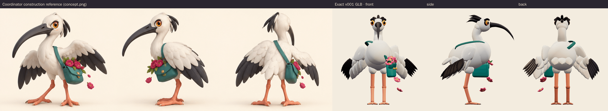

The model keeps the concept's long downward-curved beak, white head with black
swept plumes, large orange eyes under a scowling brow, and layered white wings
with long black primaries. It also keeps the coral legs with backward-bending
ankles and splayed toes, and the teal flap satchel with gold buttons. That
satchel hangs at the front left on a strap over the right shoulder, with a
bouquet of raspberry flowers and two loose blooms spilling out. This version is
slightly taller and slimmer-legged than the painted concept, so the long-bird
silhouette stays distinct from the round Broccoli Bouncer and the humanoid
drummer.

<figure>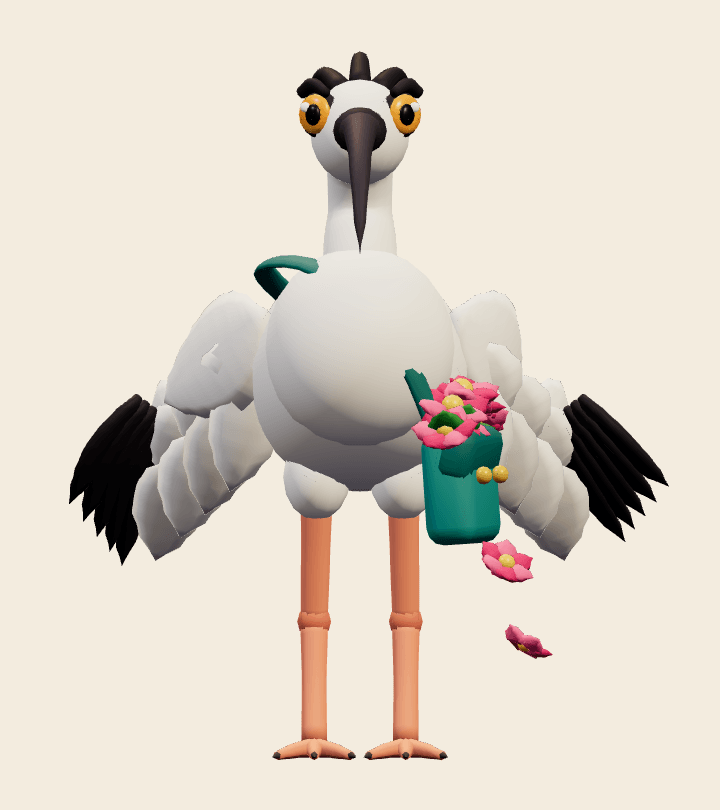<figcaption>Front</figcaption></figure>
<figure>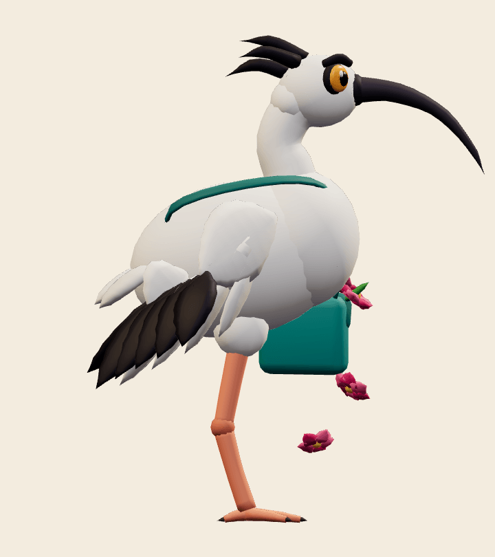<figcaption>Side</figcaption></figure>
<figure>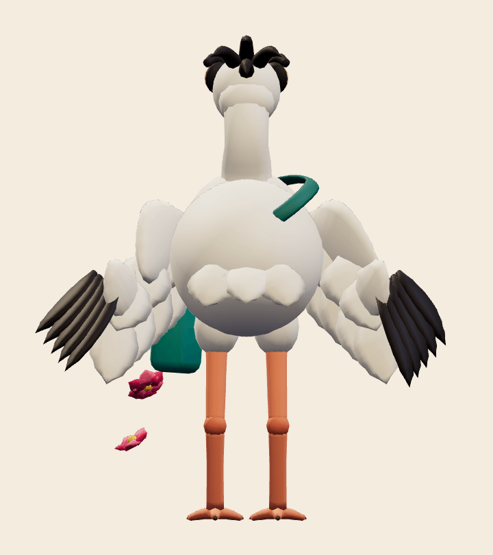<figcaption>Back</figcaption></figure>
<figure>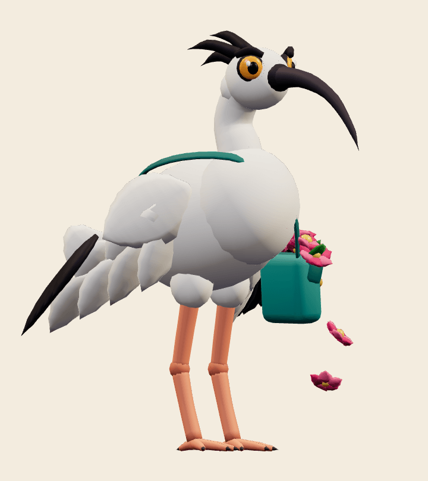<figcaption>Three-quarter</figcaption></figure>

## Animation

The adapter requires exactly `idle`, `move`, `attack`, `hit` and `defeat`, and
all five are present. One foot always stays on the floor, and the body bobs with
the stride.

- `idle`, 3.0 s loop: breathing, a suspicious look to each side, a blink, and a
  swaying satchel and blooms.
- `move`, 0.9 s loop: a high-stepping strut with a pigeon-style head bob.
- `attack`, 2.0 s: raises its crest on seeing the player (0.3 s). It rears back
  with its neck coiled and wings flared, and trembles until 1.12 s. Then it jabs
  its beak at 1.25 s, a contact fraction of 0.625, and flings two flowers
  forward. The flowers pop back into the satchel by 2.0 s.
- `hit`, 0.7 s: feathers puff, crest up and eyes squeezed shut, then it settles.
- `defeat`, 2.4 s: a dizzy wobble and a stagger, then it plops down to sit with
  its head drooped and flowers spilled. The pose is held from 1.8 s.

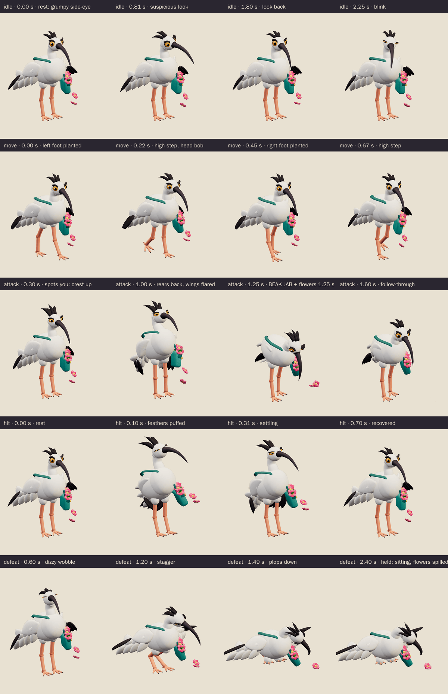

<figure>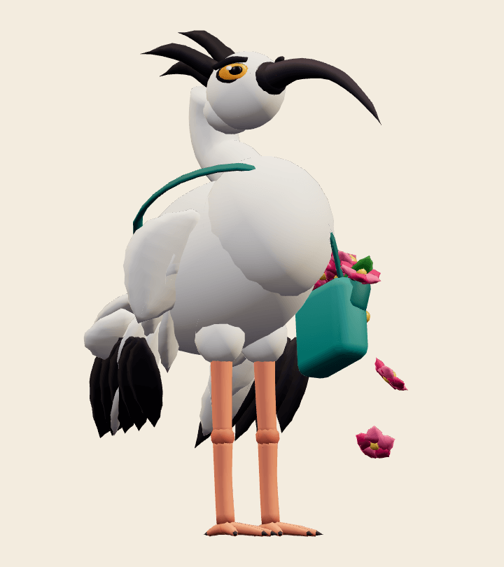<figcaption>Windup, 0.9 s</figcaption></figure>
<figure>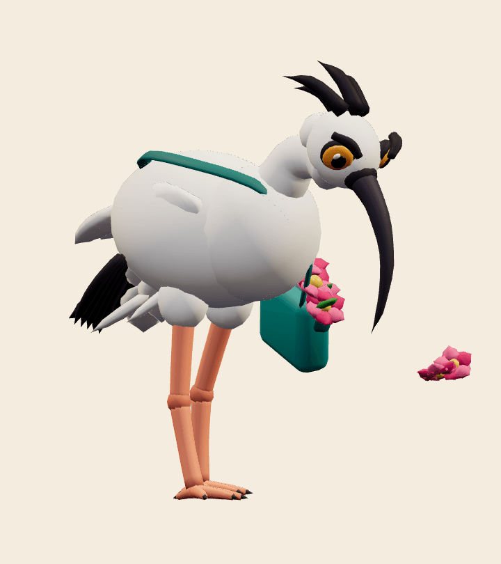<figcaption>Contact, 1.25 s</figcaption></figure>
<figure>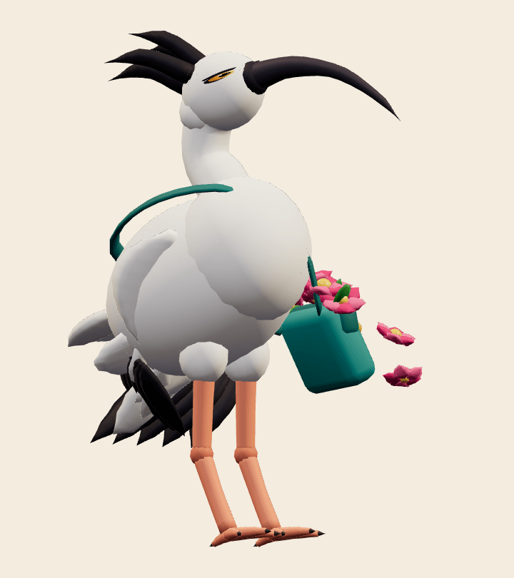<figcaption>Hit</figcaption></figure>
<figure>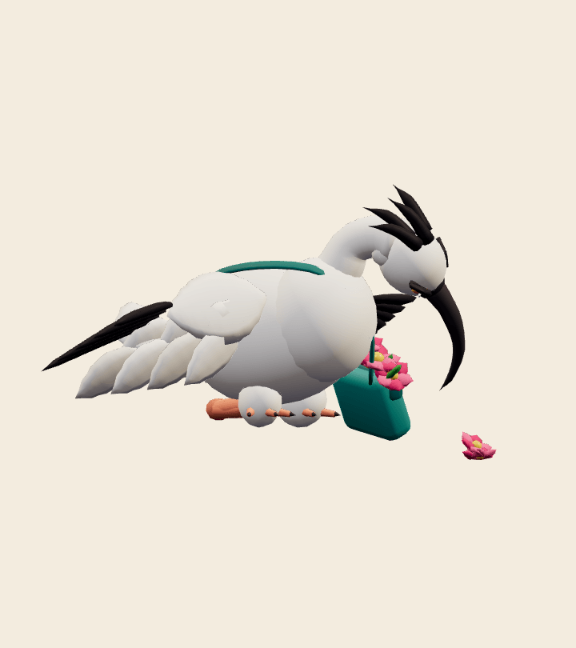<figcaption>Held defeat</figcaption></figure>

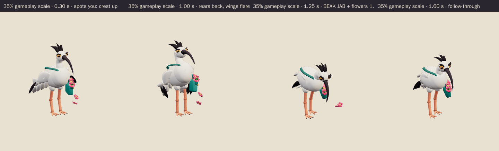

## Technical checks

| Check | Result |
| --- | --- |
| Khronos glTF Validator 2.0.0-dev.3.10 | 0 errors, 0 warnings, 0 infos, 0 hints ([report](../../media/bin-chicken-flower-thief/v001/validation.json)) |
| Runtime file | `bin-chicken-flower-thief.glb`, 1,066,968 bytes, SHA-256 `e9189113…8378b4` |
| Editable master | `bin-chicken-flower-thief.blend`, 735,885 bytes, SHA-256 `77027bda…2f2706` |
| Geometry | 16,498 triangles, 8,527 vertices; 2 vertex-coloured materials (matte, gloss); no image textures |
| Rig | 22 joints, one influence per vertex (rigid parts); constant identity `root` bone; no root motion |
| Scale and facing | 1.480 m to the crest; feet centred on the origin; faces glTF −Z like the other enemies. The beak reaches 0.71 m forward. |
| three.js r186 + `src/game/enemy-animation.ts` | All tracks bind below the scene root. Every vertex was sampled at 60 Hz in every clip: nothing goes below the floor, and the exported culling envelope covers every pose. Idle and move loops are seamless. The adapter aligns the end of windup and the strike with the exact 1.25 s contact pose and defeat vanishes ([report](../../media/bin-chicken-flower-thief/v001/three-inspection.json)). |
| Chromium WebGL (SwiftShader), ACES tone mapping as in the game | 2 character draw calls. Every clip changes the raster at full and 35% scale. Realtime playback of all clips at both scales had no console, HTTP or WebGL errors ([report](../../media/bin-chicken-flower-thief/v001/browser-inspection.json)). |

Browser emulation is not physical-device evidence; iPhone/iPad play remains the
owner's acceptance gate. The long beak extends the forward reach. Gameplay
placement should keep the usual attack ring rather than size it to the beak.

## Coordinator intake and iteration

- **Reviewed by / date:** Codex driving session, October 4, 2026; construction comparison and attack at small scale.
- **Iteration so far:** the first internal draft had a small head, a thin neck,
  spindly legs and a tiny satchel. It was rebuilt before delivery with a bigger
  head and beak, a thicker neck and legs, and a larger satchel and bouquet. Only
  the corrected export is delivered.
- **Selected for Tom's review:** yes; coherent family candidate under PRD-004 Q-03. Owner approval remains pending.

The coordinator accepted this candidate's 16,498 triangles above the provisional 15,000 target for its distinct silhouette and two character draw calls, subject to the full-scene performance check. [Coordinator record](../../media/bin-chicken-flower-thief/v001/coordinator-review.json).
