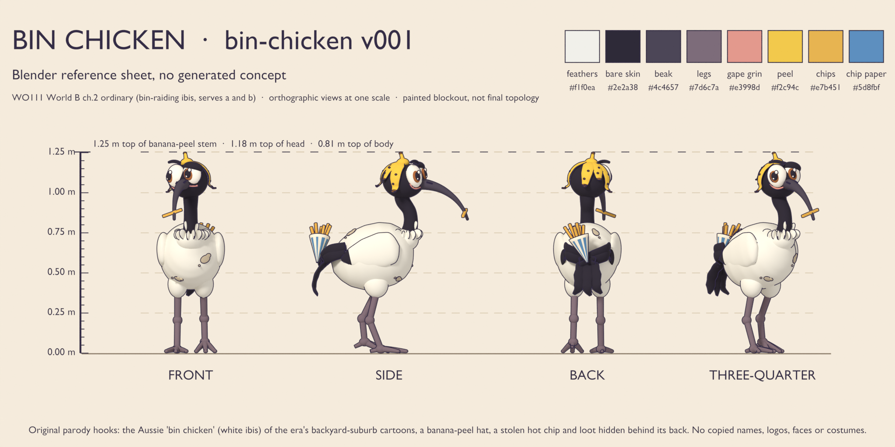
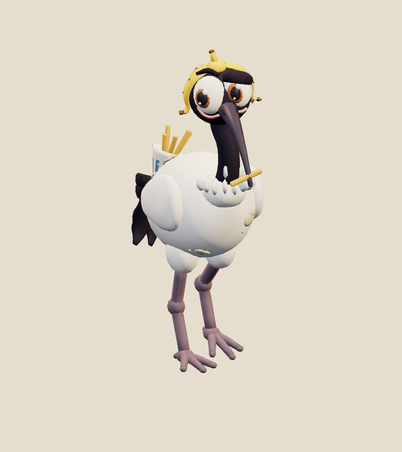
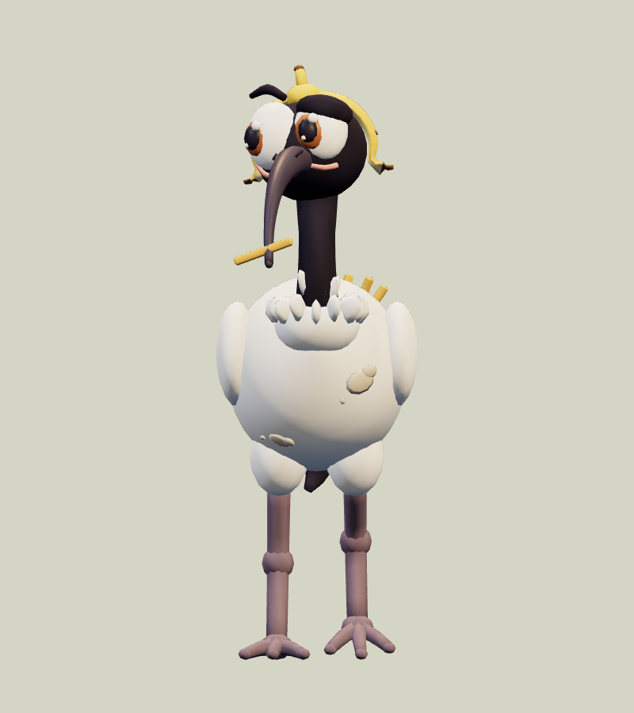
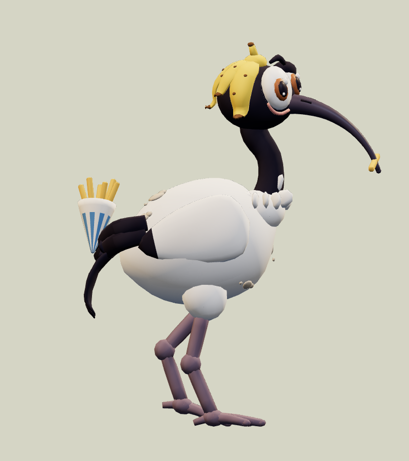
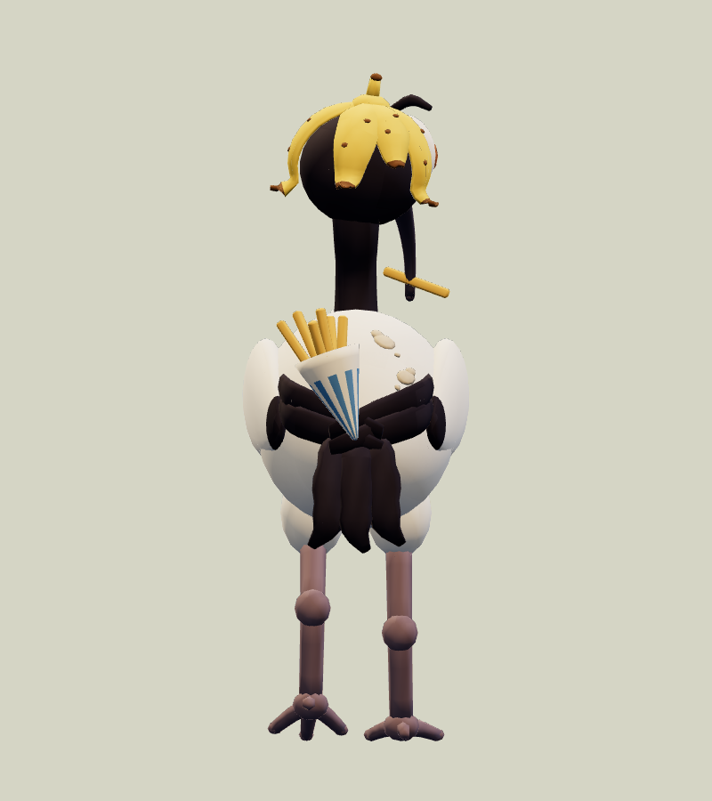
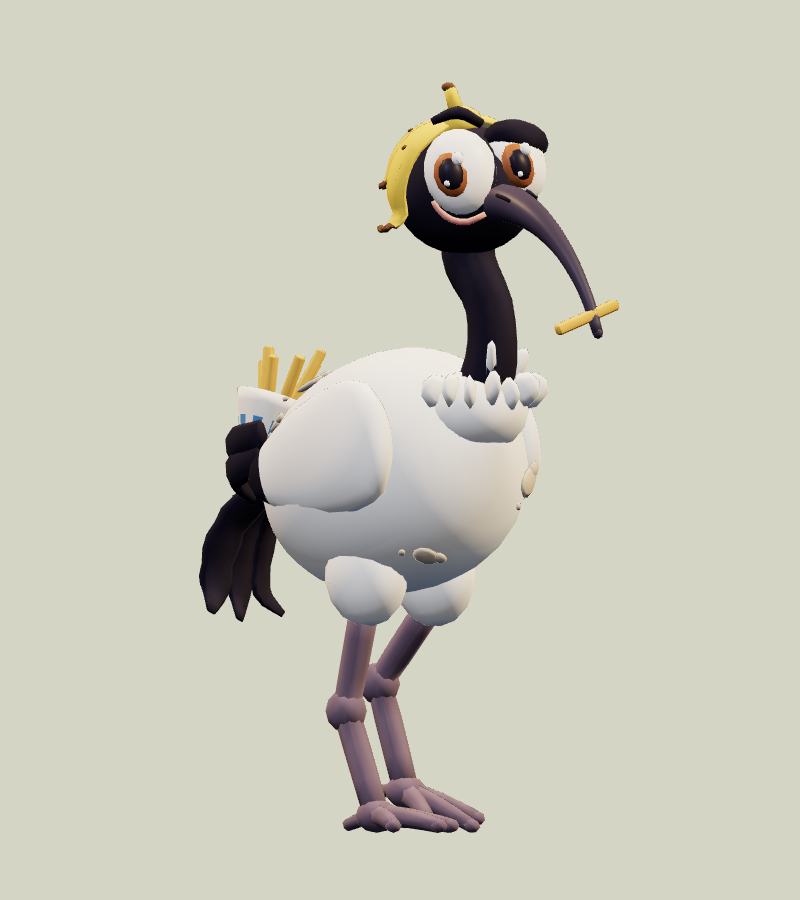
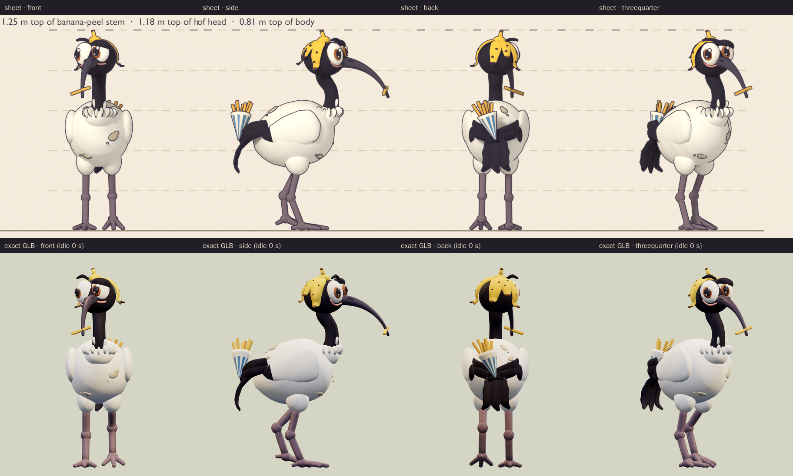
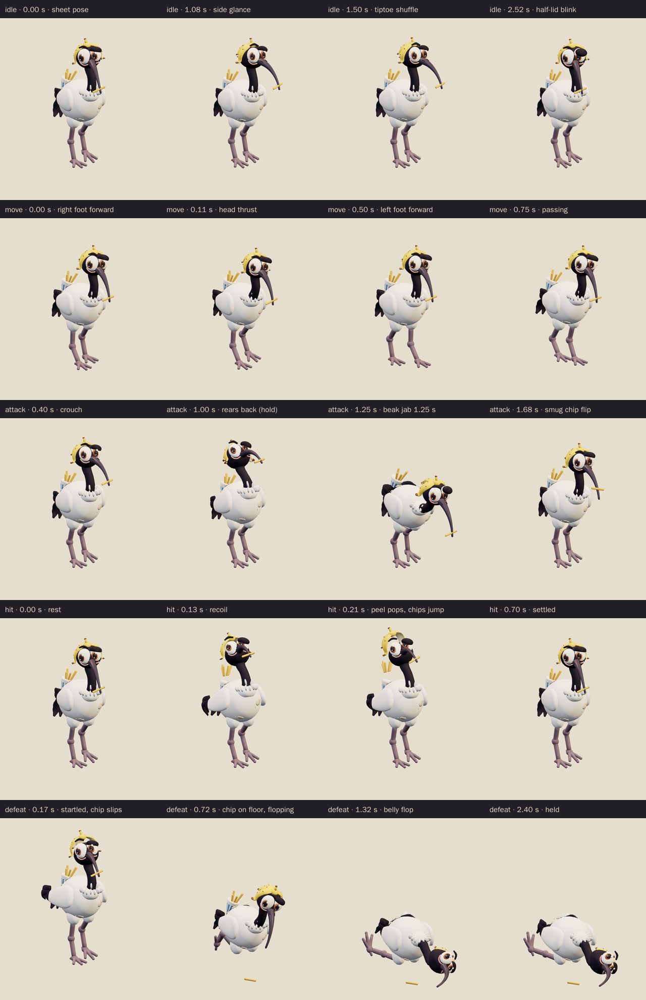
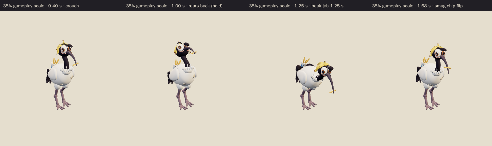

# Bin Chicken · v001

**Awaiting Tom's review · used in the family release.** This cheeky ibis is the World B chapter 2 ordinary enemy candidate from [the locked era roster](../../../designs/026-personal-era-casts.md). It is a goofy "bin chicken", an Australian white ibis caught right after raiding a bin and a chip shop. It wears a banana peel as a hat, a stolen hot chip sits crosswise in its long curved beak, and it hides a striped paper cone of chips behind its back in its crossed black wing tips. It tiptoes about on knobbly stilt legs with a sideways "who, me?" glance. Its attack is a rear-back and a long beak jab.

**Source: Blender reference sheet, no generated concept.** No image-generation model was used for this asset. Following [PRD-004 Q-07](../../../prds/004-family-release.md#owner-decisions), the author first rendered a painted Blender reference sheet from the written brief, and the coordinator approved it on September 26 before any detailing.

[Reference sheet notes](../../media/bin-chicken/v001/reference-notes.md) · [Reference source record](../../media/bin-chicken/v001/source.json) · [Model provenance](../../media/bin-chicken/v001/provenance.json)

<figure><figcaption>Blender reference sheet, no generated concept</figcaption></figure>
<figure><figcaption>Exact v001 model</figcaption></figure>

<model-viewer src="../../media/bin-chicken/v001/bin-chicken.glb" poster="../../media/bin-chicken/v001/beauty.png" alt="Orbit the Bin Chicken and inspect its five animations" camera-controls touch-action="pan-y" data-quest-clips shadow-intensity="0.7" camera-orbit="155deg 75deg auto"></model-viewer>

[Download exact GLB](../../media/bin-chicken/v001/bin-chicken.glb) · [Editable Blender master](../../media/bin-chicken/v001/bin-chicken.blend) · [Reference blockout master](../../media/bin-chicken/v001/bin-chicken-blockout.blend) · [Artifact manifest](../../media/bin-chicken/v001/sha256-manifest.json)

<figure><figcaption>Front</figcaption></figure>
<figure><figcaption>Side</figcaption></figure>
<figure><figcaption>Back</figcaption></figure>
<figure><figcaption>Three-quarter</figcaption></figure>

The comparison above shows the sheet and the exact export at matching angles and one metric scale. The export stills use the first frame of `idle`, which recreates the sheet pose: the head turned 17° to its right and tilted 7°, and the left foot on tiptoe. The model follows the coordinator's sheet notes:

- It keeps the banana-peel hat, the stolen hot chip, the chip-paper loot on its back and the long curved beak.
- The legs are thickened from the blockout's 0.04 m to 0.044–0.050 m, with 0.07 m knee knobs, so they stay readable at 35% scale.
- The attack is a beak peck: it rears back with its neck coiled, then jabs forward.
- The defeat drops the chip on the floor.
- The height matches the approved blockout to within 3 mm, and the atlas uses the sheet's colour values.

The author departed from the sheet notes in four deliberate ways:

- The bind pose stands with the head straight and both feet flat, as the sheet notes suggested. The sheet pose is recreated at the start of `idle`, and the main stills show it; [rest-pose stills](../../media/bin-chicken/v001/final-preview/rest-beauty.png) show the bind pose.
- Each leg uses leg, shank and foot bones. The feathered thigh rides on the hips and the toes ride on the foot, so there are no separate thigh or toe bones; the rig has 29 joints.
- The chip cone rides on its own bone under the hips rather than a wing-tip bone, so the wing flares in `hit` and `defeat` do not throw it. The chips in the cone have their own bone for the hit jump and the defeat spill.
- `hit` has no feather-puff scaling; every joint stays unscaled. In `defeat` the peel slides forward partly over the brow, and the eyes stay visible under drooping lids.

The author also fixed these problems along the way:

- The first defeat bake left the belly 3.4 mm below the floor.
- The first held defeat propped the head 0.43 m up with the beak pointing at the floor, which did not read as a flop. The neck now drapes along the floor and the head lies on its left cheek.
- When the head rolled onto its cheek, the left peel flap dipped up to 3 cm below the floor.
- The spilled chips first sat 1.9 cm below the floor, and the dropped beak chip first landed under the beak. It now lands at the front right, 0.30 m from the beak tip.
- The hit clip first started with the peel flaps out of place; it now starts exactly at the idle 0 s pose.
- The first beak jab pointed steeply down, only 0.20 m ahead. More head counter-pitch and body lean make it a forward jab.

The expression is sly rather than mean, with no teeth, claws or weapon. The grime is beige smudges, and the chip cone has plain stripes with no lettering or brand.

| Exact exported model | Result |
| --- | --- |
| Size and placement | 0.425 m wide × 1.257 m tall to the banana-peel stem tip × 1.006 m deep at rest; the soles sit 1.7 mm above the floor. Across all clips the highest point is 1.302 m, and at attack contact the beak tip lands 0.369 m ahead of its sheet-pose position, about 0.49 m above the floor. Metre scale, Y-up, forward −Z, floor-centered |
| Geometry | 11,196 triangles; one skin with 29 joints and at most two influences per vertex; two opaque material primitives |
| Texture | One original embedded 1024 × 1024 palette atlas; no external resource or required decoder |
| Download | 1,033,964 bytes; below the 2 MiB candidate budget |
| GLB SHA-256 | `5aa5bb2bfe3fce55a5ea20b766768a501710a998e20cd064b8c7db9c26cbf0db` |
| Blender master SHA-256 | `1a8b30358de09ac35e6cabbc9f0172942cd9067f4c0451089ffbc9c4c073a8bf` |
| Reference sheet SHA-256 | `cd9d2266f56b142709fb6526e6d8e1e0129cc84383ef0ebff4991ba721359044` |

## Motion and checks

The viewer exposes `idle` (3.0 s), `move` (1.0 s), `attack` (2.0 s), `hit` (0.7 s) and `defeat` (2.4 s):

- **Idle:** it starts in the sheet pose and shuffles on tiptoe, bobbing its head. From about 0.9 to 2.0 seconds it glances quickly to its left with a raised brow, then blinks its half-lid at about 2.5 seconds. The chip wiggles in its beak.
- **Move:** a jerky strut on stilt legs, with a fast head thrust and slow return on each step. The peel flaps flop and the plumes swish.
- **Attack:** it crouches, then rears back with its neck coiled and its eyes squinting, holding with a quiver from 0.9 to 1.1 seconds. It lunges into a forward beak jab with contact at **1.25 seconds**, holds to 1.4 seconds, recovers and flips the chip smugly back into its beak.
- **Hit:** a recoil and neck whip. The banana peel pops 11 cm off its head, the chips jump out of the cone and the wings flare, then everything settles back to the idle pose.
- **Defeat:** a startled hop. The chip slips from its beak at 0.17 seconds and lands on the floor by 0.62 seconds. It flops belly-down with its legs splayed behind, drapes its neck along the floor and lies on its left cheek. The peel slides forward and the cone tips over, spilling its chips. The pose is held from 1.8 seconds.

The clips leave the root stationary; gameplay controls travel and damage. The lunge moves the body forward and back inside the clip.

[Khronos validation](../../media/bin-chicken/v001/validation.json) reports zero errors, warnings, infos and hints. [Three.js inspection](../../media/bin-chicken/v001/three-inspection.json) reimported the exact GLB and exercised the real enemy animation adapter. It sampled all 9,899 exported vertices at 552 animation steps and passed all 30 checks:

- The root stays still, and rotation-only joints keep their pivots.
- The idle and move loops are seamless, and the defeat pose holds.
- No clip goes below the floor.
- The bird rears back before the jab, the beak jabs forward at contact and the chip is still in the beak at contact.
- The peel pops and the loot chips jump on hit, and the held defeat is flopped with the chip dropped on the floor.

The [attachment audit](../../media/bin-chicken/v001/attachment-inspection.json) checked 10 part pairs on every frame of every clip, including the beak against the body, wings and legs, the head against the body and legs, the two legs against each other and the tail, wings and loot cone against the legs. It found no overlaps, and the limb joints stayed connected. [Chromium playback](../../media/bin-chicken/v001/browser-inspection.json) rendered changing frames for all five clips at normal and 35% scale with no page, console, HTTP or WebGL errors and no external requests. [Author's visual notes](../../media/bin-chicken/v001/visual-review.json) and the [scene release](../../media/bin-chicken/v001/scene-release.json) record the corrections and the released Blender scene.

The catalog intake checked all 146 local artifact hashes against the manifest. It reran the Three.js inspection against the current enemy animation adapter and got byte-identical results. Two small run logs from the sheet stage (`source/crops-render.log` and `source/sheet-render.log`) are listed in the manifest but not published, because the repository ignores log files; they stay in the durable artifact directory.

One runtime limitation affects this model in the game. The game draws enemy skinned meshes with a bounding sphere that three.js computes once, at the first rendered pose, and it does not yet apply the culling envelope the model exports. During the defeat, the eyes-and-beak part moves up to 0.89 m outside its idle sphere, so it could vanish near the screen edge. The fix belongs in the runtime code and is tracked in [issue 103](https://github.com/thaynes43/haynes-quest/issues/103); the model needs no change.

The browser evidence uses software Chromium. Physical iPad/iPhone Safari, device frame time and combat feel remain owner checks. This package contains visual animations only; there is no new audio file.

## Provenance and release

Claude Opus 5.5 (`claude-opus-5-5`, effort `xhigh`) authored both stages through Blender 4.5.13 under [WO111](../../../../.agents/work-orders/111-era-cast-art-lead.md), under Tom's September 26 ruling. It built the procedural blockout and rendered the reference sheet on the first Blender authoring service. After the coordinator approved the sheet, it built the final topology, atlas, 29-bone rig and all five clips on the second service, holding an exclusive scene lease from 16:32 to 17:04 UTC. No family photograph, personal likeness, downloaded franchise model, character design, logo or audio was used. The bird is a real-world species; the banana-peel hat, the crosswise chip, the crossed-wing loot pose and the googly-eyed head are original choices. The [sheet-stage records](../../media/bin-chicken/v001/sheet-stage/README.md) keep the sheet's own lease, release and manifest. The source scripts live in `scripts/assets/bin-chicken/v001/`.

[PRD-004 Q-03](../../../prds/004-family-release.md#owner-decisions) permits this candidate in the family release before Tom's review. The PLAN-019 cast integration registered this exact version as the gameplay ordinary `bin-chicken@v001` in frozen `parody-catalog-v10` ([DESIGN-026](../../../designs/026-personal-era-casts.md#eligibility)). The World B templates `family-world-b@v3` and v4 place it in the four chapter 2 ordinary slots; the frozen v1 and v2 keep their placeholder candidate. Tom's exact-version decision is **pending**. A rejection returns those slots to a placeholder or prior version; catalog inclusion and technical checks do not constitute approval.
