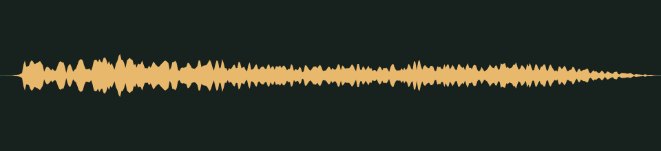

# Up we spring · v001

**Audio candidate · family world mechanics · not yet in the game · listening review pending.** A bright cartoon spring for a bounce pad launch. The prompt asks for a playful boing with a smooth rising pitch and a soft, rounded start.

## Audition

<audio controls preload="none" aria-label="Audition bounce-pad-boing version one">
  <source src="../../media/bounce-pad-boing/v001/cue.wav" type="audio/wav">
  <a href="../../media/bounce-pad-boing/v001/cue.wav">Download the processed cue</a>
</audio>

[Processed cue](../../media/bounce-pad-boing/v001/cue.wav) · [Original five-second take](../../media/bounce-pad-boing/v001/source.wav)

## Exact version

| Property | Measured result |
| --- | --- |
| Stable cue / version | `bounce-pad-boing` / `v001` |
| Duration | 0.60 seconds |
| Format | PCM signed 16-bit WAV, stereo, 44.1 kHz |
| Download size | 105,884 bytes |
| Peak / RMS | -10.0 / -22.635 dBFS |
| Clipped samples | 0 |
| Processed SHA-256 | `ccc7dc45d2fadc86f9ed2405588e217d0f6b399de823223e992df07559e151b4` |
| Source SHA-256 | `ed26d3c5d8b775384191d65ab8b8eb229bd098b6b7a595566c82d2327f7afe24` |

Processing selects the segment beginning at 0.080 seconds, trims it to the stated duration, applies a 0.020-second entrance and 0.120-second exit fade, then normalizes its peak. It is a one-shot cue, not a loop. The source is preserved separately. [Exact recipe](../../media/bounce-pad-boing/v001/processing.json), [measurements](../../media/bounce-pad-boing/v001/verification.json), and [reproducible processing script](../../../../scripts/assets/audio/process_cues.py).

## Source and checks

Generated on 2026-09-26 by a Claude Code subagent (Opus 5.5) from the workflow coordinator's cue brief, using the separate Stable Audio 3 Small-SFX CPU service (service version 0.2.0). This take used seed 201, eight steps and five seconds. It contains no supplied recording or personal reference. The [provenance record](../../media/bounce-pad-boing/v001/provenance.json) retains the complete prompt, service/model revisions and the source terms recorded in [DESIGN-008](../../../designs/008-audio-pipeline.md). The source code, model and redistributed text component have separate terms; no broader license is asserted here.

The service and download SHA-256 checks passed, as did WAV decoding and the exact-duration, non-silence and zero-clipping checks. Re-running the processing script reproduced the same output. These measurements do not establish timbre or musical quality.

## Listen-proxy check

Nobody has listened to this take; the agent cannot hear audio. Instead, it measured the source's level in 20 ms windows, a rough autocorrelation pitch track, the zero-crossing rate and a four-band energy split, and chose the segment from those numbers. The take holds one event. It starts at 0.09 seconds, reaches its level within about 10 ms and then decays for over a second. Across the selected 0.6 seconds, the pitch track climbs steadily from about 740 Hz to about 1.1 kHz, which fits the requested rising boing. The 20 ms entrance fade covers the onset.

Energy split of the processed cue: 1.5% below 300 Hz, 28.3% at 300 Hz–1 kHz, 60.3% at 1–4 kHz and 10.0% above 4 kHz. These numbers hint at shape and brightness; they cannot say how the cue sounds.

## Coordinator and owner review

Review focus: Whether the boing feels springy and fun, without a twangy or sharp start.

- **Coordinator technical intake:** Passed numerically; listening/creative selection pending.
- **Tom’s decision:** Pending, against the exact hash above.
- **Gameplay integration:** None yet. The game’s cue map does not reference this file; wiring it to bounce pads is a separate step. The inventory records it as a private candidate for the family worlds.
