# Broccoli Bouncer · v001

**Draft for coordinator intake · awaiting Tom's exact-version review.** An
original nursery-vegetable minion for the Nursery vegetable cast. It has a chunky
floret crown, a short pale-green stalk body with a sly cream face, leaf hands
and orange high-top sneakers. It bounces toward the player and lands a two-leaf
slap. [DESIGN-029](../../../designs/029-action-and-inhabited-worlds.md) adds it
as an ordinary enemy silhouette. The family-release candidate permission in
[PRD-004 Q-03](../../../prds/004-family-release.md#owner-decisions) applies.

**Source: coordinator-generated construction reference.** Row 1 of the
October 4 action-minions-B sheet was the build guide. No image pixels are applied
to the model. Claude Code Opus 5.5 (`claude-opus-5-5`, xhigh) authored the model in
Blender 4.5.13 LTS on the isolated second authoring service. Faces, brows, mouth,
shoes and leaves are modelled geometry with flat vertex colours. No family
photograph, likeness, downloaded mesh, logo or texture was used.

[Provenance](../../media/broccoli-bouncer/v001/provenance.json) ·
[Construction record](../../media/broccoli-bouncer/v001/construction.json) ·
[Artifact manifest](../../media/broccoli-bouncer/v001/sha256-manifest.json)

<model-viewer src="../../media/broccoli-bouncer/v001/broccoli-bouncer.glb" poster="../../media/broccoli-bouncer/v001/beauty.png" alt="Orbit the Broccoli Bouncer and inspect its five animations" camera-controls touch-action="pan-y" data-quest-clips shadow-intensity="0.7" camera-orbit="155deg 78deg auto"></model-viewer>

[Download exact GLB](../../media/broccoli-bouncer/v001/broccoli-bouncer.glb) ·
[Editable Blender master](../../media/broccoli-bouncer/v001/broccoli-bouncer.blend)

## Concept to model

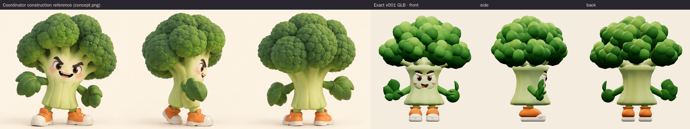

The model keeps the concept's proportions: a crown wider than the body whose
side florets drop beside the face, a short flared and ribbed stalk, the face
just under the crown, a broad open leaf hand on the right, a leafy fist on the
left and chunky orange sneakers with cream soles and toe caps. Its 13 floret
clusters use modelled buds instead of fine painted texture, so the bumpy crown
still reads at phone scale. The eyebrows angle down toward the nose for the
naughty look, and the open smirk is tilted to one side.

<figure>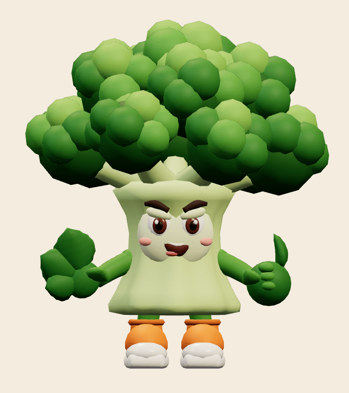<figcaption>Front</figcaption></figure>
<figure>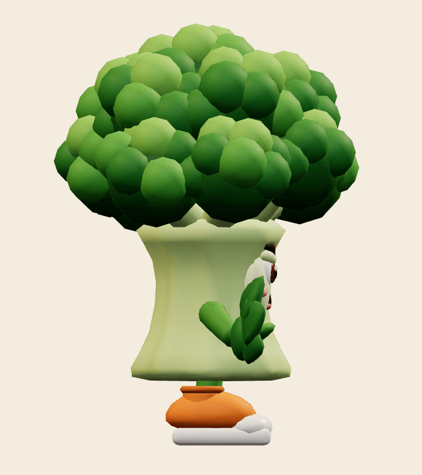<figcaption>Side</figcaption></figure>
<figure>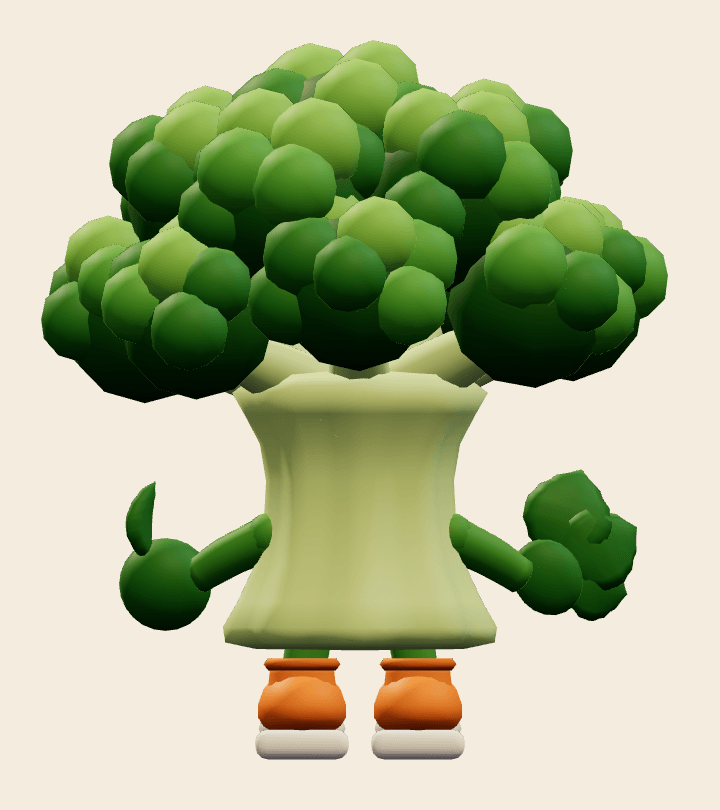<figcaption>Back</figcaption></figure>
<figure>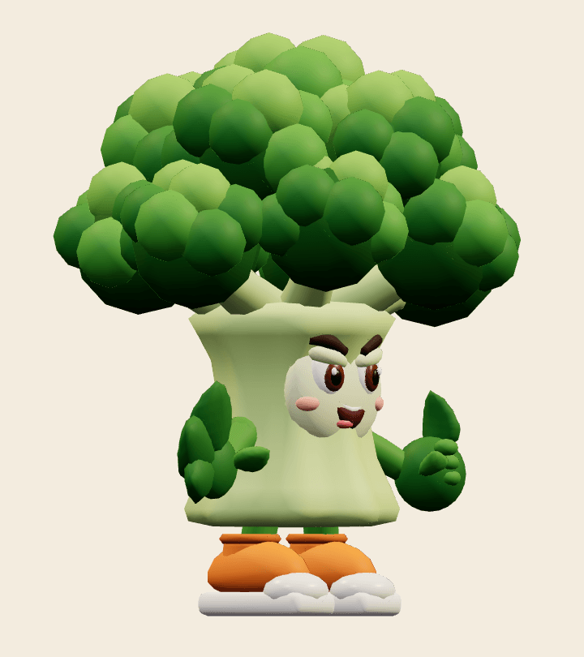<figcaption>Three-quarter</figcaption></figure>

## Animation

The adapter requires exactly `idle`, `move`, `attack`, `hit` and `defeat`, and
all five are present:

- `idle`, 2.0 s loop: springy bob, sly brow waggle and a blink.
- `move`, 0.8 s loop: a hopping run with pumping arms and a squash on landing.
- `attack`, 2.0 s: notices the player (0.25 s), crouches with its leaves cocked
  back and trembles (to 1.08 s), springs, then slaps with both leaves at 1.25 s,
  a contact fraction of 0.625. It hops home by 2.0 s.
- `hit`, 0.6 s: a squashed recoil with its eyes squeezed shut, then a wobble back.
- `defeat`, 2.4 s: a dizzy spin, wilts, then topples onto its back with its feet
  in the air. The pose is held from 1.8 s.

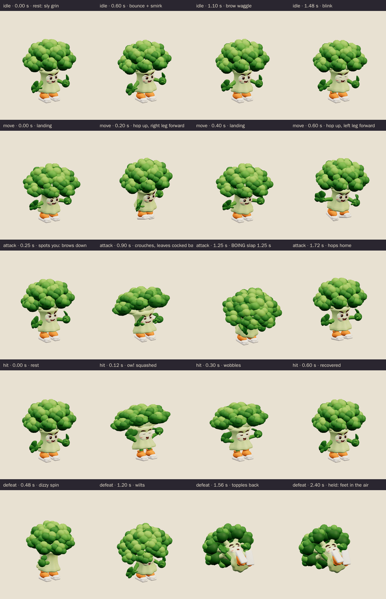

<figure>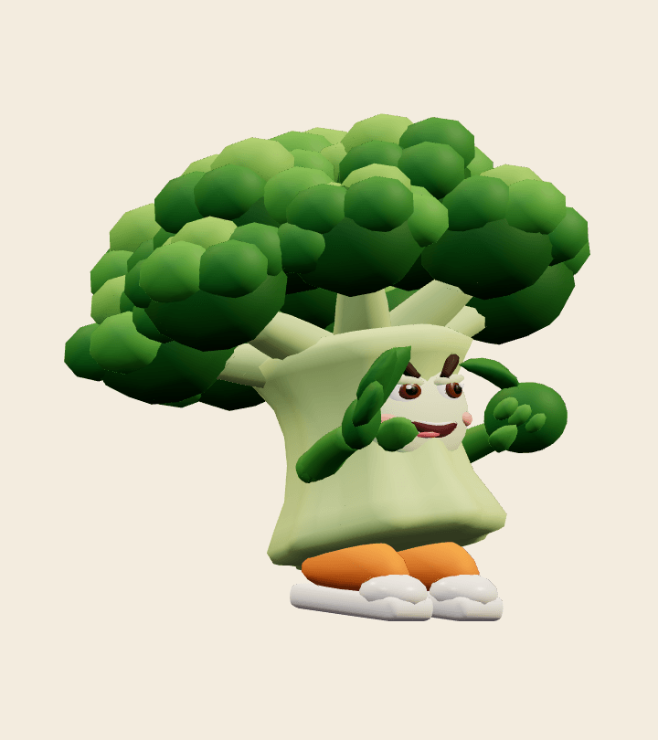<figcaption>Windup, 0.9 s</figcaption></figure>
<figure>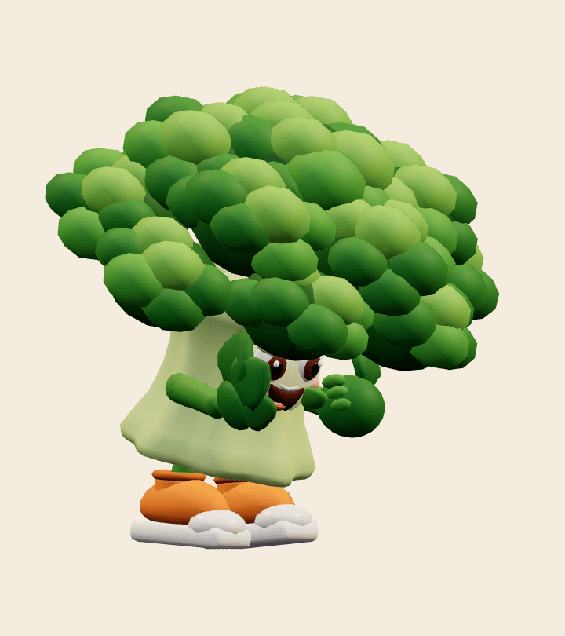<figcaption>Contact, 1.25 s</figcaption></figure>
<figure>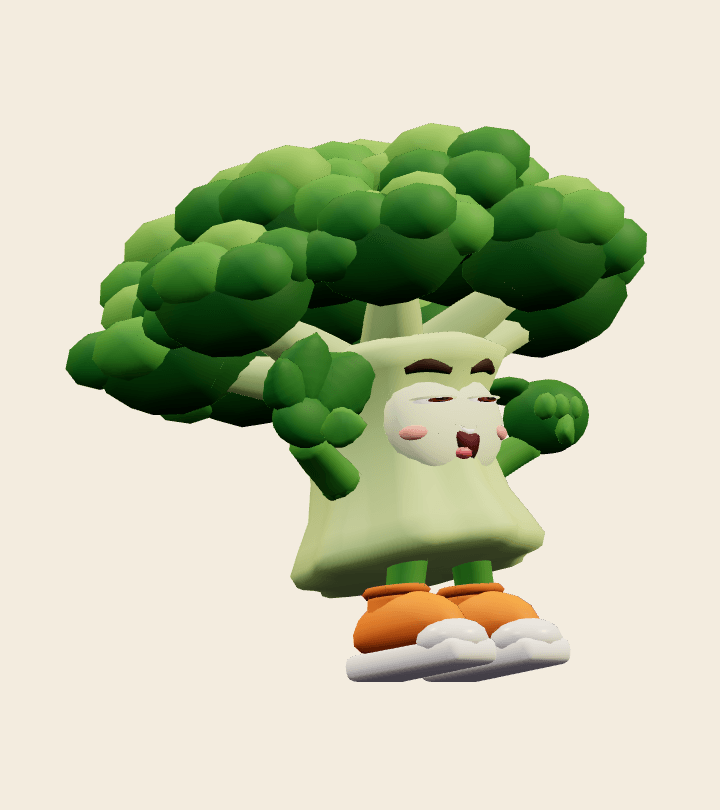<figcaption>Hit</figcaption></figure>
<figure>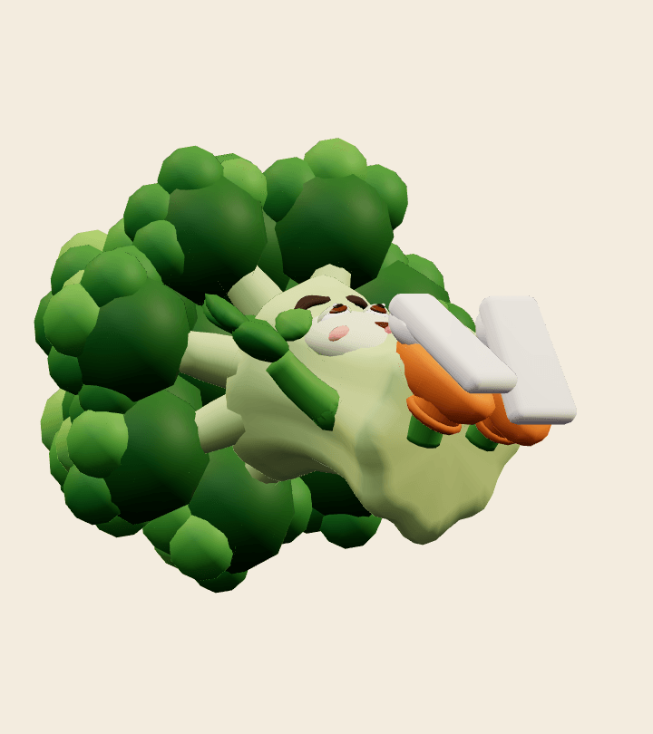<figcaption>Held defeat</figcaption></figure>

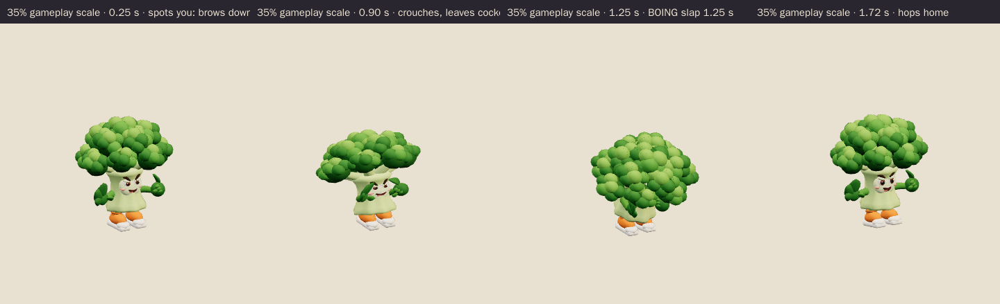

## Technical checks

| Check | Result |
| --- | --- |
| Khronos glTF Validator 2.0.0-dev.3.10 | 0 errors, 0 warnings, 0 infos, 0 hints ([report](../../media/broccoli-bouncer/v001/validation.json)) |
| Runtime file | `broccoli-bouncer.glb`, 1,070,172 bytes, SHA-256 `164a5476…7b5bf9` |
| Editable master | `broccoli-bouncer.blend`, 711,118 bytes, SHA-256 `e2bb7e3d…289b9a` |
| Geometry | 19,438 triangles, 10,045 vertices; 2 vertex-coloured materials (matte, gloss); no image textures |
| Rig | 19 joints, one influence per vertex (rigid parts); constant identity `root` bone; no root motion |
| Scale and facing | 1.528 m standing height; floor-centred; faces glTF −Z like the other enemies |
| three.js r186 + `src/game/enemy-animation.ts` | All tracks bind below the scene root. Every vertex was sampled at 60 Hz in every clip: nothing goes below the floor, and the exported culling envelope covers every pose. Idle and move loops are seamless. The windup holds the exact 1.25 s contact pose and defeat vanishes ([report](../../media/broccoli-bouncer/v001/three-inspection.json)). |
| Chromium WebGL (SwiftShader), ACES tone mapping as in the game | 2 character draw calls. Every clip changes the raster at full and 35% scale. Realtime playback of all clips at both scales had no console, HTTP or WebGL errors ([report](../../media/broccoli-bouncer/v001/browser-inspection.json)). |

Browser emulation is not physical-device evidence; iPhone/iPad play remains the
owner's acceptance gate. The triangle count is higher than the WO111 era cast
(about 12k) because of the modelled floret buds. It still uses only two draw
calls.

## Coordinator intake and iteration

- **Reviewed by / date:** pending coordinator intake.
- **Iteration so far:** the first internal draft had a tall, narrow stalk and a
  small crown. It was rebuilt before delivery to match the concept's big, low
  crown, short flared stalk and chunky shoes. Only the corrected export is
  delivered.
- **Selected for Tom's review:** pending coordinator decision.
