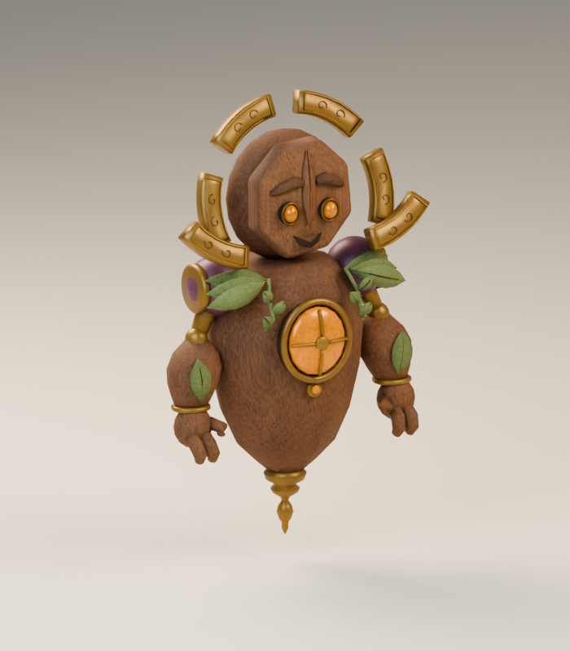
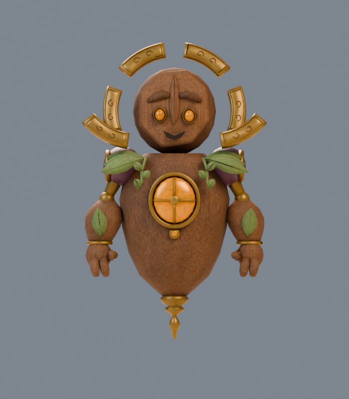
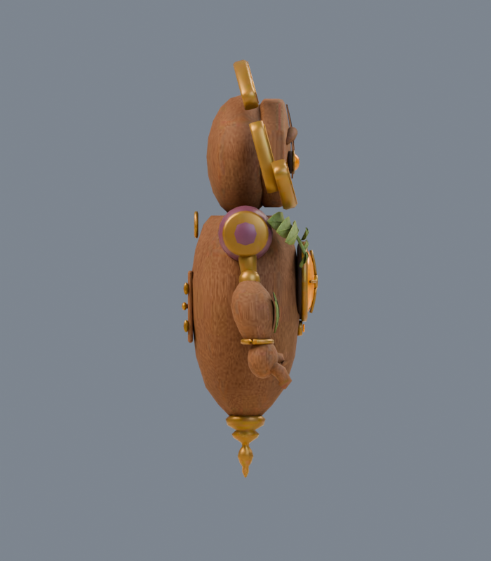
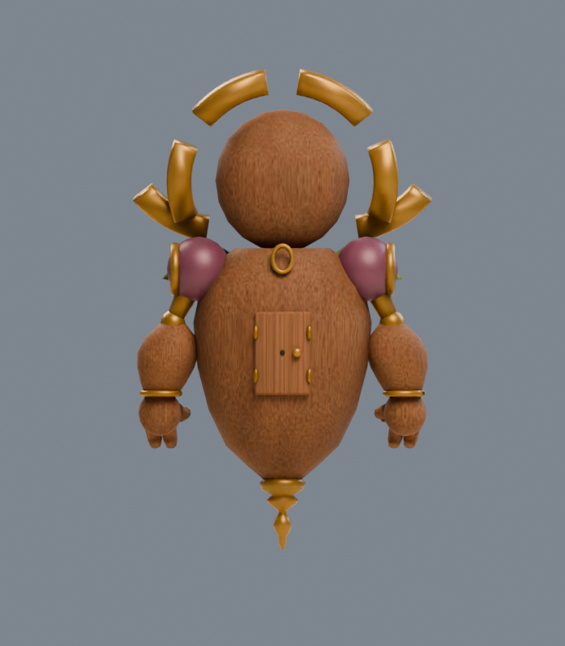

# Buffer Baron

**buffer-baron · v001 · First-pass candidate · Tom’s review pending**

The Pixel Orchard boss is a floating lantern guardian. Six separate brass halo pieces frame its face; two articulated arms surround an amber chest light.

## Concept and exported model

<figure><figcaption>Selected construction reference.</figcaption></figure>
<figure><figcaption>Exact v001 GLB, re-imported for this render.</figcaption></figure>

The first export hid the lower halo pieces behind the collar. Lead review moved them outward and upward, so all six read in front and three-quarter views. The final carved mask, broad gauntlets and sage shoulder leaves are simpler and more regular than the illustration.

<model-viewer src="../../media/buffer-baron/v001/buffer-baron.glb" poster="../../media/buffer-baron/v001/front.png" alt="Orbit the Buffer Baron candidate" camera-controls touch-action="pan-y" data-quest-clips shadow-intensity="0.7" camera-orbit="155deg 75deg auto"></model-viewer>

[Download model](../../media/buffer-baron/v001/buffer-baron.glb) · [Exact manifest](../../media/buffer-baron/v001/manifest.json) · [Concept prompt](../../media/buffer-baron/v001/prompt.txt)

<figure><figcaption>Front</figcaption></figure>
<figure><figcaption>Side</figcaption></figure>
<figure><figcaption>Back</figcaption></figure>

## Motion

<video controls playsinline preload="metadata" poster="../../media/buffer-baron/v001/motion-grid.png" aria-label="Buffer Baron animation reel"><source src="../../media/buffer-baron/v001/animations.mp4" type="video/mp4"><a href="../../media/buffer-baron/v001/animations.mp4">Download motion reel</a></video>

Choose **idle**, **move**, **attack**, **hit** or **defeat** beneath the viewer. Idle and movement repeat; the other actions play once. The root stays fixed, with movement supplied by the game. The attack reaches its contact pose at 1.05 s of a 1.75 s attack. Defeat finishes in a collapsed or drooping pose which the game holds before removal.

## Exact candidate

| Check | Result |
| --- | --- |
| Scale | 1.85 m ground-to-top; 0.10 m underside clearance; meters, Y-up, forward −Z |
| Geometry | 14,840 triangles; six materials and six primitives |
| Texture | One embedded 1024-pixel original pigment atlas; no external resources or decoder |
| Download | 1,195,688 bytes |
| SHA-256 | `9d343e07e9d2593fce5ad9c99df29672ac81cc235ea66fdd276199b7c6da6915` |

[Format validation](../../media/buffer-baron/v001/validation.json) · [Re-imported bounds and motion](../../media/buffer-baron/v001/export-inspection.json) · [Three.js deformation checks](../../media/buffer-baron/v001/three-inspection.json) · [Browser rendering evidence](../../media/buffer-baron/v001/browser-inspection.json)

The technical record distinguishes software browser checks from physical iPhone/iPad performance. This model has not received owner approval or entered the private live game.

## Source and review

A fresh native **GPT-6 Astra, max** author built this original model in Blender 4.5.13 LTS. The lead generated the fictional concept serially with the built-in image tool. No family references, downloaded textures or third-party meshes were used. The editable master, embedded construction source and original pigment image remain on the dedicated authoring PVC; their exact retrieval paths and checksums are in the manifest. [Work order and production evidence](../../../../.agents/work-orders/014-blender-era-2020-evidence.md).

Lead inspection selected this version for the first review after comparing the actual exported views with the concept. The remaining visual simplifications are described above. Game-scale captures and the complete catalog delivery audit are recorded separately when available.

**Tom’s decision:** Pending. No approved version or gameplay promotion is recorded.
