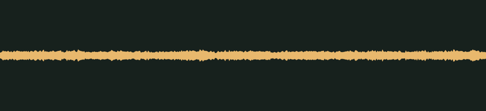

# After hours · v001

**Audio candidate · scary moments · not yet in the game · listening review pending.** A low electrical hum with a carnival organ droning somewhere behind the walls, prepared as a seamless loop.

## Audition

<audio controls preload="none" aria-label="Audition casino-hum version one" loop>
  <source src="../../media/casino-hum/v001/cue.wav" type="audio/wav">
  <a href="../../media/casino-hum/v001/cue.wav">Download the processed cue</a>
</audio>

The player repeats the loop until you pause it.

[Processed cue](../../media/casino-hum/v001/cue.wav) · [Original twenty-second take](../../media/casino-hum/v001/source.wav)

## Exact version

| Property | Measured result |
| --- | --- |
| Stable cue / version | `casino-hum` / `v001` |
| Duration | 8.00 seconds, seamless loop |
| Format | PCM signed 16-bit WAV, stereo, 44.1 kHz |
| Download size | 1,411,244 bytes |
| Peak / RMS | -18.0 / -30.625 dBFS |
| Clipped samples | 0 |
| Processed SHA-256 | `bed43b1b73a27f834715e75463e9719c5df363fe13833fd03459ecb0bcefdc6d` |
| Source SHA-256 | `488f586dc39caa350fed60051f2db22cbec8914f4573f691945d76bcb96e6af8` |

Processing takes 8.00 seconds beginning at 4.000 seconds. It folds the next 1.0 second of the take back over the start with an equal-power crossfade, so the last frame runs into the first exactly as the original take continued. There is no entrance or exit fade. The peak is normalized to -18 dBFS so the hum sits under every other sound. At the wrap, the step from the last sample to the first (126) is smaller than the clip's 99th-percentile sample step (175), and the 50 ms around the seam measures -1.5 dB against the whole clip. The source is preserved separately. [Exact recipe](../../media/casino-hum/v001/processing.json), [measurements](../../media/casino-hum/v001/verification.json), and [reproducible processing script](../../../../scripts/assets/audio/process_cues.py).

## Source and checks

Generated on 2026-09-26 by a Claude Code subagent (Opus 5.5) from the workflow coordinator's cue brief, using the separate Stable Audio 3 Small-SFX CPU service (service version 0.2.0). This take used seed 326, eight steps and twenty seconds. It contains no supplied recording or personal reference. The [provenance record](../../media/casino-hum/v001/provenance.json) retains the complete prompt, service/model revisions, every other attempt and the source terms recorded in [DESIGN-008](../../../designs/008-audio-pipeline.md). The source code, model and redistributed text component have separate terms; no broader license is asserted here.

The service and download SHA-256 checks passed, as did WAV decoding, the exact-duration, non-silence and zero-clipping checks, and both loop-seam checks. Re-running the processing script reproduced the same output. These measurements do not establish timbre or musical quality.

## Listen-proxy check

Nobody has listened to this take; the agent cannot hear audio. Instead, it measured the source's level in 20 ms and half-second windows, the strongest spectral peaks, the zero-crossing rate and a four-band energy split, and chose the segment from those numbers. The take holds within about ±1 dB in half-second windows for its 19.5 seconds of sound, and the loop comes from the middle. The hum is a drone chord with strong peaks near 150, 220 and 335 Hz, a stack of fifths, with slow movement but no events. Across the loop, including the crossfade, 100 ms windows stay within about ±2 dB of the clip's level. About half of the energy sits above 300 Hz, so the upper notes should carry on tablet and phone speakers; the lowest will not.

Energy split of the processed cue: 50.7% below 300 Hz, 46.9% at 300 Hz–1 kHz, 2.4% at 1–4 kHz and 0.1% above 4 kHz. These numbers hint at shape and brightness; they cannot say how the cue sounds.

## Coordinator and owner review

Review focus: Whether the loop stays even when it repeats, whether a seam becomes audible over a long stay, and whether the hum is eerie rather than muddy.

- **Coordinator technical intake:** Passed numerically; listening/creative selection pending.
- **Tom’s decision:** Pending, against the exact hash above.
- **Gameplay integration:** Registered in the game's scare cue manifest as a loop for [DESIGN-027](../../../designs/027-scare-pass.md) ambience at scare levels 1 and 2. A loop plays only through the audio owner's loop control, one instance at a time; no game event starts this one yet. At gain 1.0 it peaks near -20 dBFS at the default master, about 4 dB under the glide wind. [DESIGN-008](../../../designs/008-audio-pipeline.md#scary-moments-cues) records the manifest and its priority; the inventory records it as a private candidate.

## Retained attempts

Two earlier takes were not selected. The first has essentially no energy above 1 kHz, with 56–87% below 300 Hz, so it would likely vanish on tablet and phone speakers. Its level also fades by about 10 dB after 7 seconds, which leaves no steady 9-second stretch for the loop. The second is steady, but only about a quarter of its energy sits above 300 Hz, and almost none above 700 Hz. The third prompt asked for a raspier buzz, and it holds just as steadily with about half its energy above 300 Hz.

- [Source attempt 1](../../media/casino-hum/v001/source-attempt-1.wav) (seed 306, fifteen seconds) with its [measurements](../../media/casino-hum/v001/source-attempt-1-verification.json)
- [Source attempt 2](../../media/casino-hum/v001/source-attempt-2.wav) (seed 316, twenty seconds) with its [measurements](../../media/casino-hum/v001/source-attempt-2-verification.json)

The prompts, seeds and job IDs of every attempt are in the provenance record. These decisions rest on measurements, not on listening.
