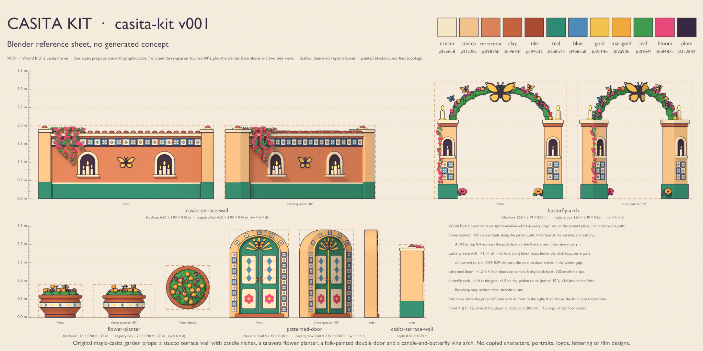
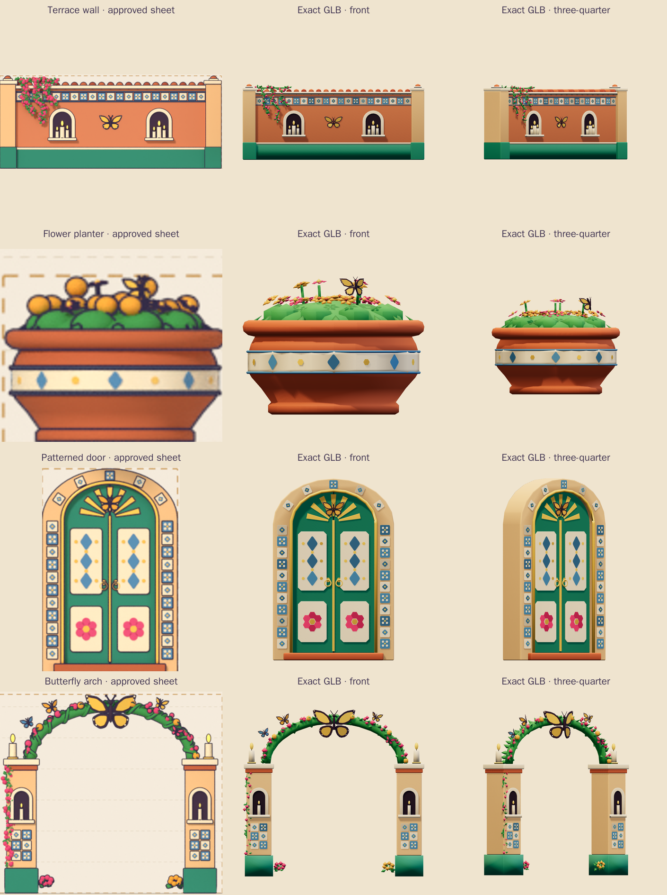
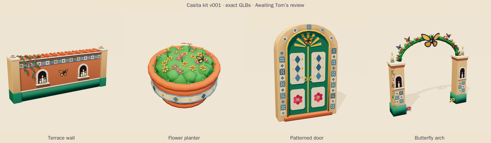
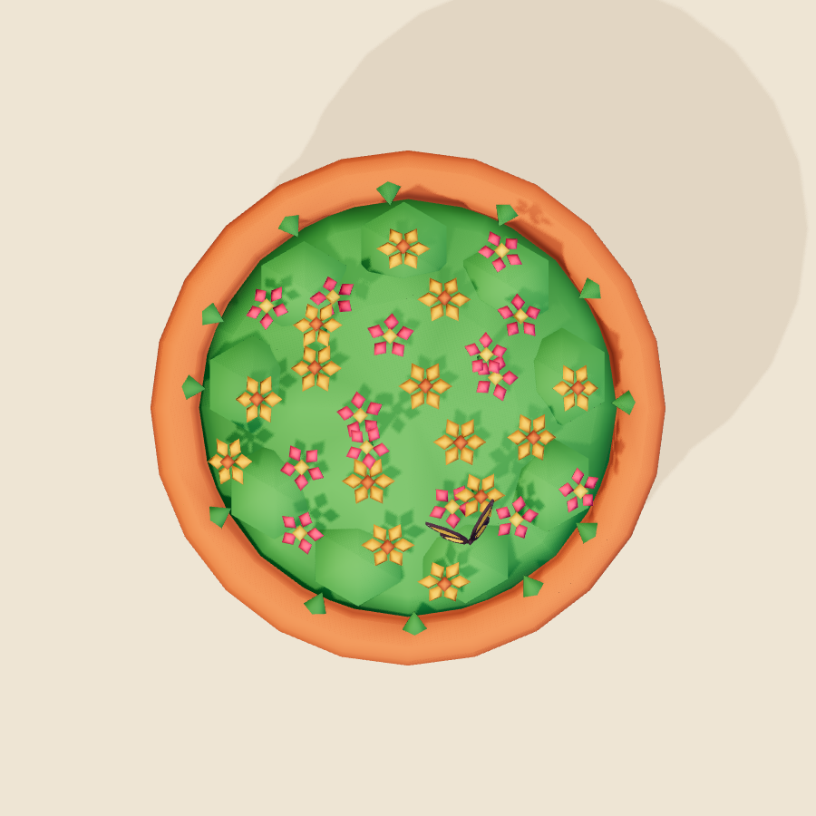
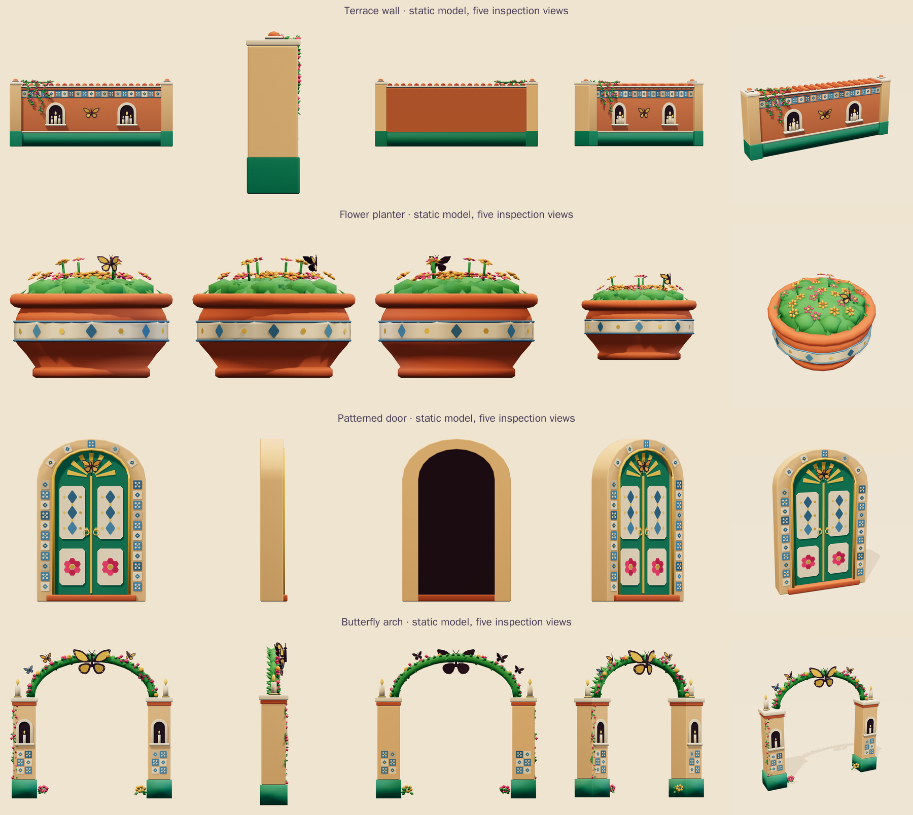
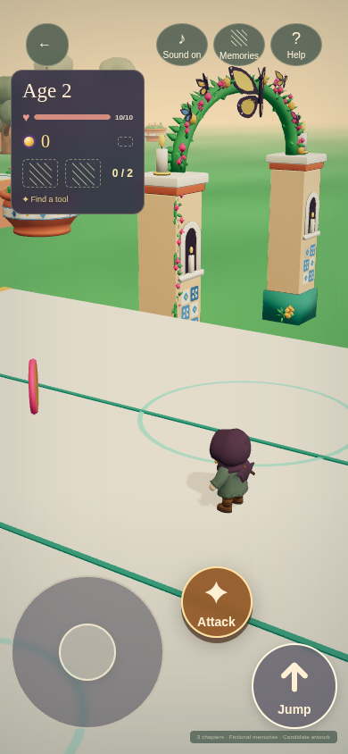
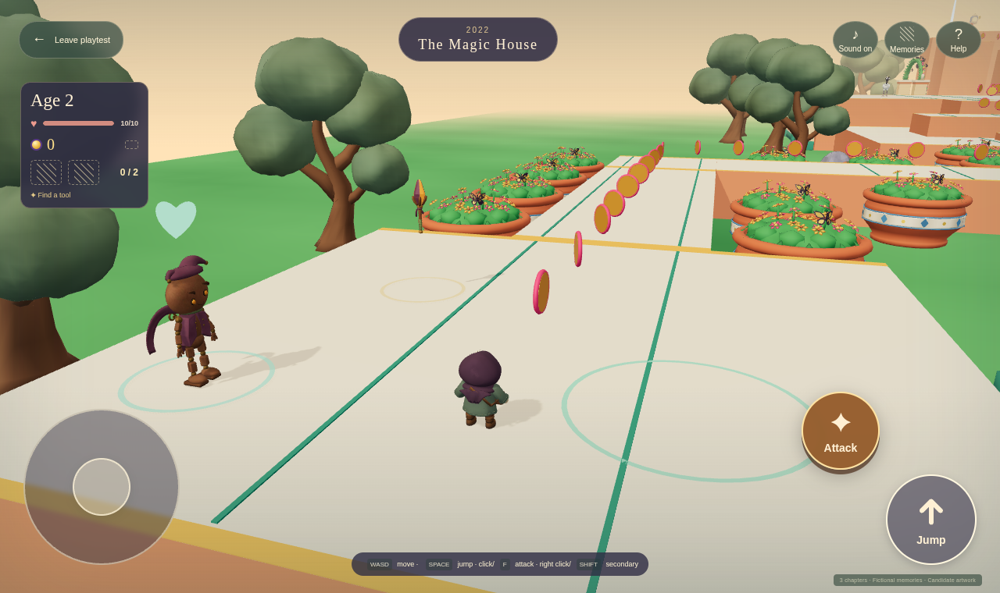

# Casita kit · v001

**Awaiting Tom's review · used in the family release.** Four static garden props for World B chapter 2: a terrace wall, flower planter, patterned door and candle-and-butterfly arch. The `casita` theme pins their exact files and hashes. All four planning boxes and all 36 B2 placements remain unchanged.

[PRD-004 Q-03](../../../prds/004-family-release.md) permits labeled private candidates before Tom's exact-version decision. The coordinator approved the corrected reference sheet and exact export previews on September 29. Tom's review remains **pending**; publication and hosted verification are recorded separately by the release coordinator.

## Reference and exact exports

This is a **Blender reference sheet, with no generated concept**. Warm stucco and terracotta, teal paint, geometric blue-and-cream tiles, magenta flowers, gold butterflies and candle niches connect the four silhouettes. No copied characters, portraits, logos, lettering, private photos or likenesses were used.

[Source record](../../media/casita-kit/v001/source.json) · [Authoring brief](../../media/casita-kit/v001/prompt.txt) · [Provenance](../../media/casita-kit/v001/provenance.json) · [Production notes](../../media/casita-kit/v001/model-notes.md)

{ loading=lazy }

{ loading=lazy }

## Four exact models

### Terrace wall {#casita-terrace-wall}

A terracotta wall has teal lower paint, cream pilasters, clay coping tiles and a blue-and-cream patterned band. Two candle niches flank the gold butterfly relief, with flowering vines cascading from one corner. Nine B2 walls keep their existing 1.1×–1.6× scales along the deck faces.

<model-viewer src="../../media/casita-kit/v001/casita-terrace-wall.glb" poster="../../media/casita-kit/v001/stills/casita-terrace-wall-beauty.png" alt="Orbit the exact Casita terrace wall v001" camera-controls touch-action="pan-y" shadow-intensity="0.7"></model-viewer>

[Download terrace wall GLB](../../media/casita-kit/v001/casita-terrace-wall.glb)

### Flower planter {#flower-planter}

A wide terracotta pot carries a cream tile band, spilling green leaves, pink flowers and orange six-petal blooms with dark centers. The petals replace the reference blockout's round orange flower heads after the coordinator's review. A small butterfly rests above the flowers. Sixteen 2× planters line the garden path; four 1.5× planters decorate the veranda and balcony.

<model-viewer src="../../media/casita-kit/v001/flower-planter.glb" poster="../../media/casita-kit/v001/stills/flower-planter-beauty.png" alt="Orbit the exact Casita flower planter v001" camera-controls touch-action="pan-y" shadow-intensity="0.7"></model-viewer>

{ loading=lazy }

[Download flower planter GLB](../../media/casita-kit/v001/flower-planter.glb)

### Patterned door {#patterned-door}

The teal double door has cream panels with blue diamonds and pink rosettes, small gold ring pulls, a sunburst transom and a butterfly. The shallow stucco surround fits against B2's existing block faces. Four doors retain their 1.2×–1.4× scales and ground-level origins.

<model-viewer src="../../media/casita-kit/v001/patterned-door.glb" poster="../../media/casita-kit/v001/stills/patterned-door-beauty.png" alt="Orbit the exact Casita patterned door v001" camera-controls touch-action="pan-y" shadow-intensity="0.7"></model-viewer>

[Download patterned door GLB](../../media/casita-kit/v001/patterned-door.glb)

### Candle-and-butterfly arch {#butterfly-arch}

Two tiled stucco posts support a leafy arch, with a large golden butterfly at its crown and four smaller butterflies along the vine. Each post has a candle niche and a candle on its cap. The opening stays clear. B2 uses 1.4×, 1.8× and 3.4× copies beside the arrival gate, optional golden route and finish; none straddles a walkable lane.

<model-viewer src="../../media/casita-kit/v001/butterfly-arch.glb" poster="../../media/casita-kit/v001/stills/butterfly-arch-beauty.png" alt="Orbit the exact candle-and-butterfly arch v001" camera-controls touch-action="pan-y" shadow-intensity="0.7"></model-viewer>

[Download butterfly arch GLB](../../media/casita-kit/v001/butterfly-arch.glb)

## Sizes and placement

| Prop | Exact width × height × depth (m) | Fixed planning box (m) | Triangles | Materials | GLB bytes |
| --- | --- | --- | ---: | ---: | ---: |
| Terrace wall | 4.8000 × 2.0000 × 0.6831 | 4.80 × 2.00 × 0.70 | 4,524 | 3 | 153,388 |
| Flower planter | 1.1800 × 0.8942 × 1.1800 | 1.20 × 0.90 × 1.20 | 4,338 | 2 | 131,712 |
| Patterned door | 1.6000 × 2.4000 × 0.4000 | 1.60 × 2.40 × 0.40 | 2,486 | 3 | 97,932 |
| Butterfly arch | 3.4817 × 3.1878 × 0.5870 | 3.60 × 3.20 × 0.60 | 4,980 | 4 | 193,420 |

Every file stays within 5,000 triangles, four materials and 1.5 MiB. Opaque vertex colors carry the palette and gentle baked contact shading. The candle flames use restrained emission. There are no textures, external resources, skins, animations or compression decoders. Roots are floor-centered, with glTF +Y up and front +Z.

All origins remain at Y = −1.4 m. At 2× scale, the planter reaches about 0.39 m above the path. The walls and doors remain below the raised decks as authored; they do not create footholds or collision. Frozen templates and saved publications are unchanged.

{ loading=lazy }

## B2 gameplay views

The existing World B v5 route completed all 29 legs, four ordinary fights and the boss fight, recovered all three memories, and advanced to chapter 3 with no recoveries. All four kit files loaded successfully. Seventeen captures include twelve desktop/phone camera probes at ordinary route stops; the player and placements were never teleported or rewritten. The coordinator approved the phone arch and desktop planter views at gameplay scale.

{ loading=lazy }

{ loading=lazy }

[Complete route report and capture list](../../media/casita-kit/v001/b2-camera/report.json) · [Desktop terrace wall](../../media/casita-kit/v001/b2-camera/family-b2-02-first-ordinary-fight-terrace-wall-west-1-desktop.png) · [Phone balcony door](../../media/casita-kit/v001/b2-camera/family-b2-02-mid-climb-balcony-door-phone.png) · [Phone finish arch](../../media/casita-kit/v001/b2-camera/family-b2-03-boss-arena-finish-arch-phone.png).

This synthetic local run used public movement and combat inputs. Software rendering was thinned between full captures; attacks respected server cooldowns. An [initial fixture-entry attempt](../../media/casita-kit/v001/b2-camera/history/persistent-fixture-entry-failure.json) stopped before gameplay because it used the persistent fixture entry page. The fresh ephemeral fixture completed the route with no page, console, HTTP or media errors. These checks do not measure physical-device performance.

## Validation and review

- **Khronos:** all four GLBs pass with zero errors and warnings. [Validator report](../../media/casita-kit/v001/validation.json).
- **Blender reimport:** exact bytes preserve topology, bounds and floor roots. [Round-trip report](../../media/casita-kit/v001/reimport.json).
- **Three.js and the game adapter:** 32 rotation/scale probes plus all 36 B2 transforms pass inside the unchanged planning boxes, with no walkable-surface overlap. [Adapter report](../../media/casita-kit/v001/three-inspection.json) · [Measured bounds](../../media/casita-kit/v001/bounds.json).
- **Exact-GLB browser inspection:** 21 Chromium WebGL views pass with no page, HTTP or GL errors. [Browser report](../../media/casita-kit/v001/stills/browser-inspection.json).
- **Desktop/phone studio:** all four cards and eight static model viewers load and orbit without overflow or browser errors. [Studio report](../../media/casita-kit/v001/review-audit/report.json).
- **Application checks:** 1,900 tests pass across 164 files; 34 tests and three files are skipped. Typecheck, lint, level validation and the production build pass. [Test summary](../../media/casita-kit/v001/checks/full-suite.txt) · [Check record](../../media/casita-kit/v001/checks/commands.json).
- **Helper rebase:** all 98 upstream inventory records and 139 thumbnails are retained exactly. B2's frozen route and scene adapter bytes are unchanged. [Rebase evidence](../../media/casita-kit/v001/rebase-verification.json).
- **Full catalog audit:** 102 entries, 144 thumbnails, 71 review pages, 73 exact model deliveries and 40 animated candidate viewer checks pass with no page, console, HTTP, request or external errors. [Catalog report](../../media/casita-kit/v001/catalog-audit/report.json). The [first attempt](../../media/casita-kit/v001/catalog-audit/history/legacy-playtest-status-contract-failure.json) exposed an old playtest-label assertion; the family-era check now requires the pending-Tom-review label shown here.
- **Coordinator visual review:** passed for the exact kit, reference comparison, flower shapes and B2 desktop/phone gameplay views. [Decision record](../../media/casita-kit/v001/visual-review.json).

[Final verification](../../media/casita-kit/v001/final-verification.json) records the commands, route, browser checks and retained attempts. Strict documentation and media-link checks pass. Headless Chromium does not establish physical Safari feel or frame-time acceptance. Tom's exact-version decision remains pending.

## Files and retained history

[Editable production master](../../media/casita-kit/v001/casita-kit.blend) · [Production source](../../media/casita-kit/v001/source/build_model.py) · [Construction record](../../media/casita-kit/v001/construction.json) · [Scene release](../../media/casita-kit/v001/scene-release.json) · [Version checksums](../../media/casita-kit/v001/sha256-manifest.json)

The master preserves separate editable parts and joined export meshes. Toggle the per-prop collections to inspect them. Blender instance 2 is released; every prior `.blend` and `.glb` fingerprint stayed unchanged.

The [reference history](../../media/casita-kit/v001/sheet-stage/README.md) preserves the September 26 partial sheet, master, checkpoint, sources and stale lease record. The corrected September 29 sheet only fixes a planter-height annotation; the production refinement gives its orange blooms distinct petals.

| Exact GLB | SHA-256 |
| --- | --- |
| `casita-terrace-wall.glb` | `0f545da86ab99abadfa3f8b3c119fd606d0e67f53503c6b92708fc4b0fbc005c` |
| `flower-planter.glb` | `89965de5b2fa88330a78a6a45f67b04a4e4bfb5581bd522469ca61d93b86df27` |
| `patterned-door.glb` | `14eee20e95b95c80a2319baa16bf6f69577fd63911bdb19c0963f74eace51afc` |
| `butterfly-arch.glb` | `f102c4e4927739e4ee870366dc9228ad0b20e03999d48d05abf94e26ced30ca7` |

## Owner decision

**Tom's exact-version decision: pending.** Review these four exact files, the planter flowers at gameplay distance and the arch at B2's existing scales. Coordinator selection and technical validation do not fill in owner approval.
