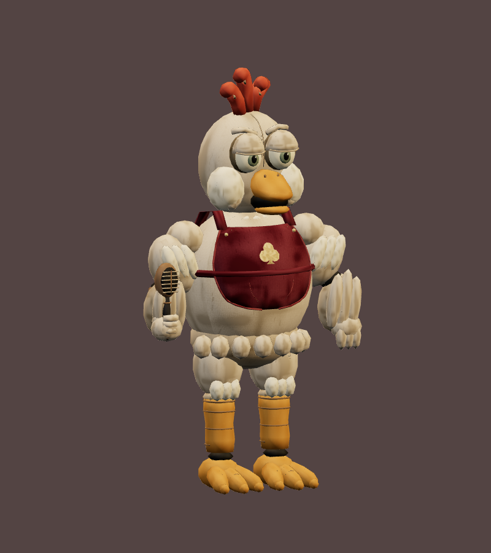
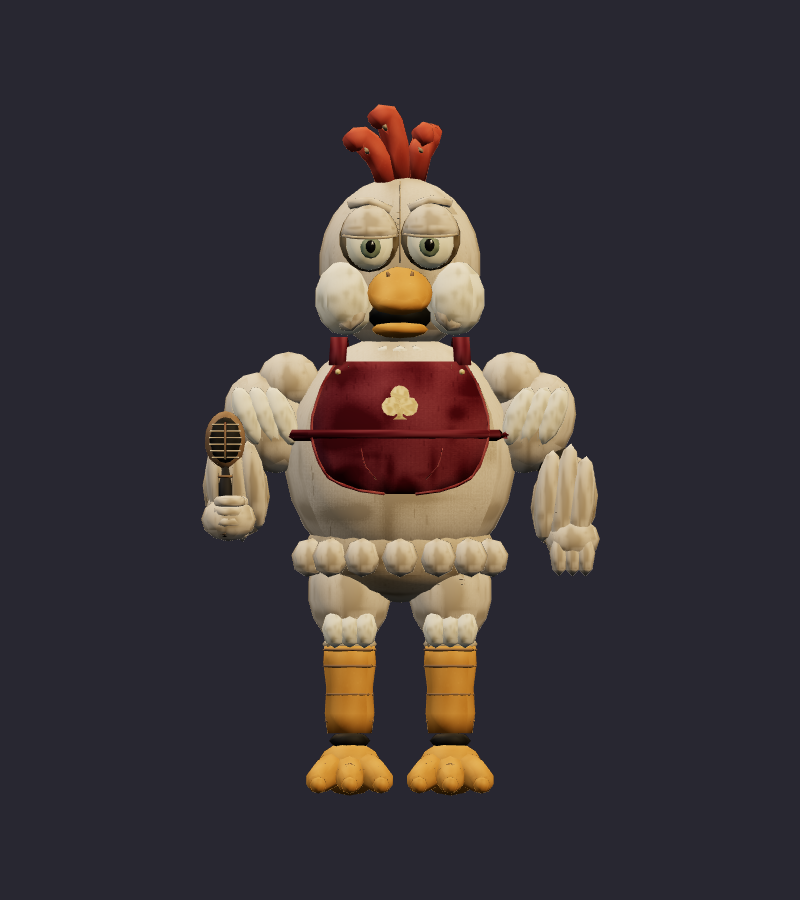
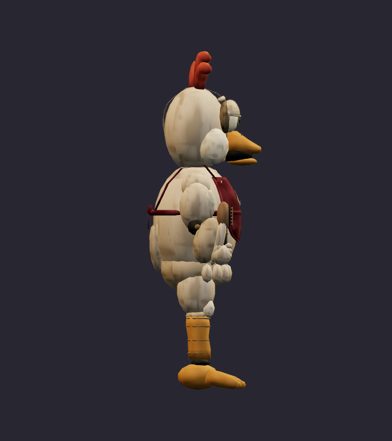
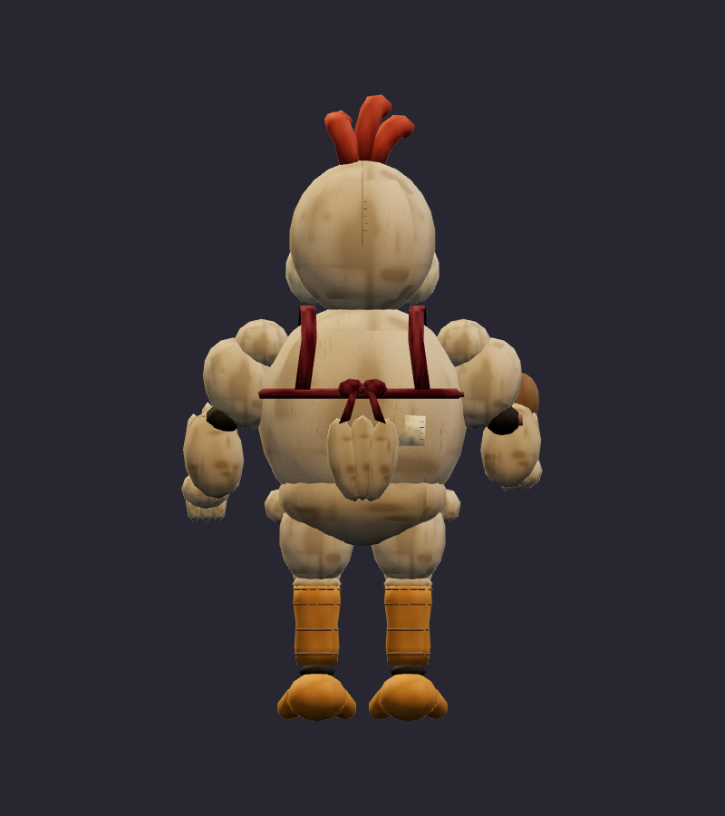
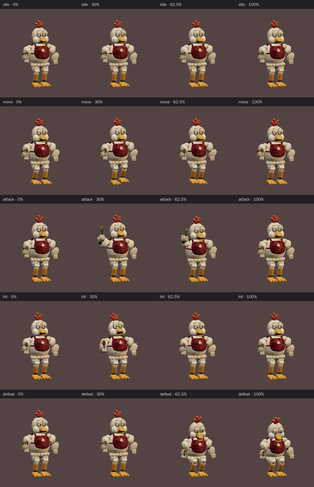
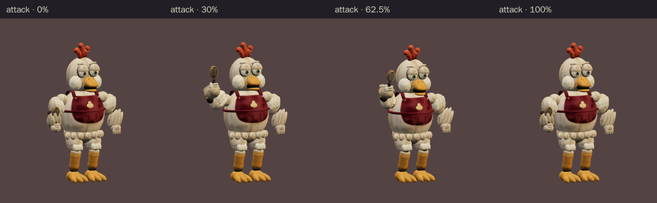

# Chick-flia · v001 worn mascot

**Validated Blender model candidate · Studio only · Exact art review pending.** Chick-flia is a supporting performer beside the central Rat Pit Boss in the proposed Rat Casino cast. Tom asked for the worn, quieter mood of the original FNAF era after the earlier images read as glam rock. This model follows the [corrected six-character ensemble](../rat-casino-ensemble/v003.md) and the [plain-eyed Chick-flia construction sheet](../../media/rat-casino-ensemble/v003/construction/chick-flia.png). The [first sheet with makeup](../../media/rat-casino-ensemble/v003/construction/chick-flia-draft.png) remains visible as a coordinator-superseded draft; the earlier glossy treatment is also retained for comparison.

[Original image prompt](../../media/rat-casino-ensemble/v003/construction/chick-flia-draft-prompt.txt) · [Plain-eye correction prompt](../../media/rat-casino-ensemble/v003/construction/chick-flia-edit-prompt.txt) · [Image source and checksums](../../media/rat-casino-ensemble/v003/source.json)

<figure><figcaption>Selected v003 construction reference</figcaption></figure>
<figure><figcaption>Exact exported v001 model · studio candidate</figcaption></figure>

<model-viewer src="../../media/chick-flia/v001/chick-flia.glb" poster="../../media/chick-flia/v001/beauty.png" alt="Orbit the worn Chick-flia model and inspect its five animations" camera-controls touch-action="pan-y" data-quest-clips shadow-intensity="0.7" camera-orbit="155deg 75deg auto"></model-viewer>

[Download exact GLB](../../media/chick-flia/v001/chick-flia.glb) · [Editable Blender master](../../media/chick-flia/v001/chick-flia.blend) · [Artifact manifest](../../media/chick-flia/v001/sha256-manifest.json)

<figure><figcaption>Front</figcaption></figure>
<figure><figcaption>Side</figcaption></figure>
<figure><figcaption>Back</figcaption></figure>

The cream padded body, rounded wing arms, heavy plain eyelids, chipped comb and three-toed feet keep her readable as a hen at small play distance. A short faded apron and old handheld microphone carry her token-arcade role without the former fashion dress. During the model pass, the lead asked for less exposed shoulder mechanism, softer hem feathers, a flat sewn club patch and fuller knees; the exact GLB above includes those revisions. Tom has not yet reviewed this exported version as final art.

| Exact exported model | Result |
| --- | --- |
| Size and placement | 0.993 × 1.720 × 0.582 m; metre scale, Y-up, forward −Z, floor-centered |
| Geometry | 14,698 triangles; two opaque material primitives; one skin, 21 joints, up to four influences per vertex |
| Texture | One original embedded 1024 × 1024 atlas; no external resource or required glTF extension |
| Download | 1,307,460 bytes; below the 2 MiB candidate budget |
| GLB SHA-256 | `4f72a94c89debf8ee00a8a5db4eaf6b681375a64a08b743b0cbe07fbdf6eb396` |
| Blender master SHA-256 | `fec0fae84e0d5a50a0b6706f21decd4baeb48e8b7be6d0b616cf68932a9d3aed` |

## Motion and technical review

The viewer above exposes all five exact clips. `idle` lasts 2.8 seconds and `move` 1.4 seconds; both loop. `attack` lasts 2.0 seconds and lifts the microphone into a clear warning before its contact gesture at 1.25 seconds. `hit` lasts 0.7 seconds. `defeat` lasts 2.4 seconds and holds a shallow failed curtsy with the microphone still attached. The clip supplies a visible gesture; any future sound effect or encounter hazard belongs to the game.

[Khronos validation](../../media/chick-flia/v001/validation.json) reports zero errors and warnings. [Three.js inspection](../../media/chick-flia/v001/three-inspection.json) reimported the exact GLB, exercised the real enemy animation adapter and sampled every exported skin vertex through all five clips at 60 Hz. The bounds cover every pose. Feet stayed at least 1.9 mm above the floor, the microphone stayed attached and clear of the suit and face, and the root remained stationary. [Chromium WebGL playback](../../media/chick-flia/v001/browser-inspection.json) produced changing frames for every clip without page, console, HTTP or WebGL errors or external asset requests. [Author's visual notes](../../media/chick-flia/v001/visual-review.json) and [scene release](../../media/chick-flia/v001/scene-release.json) record the corrected views and safe handoff.

The browser check used software Chromium. Physical iPad/iPhone Safari, device frame time and combat feel remain untested. This is a studio candidate for Tom to review, **not a model mapped into a level or approved for gameplay**. Final use still depends on his exact-version art review and the later level and encounter gates.

A fresh Astra Blender author built this character under [WO100](../../../../.agents/work-orders/100-chick-flia-classic.md) using the selected original ensemble and construction sheet. Source scripts live in `scripts/assets/chick-flia/v001/`; the manifest records matching local and Blender-service artifact hashes. No downloaded franchise model, texture, family photograph or personal likeness was used.
