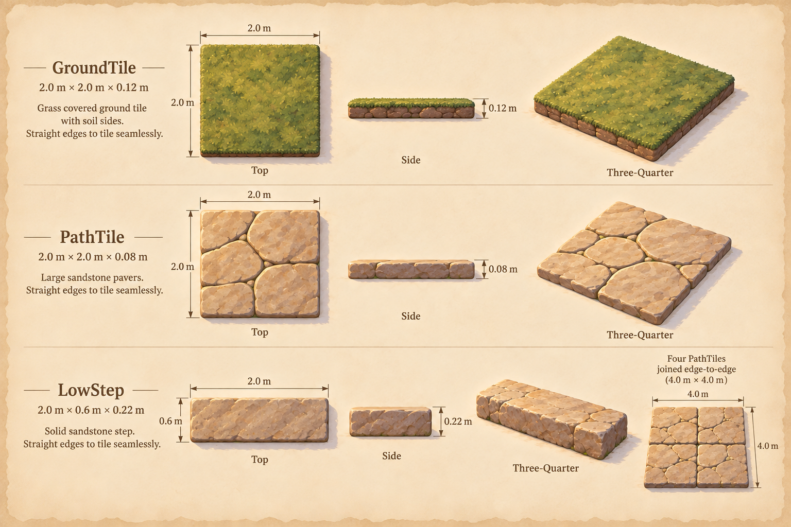
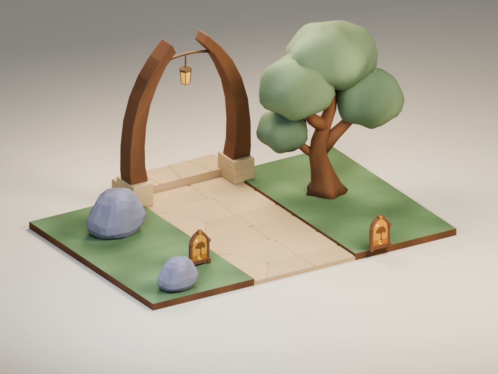
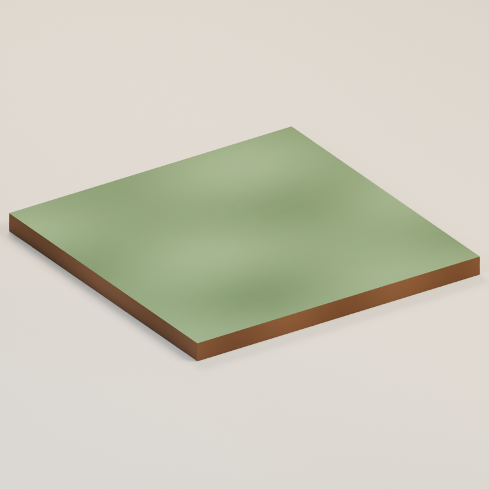
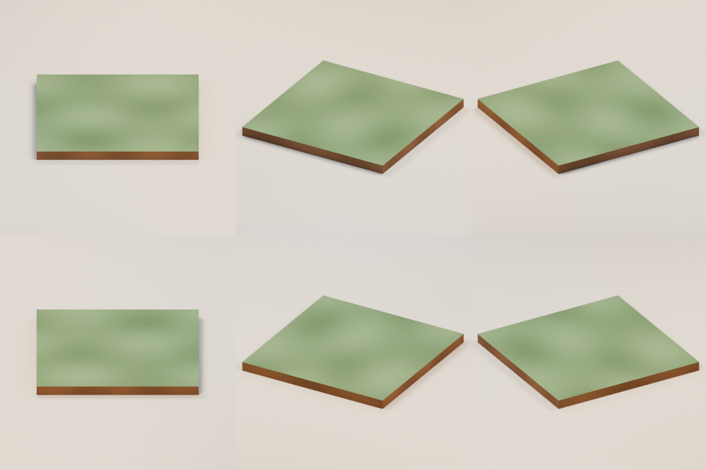
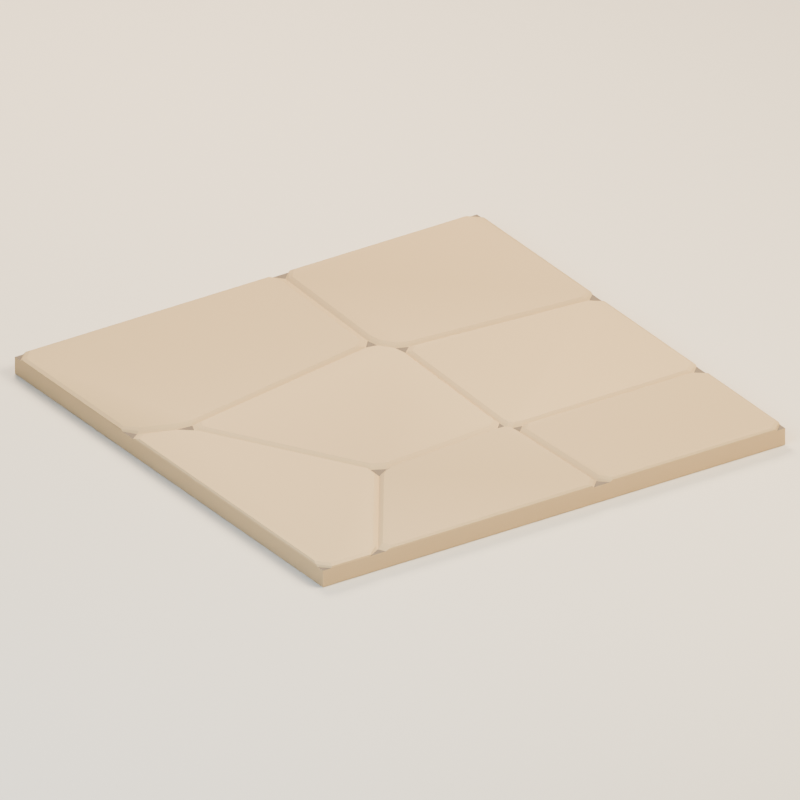
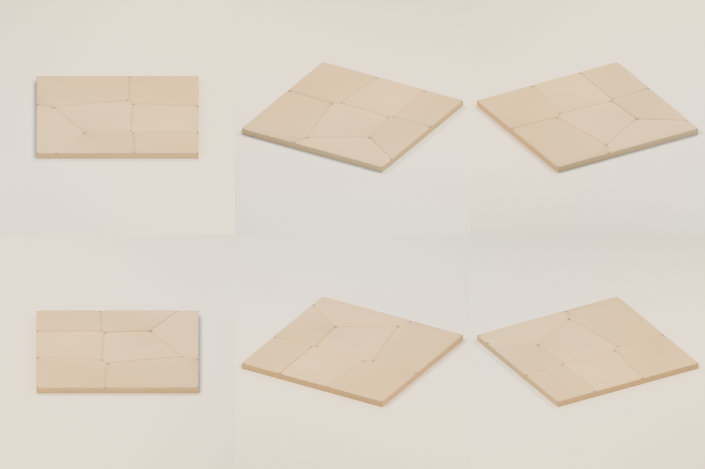
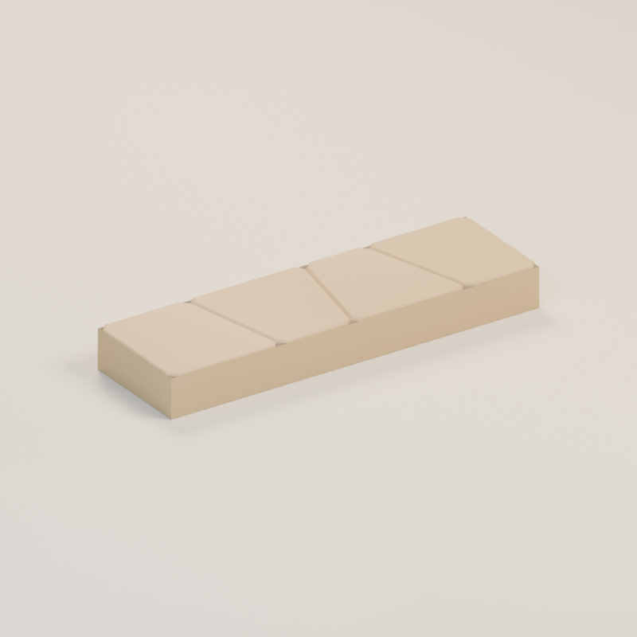
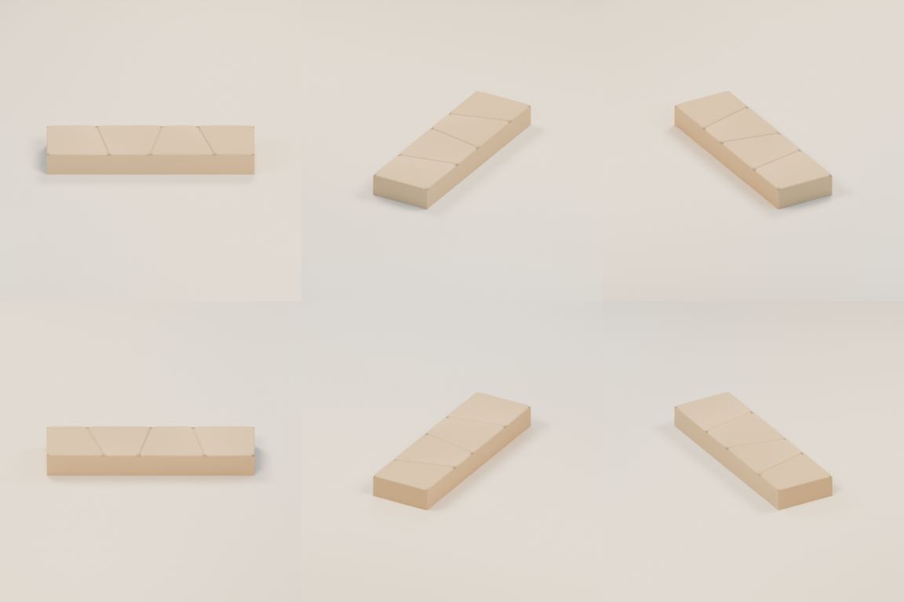
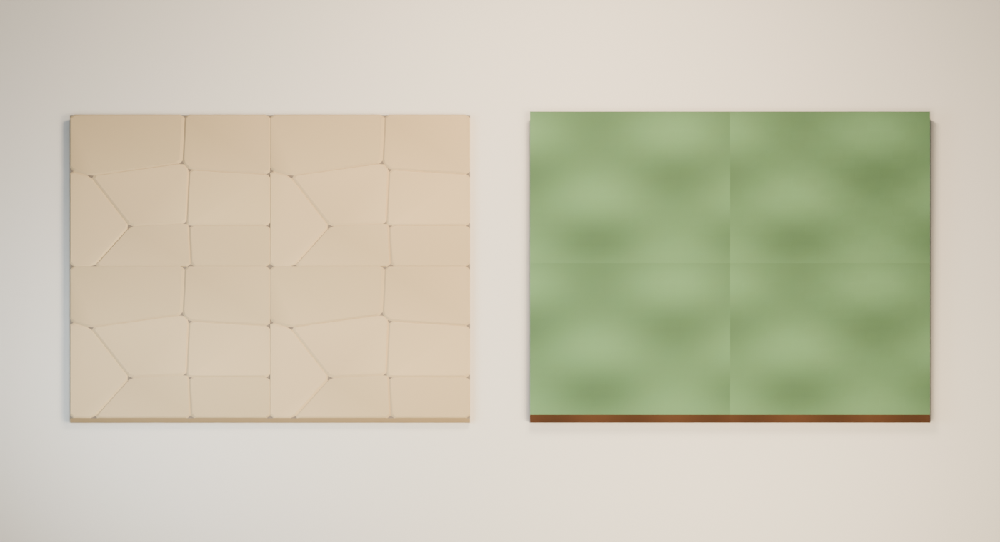

# A small path forward

**clearing-path-kit · v001 · Ready for Tom · Not approved for gameplay**

Three distinct pieces give the clearing a grassy edge, a pale path and one low rise. Each file has its own viewer and checksum; any kit approval must identify all included files.

## From illustration to model

<figure><figcaption>Selected source concept.</figcaption></figure>
<figure><figcaption>The exact exported models, re-imported together.</figcaption></figure>

The source shows the grass tile, path tile and low step separately. The combined model view also includes the [keepsake](../memory-keepsake/v001.md), [tree](../clearing-tree/v001.md), [stone](../clearing-stone/v001.md) and [gateway](../arrival-landmark/v001.md), reviewed on their own pages. All are candidates; this arrangement is a scale/coherence preview.

The kit uses broad color variation and shallow paver joints. It omits the illustration’s individual grass blades, rough stone texture and chipped soil detail. The outer tile footprints remain exact squares for placement.

## Grass and soil

**ground-tile.glb** — A 2 × 2 m tile, 0.12 m high, with a grass-colored top and closed soil sides. The flat top has gentle color variation; it contains no individual grass geometry.

<model-viewer src="../../media/clearing-path-kit/v001/ground-tile.glb" poster="../../media/clearing-path-kit/v001/ground-tile-front.png" alt="Orbit the grass and soil candidate" camera-controls touch-action="pan-y" shadow-intensity="0.7" camera-orbit="155deg 70deg auto"></model-viewer>

[Download the GLB](../../media/clearing-path-kit/v001/ground-tile.glb) · [Still fallback](../../media/clearing-path-kit/v001/ground-tile-front.png)

[Front](../../media/clearing-path-kit/v001/ground-tile-front.png) · [Side](../../media/clearing-path-kit/v001/ground-tile-side.png) · [Back](../../media/clearing-path-kit/v001/ground-tile-back.png) · [Top](../../media/clearing-path-kit/v001/ground-tile-top.png) · [Scale](../../media/clearing-path-kit/v001/ground-tile-scale.png)

| Check | Exact candidate |
| --- | --- |
| Geometry | 702 triangles; 2 materials |
| Size, width × height × depth | 2.000 × 0.120 × 2.000 m |
| Runtime bytes | 50,724 |
| Runtime SHA-256 | `432a834771f5054fa2d8c28a59c8ab713358aefab773f4d1fce6c24080d1392a` |
| Coordinates | Y-up, meters, forward −Z; ground at Y=0 |
| Animation | Static prop; no clips or rig |

[Validator](../../media/clearing-path-kit/v001/ground-tile-validation.json) · [Re-import](../../media/clearing-path-kit/v001/ground-tile-reimport.json) · [Three.js check](../../media/clearing-path-kit/v001/ground-tile-three-inspection.json) · [Construction](../../media/clearing-path-kit/v001/ground-tile-construction.json)

Editable master: `haynes-quest/clearing-kit/v001/ground-tile/ground-tile.blend`, 189,932 bytes, SHA-256 `960399fcb147db3cb54cbcd786007ffbaf7f85e794b636c1e3f5e23e96b2ed08`. Retrieve it from dev-env through the Blender service’s `/artifacts/haynes-quest/clearing-kit/v001/ground-tile/ground-tile.blend` route and verify the checksum. Masters remain on the dedicated authoring PVC.

## Pale pavers

**path-tile.glb** — A 2 × 2 m tile, 0.08 m high, with several broad sandstone pavers. Shallow joints and softened internal corners keep the walking surface continuous.

<model-viewer src="../../media/clearing-path-kit/v001/path-tile.glb" poster="../../media/clearing-path-kit/v001/path-tile-front.png" alt="Orbit the pale pavers candidate" camera-controls touch-action="pan-y" shadow-intensity="0.7" camera-orbit="155deg 70deg auto"></model-viewer>

[Download the GLB](../../media/clearing-path-kit/v001/path-tile.glb) · [Still fallback](../../media/clearing-path-kit/v001/path-tile-front.png)

[Front](../../media/clearing-path-kit/v001/path-tile-front.png) · [Side](../../media/clearing-path-kit/v001/path-tile-side.png) · [Back](../../media/clearing-path-kit/v001/path-tile-back.png) · [Top](../../media/clearing-path-kit/v001/path-tile-top.png) · [Scale](../../media/clearing-path-kit/v001/path-tile-scale.png)

| Check | Exact candidate |
| --- | --- |
| Geometry | 392 triangles; 2 materials |
| Size, width × height × depth | 2.000 × 0.080 × 2.000 m |
| Runtime bytes | 30,084 |
| Runtime SHA-256 | `f36ce588582fc9ce386375d3972e5abed67fe62d5bef53636d1d3f4262d7ec2f` |
| Coordinates | Y-up, meters, forward −Z; ground at Y=0 |
| Animation | Static prop; no clips or rig |

[Validator](../../media/clearing-path-kit/v001/path-tile-validation.json) · [Re-import](../../media/clearing-path-kit/v001/path-tile-reimport.json) · [Three.js check](../../media/clearing-path-kit/v001/path-tile-three-inspection.json) · [Construction](../../media/clearing-path-kit/v001/path-tile-construction.json)

Editable master: `haynes-quest/clearing-kit/v001/path-tile/path-tile.blend`, 185,406 bytes, SHA-256 `daba9a1f42a0cd6d9811f5f9a11b212e0aafacf01673060a468c7afd1b9f1a91`. Retrieve it from dev-env through the Blender service’s `/artifacts/haynes-quest/clearing-kit/v001/path-tile/path-tile.blend` route and verify the checksum. Masters remain on the dedicated authoring PVC.

## One low rise

**low-step.glb** — A 2 m wide × 0.6 m deep sandstone step, 0.22 m high. It is a solid static candidate; final collision and progression placement belong to later approved-asset integration.

<model-viewer src="../../media/clearing-path-kit/v001/low-step.glb" poster="../../media/clearing-path-kit/v001/low-step-front.png" alt="Orbit the one low rise candidate" camera-controls touch-action="pan-y" shadow-intensity="0.7" camera-orbit="155deg 70deg auto"></model-viewer>

[Download the GLB](../../media/clearing-path-kit/v001/low-step.glb) · [Still fallback](../../media/clearing-path-kit/v001/low-step-front.png)

[Front](../../media/clearing-path-kit/v001/low-step-front.png) · [Side](../../media/clearing-path-kit/v001/low-step-side.png) · [Back](../../media/clearing-path-kit/v001/low-step-back.png) · [Top](../../media/clearing-path-kit/v001/low-step-top.png) · [Scale](../../media/clearing-path-kit/v001/low-step-scale.png)

| Check | Exact candidate |
| --- | --- |
| Geometry | 188 triangles; 2 materials |
| Size, width × height × depth | 2.000 × 0.220 × 0.600 m |
| Runtime bytes | 15,968 |
| Runtime SHA-256 | `c72956195c7b82501ccacf4898b8f68c13669671da7ef9b95143d98c5aba231f` |
| Coordinates | Y-up, meters, forward −Z; ground at Y=0 |
| Animation | Static prop; no clips or rig |

[Validator](../../media/clearing-path-kit/v001/low-step-validation.json) · [Re-import](../../media/clearing-path-kit/v001/low-step-reimport.json) · [Three.js check](../../media/clearing-path-kit/v001/low-step-three-inspection.json) · [Construction](../../media/clearing-path-kit/v001/low-step-construction.json)

Editable master: `haynes-quest/clearing-kit/v001/low-step/low-step.blend`, 182,356 bytes, SHA-256 `355722f90edf9d712825c938fe8b61f0299991aba781a5cd1b4c5bce505b6ff5`. Retrieve it from dev-env through the Blender service’s `/artifacts/haynes-quest/clearing-kit/v001/low-step/low-step.blend` route and verify the checksum. Masters remain on the dedicated authoring PVC.

## Joined tiles

Both grids use four copies of their exact exported tile. Three.js cast 164 seam probes per grid with zero holes. The square outer footprint is exact; the repeating color patches and paver pattern remain visible at joins. This is a technical placement check, not a claim that repetition is invisible.

[Seam measurements](../../media/clearing-path-kit/v001/tile-joins.json)

## Source and coordinator intake

Original fictional construction by a fresh **GPT-6 Astra, max** author in **Blender 4.5.13 LTS**, through the dedicated service on September 11, 2026. The driving Astra lead generated and selected the source concepts serially. No private photograph, real-person likeness, third-party mesh or downloaded texture was used. A generator seed/model ID was not returned and is not claimed.

[Full-size concept](../../media/clearing-path-kit/v001/concept.png) · [Retained prompt](../../media/clearing-path-kit/v001/prompt.txt) · [Concept provenance](../../media/clearing-path-kit/v001/concept-provenance.json) · [Exact asset manifest](../../media/clearing-path-kit/v001/manifest.json) · [Authoring work order](../../../../.agents/work-orders/010-blender-clearing-kit.md)

Every piece is Y-up in meters, with its base at Y=0. Khronos validation reports zero errors/warnings for all three exports; actual re-import and Three.js load/bounds checks passed. There are no external image resources or required decoders. These are static pieces without animation. Chromium 153 loaded and visibly rendered all three exact models in square phone frames; all delivered hashes matched the manifest. Physical Safari performance remains untested.

The lead inspected every exact beauty and six-angle sheet against the source concept, then reviewed both joined grids and the complete kit. The three pieces remain distinguishable and their pale stone/grass colors fit the other props. Flat surfaces and visible tile repetition are retained first-pass limits. No additional modeling revision was requested after the author softened the paver corners and verified the joins.

[Complete browser audit](../../media/storybook-reference/v001/browser-intake/catalog-local-report.json) · [Independent master retrieval check](../../media/storybook-reference/v001/browser-intake/prop-master-check.json)

[Grass in the browser](../../media/storybook-reference/v001/browser-intake/clearing-path-kit-model-1-phone.png) · [Path in the browser](../../media/storybook-reference/v001/browser-intake/clearing-path-kit-model-2-phone.png) · [Step in the browser](../../media/storybook-reference/v001/browser-intake/clearing-path-kit-model-3-phone.png)

## Tom’s review

Review the contrast between grass and path, the simple paver finish and whether the repeated pattern is suitable for a compact clearing.

- **Decision:** Pending for `ground-tile.glb`, `path-tile.glb` and `low-step.glb` at the exact checksums above.
- **Approved files:** None.
- **Integration:** Studio only. The playable level keeps its temporary surfaces and collision shapes. A changed piece needs a new candidate version and review.
