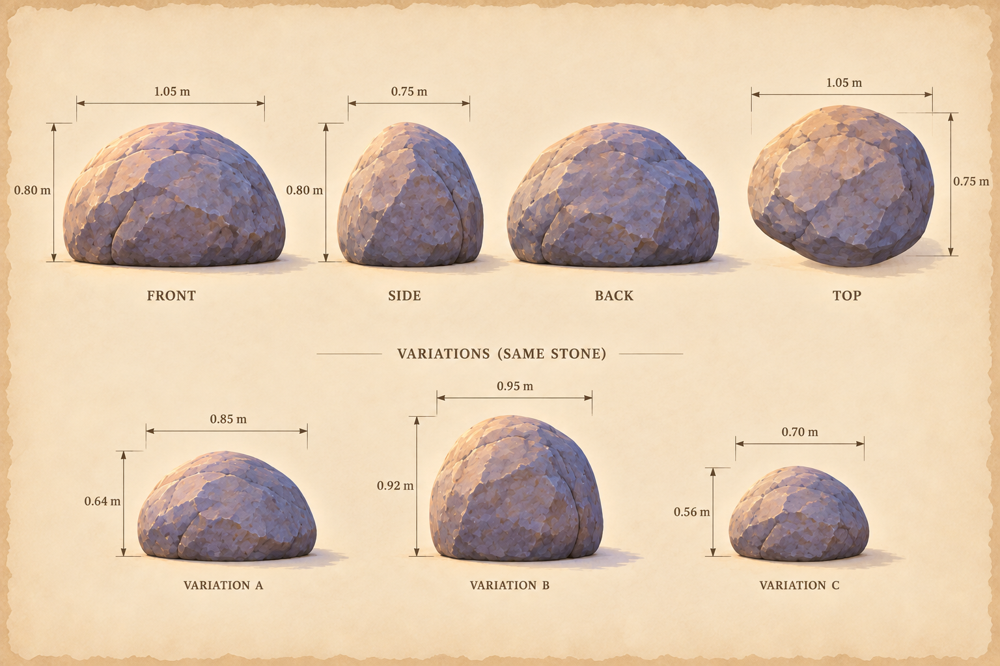
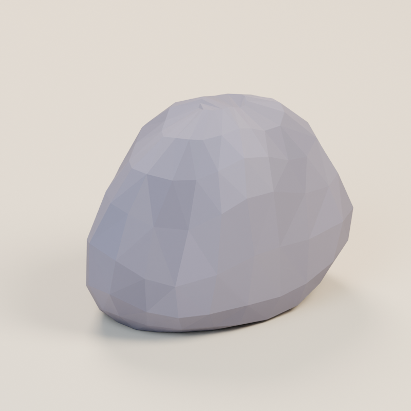
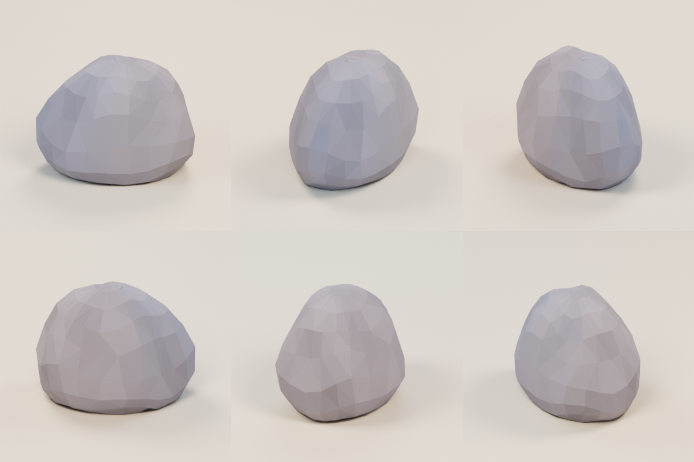
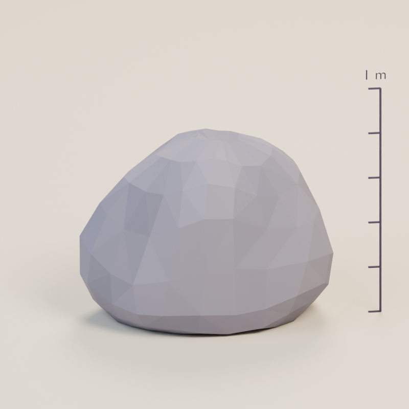
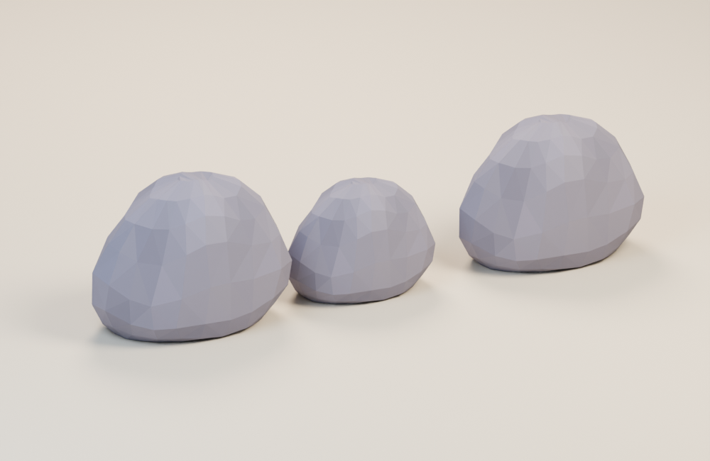

# A rounded edge to the clearing

**clearing-stone · v001 · Ready for Tom · Not approved for gameplay**

A quiet lavender stone rounds off the path without competing with the memory frames or lantern.

## From illustration to model

<figure><figcaption>Selected source concept.</figcaption></figure>
<figure><figcaption>Exact exported GLB, re-imported for this view.</figcaption></figure>

The stone is 1.05 m wide, 0.80 m high and 0.75 m deep. Its asymmetric silhouette and broad facets preserve the concept’s shape and muted color. Fine speckling and surface cracks are omitted.

<model-viewer src="../../media/clearing-stone/v001/clearing-stone.glb" poster="../../media/clearing-stone/v001/front.png" alt="Orbit the clearing-stone candidate" camera-controls touch-action="pan-y" shadow-intensity="0.7" camera-orbit="155deg 70deg auto"></model-viewer>

[Download the GLB](../../media/clearing-stone/v001/clearing-stone.glb) · [Still fallback](../../media/clearing-stone/v001/front.png)

[Front](../../media/clearing-stone/v001/front.png) · [Side](../../media/clearing-stone/v001/side.png) · [Back](../../media/clearing-stone/v001/back.png) · [Top](../../media/clearing-stone/v001/top.png)

## Construction and use

The author removed visible horizontal bands and corrected an underside dip. Source and exported-mesh checks measured about 0.321 m² of flat ground contact. The reuse view uses rotations and scales of this single file; collision remains a separate integration decision.

## Technical record

| Check | Exact candidate |
| --- | --- |
| Geometry | 348 triangles; 1 materials |
| Size, width × height × depth | 1.050 × 0.800 × 0.750 m |
| Runtime bytes | 41,284 |
| Runtime SHA-256 | `475de5a60175e1899f5688ed7a5738a036a3d60b7b06c455eea0bb4472e11aa7` |
| Coordinates | Y-up, meters, forward −Z; ground at Y=0 |
| Animation | Static prop; no clips or rig |

Khronos glTF Validator reports zero errors and warnings. Actual GLB re-import and Three.js loading/bounds checks passed. There are no external texture resources or required compression decoders. Chromium 153 loaded and visibly rendered the exact model in a 358 × 358 phone frame; its download matched the manifest hash. Physical iPhone/iPad Safari performance remains untested.

[Format validation](../../media/clearing-stone/v001/validation.json) · [Re-import inspection](../../media/clearing-stone/v001/reimport.json) · [Three.js checks](../../media/clearing-stone/v001/three-inspection.json) · [Construction record](../../media/clearing-stone/v001/construction.json)

## Source and coordinator intake

Original fictional construction by a fresh **GPT-6 Astra, max** author in **Blender 4.5.13 LTS**, through the dedicated service on September 11, 2026. The driving Astra lead generated and selected the source concepts serially. No private photograph, real-person likeness, third-party mesh or downloaded texture was used. A generator seed/model ID was not returned and is not claimed.

[Full-size concept](../../media/clearing-stone/v001/concept.png) · [Retained prompt](../../media/clearing-stone/v001/prompt.txt) · [Concept provenance](../../media/clearing-stone/v001/concept-provenance.json) · [Exact asset manifest](../../media/clearing-stone/v001/manifest.json) · [Authoring work order](../../../../.agents/work-orders/010-blender-clearing-kit.md)

Editable master: `haynes-quest/clearing-kit/v001/clearing-stone/clearing-stone.blend`, 187,725 bytes, SHA-256 `2e26ac4613f7c7a5a165fb1abd956af211ca0568ee88714a04f334f294d60f8a`. Retrieve it from dev-env through the Blender service’s `/artifacts/haynes-quest/clearing-kit/v001/clearing-stone/clearing-stone.blend` route and verify the checksum. Masters remain on the dedicated authoring PVC.

The lead inspected the corrected beauty, six-angle sheet and combined kit against the source concept. The grounded base and asymmetric profile read clearly. Close inspection still shows deliberately coarse facets; this is a small static first-pass candidate.

[Complete browser audit](../../media/storybook-reference/v001/browser-intake/catalog-local-report.json) · [Independent master retrieval check](../../media/storybook-reference/v001/browser-intake/prop-master-check.json) · [Actual browser view](../../media/storybook-reference/v001/browser-intake/clearing-stone-model-1-phone.png)

## Tom’s review

Review the rounded silhouette, lavender tone and broad facets beside the smoother tree and pale path.

- **Decision:** Pending.
- **Approved version/checksums:** None.
- **Integration:** Studio only. Gameplay uses temporary shapes. Changed geometry or materials require a new candidate version before approval or use.
