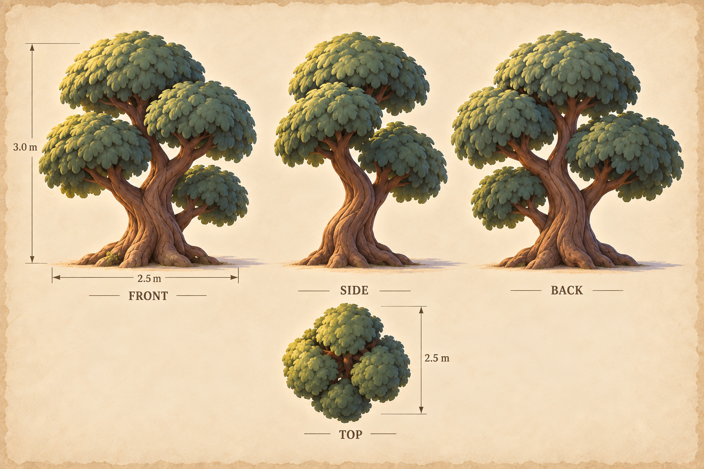
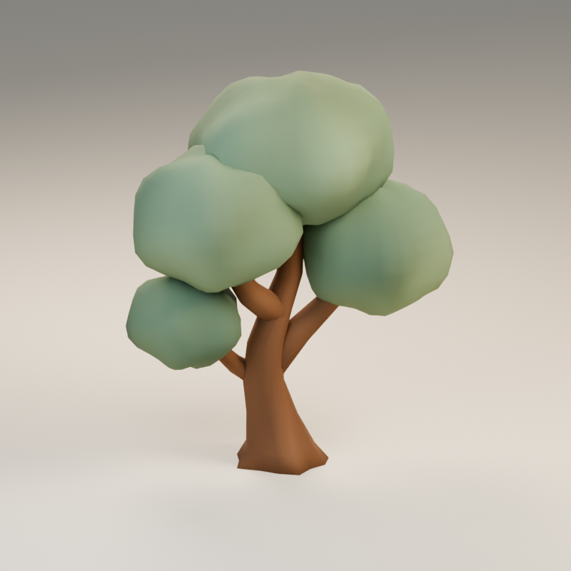
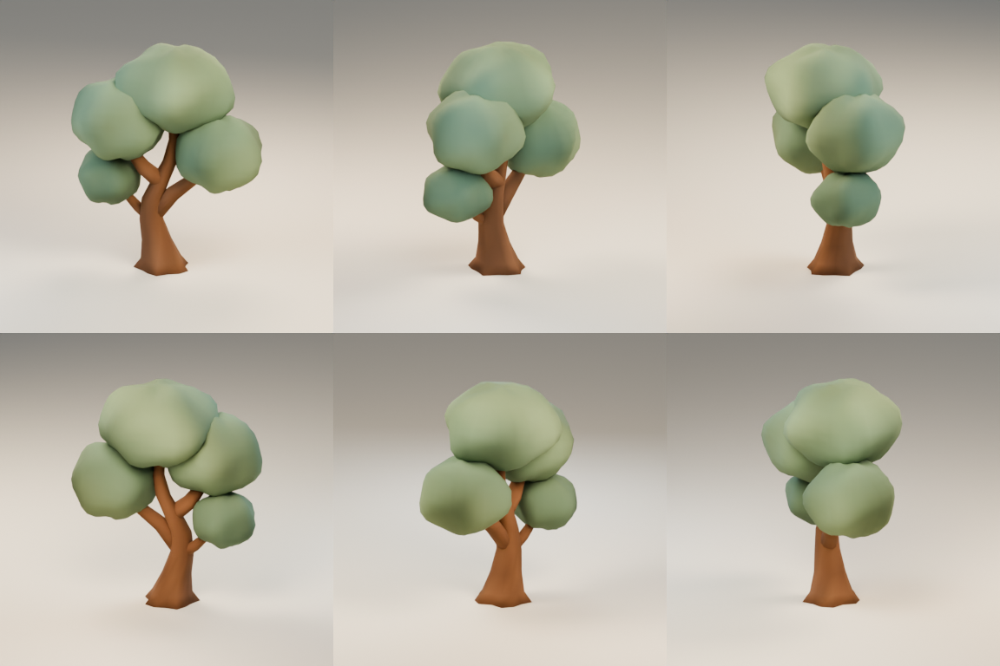
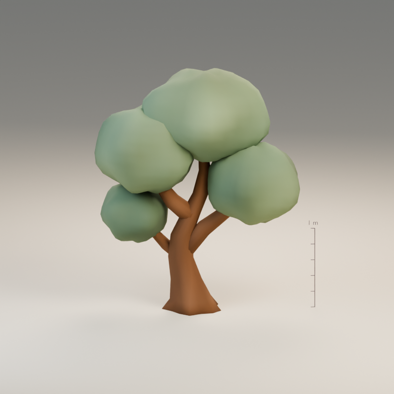
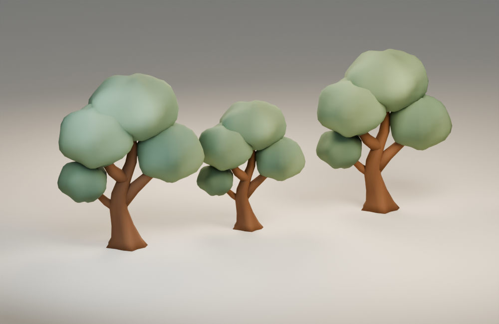

# A quiet place in the shade

**clearing-tree · v001 · Ready for Tom · Not approved for gameplay**

Four soft green canopy masses sit above a curved warm trunk, giving the clearing a gentle, readable landmark.

## From illustration to model

<figure><figcaption>Selected source concept.</figcaption></figure>
<figure><figcaption>Exact exported GLB, re-imported for this view.</figcaption></figure>

The tree is 3 m tall and 2.5 m wide. Its four foliage cushions keep the illustrated silhouette while omitting individual leaves, bark grooves and fine root detail. Broad vertex-color variation gives the foliage a softer finish than the stone and timber.

<model-viewer src="../../media/clearing-tree/v001/clearing-tree.glb" poster="../../media/clearing-tree/v001/front.png" alt="Orbit the clearing-tree candidate" camera-controls touch-action="pan-y" shadow-intensity="0.7" camera-orbit="155deg 70deg auto"></model-viewer>

[Download the GLB](../../media/clearing-tree/v001/clearing-tree.glb) · [Still fallback](../../media/clearing-tree/v001/front.png)

[Front](../../media/clearing-tree/v001/front.png) · [Side](../../media/clearing-tree/v001/side.png) · [Back](../../media/clearing-tree/v001/back.png) · [Top](../../media/clearing-tree/v001/top.png)

## Construction and use

The reuse view shows rotation and scale changes of the same exported model. These are placement examples, not additional assets. The trunk and foliage are static; no wind animation is included.

## Technical record

| Check | Exact candidate |
| --- | --- |
| Geometry | 2,840 triangles; 2 materials |
| Size, width × height × depth | 2.500 × 3.000 × 1.546 m |
| Runtime bytes | 71,316 |
| Runtime SHA-256 | `501873525cbacf5449274a5f1c4ddf8294c2c8057b79b995e4070af375006ff9` |
| Coordinates | Y-up, meters, forward −Z; ground at Y=0 |
| Animation | Static prop; no clips or rig |

Khronos glTF Validator reports zero errors and warnings. Actual GLB re-import and Three.js loading/bounds checks passed. There are no external texture resources or required compression decoders. Chromium 153 loaded and visibly rendered the exact model in a 358 × 358 phone frame; its download matched the manifest hash. Physical iPhone/iPad Safari performance remains untested.

[Format validation](../../media/clearing-tree/v001/validation.json) · [Re-import inspection](../../media/clearing-tree/v001/reimport.json) · [Three.js checks](../../media/clearing-tree/v001/three-inspection.json) · [Construction record](../../media/clearing-tree/v001/construction.json)

## Source and coordinator intake

Original fictional construction by a fresh **GPT-6 Astra, max** author in **Blender 4.5.13 LTS**, through the dedicated service on September 11, 2026. The driving Astra lead generated and selected the source concepts serially. No private photograph, real-person likeness, third-party mesh or downloaded texture was used. A generator seed/model ID was not returned and is not claimed.

[Full-size concept](../../media/clearing-tree/v001/concept.png) · [Retained prompt](../../media/clearing-tree/v001/prompt.txt) · [Concept provenance](../../media/clearing-tree/v001/concept-provenance.json) · [Exact asset manifest](../../media/clearing-tree/v001/manifest.json) · [Authoring work order](../../../../.agents/work-orders/010-blender-clearing-kit.md)

Editable master: `haynes-quest/clearing-kit/v001/clearing-tree/clearing-tree.blend`, 218,629 bytes, SHA-256 `839ce2438106d8cea9f562a90c082c82049689cc56e44868473cb0bbffc9022b`. Retrieve it from dev-env through the Blender service’s `/artifacts/haynes-quest/clearing-kit/v001/clearing-tree/clearing-tree.blend` route and verify the checksum. Masters remain on the dedicated authoring PVC.

The lead inspected the exact beauty, six-angle sheet and combined kit against the concept. The canopy grouping and curved trunk remain recognizable from several angles. The broad, smooth leaf masses are deliberately much less detailed than the source illustration.

[Complete browser audit](../../media/storybook-reference/v001/browser-intake/catalog-local-report.json) · [Independent master retrieval check](../../media/storybook-reference/v001/browser-intake/prop-master-check.json) · [Actual browser view](../../media/storybook-reference/v001/browser-intake/clearing-tree-model-1-phone.png)

## Tom’s review

Review the four-part canopy, curved trunk and whether the smooth foliage feels sufficiently storybook-like beside the travelers.

- **Decision:** Pending.
- **Approved version/checksums:** None.
- **Integration:** Private candidate. The exact v001 model is the shared theme-kit prop `clearing-tree` (DESIGN-025 D-05). The Magic House, chapter 2 of the private family template `family-world-b@v1`, places it 23 times as scenery. Decor has no collision, and a model that fails to load draws its procedural fallback. This records use, not approval. Changed geometry or materials require a new candidate version before approval or use.
