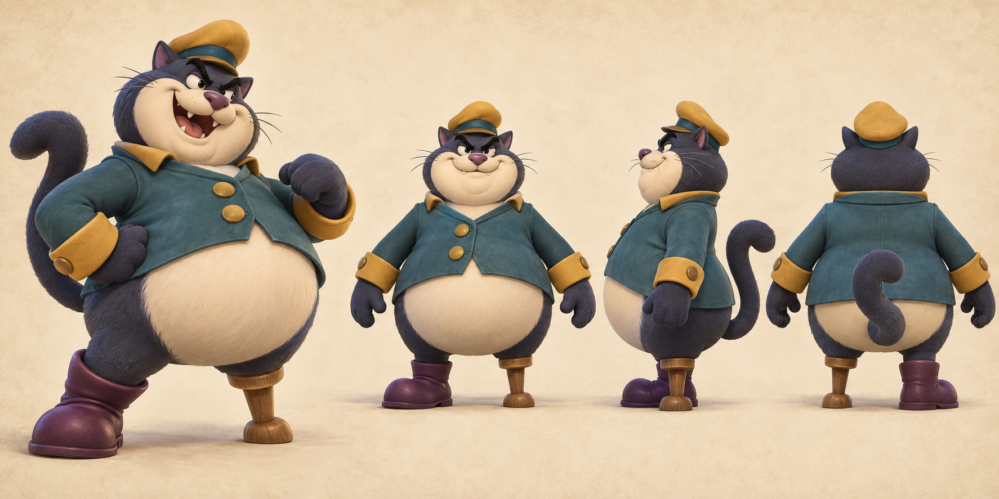
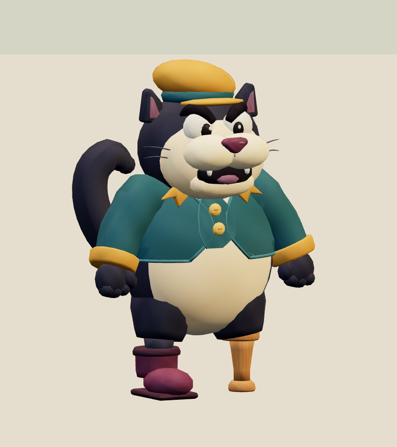
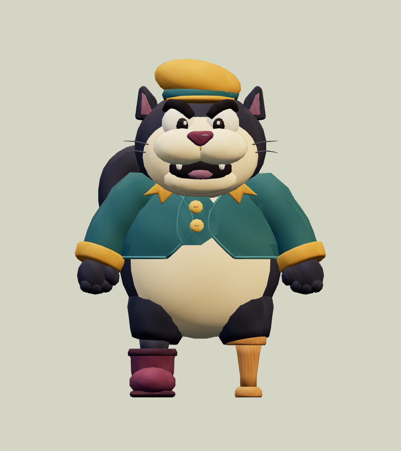
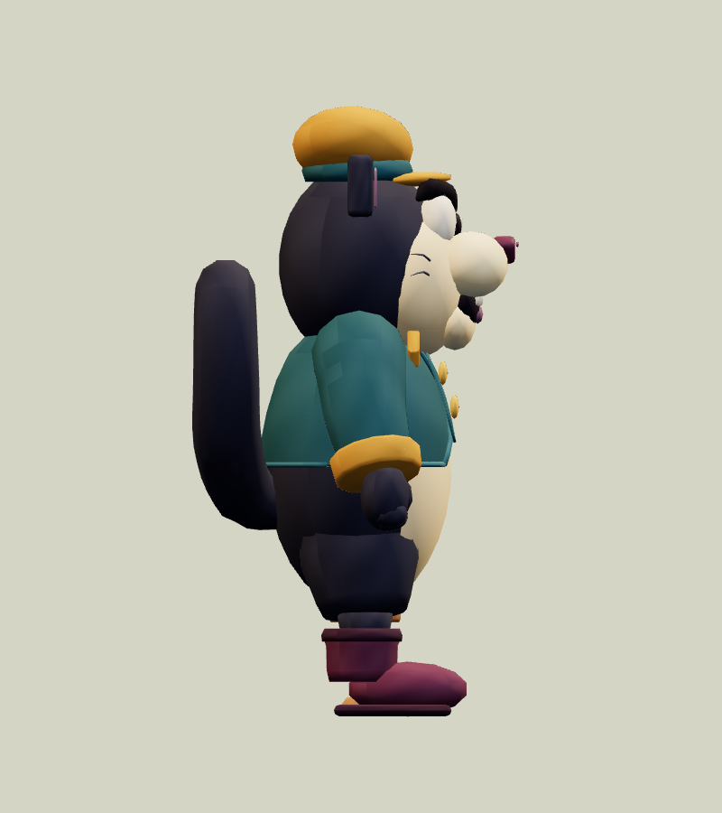
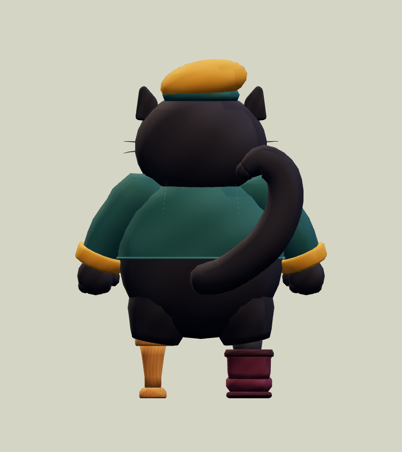
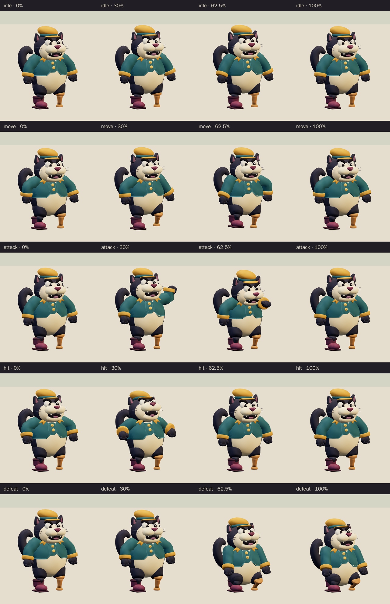
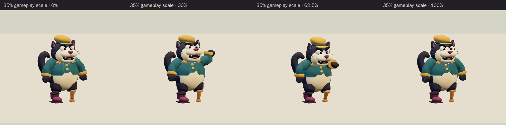

# Clubhouse Bully Cat · v001

**Awaiting Tom's review · used in the family release.** This original blustering cat captain is the World A chapter 1 boss candidate from [the locked era roster](../../../designs/026-personal-era-casts.md). His broad cream belly, curled tail, short teal jacket and uneven peg-and-boot stance carry the joke. The model uses a wooden peg on his left and a plum boot on his right, following the selected sheet.

[Concept prompt](../../media/clubhouse-bully-cat/v001/prompt.txt) · [Concept source and selection notes](../../media/clubhouse-bully-cat/v001/source.json) · [Model provenance](../../media/clubhouse-bully-cat/v001/construction.json)

<figure><figcaption>Selected construction concept</figcaption></figure>
<figure><figcaption>Exact v001 model</figcaption></figure>

<model-viewer src="../../media/clubhouse-bully-cat/v001/clubhouse-bully-cat.glb" poster="../../media/clubhouse-bully-cat/v001/beauty.png" alt="Orbit the Clubhouse Bully Cat and inspect his five animations" camera-controls touch-action="pan-y" data-quest-clips shadow-intensity="0.7" camera-orbit="155deg 75deg auto"></model-viewer>

[Download exact GLB](../../media/clubhouse-bully-cat/v001/clubhouse-bully-cat.glb) · [Editable Blender master](../../media/clubhouse-bully-cat/v001/clubhouse-bully-cat.blend) · [Artifact manifest](../../media/clubhouse-bully-cat/v001/sha256-manifest.json)

<figure><figcaption>Front</figcaption></figure>
<figure><figcaption>Side</figcaption></figure>
<figure><figcaption>Back</figcaption></figure>

The lead reviewed the exact exported front, side, back and three-quarter views, then requested a continuous jacket sleeve, rounded mitten fingers and two buttons seated on the teal overlap. Those corrections are present here. The selected concept fixes the peg on the character's left; the model and its source record preserve that choice.

| Exact exported model | Result |
| --- | --- |
| Size and placement | 1.854 m wide × 2.500 m tall × 1.339 m deep; metre scale, Y-up, forward −Z, floor-centered |
| Geometry | 14,492 triangles; one skin with 23 joints and at most two influences per vertex; two opaque material primitives |
| Texture | One original embedded 1024 × 1024 atlas; no external resource or required decoder |
| Download | 1,073,732 bytes; below the 2 MiB candidate budget |
| GLB SHA-256 | `e082df0e5ebe116645aa800c26896b79b8a01025167446e00d1f37cb1788b447` |
| Blender master SHA-256 | `f3d6ee6126bc42cba5fa95a7eb3a0a0cc8fc9e0d7de9718b761fd82bf0572496` |

## Motion and checks

The viewer exposes `idle` (2.4 s), `move` (1.2 s), `attack` (2.0 s), `hit` (0.7 s) and `defeat` (2.4 s). The attack raises a mitten beside the head, holds its warning and swats forward at **1.25 seconds** before recovering. Defeat ends in a planted, embarrassed squat held from 1.8 seconds. The clips leave the root stationary; gameplay controls travel and damage.

[Khronos validation](../../media/clubhouse-bully-cat/v001/validation.json) reports zero errors and warnings. [Three.js inspection](../../media/clubhouse-bully-cat/v001/three-inspection.json) reimported the exact GLB, exercised the real enemy animation adapter and sampled all 11,388 exported vertices at 530 animation steps. It found stationary root tracks, attachment pivot drift below one micrometre, a held defeat pose and no floor penetration beyond export rounding. [Chromium playback](../../media/clubhouse-bully-cat/v001/browser-inspection.json) rendered changing frames for all five clips at normal and 35% scale with no page, console, HTTP or WebGL errors. [Author's visual notes](../../media/clubhouse-bully-cat/v001/visual-review.json) and the [scene release](../../media/clubhouse-bully-cat/v001/scene-release.json) record the corrections, preserved earlier masters and released Blender scene. The lead's independent intake checked all 86 local artifact hashes against the manifest.

The browser evidence uses software Chromium. Physical iPad/iPhone Safari, device frame time and combat feel remain owner checks. The source image is a construction guide; the downloadable GLB and its hashes identify the model under review.

## Provenance and release

Driving Astra generated and selected the concept with the built-in image tool. A fresh native Astra at `max` authored the geometry, atlas, rig and animations through Blender under [WO111](../../../../.agents/work-orders/111-era-cast-art-lead.md), using an exclusive scene lease. No family photograph, personal likeness, downloaded franchise model, logo or audio was used. The source scripts live in `scripts/assets/clubhouse-bully-cat/v001/`; the manifest identifies the durable master and matching authoring-service backup.

[PRD-004 Q-03](../../../prds/004-family-release.md#owner-decisions) permits this candidate in the family release before Tom's review. This delivery supplies the artwork and technical handoff; the PLAN-019 coordinator owns its runtime catalog entry and level placement. Tom's exact-version decision is **pending**. A rejection returns that slot to a placeholder or prior version; catalog inclusion and validation do not constitute approval.
