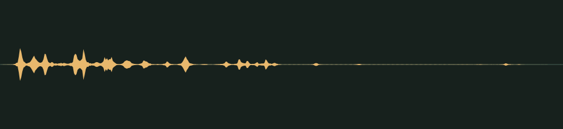

# Cookie crumble · v001

**Audio candidate · family world mechanics · not yet in the game · listening review pending.** A crumbly crack for a platform that is about to give way, followed by a small rattle of crumbs. It should not startle.

## Audition

<audio controls preload="none" aria-label="Audition crumble-crack version one">
  <source src="../../media/crumble-crack/v001/cue.wav" type="audio/wav">
  <a href="../../media/crumble-crack/v001/cue.wav">Download the processed cue</a>
</audio>

[Processed cue](../../media/crumble-crack/v001/cue.wav) · [Original five-second take](../../media/crumble-crack/v001/source.wav)

## Exact version

| Property | Measured result |
| --- | --- |
| Stable cue / version | `crumble-crack` / `v001` |
| Duration | 0.70 seconds |
| Format | PCM signed 16-bit WAV, stereo, 44.1 kHz |
| Download size | 123,524 bytes |
| Peak / RMS | -11.0 / -36.092 dBFS |
| Clipped samples | 0 |
| Processed SHA-256 | `2ac76e286d5ea86d6f9945242325328146bf0728a8a9c9fd84faaf74caf6c714` |
| Source SHA-256 | `8970901dd8a91ab16099fdbae2f3b5e27d48aacaa6c84fe9a03d974dc9266fd2` |

Processing selects the segment beginning at 2.060 seconds, trims it to the stated duration, applies a 0.010-second entrance and 0.120-second exit fade, then normalizes its peak. It is a one-shot cue, not a loop. The source is preserved separately. [Exact recipe](../../media/crumble-crack/v001/processing.json), [measurements](../../media/crumble-crack/v001/verification.json), and [reproducible processing script](../../../../scripts/assets/audio/process_cues.py).

## Source and checks

Generated on 2026-09-26 by a Claude Code subagent (Opus 5.5) from the workflow coordinator's cue brief, using the separate Stable Audio 3 Small-SFX CPU service (service version 0.2.0). This take used seed 203, eight steps and five seconds. It contains no supplied recording or personal reference. The [provenance record](../../media/crumble-crack/v001/provenance.json) retains the complete prompt, service/model revisions and the source terms recorded in [DESIGN-008](../../../designs/008-audio-pipeline.md). The source code, model and redistributed text component have separate terms; no broader license is asserted here.

The service and download SHA-256 checks passed, as did WAV decoding and the exact-duration, non-silence and zero-clipping checks. Re-running the processing script reproduced the same output. These measurements do not establish timbre or musical quality.

## Listen-proxy check

Nobody has listened to this take; the agent cannot hear audio. Instead, it measured the source's level in 20 ms windows, a rough autocorrelation pitch track, the zero-crossing rate and a four-band energy split, and chose the segment from those numbers. The take scatters crackles over four seconds. The selected window starts with the loudest cluster at 2.08 seconds, a crack lasting about 0.2 seconds. About 0.1 seconds later come smaller crackles, 6–10 dB quieter, then a few sparse ticks. The crackles are sharp: single 20 ms frames peak 12–17 dB above their average level. The -11 dBFS peak therefore leaves this cue with the lowest average level of the set.

Energy split of the processed cue: 0.4% below 300 Hz, 1.1% at 300 Hz–1 kHz, 14.3% at 1–4 kHz and 84.2% above 4 kHz. These numbers hint at shape and brightness; they cannot say how the cue sounds.

## Coordinator and owner review

Review focus: Whether it sounds like a friendly cookie crumble rather than a startling snap, and whether it is loud enough on a tablet speaker.

- **Coordinator technical intake:** Passed numerically; listening/creative selection pending.
- **Tom’s decision:** Pending, against the exact hash above.
- **Gameplay integration:** None yet. The game’s cue map does not reference this file; wiring it to crumbling platforms is a separate step. The inventory records it as a private candidate for the family worlds.
