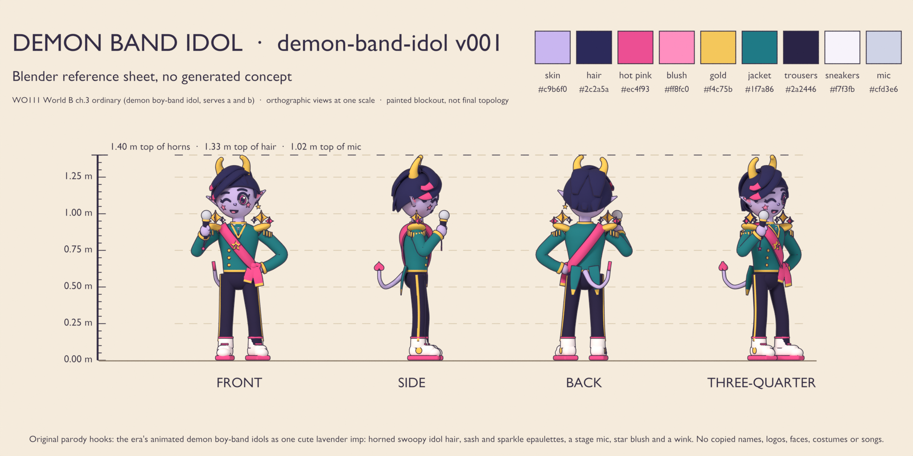
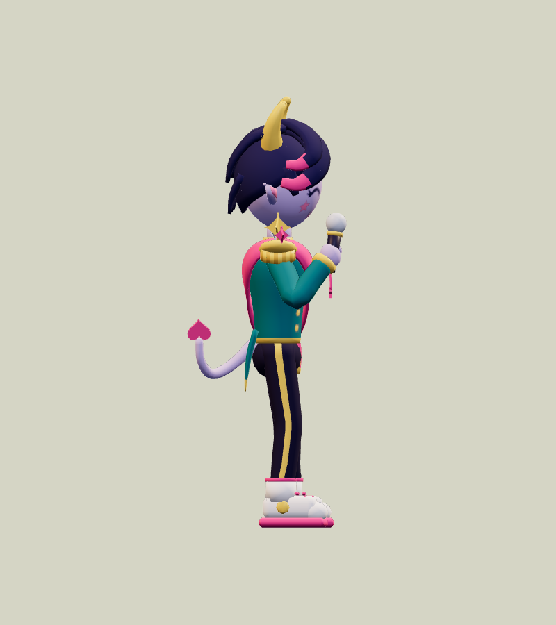
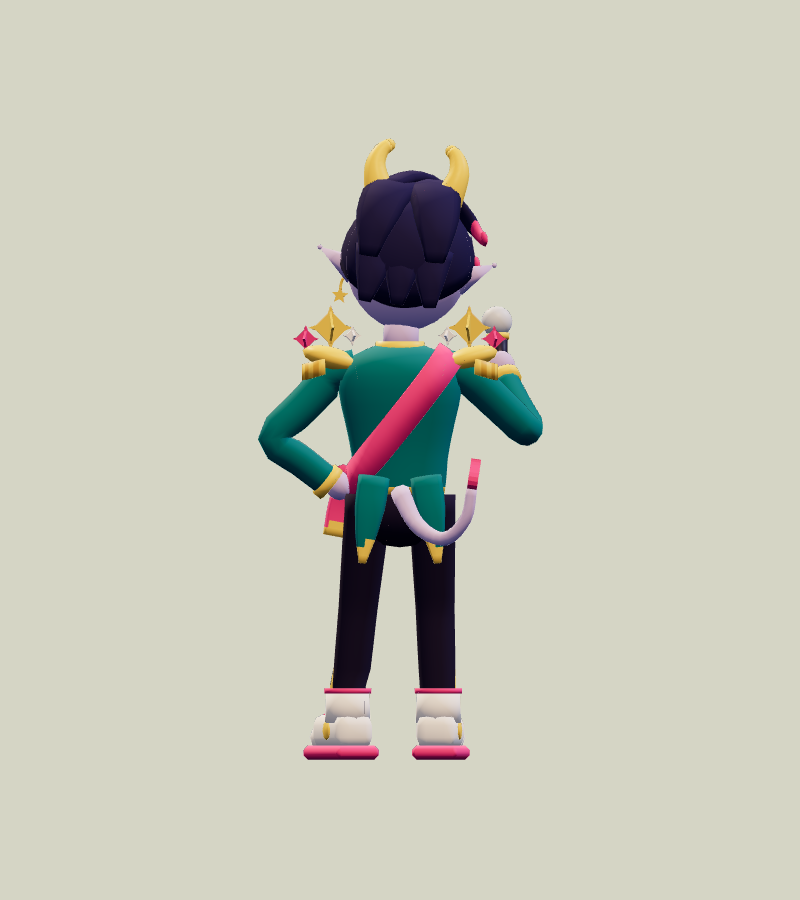
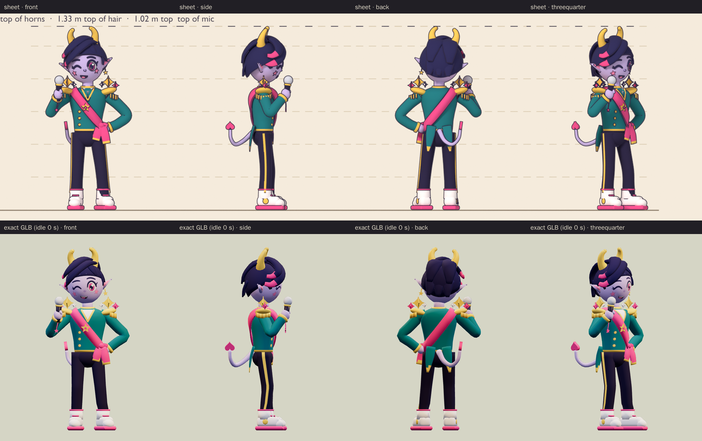
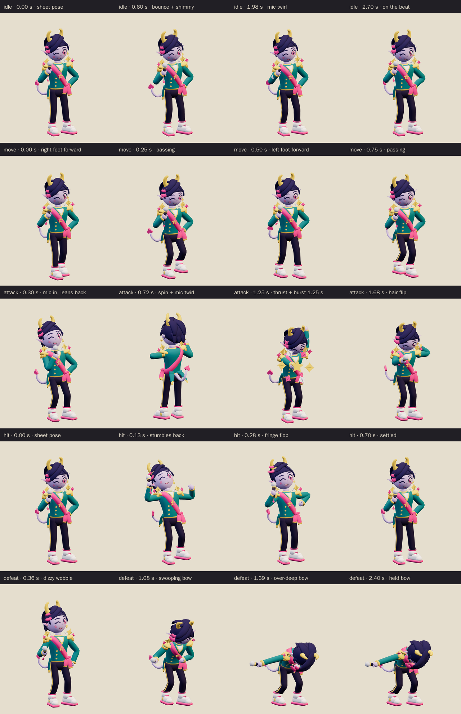
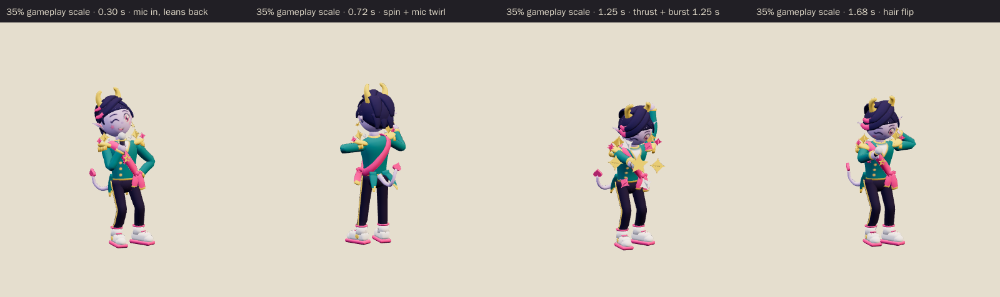

# Demon Band Idol · v001

**Awaiting Tom's exact-version review · prepared for the next family release.** This sparkly demon pop idol is the World B chapter 3 ordinary enemy candidate from [the locked era roster](../../../designs/026-personal-era-casts.md), for the Besties' Big Stage chapter for ages 4 to 6, where the existing Bickering Besties are the boss. He is a cute lavender imp caught mid-performance and very pleased with himself. Two blunt gold candy horns poke up through swoopy midnight idol hair, and the fringe is dip-dyed hot pink at his right temple. He throws the audience a big wink over an open grin with pink star blush. He wears a teal-and-gold stage jacket with sparkle-star epaulettes, a hot-pink sash with a gold star brooch and a bow at his left hip, slim trousers with gold side stripes and chunky white high-tops with pink soles. He holds a silver stage mic by his chin and plants his other fist on his hip, and a heart-tipped demon tail curls up beside his right leg. His attack is a mic spin that ends in a sparkle burst. The family world template calls him Demon Idol.

**Source: Blender reference sheet, no generated concept.** No image-generation model was used for this asset. Following [PRD-004 Q-07](../../../prds/004-family-release.md#owner-decisions), the author first rendered a painted Blender reference sheet from the written brief, and the coordinator approved it on September 26 before any detailing.

[Reference sheet notes](../../media/demon-band-idol/v001/reference-notes.md) · [Reference source record](../../media/demon-band-idol/v001/source.json) · [Model provenance](../../media/demon-band-idol/v001/provenance.json)

<figure><figcaption>Blender reference sheet, no generated concept</figcaption></figure>
<figure><figcaption>Exact v001 model</figcaption></figure>

<model-viewer src="../../media/demon-band-idol/v001/demon-band-idol.glb" poster="../../media/demon-band-idol/v001/beauty.png" alt="Orbit the Demon Band Idol and inspect its five animations" camera-controls touch-action="pan-y" data-quest-clips shadow-intensity="0.7" camera-orbit="155deg 75deg auto"></model-viewer>

[Download exact GLB](../../media/demon-band-idol/v001/demon-band-idol.glb) · [Editable Blender master](../../media/demon-band-idol/v001/demon-band-idol.blend) · [Reference blockout master](../../media/demon-band-idol/v001/demon-band-idol-blockout.blend) · [Artifact manifest](../../media/demon-band-idol/v001/sha256-manifest.json)

<figure><figcaption>Front</figcaption></figure>
<figure><figcaption>Side</figcaption></figure>
<figure><figcaption>Back</figcaption></figure>
<figure><figcaption>Three-quarter</figcaption></figure>

The comparison above shows the sheet and the exact export at matching angles and one metric scale. The export stills use the first frame of `idle`, which recreates the sheet pose: the head tilted 6° into the mic and turned 5°, the weight on the right leg and the left foot turned out. The mic grille, fists, wrists and feet match the approved blockout to within a millionth of a metre. The model follows the coordinator's sheet notes:

- It keeps the cute, kid-safe lavender imp with swoopy horned idol hair, the pink sash, the sparkle epaulettes, the stage mic, the star blush and the wink.
- The heart-tipped tail stays readable. It is 20% thicker than in the blockout. Its pink heart tip reads clearly from the side, back and three-quarter and at 35% gameplay scale, and the tail peeks up beside his right leg from the front.
- The attack is a mic spin that ends in a sparkle burst.
- The defeat is a dramatic dizzy bow, held.
- The atlas uses the sheet's colour values. The browser preview renders them slightly deeper than the sheet because it uses different tone mapping and lighting.

The author departed from the sheet notes in five deliberate ways:

- The bind pose stands neutral, with the head straight, the arms in an A-pose and both feet forward, as the sheet notes suggested. The sheet pose is recreated at the start of `idle`, and the main stills show it; [rest-pose stills](../../media/demon-band-idol/v001/rest-beauty.png) show the bind pose.
- At contact his free hand flings up in a raised fist instead of the notes' heart gesture, because the mitten fists cannot make a heart.
- In `hit` the fringe flings out off his head instead of flopping over both eyes, because that rotation would pass through the face.
- The face is painted, with no morph targets, so there is no blink and no round "ow" mouth; the wink and grin hold in every clip.
- The chunky sneakers stay rigid on the foot, with no toe bones. The rig has 36 joints, including two fringe bones, four tail bones, bow-tail and swallowtail bones and a bone that opens the sparkle burst.

The attack and defeat follow the coordinator's notes rather than the sheet notes' quarter-spin and seated swoon. The ears are 13% fuller than in the blockout, and the earring, mic charm and cord are slightly thicker.

The author also fixed these problems along the way:

- The epaulette fringe first hung with a gap below the pad, as in the blockout. It now hangs from just under the rim.
- The trouser hems poked through the high-top collars once the shins bent. They now tuck 8 mm inside the collars.
- At 35% scale the first sparkle burst read as a few specks. The ring is now wider, the sparkles about 1.65 times larger, and the burst overshoots and spins as it opens. The first thrust also pointed the mic down; the arm now reaches out level along the mic.
- The first held bow flung the mic arm up behind his back, which read like a dab. The arm now flings out wide at hip height.
- The first fringe motion swung the swoop down and buried the pink tips in his cheek. The fringe now only lifts away from the head.
- The attack spin first swung the tail into his seat, and the dizzy wobble rolled his head into the shoulder sparkles. The tail now flings out and up, and the wobble is a nod and turn.
- The held defeat first drifted 0.46 mm at 60 Hz because the last settle key sat inside the hold. Every defeat motion now ends at 1.68 seconds.

The horns have blunt round tips 0.028 m across, and the tail ends in a heart. There are no fangs, claws, weapons or angry face, and the mic is his only prop. Nothing on the model carries lettering or a logo.

| Exact exported model | Result |
| --- | --- |
| Size and placement | 1.401 m tall to the horn tips in the sheet pose at the start of `idle`, and about 0.66 m wide across the elbows. The bind pose is 1.396 m tall, 0.976 m wide because of the A-pose arms, and 0.522 m deep; the soles sit 3 mm above the floor. Across all clips the highest point is 1.410 m and the lowest 1.2 mm. At attack contact the mic grille is 0.83 m above the floor, 0.43 m ahead of its sheet-pose position. Metre scale, Y-up, forward −Z, floor-centered |
| Geometry | 12,308 triangles; 6,356 Blender vertices, 11,760 after export; one skin with 36 joints and at most two influences per vertex |
| Materials | Two opaque materials: matte for the skin, hair and cloth, and satin for the gold, the sparkles and the mic. Both sample the same atlas, one draw primitive each |
| Texture | One original embedded 1024 × 1024 painted atlas (20,506 bytes); no external resource or required decoder |
| Download | 1,240,728 bytes; below the 2 MiB candidate budget |
| GLB SHA-256 | `332f1bfb66d611676b1864e968b5d4657ecfe73698d623541eca4379331df54c` |
| Blender master SHA-256 | `b11910f9d2510b529e41d88cbbc01edc041161c53bac0d948f2f238f5cdc00c9` |
| Reference sheet SHA-256 | `ecdefc9659051d1bc7ab5382743a08ccfe264b051f30f15059acd8a5a14178a3` |

## Motion and checks

The viewer exposes `idle` (3.0 s), `move` (1.0 s), `attack` (2.0 s), `hit` (0.7 s) and `defeat` (2.4 s):

- **Idle:** it starts in the sheet pose, bounces on the beat and shimmies his shoulders so the sparkles jiggle, with one quick mic twirl. The tail, fringe, earring and star charm sway.
- **Move:** a strutting walk with bouncing steps and a shoulder roll. The mic stays up and the fist stays on his hip, while the bow tails and swallowtails bounce and the tail wags.
- **Attack:** he pulls the mic in and leans back. From 0.40 to 1.04 seconds he spins a full turn in place while twirling the mic twice. He then lunges into a high-note thrust with the mic aimed along his arm and his free hand flung up, with contact at **1.25 seconds**. A ring of six crossed sparkles and a big gold star pops open around the mic grille between 1.17 and 1.60 seconds, and the shoulder sparkles pulse with it. A hair flip returns him to the sheet pose.
- **Hit:** he stumbles back a step. His head whips back, the fringe flings out, his arms flail and the tail stiffens while the sparkles and ears shake.
- **Defeat:** a dizzy wobble in which the mic droops and the fist falls off his hip. Then comes an over-deep curtain-call bow: the mic flung out wide, the other hand on his belly, the right foot slid back, the tail and ears drooping and one sparkle tilted. The chest ends 66° forward with the hips at 0.51 m. The pose is held from 1.75 seconds.

The clips leave the root stationary; gameplay controls travel and damage. The spin and lunge move the body inside the clip. The sparkle burst is model geometry, folded up inside the mic grille and opened by its bone's scale, up to 28.75 times at the peak of its overshoot; it stays closed in every other clip. In the game, the wind-up plays the attack from its start to the 1.25 second contact at the enemy's wind-up speed.

[Khronos validation](../../media/demon-band-idol/v001/validation.json) reports zero errors, warnings, infos and hints, and all 19 contract checks pass. [Three.js inspection](../../media/demon-band-idol/v001/three-inspection.json) reimported the exact GLB and exercised the real enemy animation adapter. It sampled all 11,760 exported vertices at 552 animation steps and passed all 30 checks:

- The root stays still, and rotation-only joints keep their pivots.
- The idle and move loops are seamless, and the defeat pose holds.
- No clip goes below the floor, and the culling envelope stored in the model covers every pose.
- The start of `idle` is the sheet pose, and the burst stays closed inside the grille at rest and in `idle`.
- He spins a full turn in place from 0.40 to 1.04 seconds. At contact the burst is open, the mic is thrust at the player and his free hand is up.
- The held defeat is the dramatic bow.

The [attachment audit](../../media/demon-band-idol/v001/attachment-inspection.json) ran on the live Blender scene that exported the GLB. It checked 17 part pairs on every frame of every clip, including the mic against the head, body and legs, the burst against the head and body, the arms against the head, the fringe and shoulder sparkles against the face, the tail against the legs and body, and the two legs against each other. It found no overlaps, and the limb joints stayed connected. [Chromium playback](../../media/demon-band-idol/v001/browser-inspection.json) rendered changing frames for all five clips at normal and 35% scale with no page, console, HTTP or WebGL errors and no external requests. [Author's visual notes](../../media/demon-band-idol/v001/visual-review.json) and the [scene release](../../media/demon-band-idol/v001/scene-release.json) record the corrections and the released Blender scene.

The catalog intake checked all 174 local artifact hashes against the manifest; every manifested file is published. It reran the Three.js inspection against the current enemy animation adapter and got byte-identical results. The intake added this page's [source record](../../media/demon-band-idol/v001/source.json) and a short [sheet-stage note](../../media/demon-band-idol/v001/sheet-stage/README.md); neither is in the author's manifest.

The asset intake found a small runtime culling risk for this model: three.js computed each skinned primitive's culling sphere from its first rendered pose, before the runtime used the model's exported animation envelope. The intake measured this model against its first idle pose. When the burst peaks at 1.40 seconds into the attack, the satin part moves at most 0.077 m outside its sphere; the matte part moves at most 0.011 m outside its own during the spin. The runtime now applies the exported envelope to every skinned primitive; the model itself is unchanged.

The browser evidence uses software Chromium. Physical iPad/iPhone Safari, device frame time and combat feel remain owner checks. This package contains visual animations only; there is no new audio file.

## Provenance and release

Claude Opus 5.5 (`claude-opus-5-5`, effort `xhigh`) authored both stages through Blender 4.5.13 under [WO111](../../../../.agents/work-orders/111-era-cast-art-lead.md), under Tom's September 26 ruling. It built the procedural blockout and rendered the reference sheet on the first Blender authoring service, holding its scene lease from 16:56 to 17:16 UTC. After the coordinator approved the sheet, it built the final topology, painted atlas, 36-bone rig and all five clips on the second service, holding an exclusive scene lease from 18:59 to 19:41 UTC. No family photograph, personal likeness, downloaded franchise model, character design, logo, lettering, song or audio was used. The demon who is secretly a pop idol comes from the era's animated demon boy band, and the military-style stage jacket, sash, glitter stripes, chunky sneakers and handheld mic are generic idol-stage conventions. The lavender imp skin, candy horns, dip-dyed swoop, star blush, sparkle epaulettes, heart-tipped tail and wink-and-mic pose are original choices. The [sheet-stage records](../../media/demon-band-idol/v001/sheet-stage/README.md) keep the sheet's own lease, release and manifest. The source scripts live in `scripts/assets/demon-band-idol/v001/`.

[PRD-004 Q-03](../../../prds/004-family-release.md#owner-decisions) permits this candidate in the private family release before Tom reviews its exact version. `parody-catalog-v11` registers this v001 model, and `family-world-b@v5` assigns it to the World B chapter 3 ordinary encounters. The previous templates keep their neutral placeholder assignments. The v5 release and exact-version owner decision are **pending**; a rejection returns this slot to a placeholder or prior version. Catalog registration and technical checks do not constitute owner approval.
