# Demon Idol Drummer · v001

**Draft for coordinator intake · awaiting Tom's exact-version review.** An
original toy-demon idol minion for the Big Stage cast. He has swept magenta
spiky hair, small plum horns, pointed ears and a smug sneer with one tiny fang.
He wears a teal short jacket over a black shirt with a gold star, plum baggy
pants and chunky white boots. Brown straps carry a raspberry snare at his waist,
and he holds two drumsticks. He keeps a beat while waiting. To attack he raises
both sticks, slams the drum and sends out a golden beat ring.
[DESIGN-029](../../../designs/029-action-and-inhabited-worlds.md) adds him as an
ordinary enemy silhouette. The family-release candidate permission in
[PRD-004 Q-03](../../../prds/004-family-release.md#owner-decisions) applies.

**Source: coordinator-generated construction reference.** Row 3 of the October 4
action-minions-B sheet was the build guide. No image pixels are applied to the
model. Claude Code Opus 5.5 (`claude-opus-5-5`, xhigh) authored the model in
Blender 4.5.13 LTS on the isolated second authoring service. The face, hair,
star, buckles, studs and drum hardware are modelled geometry with flat vertex
colours. He is a generic fantasy idol, with no likeness of a real performer or
existing character. No family photograph, downloaded mesh, logo or texture was
used.

[Provenance](../../media/demon-idol-drummer/v001/provenance.json) ·
[Construction record](../../media/demon-idol-drummer/v001/construction.json) ·
[Artifact manifest](../../media/demon-idol-drummer/v001/sha256-manifest.json)

<model-viewer src="../../media/demon-idol-drummer/v001/demon-idol-drummer.glb" poster="../../media/demon-idol-drummer/v001/beauty.png" alt="Orbit the Demon Idol Drummer and inspect his five animations" camera-controls touch-action="pan-y" data-quest-clips shadow-intensity="0.7" camera-orbit="155deg 78deg auto"></model-viewer>

[Download exact GLB](../../media/demon-idol-drummer/v001/demon-idol-drummer.glb) ·
[Editable Blender master](../../media/demon-idol-drummer/v001/demon-idol-drummer.blend)

## Concept to model

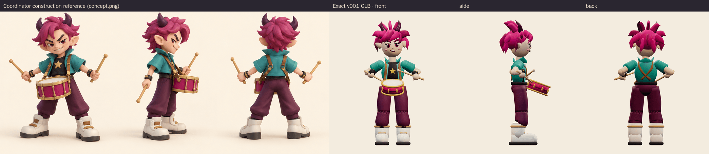

The model keeps the concept's oversized swept hair with small curved horns,
pointed ears, angled brows and smirk. It also keeps the open teal jacket with a
popped collar and short sleeves over the black star shirt, the crossed brown
straps on the back, the studded black wristbands, and the plum pants gathered
over chunky boots. The raspberry snare has gold rims and lugs. The neutral bind
pose holds the sticks out to the sides as the concept does. The model stills
show `idle` at 0 seconds, where he is already drumming with both stick tips on
the drumhead.

<figure>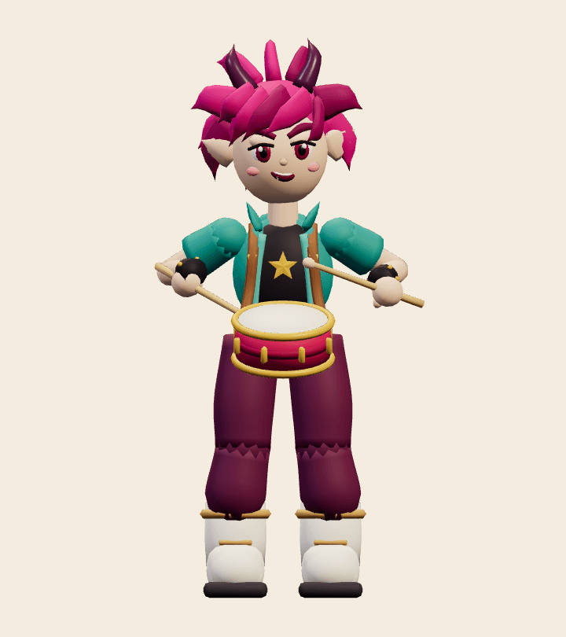<figcaption>Front</figcaption></figure>
<figure>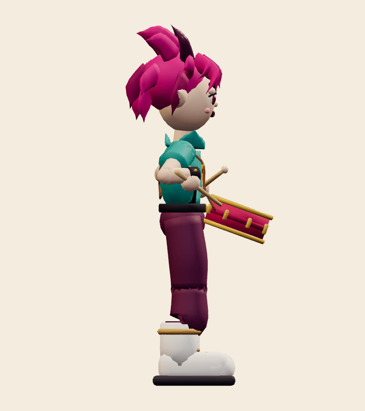<figcaption>Side</figcaption></figure>
<figure>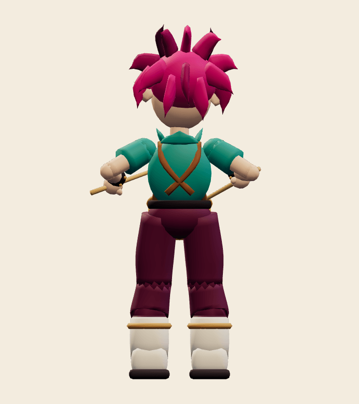<figcaption>Back</figcaption></figure>
<figure>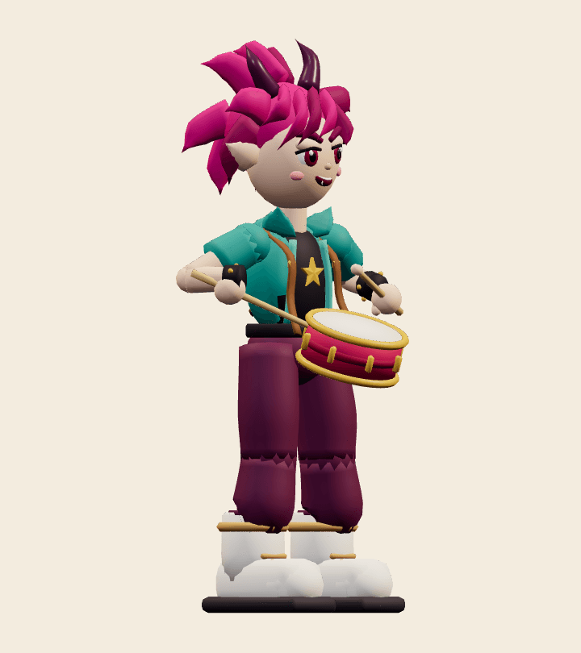<figcaption>Three-quarter</figcaption></figure>

## Animation

The adapter requires exactly `idle`, `move`, `attack`, `hit` and `defeat`, and
all five are present. The legs and arms were authored with two-bone IK, so the
boots stay planted and the stick tips land exactly on the drumhead. The GLB
carries ordinary joint rotations.

- `idle`, 2.0 s loop: alternating stick taps on the drumhead, a head bob, a smug
  brow raise and a blink.
- `move`, 0.8 s loop: a swaggering jog with planted footfalls and twirling taps.
- `attack`, 2.0 s: sneers on seeing the player (0.25 s). He raises both sticks
  overhead and leans back, with the sticks trembling until 1.12 s. He slams the
  drum at 1.25 s (contact fraction 0.625), lunging with both knees bent. A golden
  beat ring bursts from the drum and peaks at 1.42 s, and a second smaller ring
  follows at 1.75 s. The rings are collapsed inside the drum shell at every
  other moment.
- `hit`, 0.7 s: his head snaps back with eyes squeezed shut and the sticks flail,
  then he returns to drumming.
- `defeat`, 2.4 s: a dizzy spin and a wobble, then he plops down to sit with his
  legs out, the drum in his lap and his eyes shut. The pose is held from 1.8 s.

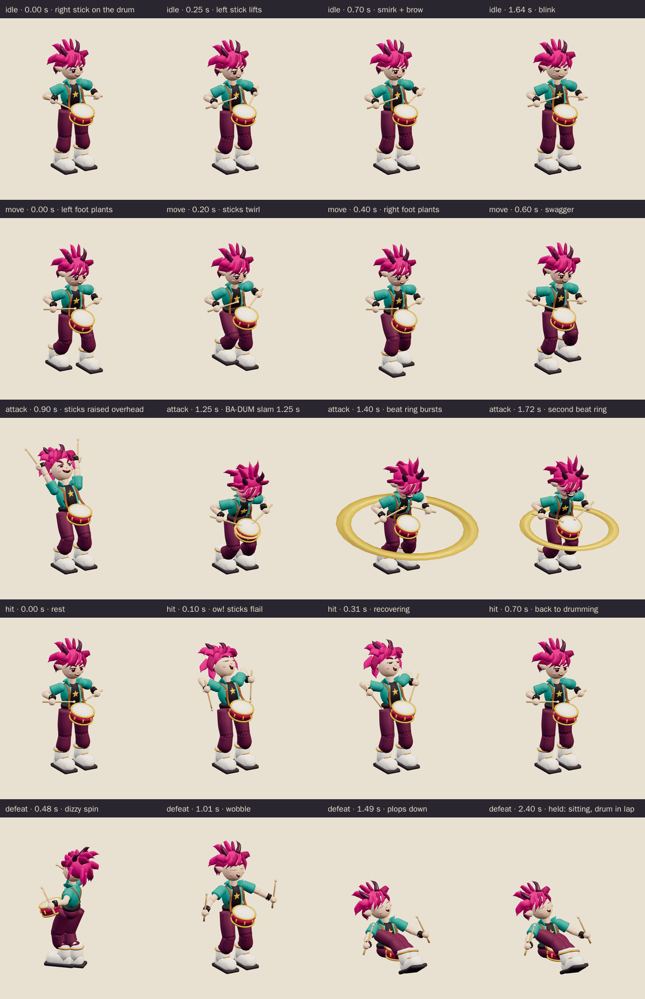

<figure>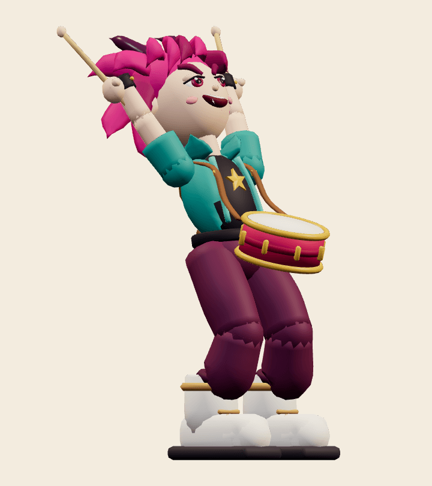<figcaption>Windup, 0.9 s</figcaption></figure>
<figure>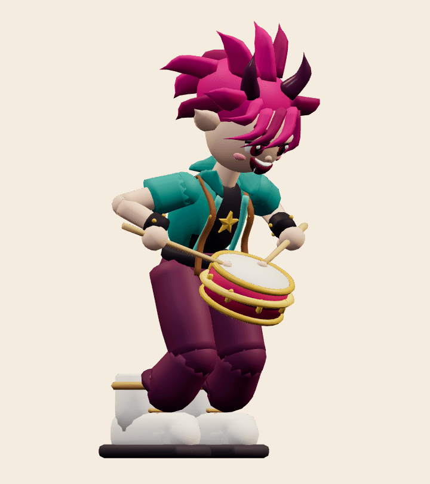<figcaption>Contact, 1.25 s</figcaption></figure>
<figure>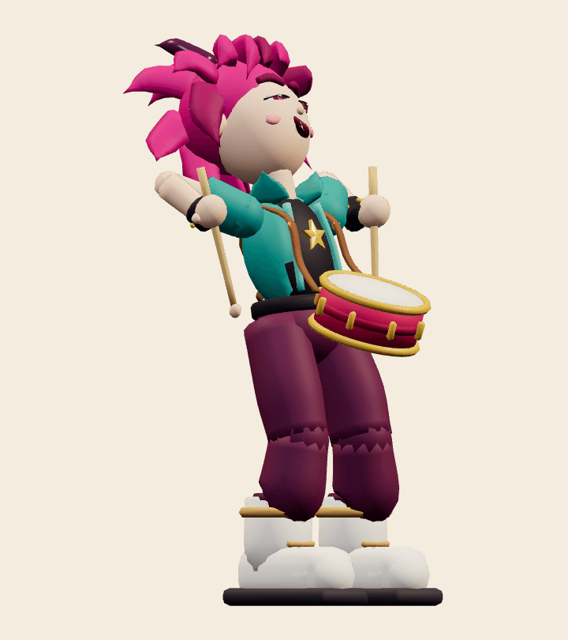<figcaption>Hit</figcaption></figure>
<figure>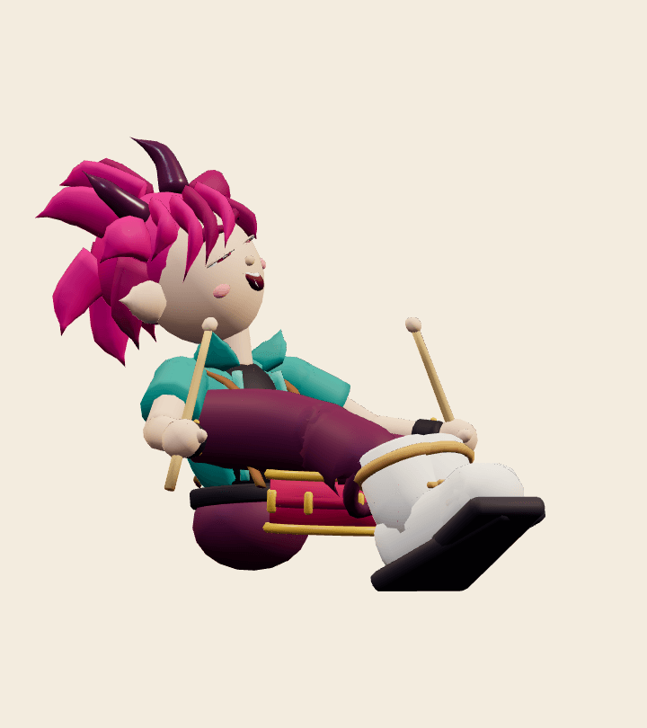<figcaption>Held defeat</figcaption></figure>

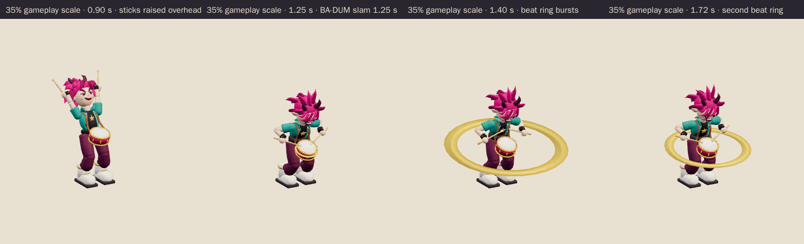

## Technical checks

| Check | Result |
| --- | --- |
| Khronos glTF Validator 2.0.0-dev.3.10 | 0 errors, 0 warnings, 0 infos, 0 hints ([report](../../media/demon-idol-drummer/v001/validation.json)) |
| Runtime file | `demon-idol-drummer.glb`, 1,174,024 bytes, SHA-256 `a2d4a6bd…8c1610b` |
| Editable master | `demon-idol-drummer.blend`, 795,250 bytes, SHA-256 `b2cacb15…b74380` |
| Geometry | 17,946 triangles, 9,213 vertices; 2 vertex-coloured materials (matte, gloss); no image textures |
| Rig | 27 joints, one influence per vertex (rigid parts); constant identity `root` bone; no root motion |
| Scale and facing | 1.570 m to the horn tips; boots centred on the origin; faces glTF −Z like the other enemies |
| three.js r186 + `src/game/enemy-animation.ts` | All tracks bind below the scene root. Every vertex was sampled at 60 Hz in every clip: nothing goes below the floor, and the exported culling envelope covers every pose, including the open beat ring. Idle and move loops are seamless. The ring is closed at idle and windup and opens to about 7.5× at the contact burst. The windup holds the exact 1.25 s contact pose and defeat vanishes ([report](../../media/demon-idol-drummer/v001/three-inspection.json)). |
| Chromium WebGL (SwiftShader), ACES tone mapping as in the game | 2 character draw calls. Every clip changes the raster at full and 35% scale. Realtime playback of all clips at both scales had no console, HTTP or WebGL errors ([report](../../media/demon-idol-drummer/v001/browser-inspection.json)). |

Browser emulation is not physical-device evidence; iPhone/iPad play remains the
owner's acceptance gate. The beat ring's open radius is about 0.8 m. It is a
visual cue only and does not define the attack range.

## Coordinator intake and iteration

- **Reviewed by / date:** pending coordinator intake.
- **Iteration so far:** the head group was enlarged for the concept's chibi
  proportions. The first internal draft's narrow stance, straight pants and small
  boots were widened and enlarged to match the concept before delivery. Only the
  corrected export is delivered.
- **Selected for Tom's review:** pending coordinator decision.
