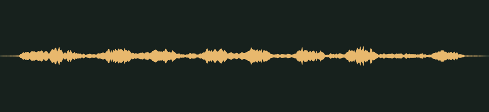

# Laughter down the hall · v001

**Audio candidate · scary moments · not yet in the game · listening review pending.** A broken animatronic laughing to itself somewhere far away, with no words.

## Audition

<audio controls preload="none" aria-label="Audition distant-laugh version one">
  <source src="../../media/distant-laugh/v001/cue.wav" type="audio/wav">
  <a href="../../media/distant-laugh/v001/cue.wav">Download the processed cue</a>
</audio>

[Processed cue](../../media/distant-laugh/v001/cue.wav) · [Original five-second take](../../media/distant-laugh/v001/source.wav)

## Exact version

| Property | Measured result |
| --- | --- |
| Stable cue / version | `distant-laugh` / `v001` |
| Duration | 1.50 seconds |
| Format | PCM signed 16-bit WAV, stereo, 44.1 kHz |
| Download size | 264,644 bytes |
| Peak / RMS | -14.0 / -28.742 dBFS |
| Clipped samples | 0 |
| Processed SHA-256 | `86721f34a4e11b8706ec3aae9eabaeb0715cd0d9498ccf171f037e86f8fdc73a` |
| Source SHA-256 | `15e0a8eecf3ea8f3755ae49cd59e39b99562c449528fb210cb343bd730f0a465` |

Processing selects the segment beginning at 0.140 seconds, trims it to the stated duration, applies a 0.020-second entrance and 0.200-second exit fade, then normalizes its peak to -14 dBFS, below the other one-shots, because the laugh should sound far away. It is a one-shot cue, not a loop. The source is preserved separately. [Exact recipe](../../media/distant-laugh/v001/processing.json), [measurements](../../media/distant-laugh/v001/verification.json), and [reproducible processing script](../../../../scripts/assets/audio/process_cues.py).

## Source and checks

Generated on 2026-09-26 by a Claude Code subagent (Opus 5.5) from the workflow coordinator's cue brief, using the separate Stable Audio 3 Small-SFX CPU service (service version 0.2.0). This take used seed 314, eight steps and five seconds. It contains no supplied recording or personal reference. The [provenance record](../../media/distant-laugh/v001/provenance.json) retains the complete prompt, service/model revisions, every other attempt and the source terms recorded in [DESIGN-008](../../../designs/008-audio-pipeline.md). The source code, model and redistributed text component have separate terms; no broader license is asserted here.

The service and download SHA-256 checks passed, as did WAV decoding and the exact-duration, non-silence and zero-clipping checks. Re-running the processing script reproduced the same output. These measurements do not establish timbre or musical quality.

## Listen-proxy check

Nobody has listened to this take; the agent cannot hear audio. Instead, it measured the source's level in 20 ms windows, a rough autocorrelation pitch track, the zero-crossing rate and a four-band energy split, and chose the segment from those numbers. The cue holds eight short pulses, 0.12 to 0.25 seconds apart, at 0.17, 0.37, 0.49, 0.64, 0.77, 0.92, 1.10 and 1.35 seconds. The level drops by about 4 to 14 dB between them. Each pulse has a low fundamental between about 160 and 280 Hz and strong energy between 800 Hz and 1 kHz, a pattern typical of a voice-like laugh. There is almost nothing above 4 kHz, which fits a distant, muffled source. The last pulse falls under the exit fade; in the source take the laugh carries on, slowing and fading, for about two more seconds.

Energy split of the processed cue: 23.2% below 300 Hz, 64.4% at 300 Hz–1 kHz, 12.1% at 1–4 kHz and 0.2% above 4 kHz. These numbers hint at shape and brightness; they cannot say how the cue sounds. The prompt excluded words and speech, but only listening can confirm that the cue sounds like a laugh and contains no word-like syllables.

## Coordinator and owner review

Review focus: Whether it sounds like a mechanical laugh from far away, with no words, and whether it is creepy at this low level.

- **Coordinator technical intake:** Passed numerically; listening/creative selection pending.
- **Tom’s decision:** Pending, against the exact hash above.
- **Gameplay integration:** Registered in the game's scare cue manifest for [DESIGN-027](../../../designs/027-scare-pass.md) random ambience at scare level 2. No game event plays it yet. At gain 1.0 it peaks near -15.9 dBFS at the default master, below the one-shots so it sounds distant, with a low priority and one instance at a time. [DESIGN-008](../../../designs/008-audio-pipeline.md#scary-moments-cues) records the manifest; the inventory records it as a private candidate.

## Retained attempts

The first take was not selected. Its pulses are less distinct, since the level between them stays within about 5 to 10 dB of the peaks, and its rough pitch track jumps between about 200 and 880 Hz. The second prompt asked for a slow, deep laugh that sags like a dying battery; its evenly spaced pulses slow down as the take goes on, which fits the brief more closely.

- [Source attempt 1](../../media/distant-laugh/v001/source-attempt-1.wav) (seed 304) with its [measurements](../../media/distant-laugh/v001/source-attempt-1-verification.json)

The prompts, seeds and job IDs of every attempt are in the provenance record. These decisions rest on measurements, not on listening.
