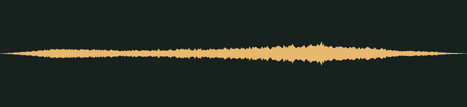

# One more hop · v001

**Audio candidate · family world mechanics · not yet in the game · listening review pending.** A quick, airy whoosh with a small sparkle for a second jump in mid-air.

## Audition

<audio controls preload="none" aria-label="Audition double-jump-whoosh version one">
  <source src="../../media/double-jump-whoosh/v001/cue.wav" type="audio/wav">
  <a href="../../media/double-jump-whoosh/v001/cue.wav">Download the processed cue</a>
</audio>

[Processed cue](../../media/double-jump-whoosh/v001/cue.wav) · [Original five-second take](../../media/double-jump-whoosh/v001/source.wav)

## Exact version

| Property | Measured result |
| --- | --- |
| Stable cue / version | `double-jump-whoosh` / `v001` |
| Duration | 0.45 seconds |
| Format | PCM signed 16-bit WAV, stereo, 44.1 kHz |
| Download size | 79,424 bytes |
| Peak / RMS | -12.0 / -28.499 dBFS |
| Clipped samples | 0 |
| Processed SHA-256 | `bfef347311b767f83405e2dde0c32461a9c1c282e56d3ce649886056ab91ac87` |
| Source SHA-256 | `a4eba5500c6fef4a98d5c730a58a7f2d170320778c47178893d5335bf5cbf9b6` |

Processing selects the segment beginning at 0.780 seconds, trims it to the stated duration, applies a 0.050-second entrance and 0.150-second exit fade, then normalizes its peak. It is a one-shot cue, not a loop. The source is preserved separately. [Exact recipe](../../media/double-jump-whoosh/v001/processing.json), [measurements](../../media/double-jump-whoosh/v001/verification.json), and [reproducible processing script](../../../../scripts/assets/audio/process_cues.py).

## Source and checks

Generated on 2026-09-26 by a Claude Code subagent (Opus 5.5) from the workflow coordinator's cue brief, using the separate Stable Audio 3 Small-SFX CPU service (service version 0.2.0). This take used seed 204, eight steps and five seconds. It contains no supplied recording or personal reference. The [provenance record](../../media/double-jump-whoosh/v001/provenance.json) retains the complete prompt, service/model revisions and the source terms recorded in [DESIGN-008](../../../designs/008-audio-pipeline.md). The source code, model and redistributed text component have separate terms; no broader license is asserted here.

The service and download SHA-256 checks passed, as did WAV decoding and the exact-duration, non-silence and zero-clipping checks. Re-running the processing script reproduced the same output. These measurements do not establish timbre or musical quality.

## Listen-proxy check

Nobody has listened to this take; the agent cannot hear audio. Instead, it measured the source's level in 20 ms windows, a rough autocorrelation pitch track, the zero-crossing rate and a four-band energy split, and chose the segment from those numbers. The take is one long whoosh. It swells from 0.2 seconds to a peak at 1.08 seconds and has faded by 3 seconds. The selected 0.45 seconds starts during the swell at 0.78 seconds, which includes the brightest part of the take, and passes the peak. A 50 ms entrance fade softens the cut into the swell. The pitch track shows no separate pitched sparkle.

Energy split of the processed cue: 0.1% below 300 Hz, 0.2% at 300 Hz–1 kHz, 3.6% at 1–4 kHz and 96.0% above 4 kHz. These numbers hint at shape and brightness; they cannot say how the cue sounds.

## Coordinator and owner review

Review focus: Whether the whoosh feels quick and light, and whether any sparkle is audible or should be requested more strongly in a later take.

- **Coordinator technical intake:** Passed numerically; listening/creative selection pending.
- **Tom’s decision:** Pending, against the exact hash above.
- **Gameplay integration:** None yet. The game’s cue map does not reference this file; wiring it to the double jump is a separate step. The inventory records it as a private candidate for the family worlds.
