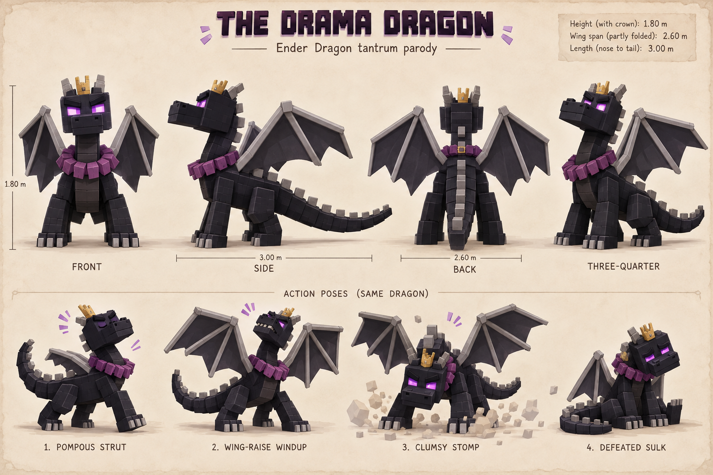
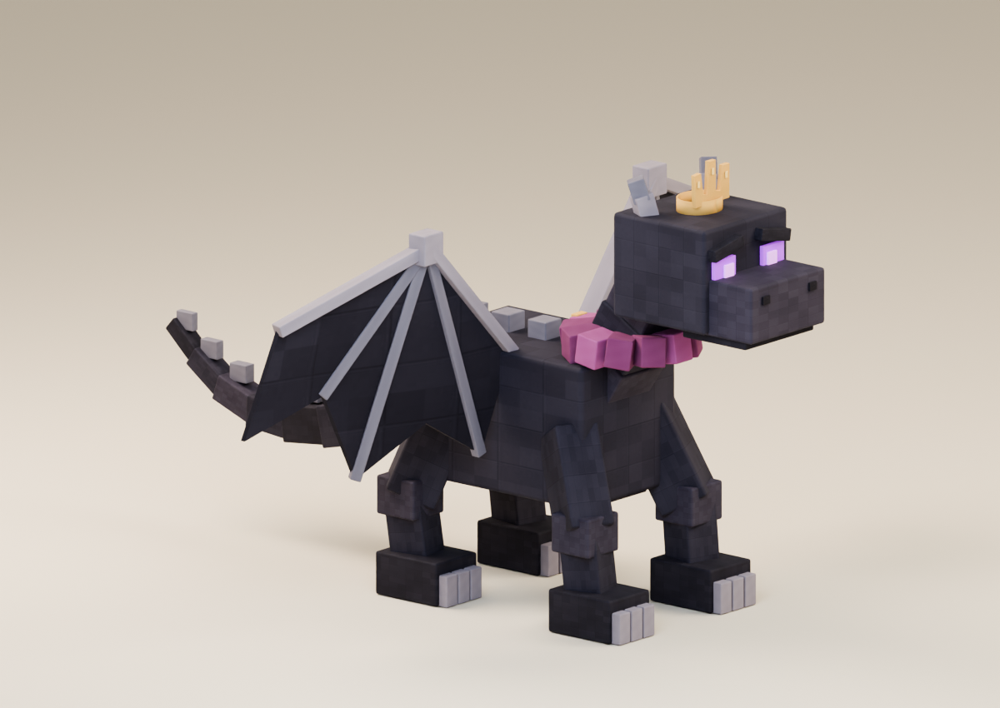
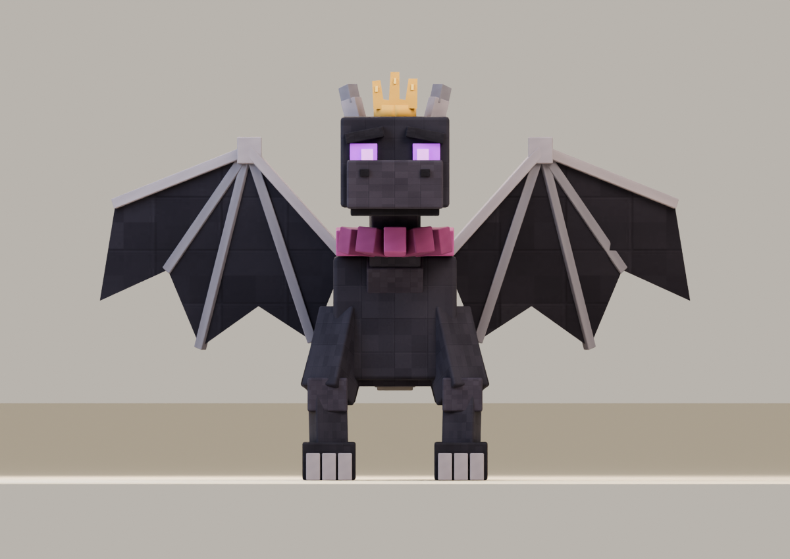
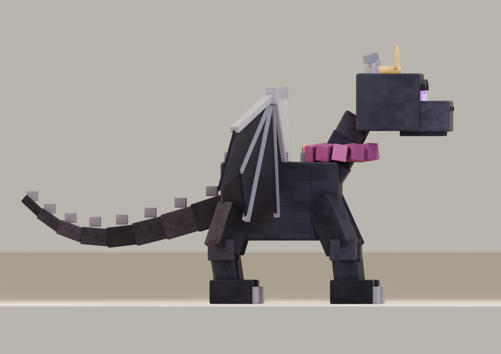
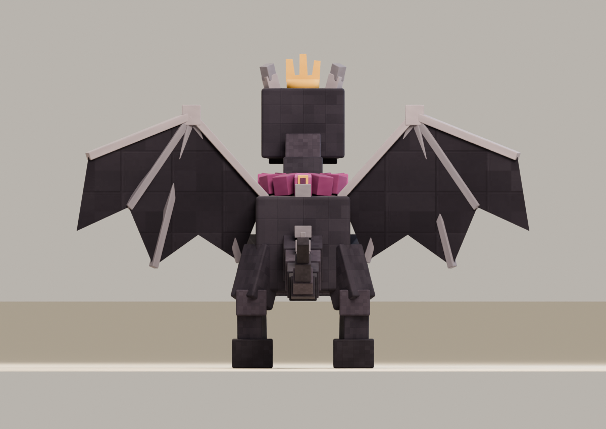

# The Drama Dragon

**Recognizable Ender Dragon parody · v001 model candidate · Tom’s review pending**

A tiny crown and an enormous sense of importance turn the familiar dragon into a pompous party performer. He expects applause for every stomp.

## Concept and exported model

<figure><figcaption>Selected construction reference.</figcaption></figure>
<figure><figcaption>Exact v001 GLB, re-imported for this render.</figcaption></figure>

Four distinct legs, two angular wings, a segmented tail and purple eyes preserve the recognizable silhouette. The plum ruff wraps around the neck and closes with a visible rear clasp. The side view makes the long tail and its connection clear; the front view alone hides the rear legs.

<model-viewer src="../../media/drama-dragon/v001/drama-dragon.glb" poster="../../media/drama-dragon/v001/front.png" alt="Orbit The Drama Dragon" camera-controls touch-action="pan-y" data-quest-clips shadow-intensity="0.7" camera-orbit="155deg 75deg auto"></model-viewer>

[Download model](../../media/drama-dragon/v001/drama-dragon.glb) · [Exact manifest and editable sources](../../media/drama-dragon/v001/manifest.json) · [Concept prompt](../../media/drama-dragon/v001/prompt.txt) · [Concept provenance](../../media/drama-dragon/v001/concept-provenance.json)

<figure><figcaption>Front</figcaption></figure>
<figure><figcaption>Side</figcaption></figure>
<figure><figcaption>Back</figcaption></figure>

## Motion and encounter

<video controls playsinline preload="metadata" poster="../../media/drama-dragon/v001/motion-grid.png" aria-label="The Drama Dragon five-clip reel"><source src="../../media/drama-dragon/v001/animations.mp4" type="video/mp4"><a href="../../media/drama-dragon/v001/animations.mp4">Download motion reel</a></video>

Clear the two ordinary encounters to wake the boss. His exaggerated preparation leads into a stomp, followed by a chance to strike. He sits down to sulk when defeated. Only then does the player open and consume the released memories to grow.

The viewer offers **idle, move, attack, hit and defeat**. The attack lasts 2.0 seconds, with contact at 1.25 seconds. The game controls movement and the world root stays fixed; one-shot clips hold their final pose. No sound is embedded.

[Idle](../../media/drama-dragon/v001/idle.mp4) · [Move](../../media/drama-dragon/v001/move.mp4) · [Attack](../../media/drama-dragon/v001/attack.mp4) · [Hit](../../media/drama-dragon/v001/hit.mp4) · [Defeat](../../media/drama-dragon/v001/defeat.mp4) · [Turntable](../../media/drama-dragon/v001/turntable.mp4)

## Exact candidate

| Check | Result |
| --- | --- |
| Dimensions | 1.80 m high; 2.60 m wing span, 3.00 m nose to tail |
| Coordinates | Meters, Y-up, forward −Z, feet at ground level |
| Geometry | 11,960 triangles; 3 opaque material primitives; 29 joints |
| Download | 917,980 bytes; embedded textures, no external resources |
| SHA-256 | `13c6cb5185385f85cda2e16027ad201a2ea1e2a4ad0f5eb7a13cba9d073fa933` |

[Format validation](../../media/drama-dragon/v001/validation.json) · [Construction](../../media/drama-dragon/v001/construction.json) · [Rig and ground checks](../../media/drama-dragon/v001/rig-ground-inspection.json) · [Three.js checks](../../media/drama-dragon/v001/three-inspection.json) · [Browser evidence](../../media/drama-dragon/v001/browser-inspection.json)

All 110 named construction parts survive the actual export and re-import with their bone assignments. The author checked physical attachment intersections, articulated seams, floor contact and clip playback. Format and isolated browser checks passed. The review videos are 20 fps H.264 captures; these are not physical-device performance measurements.

## Source and review

A fresh native GPT-6 Astra at max authored this original model from the lead’s serially generated concept. No family references or downloaded models/textures were used. Editable masters remain on the authoring PVC, with exact source paths and hashes in the manifest. [Production evidence](../../../../.agents/work-orders/028-blender-block-party-pair-evidence.md).

[Primary-source period research](../../../../.agents/work-orders/022-parody-period-evidence.md) places this reference before the opening 2020 period and distinguishes availability from popularity. The lead inspected and selected the actual construction and motion poses. Owner approval, combined gameplay delivery and physical iPhone/iPad testing are separate checks. This model has not entered the private live game.

**Tom’s decision:** Pending.
