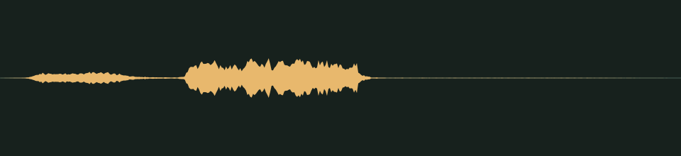

# Poof, gone · v001

**Audio candidate · family world mechanics · not yet in the game · listening review pending.** A cartoon puff with a little squeak for an enemy's defeat.

## Audition

<audio controls preload="none" aria-label="Audition enemy-poof version one">
  <source src="../../media/enemy-poof/v001/cue.wav" type="audio/wav">
  <a href="../../media/enemy-poof/v001/cue.wav">Download the processed cue</a>
</audio>

[Processed cue](../../media/enemy-poof/v001/cue.wav) · [Original five-second take](../../media/enemy-poof/v001/source.wav)

## Exact version

| Property | Measured result |
| --- | --- |
| Stable cue / version | `enemy-poof` / `v001` |
| Duration | 0.60 seconds |
| Format | PCM signed 16-bit WAV, stereo, 44.1 kHz |
| Download size | 105,884 bytes |
| Peak / RMS | -11.0 / -26.771 dBFS |
| Clipped samples | 0 |
| Processed SHA-256 | `b4ae4aa1bc598ef7ebe9e42296dedbe83e799532045ed3cfc45c1cf9da339712` |
| Source SHA-256 | `c07724e57353714822491dc93d1996d84ff35ee4bcd6350bec65e1794d769015` |

Processing selects the segment beginning at 0.080 seconds, trims it to the stated duration, applies a 0.010-second entrance and 0.100-second exit fade, then normalizes its peak. It is a one-shot cue, not a loop. The source is preserved separately. [Exact recipe](../../media/enemy-poof/v001/processing.json), [measurements](../../media/enemy-poof/v001/verification.json), and [reproducible processing script](../../../../scripts/assets/audio/process_cues.py).

## Source and checks

Generated on 2026-09-26 by a Claude Code subagent (Opus 5.5) from the workflow coordinator's cue brief, using the separate Stable Audio 3 Small-SFX CPU service (service version 0.2.0). This take used seed 208, eight steps and five seconds. It contains no supplied recording or personal reference. The [provenance record](../../media/enemy-poof/v001/provenance.json) retains the complete prompt, service/model revisions, every other attempt and the source terms recorded in [DESIGN-008](../../../designs/008-audio-pipeline.md). The source code, model and redistributed text component have separate terms; no broader license is asserted here.

The service and download SHA-256 checks passed, as did WAV decoding and the exact-duration, non-silence and zero-clipping checks. Re-running the processing script reproduced the same output. These measurements do not establish timbre or musical quality.

## Listen-proxy check

Nobody has listened to this take; the agent cannot hear audio. Instead, it measured the source's level in 20 ms windows, a rough autocorrelation pitch track, the zero-crossing rate and a four-band energy split, and chose the segment from those numbers. A short airy puff, 0.02–0.11 seconds into the cue, is followed by a steady squeak near 1.2 kHz from 0.16 to 0.31 seconds, then silence. The squeak is the loudest part; the puff is about 10 dB quieter.

Energy split of the processed cue: 0.5% below 300 Hz, 3.7% at 300 Hz–1 kHz, 29.0% at 1–4 kHz and 66.8% above 4 kHz. These numbers hint at shape and brightness; they cannot say how the cue sounds.

## Coordinator and owner review

Review focus: Whether the defeat feels satisfying, and whether the puff is strong enough next to the squeak.

- **Coordinator technical intake:** Passed numerically; listening/creative selection pending.
- **Tom’s decision:** Pending, against the exact hash above.
- **Gameplay integration:** None yet. The game’s cue map does not reference this file; wiring it to enemy defeats is a separate step. The inventory records it as a private candidate for the family worlds.

## Retained attempts

The first take was usable. Two more were generated to look for a stronger puff, and neither was selected. The second is a slow hiss swell that ends in an abrupt thump, followed by warbling noise, and contains no clean 0.6-second poof. The third is a run of short, low pillow thumps that sounds like repeated pops rather than one poof, and starts at the first frame.

- [Source attempt 2](../../media/enemy-poof/v001/source-attempt-2.wav) (seed 218) with its [measurements](../../media/enemy-poof/v001/source-attempt-2-verification.json)
- [Source attempt 3](../../media/enemy-poof/v001/source-attempt-3.wav) (seed 228) with its [measurements](../../media/enemy-poof/v001/source-attempt-3-verification.json)

The prompts, seeds and job IDs of every attempt are in the provenance record. These decisions rest on measurements, not on listening.
