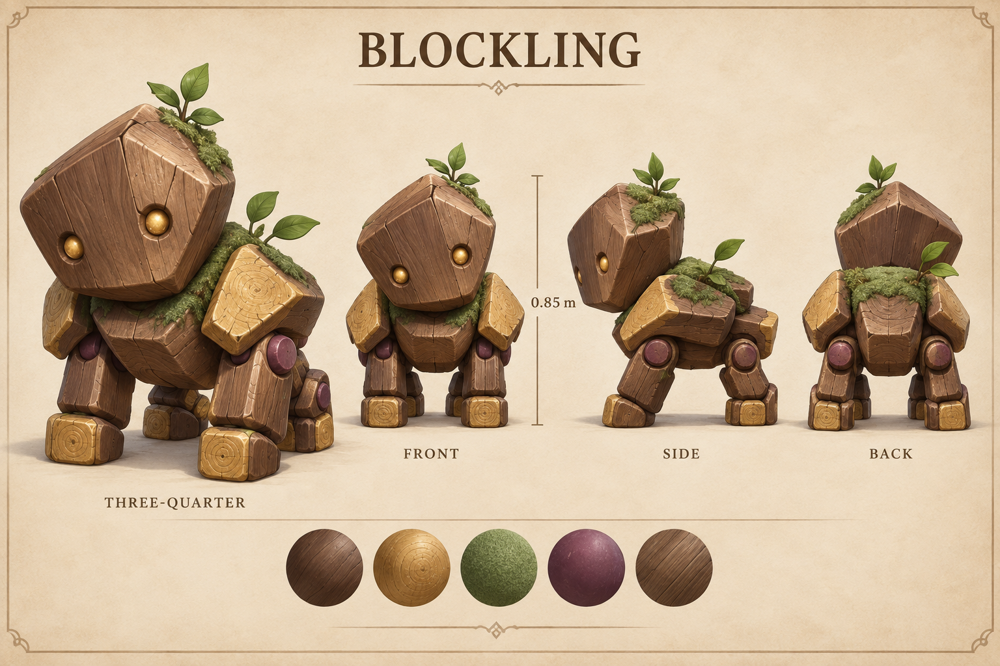
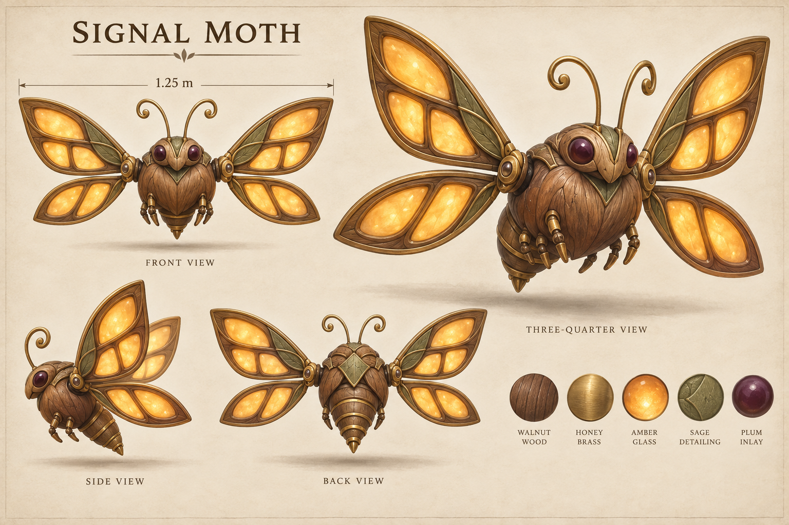
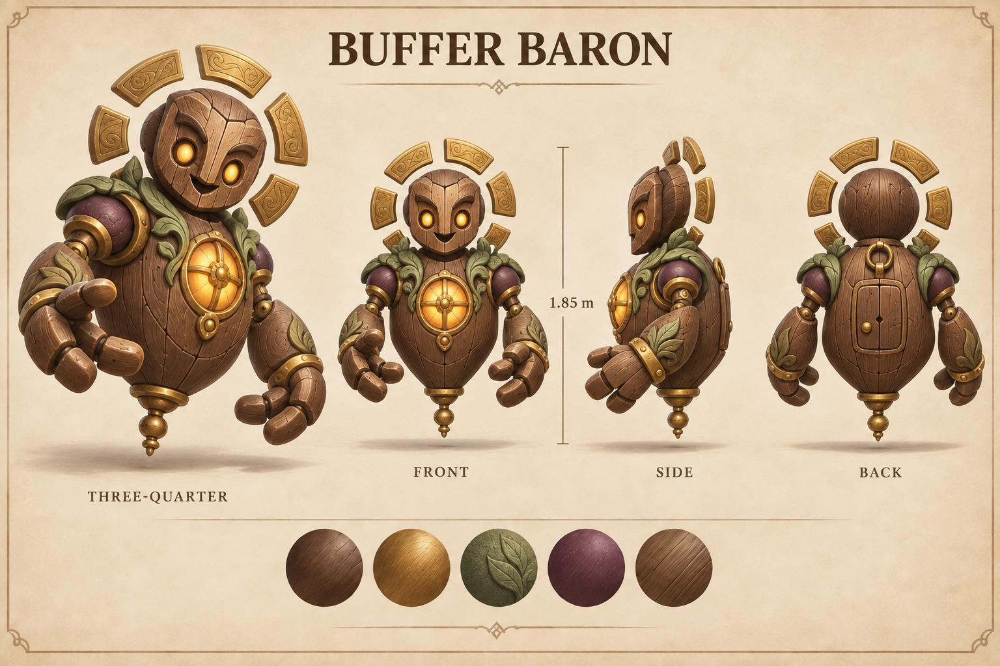
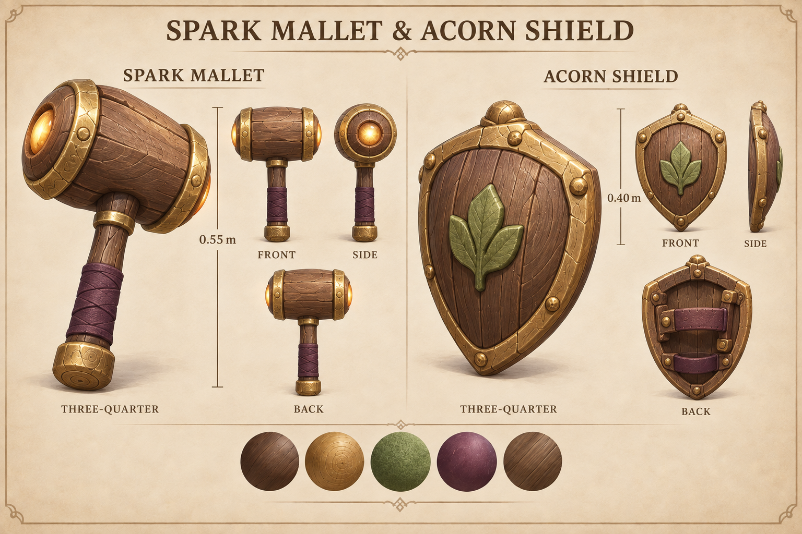
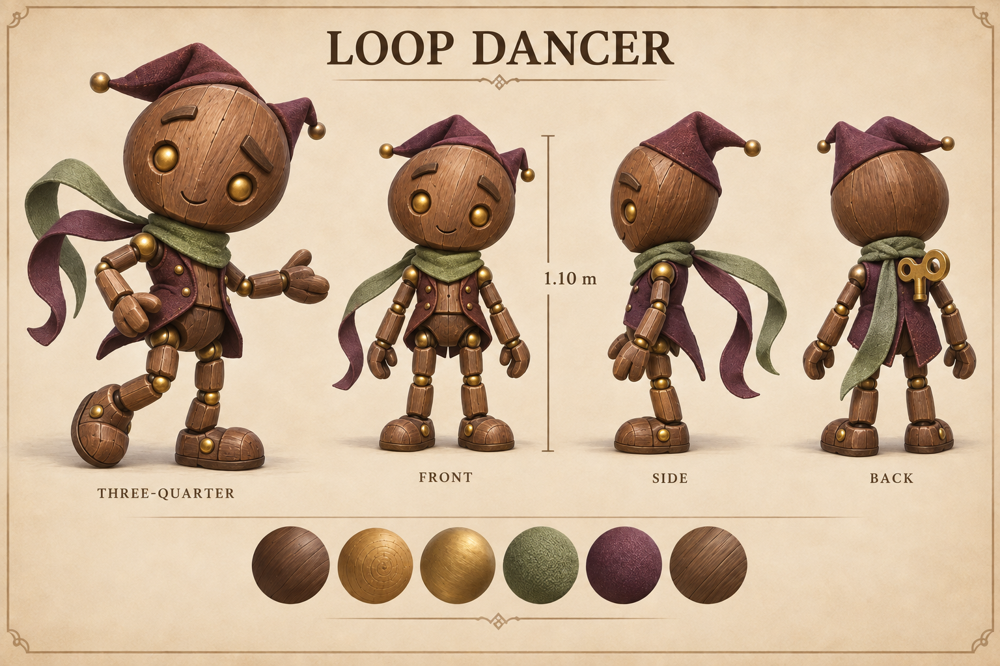
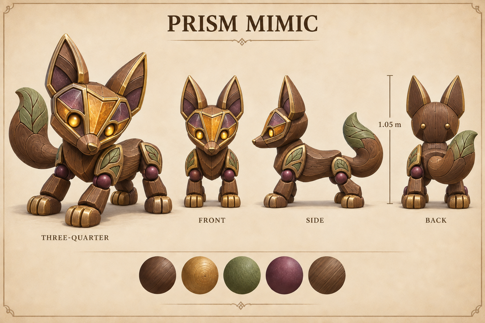
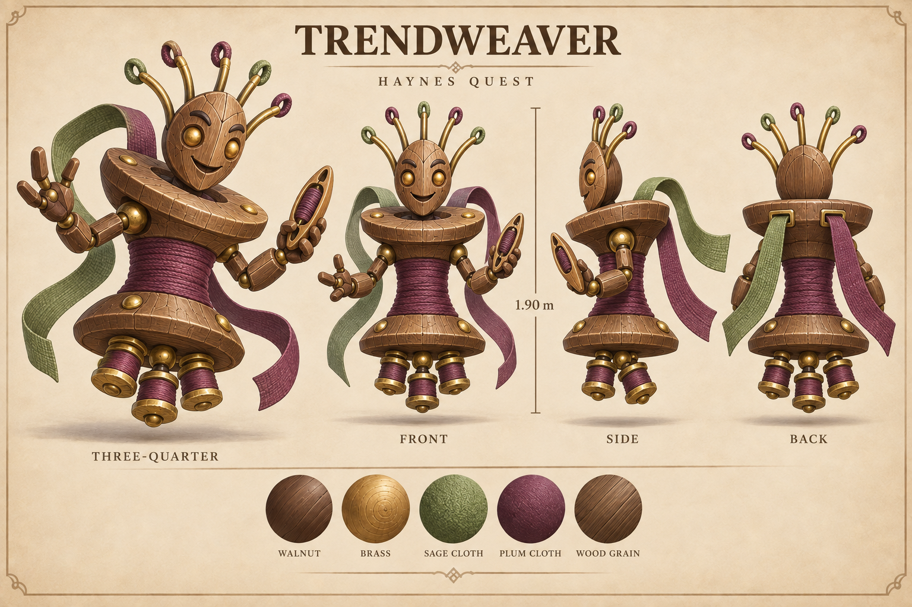
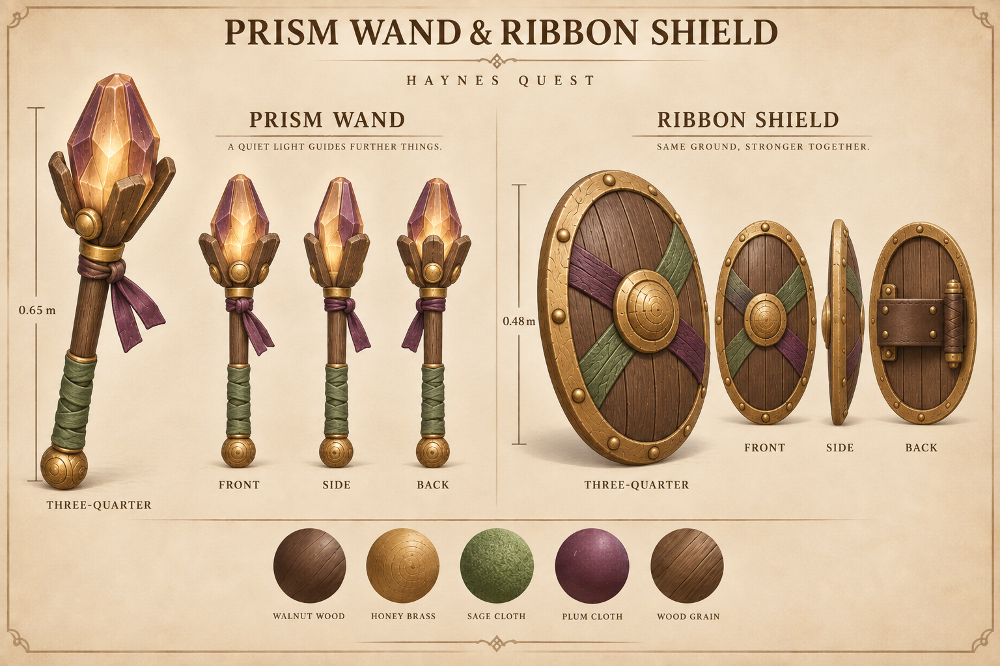

# Equipment and creatures for two eras

These eight concept sheets define six original enemies and four useful tools for the corrected playable slice. The lead selected them for construction on September 11, 2026. They share carved walnut, honey brass, sage and plum with the existing traveler and clearing kit.

**Concepts only.** No Blender model, animation export or owner approval exists for these new entries. The local game currently uses temporary model studies. These illustrations are construction references; they are not screenshots of the game or promises that the game already looks like this.

## The Pixel Orchard · 2020

Block-building play and livestream culture inform this fictional orchard’s creatures. These are original interpretations of those influences, not licensed game characters. The roster’s date references and limits are in [DESIGN-005](../../../designs/005-era-enemy-catalog.md).

### Blockling

A forward-heavy wooden quadruped with an oversized tilted head, four short legs and mossy joints. The selected construction is four-footed even where an illustration obscures a rear foot. Full height: 0.85 m.

[Prompt](../../media/blockling/v001/prompt.txt) · [Exact concept provenance](../../media/blockling/v001/concept-provenance.json)

### Signal Moth

Four broad leaf-shaped wings frame a small hovering walnut body. Amber panes evoke streaming windows without literal screens or logos. Wingspan: 1.25 m; posed hover envelope: 0.90 m high.

[Prompt](../../media/signal-moth/v001/prompt.txt) · [Exact concept provenance](../../media/signal-moth/v001/concept-provenance.json)

### Buffer Baron · boss

A floating lantern guardian with a carved face, amber chest light, two articulated arms and six separate brass halo segments. Its underside hangs clear of the ground. Full posed height: 1.85 m.

[Prompt](../../media/buffer-baron/v001/prompt.txt) · [Exact concept provenance](../../media/buffer-baron/v001/concept-provenance.json)

### Spark Mallet and Acorn Shield

The mallet gives the traveler a way to attack; the shield softens incoming blows while guarding. The mallet is 0.55 m long. The shield is 0.40 m high, with an actual grip and forearm strap on the back.

[Prompt](../../media/era-equipment/v001/starter-prompt.txt) · [Exact equipment provenance](../../media/era-equipment/v001/concept-provenance.json)

## The Ribbon Fair · 2024

Looping dance, visual filters and remix culture inform the fair’s cast. Equipment improves as the traveler enters this period, while earlier abilities and collected gear remain saved.

### Loop Dancer

A carved puppet with two arms, two legs, a winding key and two flowing scarf tails. Its distinct dance wind-up should announce an attack before contact. Full height: 1.10 m.

[Prompt](../../media/loop-dancer/v001/prompt.txt) · [Exact concept provenance](../../media/loop-dancer/v001/concept-provenance.json)

### Prism Mimic

A four-footed wooden fox with one curled tail and a mask of amber and plum facets. Back-of-head rivets are construction details, not a second face. Height to ear tips: 1.05 m.

[Prompt](../../media/prism-mimic/v001/prompt.txt) · [Exact concept provenance](../../media/prism-mimic/v001/concept-provenance.json)

### Trendweaver · boss

A floating thread-spool guardian with two arms, five crown arches, two ribbon tails and three small bobbins beneath its body. The shuttle belongs in its left hand. Full posed height: 1.90 m.

[Prompt](../../media/trendweaver/v001/prompt.txt) · [Exact concept provenance](../../media/trendweaver/v001/concept-provenance.json)

### Prism Wand and Ribbon Shield

The wand replaces the mallet as the stronger equipped attack tool. The larger shield improves guarding. The wand is 0.65 m long; the shield is 0.48 m high. Its rear grip and forearm strap remain separate from the decorative front bands.

[Prompt](../../media/era-equipment/v001/later-prompt.txt) · [Exact equipment provenance](../../media/era-equipment/v001/concept-provenance.json)

## Construction and review still required

The concepts were generated serially with the built-in image tool and visually inspected by the lead. Generation model IDs and seeds were not returned and are not claimed. No family references or third-party meshes were used.

[WO-014](../../../../.agents/work-orders/014-blender-era-2020.md) records an initial task-capacity failure, followed by a successful fresh Astra authoring dispatch when a code lane completed. The 2020 creatures are now in production with one exclusive scene owner. Authoring must preserve these references, construct and animate the actual models, inspect re-imported exports and deliver exact-version review packages. Equipment needs measured grips and attachment transforms; enemies need readable idle, movement, attack, hit and defeat clips. The lead must then assess actual game captures before claiming visual acceptance.
