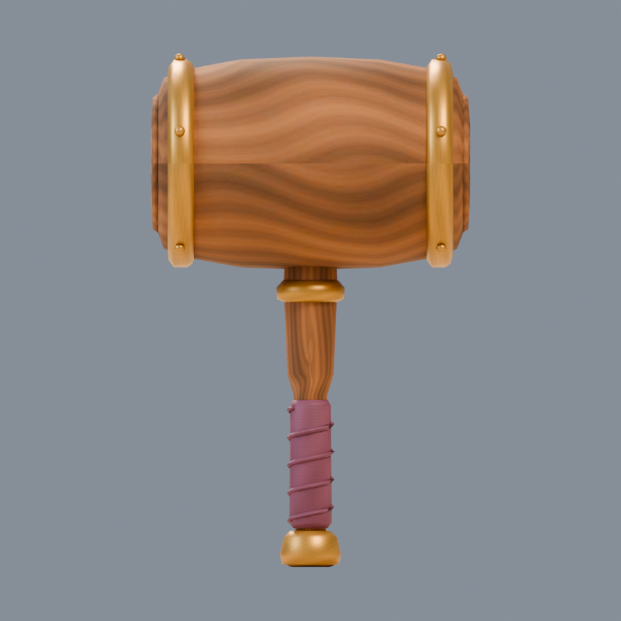
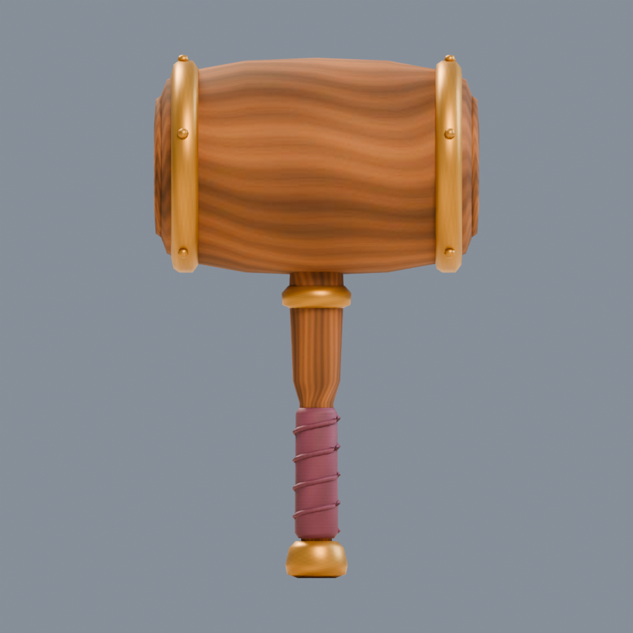
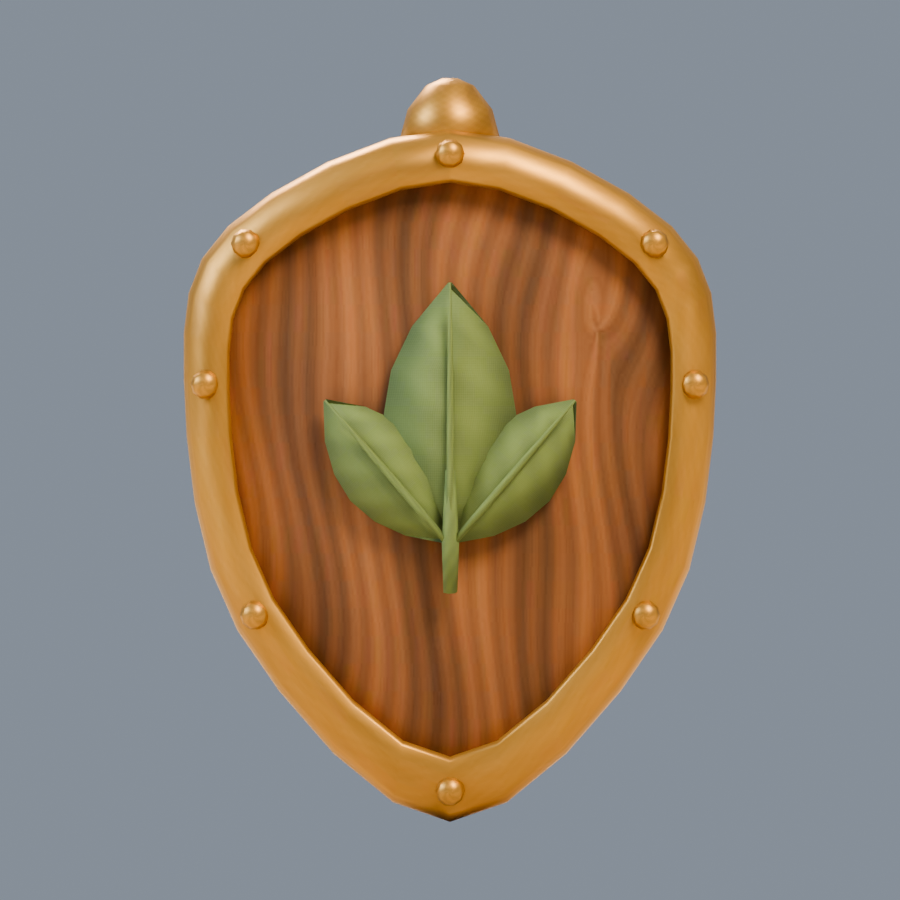
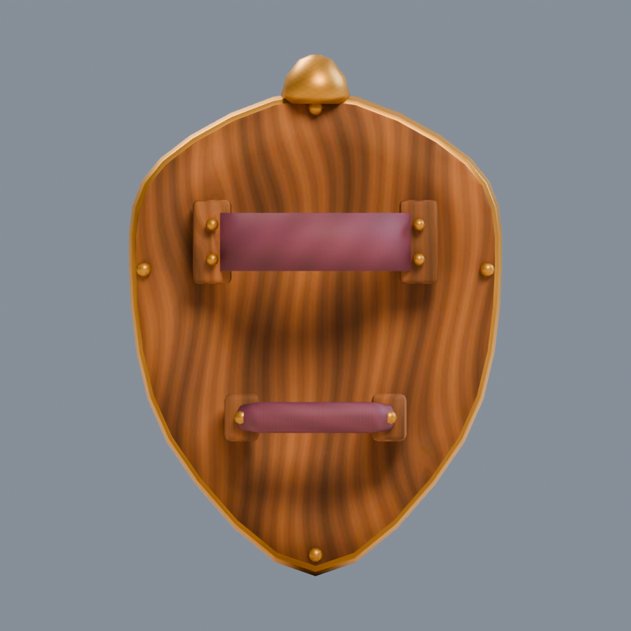
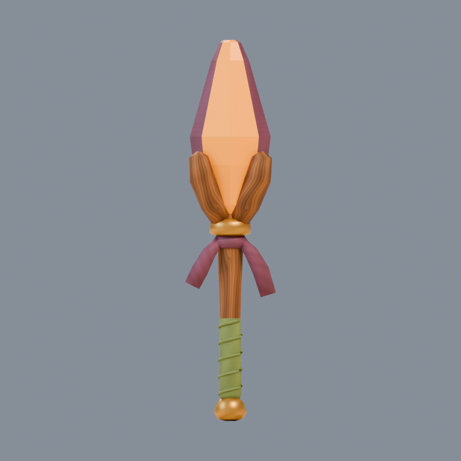
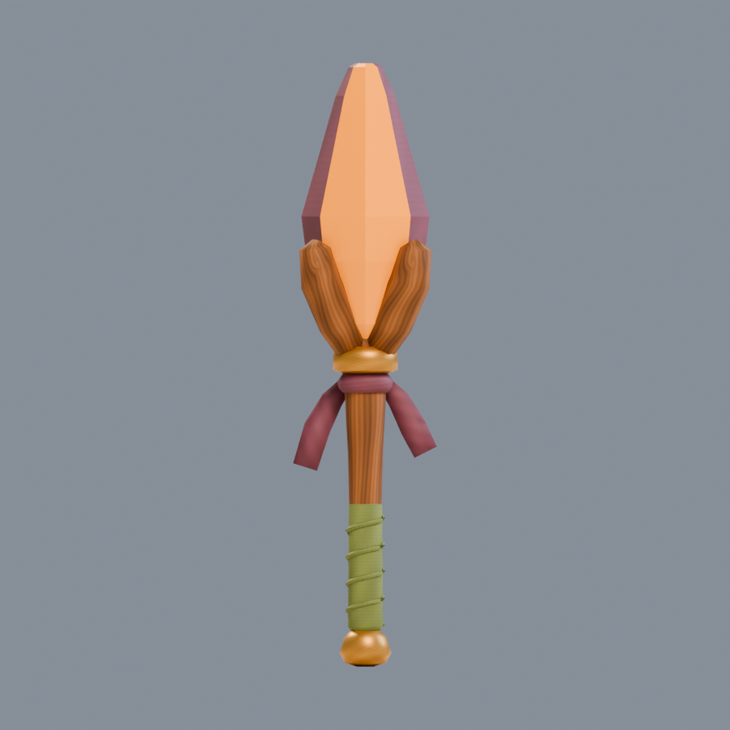
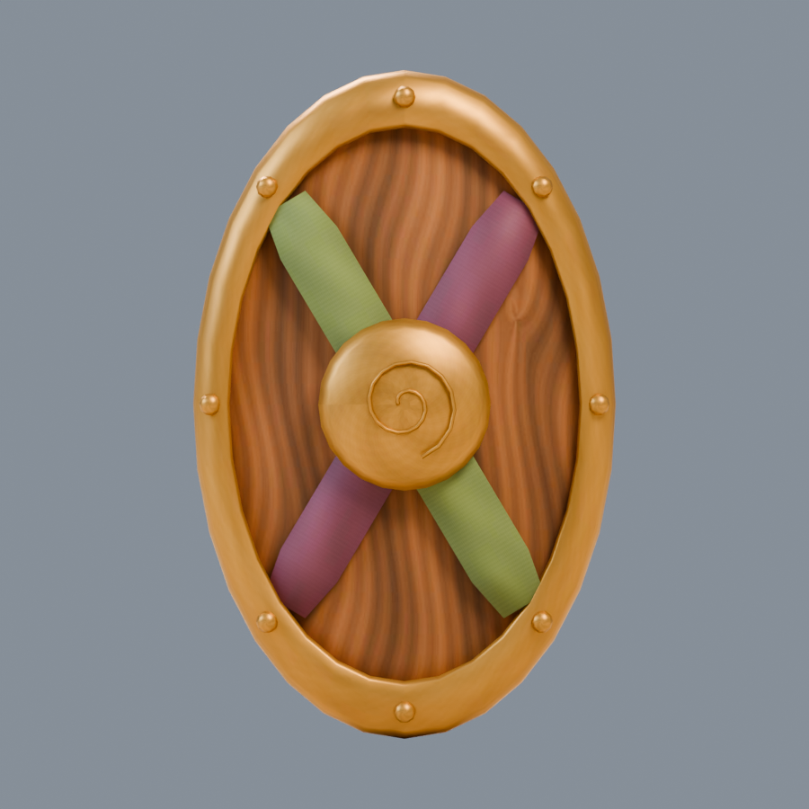
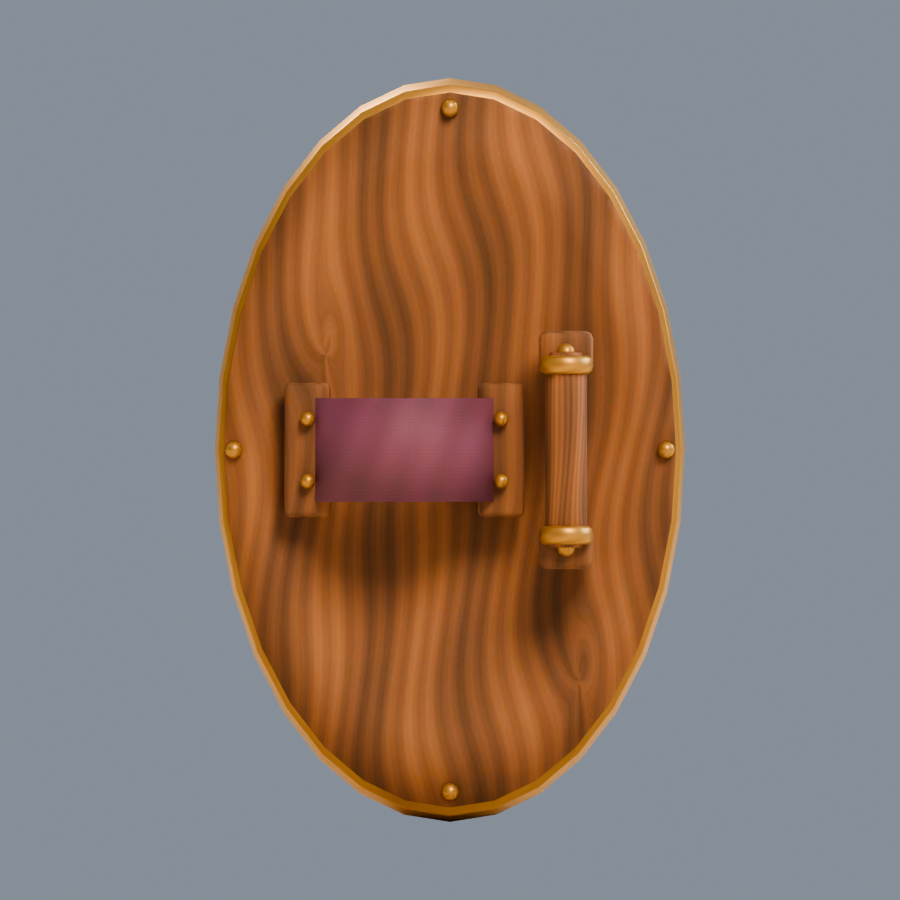

# Tools worth finding

**Four equipment candidates · v001 · Tom’s review pending**

The traveler finds these tools inside each period level. A stronger weapon makes attacks more effective; a better shield reduces damage while guarding. Equipment remains saved as the traveler grows.

These are the actual exported models. Each tool has a measured grip at its origin so the game can attach it to the traveler’s hand. The two shields have separate rear grips and forearm straps.

[Exact four-model manifest](../../media/era-equipment/v001/manifest.json)

## Construction references

<figure><figcaption>Pixel Orchard · 2020</figcaption></figure>
<figure><figcaption>Ribbon Fair · 2024</figcaption></figure>

[Starter prompt](../../media/era-equipment/v001/starter-prompt.txt) · [Later prompt](../../media/era-equipment/v001/later-prompt.txt) · [Concept provenance](../../media/era-equipment/v001/concept-provenance.json)

## Spark Mallet

A rounded wooden mallet with brass end bands, an amber inset and a plum wrapped handle. Its final wrap sits on the handle surface.

<model-viewer src="../../media/era-equipment/v001/spark-mallet/spark-mallet.glb" poster="../../media/era-equipment/v001/spark-mallet/beauty.png" alt="Orbit the Spark Mallet candidate and inspect its back" camera-controls touch-action="pan-y" shadow-intensity="0.7" camera-orbit="155deg 75deg auto"></model-viewer>

[Download model](../../media/era-equipment/v001/spark-mallet/spark-mallet.glb) · [Format validation](../../media/era-equipment/v001/spark-mallet/validation.json) · [Export inspection](../../media/era-equipment/v001/spark-mallet/reimport.json)

<figure><figcaption>Front of the exact export</figcaption></figure>
<figure><figcaption>Back of the exact export</figcaption></figure>

| Check | Result |
| --- | --- |
| Height | 0.55 m; meters, Y-up, forward −Z |
| Geometry | 3,728 triangles; 4 materials and primitives |
| Download | 161,872 bytes; embedded original pigment texture |
| SHA-256 | `f7d8607192a1634efd34fa27b708dcfc50cc8cb1185fe7eb5907f11b931b10ae` |

## Acorn Shield

A small walnut shield with an acorn emblem, a brass rim and usable rear fittings.

<model-viewer src="../../media/era-equipment/v001/acorn-shield/acorn-shield.glb" poster="../../media/era-equipment/v001/acorn-shield/beauty.png" alt="Orbit the Acorn Shield candidate and inspect its back" camera-controls touch-action="pan-y" shadow-intensity="0.7" camera-orbit="155deg 75deg auto"></model-viewer>

[Download model](../../media/era-equipment/v001/acorn-shield/acorn-shield.glb) · [Format validation](../../media/era-equipment/v001/acorn-shield/validation.json) · [Export inspection](../../media/era-equipment/v001/acorn-shield/reimport.json)

<figure><figcaption>Front of the exact export</figcaption></figure>
<figure><figcaption>Back of the exact export</figcaption></figure>

| Check | Result |
| --- | --- |
| Height | 0.40 m; meters, Y-up, forward −Z |
| Geometry | 3,624 triangles; 4 materials and primitives |
| Download | 184,460 bytes; embedded original pigment texture |
| SHA-256 | `2f499570f1579acc066e4b5b50ed91a6540daed799c245ec4f4038a99e3df1c6` |

## Prism Wand

A faceted amber-and-plum tip rests in four wooden cradle prongs. Two short ribbon tails sit above the sage hand wrap.

<model-viewer src="../../media/era-equipment/v001/prism-wand/prism-wand.glb" poster="../../media/era-equipment/v001/prism-wand/beauty.png" alt="Orbit the Prism Wand candidate and inspect its back" camera-controls touch-action="pan-y" shadow-intensity="0.7" camera-orbit="155deg 75deg auto"></model-viewer>

[Download model](../../media/era-equipment/v001/prism-wand/prism-wand.glb) · [Format validation](../../media/era-equipment/v001/prism-wand/validation.json) · [Export inspection](../../media/era-equipment/v001/prism-wand/reimport.json)

<figure><figcaption>Front of the exact export</figcaption></figure>
<figure><figcaption>Back of the exact export</figcaption></figure>

| Check | Result |
| --- | --- |
| Height | 0.65 m; meters, Y-up, forward −Z |
| Geometry | 2,076 triangles; 5 materials and primitives |
| Download | 143,444 bytes; embedded original pigment texture |
| SHA-256 | `5b4e4abc4989db3579a4240e002561a54952098515e759f30a1ef3c4a35ba1dc` |

## Ribbon Shield

Crossed sage and plum bands decorate the front. The rear grip and forearm strap are modeled separately; the band ends sit inside the rim.

<model-viewer src="../../media/era-equipment/v001/ribbon-shield/ribbon-shield.glb" poster="../../media/era-equipment/v001/ribbon-shield/beauty.png" alt="Orbit the Ribbon Shield candidate and inspect its back" camera-controls touch-action="pan-y" shadow-intensity="0.7" camera-orbit="155deg 75deg auto"></model-viewer>

[Download model](../../media/era-equipment/v001/ribbon-shield/ribbon-shield.glb) · [Format validation](../../media/era-equipment/v001/ribbon-shield/validation.json) · [Export inspection](../../media/era-equipment/v001/ribbon-shield/reimport.json)

<figure><figcaption>Front of the exact export</figcaption></figure>
<figure><figcaption>Back of the exact export</figcaption></figure>

| Check | Result |
| --- | --- |
| Height | 0.48 m; meters, Y-up, forward −Z |
| Geometry | 4,128 triangles; 4 materials and primitives |
| Download | 197,244 bytes; embedded original pigment texture |
| SHA-256 | `cdeae334f480b422df98853358b8b24c7932c81eb20906de3e4bb1583a7448f9` |

## Source and review

A fresh native **GPT-6 Astra, max** author built all four tools in Blender 4.5.13 LTS from the lead’s selected original concepts. No family references, downloaded textures or third-party meshes were used. Editable source masters and separate export-review masters remain on the dedicated authoring PVC; the manifest records their paths and checksums.

These are rigid props with no independent animation clips. The traveler’s arm and hand animation supplies their motion. Ground-display offsets and measured hand attachments are preserved in the manifest. Browser delivery, game hand poses and physical-device performance remain separate checks.

The lead inspected the final model views, including both shield backs, and selected all four for the first-pass catalog. [Production and validation evidence](../../../../.agents/work-orders/017-blender-era-equipment-evidence.md).

**Tom’s decision:** Pending. No approved version or private-game promotion is recorded.
