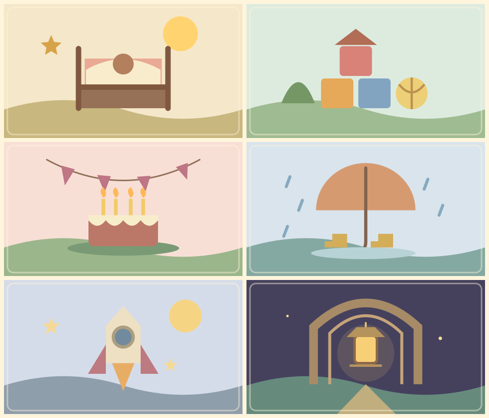

# Six little windows into a life

**Fictional playtest illustrations · v001 · In the private playtest**

These six pictures make the two test chapters readable without connecting to a photo library. The first two pictures in each chapter are small memories found along the path; its last picture is a major memory collected after the boss. The major memory brings the three together and advances the traveler’s age.

| Chapter | Along the route | After the boss |
| --- | --- | --- |
| The Block Party, age 0 → 4 | The first glow; A small discovery | A taller path |
| Besties Obby, age 4 → 7 | A bright detour; A brave crossing | The lantern gate |

These are simple, original SVG drawings: a cradle, building blocks, birthday cake, rainy-day umbrella, toy rocket and lantern gate. They have no external inspiration image or 3D model. The source pictures are shown above; they stand in for the family photos that a parent will curate later.

[Cradle SVG](../../media/fixture-memories/v001/demo-memory-2020-07.svg) · [Blocks SVG](../../media/fixture-memories/v001/demo-memory-2022-01.svg) · [Birthday SVG](../../media/fixture-memories/v001/demo-memory-2024-01.svg) · [Umbrella SVG](../../media/fixture-memories/v001/demo-memory-2025-01.svg) · [Rocket SVG](../../media/fixture-memories/v001/demo-memory-2026-01.svg) · [Lantern SVG](../../media/fixture-memories/v001/demo-memory-2027-01.svg)

The published SVGs are exported directly from the game’s fixture renderer. The catalog inventory records their checksums. They contain no personal photos, names or private likenesses. This fixture set does not decide the categories or art treatment of the future family album.

[Try the private playtest](../../playtest.md) · [Back to the catalog](../../catalog.md)
