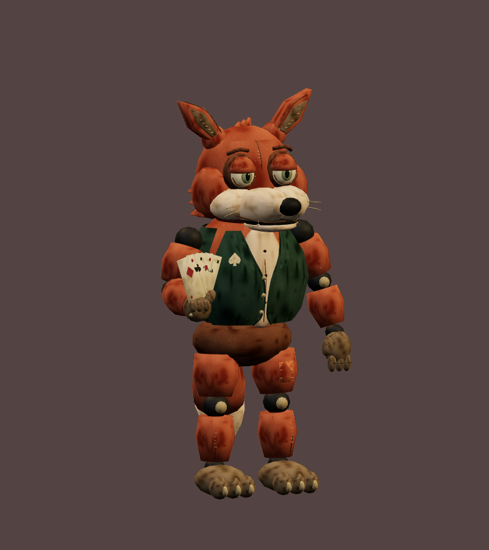
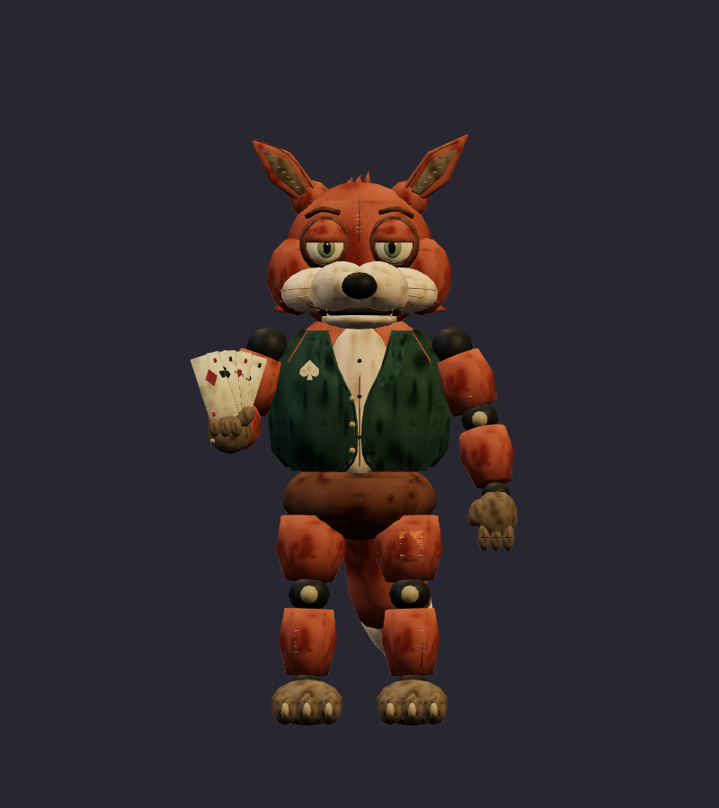
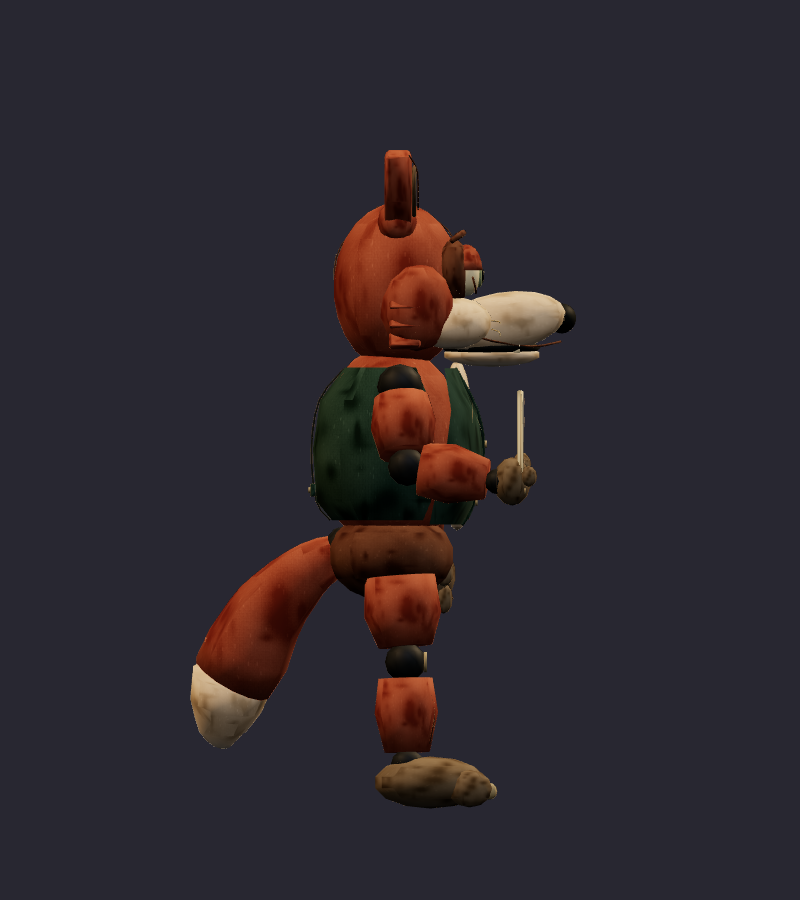
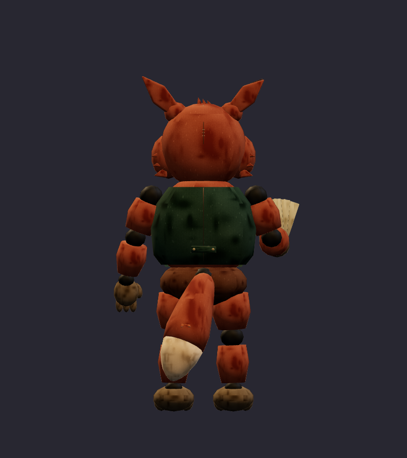
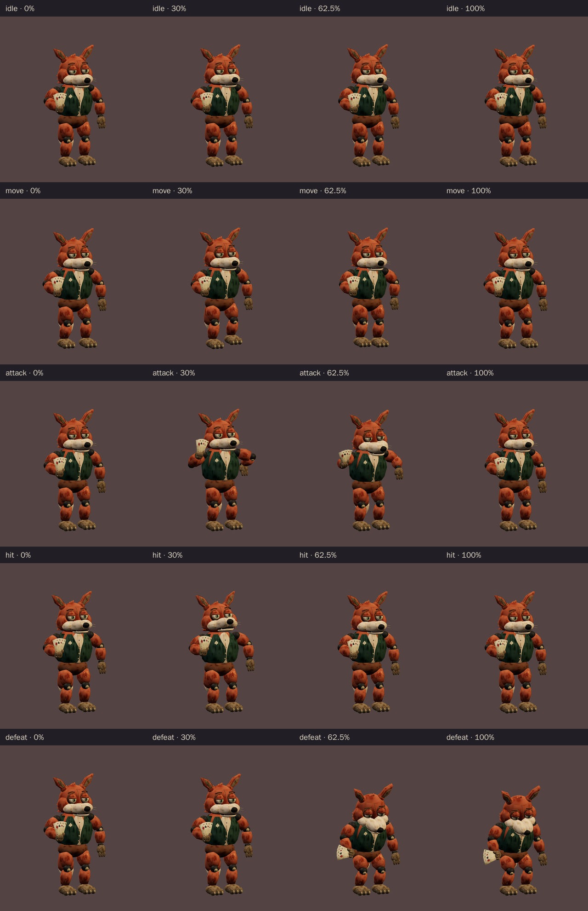
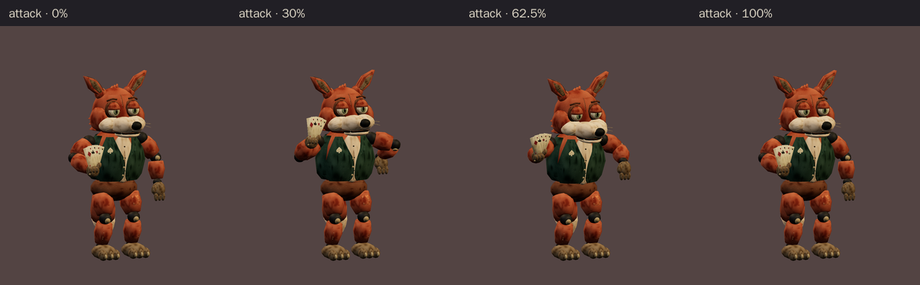

# Fox Card Shark · v001 worn mascot

**Validated Blender model candidate · Studio only · Exact art review pending.** The fox is a supporting dealer in the proposed six-character Rat Casino cast, beside the center-stage Rat Pit Boss. His worn card fan and plain green vest give him a casino joke of his own. This v001 model follows the [corrected ensemble](../rat-casino-ensemble/v003.md) and [russet front/side/back construction sheet](../../media/rat-casino-ensemble/v003/construction/fox-card-shark.png); the older glossy study remains in the ensemble's superseded history.

[Construction image prompt](../../media/rat-casino-ensemble/v003/construction/fox-card-shark-prompt.txt) · [Image source and checksums](../../media/rat-casino-ensemble/v003/source.json) · [Model provenance](../../media/fox-card-shark/v001/provenance.json)

<figure><figcaption>Selected v003 construction reference</figcaption></figure>
<figure><figcaption>Exact exported v001 model · studio candidate</figcaption></figure>

<model-viewer src="../../media/fox-card-shark/v001/fox-card-shark.glb" poster="../../media/fox-card-shark/v001/beauty.png" alt="Orbit the worn Fox Card Shark and inspect his five animations" camera-controls touch-action="pan-y" data-quest-clips shadow-intensity="0.7" camera-orbit="155deg 75deg auto"></model-viewer>

[Download exact GLB](../../media/fox-card-shark/v001/fox-card-shark.glb) · [Editable Blender master](../../media/fox-card-shark/v001/fox-card-shark.blend) · [Artifact manifest](../../media/fox-card-shark/v001/sha256-manifest.json)

<figure><figcaption>Front</figcaption></figure>
<figure><figcaption>Side</figcaption></figure>
<figure><figcaption>Back</figcaption></figure>

The model has a broad russet head, low tired lids, blunt muzzle, heavy patched tail, segmented padded limbs and one faded spade-token mark on an otherwise plain vest. The hand-held card fan stays attached. The lead asked the Blender author to close a lower vest overlap, join the cream tail tip cleanly to the russet shell and move the attack contact fan outside the torso silhouette. These corrections appear in the exact final export and small-scale motion strip. Tom has not reviewed this exported version as final art.

| Exact exported model | Result |
| --- | --- |
| Size and placement | 1.800 m tall; about 0.996 m wide and 1.053 m deep at rest; metre scale, Y-up, forward −Z, floor-centered |
| Geometry | 14,698 triangles; two opaque material primitives; one skin, 25 named pivots, up to two influences per vertex |
| Texture | One original embedded 1024 × 1024 atlas; no external resource or required decoder |
| Download | 1,401,492 bytes; below the 2 MiB candidate budget |
| GLB SHA-256 | `77346890c1d989e669f586bf3c361d028d6c2fa7f1130bf6bc039d793380791c` |
| Blender master SHA-256 | `d8868821affad96e55a3b63d0908e0bed88f7bf24626b7f22d77a73969554c6c` |

## Motion and technical review

The viewer above exposes all five exact clips. `idle` lasts 2.8 seconds and `move` 1.4 seconds; both loop. `attack` lasts 2.0 seconds: the card fan rises into a held warning from 0.85 to 1.08 seconds, then snaps forward and outward at the 1.25-second contact pose. `hit` lasts 0.7 seconds. `defeat` lasts 2.4 seconds and holds a bent-knee, bowed-head, drooping-card pose. The GLB supplies a gesture; later gameplay owns collision, effects or any projectile.

[Khronos validation](../../media/fox-card-shark/v001/validation.json) reports zero errors and warnings. [Three.js inspection](../../media/fox-card-shark/v001/three-inspection.json) reimported the exact GLB, exercised the actual enemy animation adapter and sampled deformed vertices through all five clips at 60 Hz. The export has a stationary identity root, attached card fan and tail, measured card/body clearance and no floor penetration beyond floating-point tolerance. [Chromium WebGL playback](../../media/fox-card-shark/v001/browser-inspection.json) rendered changing frames for every clip at normal and 35% scale with no page, console, HTTP or WebGL error and no external request. [Author's visual notes](../../media/fox-card-shark/v001/visual-review.json) and [scene release](../../media/fox-card-shark/v001/scene-release.json) record the corrections and safe handoff.

The browser check used software Chromium. Physical iPad/iPhone Safari, device frame time and combat feel remain untested. This is a studio candidate for Tom to review, **not mapped into a level or approved for gameplay**. Final use still depends on his exact-version art review and the later level and encounter gates.

A fresh Astra Blender author built the candidate under [WO102](../../../../.agents/work-orders/102-fox-card-shark-classic.md) using the selected original ensemble and construction sheet. [Model provenance](../../media/fox-card-shark/v001/provenance.json) records the inputs and original procedural atlas. Source scripts live in `scripts/assets/fox-card-shark/v001/`; the manifest records matching local and Blender-service artifact hashes. No downloaded franchise model, texture, family photograph or personal likeness was used.
