# Gadget Hammer Hopper · v001

**Awaiting Tom's exact-version review · DESIGN-029 action-worlds candidate.** This runaway toolbox is a new ordinary enemy for the Clubhouse cast in [DESIGN-029](../../../designs/029-action-and-inhabited-worlds.md). It is a bigger, rowdier cousin of the [Runaway Gadget](../gadget-helper/v001.md): it bounces after the player on one coiled spring and swings a soft giant rubber mallet. Under [PRD-004 Q-03](../../../prds/004-family-release.md#owner-decisions) it may appear in the children's levels while labelled awaiting review here. Coordinator review and owner approval remain separate.

It is built from row 1 of the coordinator's construction reference:

- a teal toolbox body with an ochre lid, a dark carry handle, grey latches and a split back panel;
- a naughty face on the front: big cream eyes with side-eye pupils, thick slanted brows, and a lopsided dark-red grin with two buck teeth and a pink tongue;
- corrugated hose arms from round sockets, chunky teal mitten fists, and a soft rubber mallet with orange caps in the right fist;
- one coiled spring leg ending in a chunky ochre work boot with a lugged dark sole, laces and a padded collar.

**Source: coordinator-generated concept, built as an original Blender model.** The concept is build direction only; no image is projected or pasted onto the model. Every part is modelled geometry painted from one original 1024 × 1024 colour atlas. There are no copied meshes, logos or lettering, and no gore.

[Full concept sheet](../../media/action-minions-a/v001/concept.png) · [Model provenance](../../media/gadget-hammer-hopper/v001/provenance.json) · [Construction record](../../media/gadget-hammer-hopper/v001/construction.json)

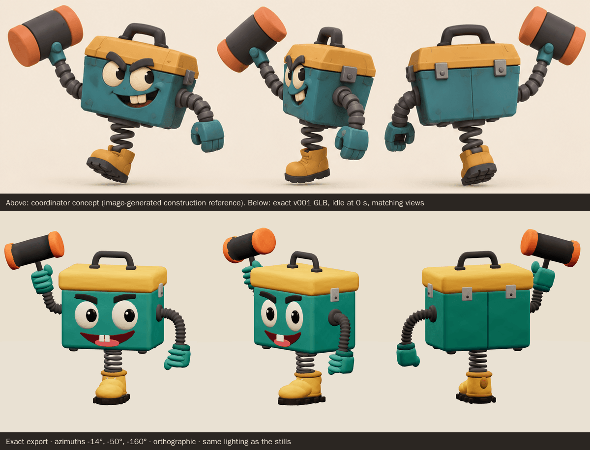

<model-viewer src="../../media/gadget-hammer-hopper/v001/gadget-hammer-hopper.glb" poster="../../media/gadget-hammer-hopper/v001/beauty.png" alt="Orbit the Gadget Hammer Hopper and inspect its five animations" camera-controls touch-action="pan-y" data-quest-clips shadow-intensity="0.7" camera-orbit="155deg 78deg auto"></model-viewer>

[Download exact GLB](../../media/gadget-hammer-hopper/v001/gadget-hammer-hopper.glb) · [Editable Blender master](../../media/gadget-hammer-hopper/v001/gadget-hammer-hopper.blend) · [Review video (WebM, 717 KiB)](../../media/gadget-hammer-hopper/v001/review.webm) · [Artifact manifest](../../media/gadget-hammer-hopper/v001/sha256-manifest.json)

<figure>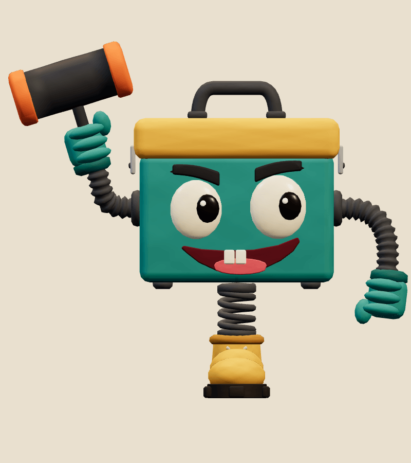<figcaption>Front</figcaption></figure>
<figure>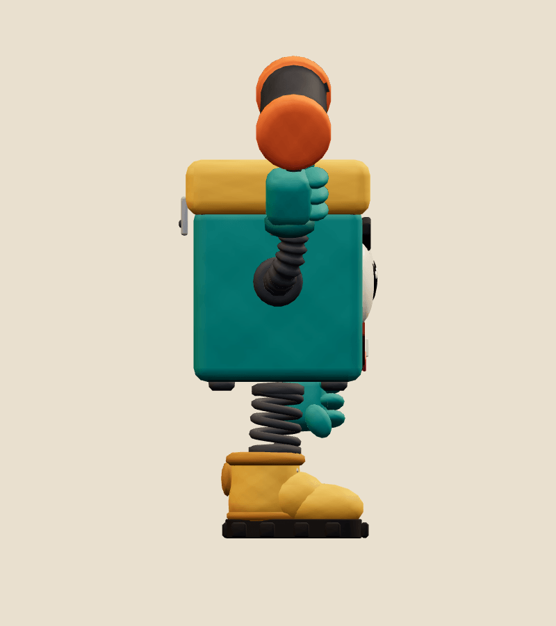<figcaption>Side</figcaption></figure>
<figure>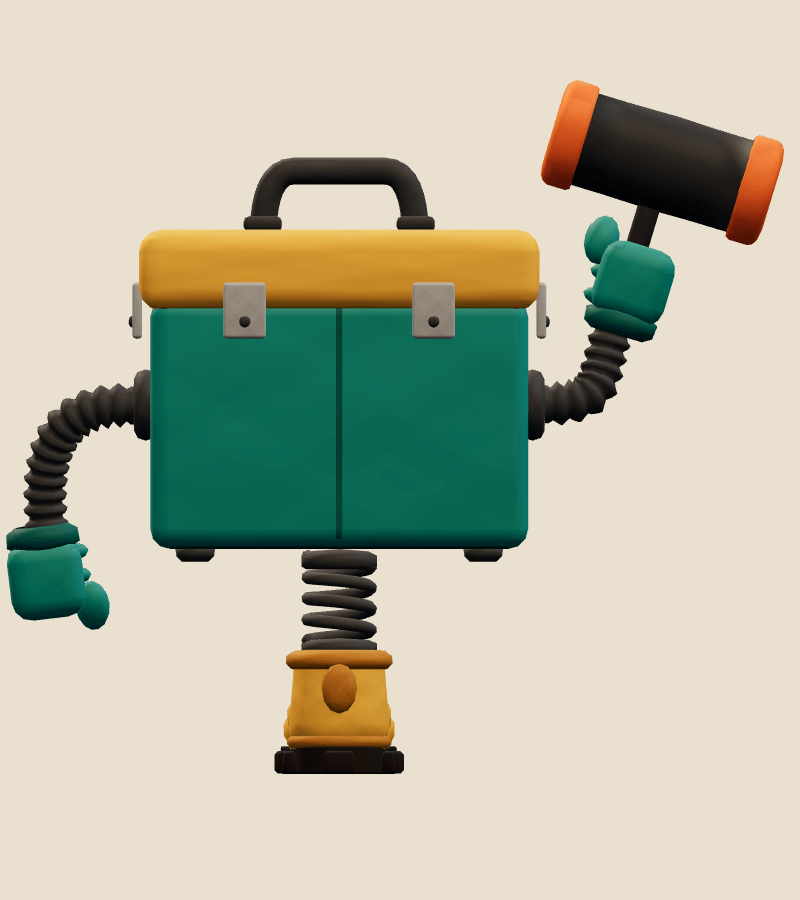<figcaption>Back</figcaption></figure>
<figure>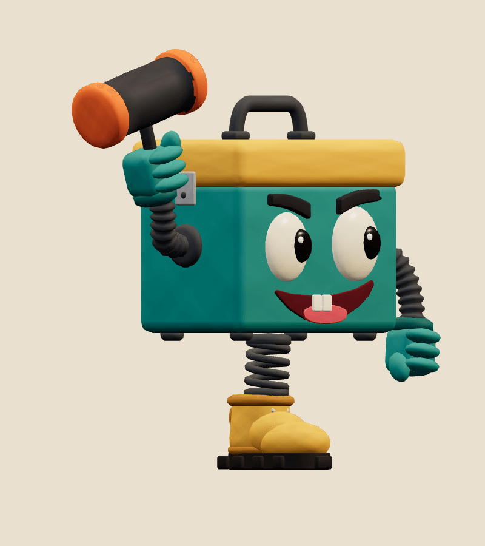<figcaption>Three-quarter</figcaption></figure>

| Exact exported model | Result |
| --- | --- |
| Size and placement | 1.541 m tall in the concept pose, 1.729 m wide and 0.637 m deep. Across all clips it spans -1.05 to 1.33 m across, up to 1.92 m high and -1.06 to 1.16 m front to back; nothing goes below the floor. Metre scale, Y-up, forward −Z, floor-centred stationary root, character right +X |
| Geometry | 13,912 triangles; one skin with 27 joints and at most 2 influences per vertex |
| Materials | 2 opaque materials sampling one atlas: Matte painted clay, Glossy toy accents; one draw primitive each |
| Texture | One original embedded 1024 × 1024 PNG atlas (195,681 bytes), painted procedurally in Blender Python; no external resource or required decoder |
| Download | 1,475,240 bytes; below the 2 MiB budget |
| GLB SHA-256 | `ac4f92e0ec57a172272616507cc399fd15e0c791ec768f6adfc4a64bad41530e` |
| Blender master SHA-256 | `a621c554ddce82297c290bcf1e81aef271879007124b1f777425ba16994ce1d2` |

## Motion and checks

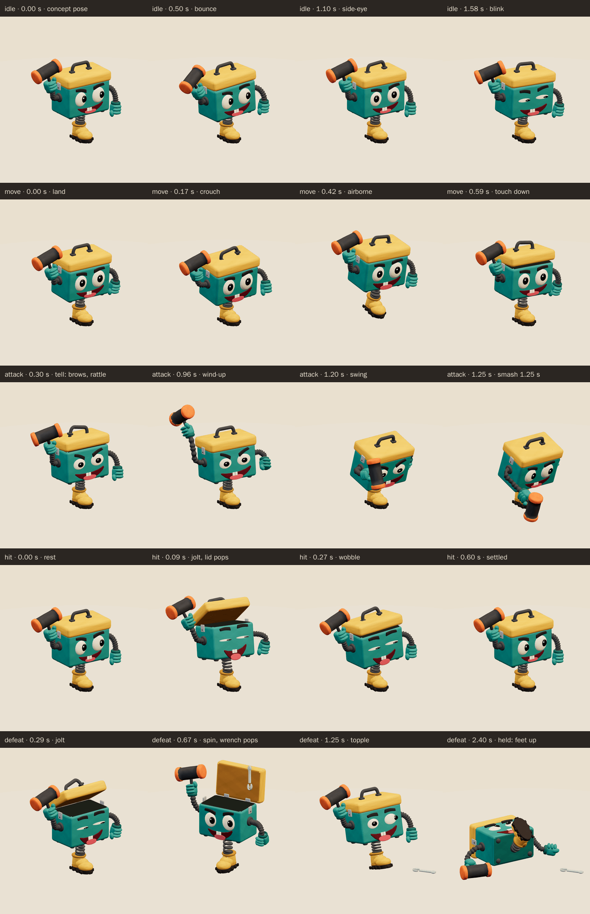

The viewer exposes `idle` (2 s), `move` (0.7 s), `attack` (2 s), `hit` (0.6 s), `defeat` (2.4 s):

- **Idle:** from the concept pose it bounces twice on its spring, the box sways, the lid clacks at each bounce, the carry handle wobbles, it twirls the mallet and pumps its left fist, side-eyes across, raises one brow and blinks.
- **Move:** one big pogo hop per loop: crouch, push off, the boot leaves the floor with the toe pointed, then lands; it leans into the hop with the arms swinging, the eyes wide and the lid flapping on landing.
- **Attack:** the tell (to 0.45 s): the brows slam into a V, the eyes narrow, the grin widens, the lid rattles and the box shivers while the mallet lifts and twists. The wind-up (0.45–0.9 s) squashes the spring, leans back and hauls the mallet up behind its head. The downswing goes over the top, outside the lid, and an orange rubber cap hits the floor in front at **1.25 seconds**. The cap squashes, the eyes pop and the lid bangs open, then it recovers to the concept pose by 2.0 s.
- **Hit:** it jolts back on the spring with its eyes squeezed shut, the lid pops open, the brows shoot up and the arms fling out before it settles.
- **Defeat:** it jolts, then boings up and spins a full turn. The lid flies open and a wrench pops out and clatters onto the floor. It lands, wobbles and topples onto its back with the boot kicking up in the air, the arms and mallet flopped on the floor, cross-eyed and gaping. The pose is held from 1.95 s.

The clips keep the root still; gameplay moves and turns the enemy. In the game, the wind-up plays the attack from its start to the 1.25 second contact at the enemy's wind-up speed, so the tell and the wind-up both show.

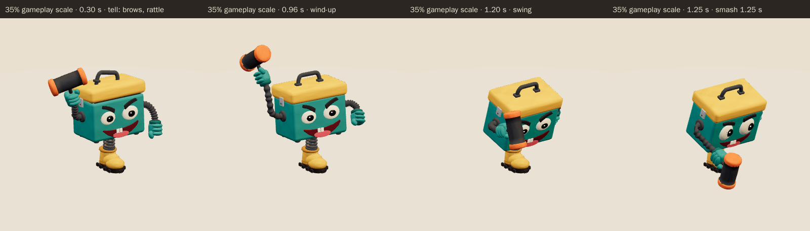

<figure>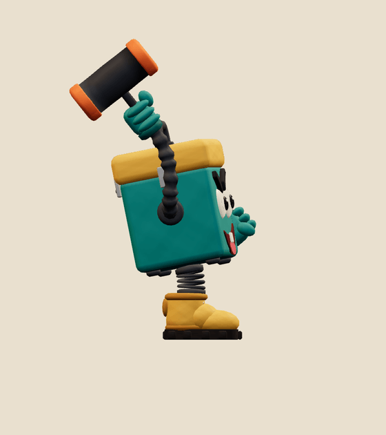<figcaption>Attack wind-up</figcaption></figure>
<figure>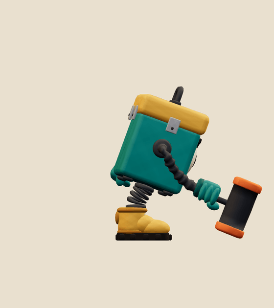<figcaption>Contact, 1.25 s</figcaption></figure>
<figure>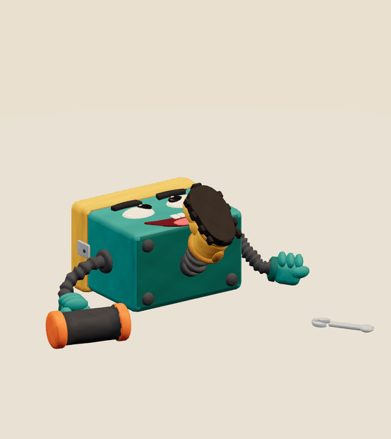<figcaption>Held defeat</figcaption></figure>
<figure>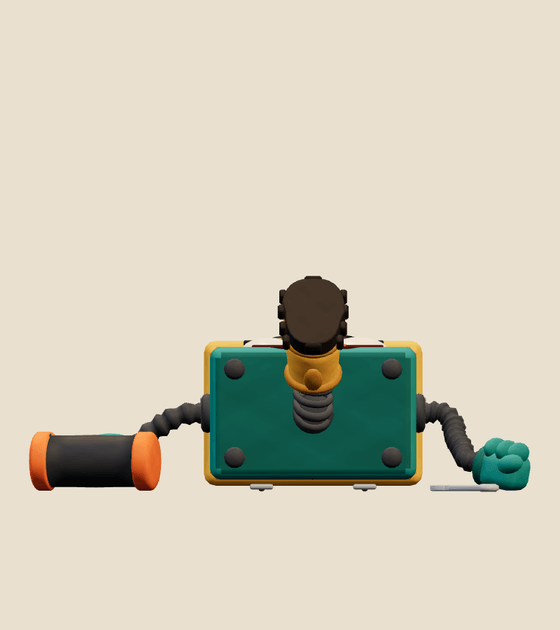<figcaption>Held defeat, front</figcaption></figure>

[Khronos validation](../../media/gadget-hammer-hopper/v001/validation.json) reports 0 errors, 0 warnings, 0 infos and 0 hints (gltf-validator 2.0.0-dev.3.10, run in the Blender pod on the exact bytes), and all 20 contract checks pass.

[Three.js inspection](../../media/gadget-hammer-hopper/v001/three-inspection.json) reimported the exact GLB with three r186 and the real `src/game/enemy-animation.ts` adapter. It sampled all 12,096 exported vertices at 60 Hz in every clip and passed all 37 checks:

- every track resolves below the scene root, the root never moves, and the weights are normalised with at most four influences;
- `idle` and `move` loop seamlessly, `defeat` holds its final pose, and no clip goes below the floor;
- the culling envelope stored in the model covers every pose;
- it stands 1.54 m tall on the floor, inside the 1.3–1.6 m band, and `idle` starts in the concept pose;
- the adapter's wind-up contact pose matches the clip at 1.25 s, the defeat vanishes, and clones animate independently;
- part clearance: mallet vs box; mallet vs lid; fists vs box; fists vs lid; boot vs box; boot vs lid; wrench hidden until defeat (rest-space part boxes; a proxy, not triangle collision);
- asset beats: idle starts in concept pose; mallet cap hits floor at contact; mallet strikes in front; mallet still falling before contact; mallet squashes on impact; boot leaves floor in move; lid pops on hit; defeat lies on its back; wrench rests on floor in defeat; boot kicks up in defeat.

[Chromium playback](../../media/gadget-hammer-hopper/v001/browser-inspection.json) (Chromium 153.0.8010.12, ANGLE SwiftShader) rendered changing frames for all five clips at full and 35% scale, played each clip in real time at both scales, and drew the character in two draw calls. There were no console, HTTP or WebGL errors and no external requests. The review video is rendered from the exact GLB at 30 fps. No physical-device test has been run.

The author departed from the concept in these deliberate ways:

- **Wrench.** The concept has no defeat props. A wrench hidden inside the closed box pops out in `defeat` for a funny exit. It is checked to stay inside the box in the other four clips.
- **Boot sole.** The concept's tread is suggested with ten lug blocks round the sole and a welt band, not sculpted tread.
- **Scuffs and seams.** The concept's clay scuffs, chips and rivets are reduced to soft atlas mottling, two scuff patches and the back panel seam; the latches and their rivets are geometry.
- **Defeat pose.** Lying on its back puts the face up toward the gameplay camera. From a low front view you see the box bottom and the kicking boot.

The author also fixed these problems along the way:

- The first downswing passed the right fist and mallet through the lid's front corner, and the recovery grazed it again. The swing now passes outside the lid, and the clearance checks report no overlaps in any clip.
- Early in the topple, the boot heel dipped 1.7 cm below the floor and the back latches went 1.3 cm under it. The drop is now eased behind the rotation and the box rests 5 cm higher, so nothing goes below the floor.
- The first export was 15,780 triangles. Trimming coil, hose, eye and handle resolution brought it under the 15k budget, and the fist, sole and grin pass afterwards keeps it there.
- Against the concept the fists were small, the boot slipper-like and the grin narrow; the fists are now 28% chunkier, the sole is thick and lugged, and the grin is 32% wider.

## Catalog intake

- **Suggested placement:** World A chapter 1, Clubhouse Capers (`clubhouse`): the Toon Clubhouse ordinaries beside the existing Runaway Gadget, under Captain Bully Cat. It shares the gadget helper's era window.
- **Suggested catalog entry:** `gadget-hammer-hopper@v001`, "Gadget Hammer Hopper", ordinary, `ordinary-a`, period `toon-clubhouse-v1`, window 2006-05-05 → 2016-11-06.
- **Scene motion:** `contactFraction: 0.625`, `height: 1.541478`.
- **Clip mapping:** idle → `idle`, chasing → `move`, wind-up and strike → `attack` (contact 1.25 s), HP drop → `hit`, defeated → `defeat` (held from 1.95 s).
