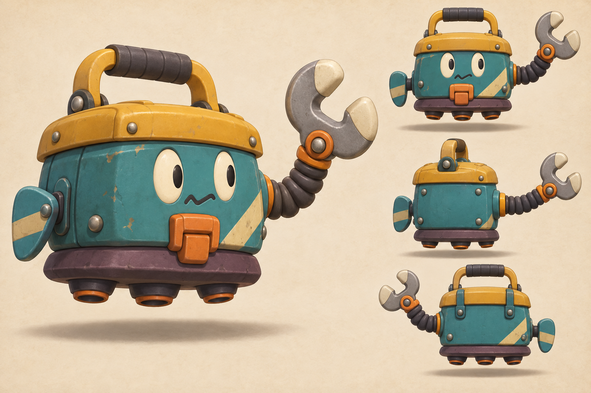
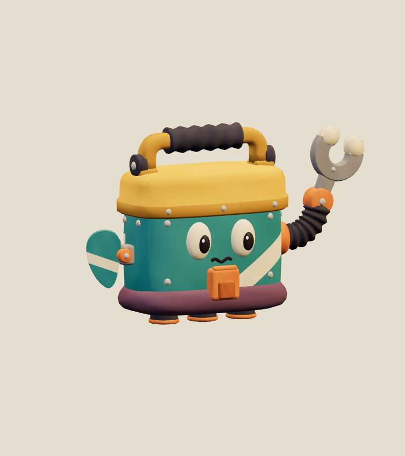
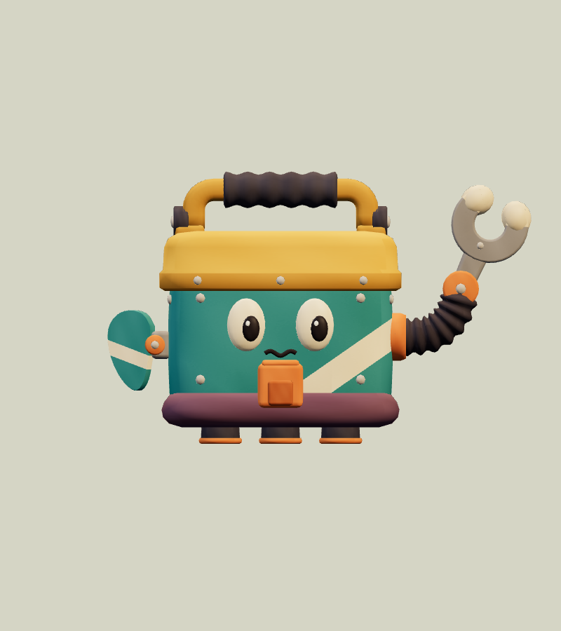
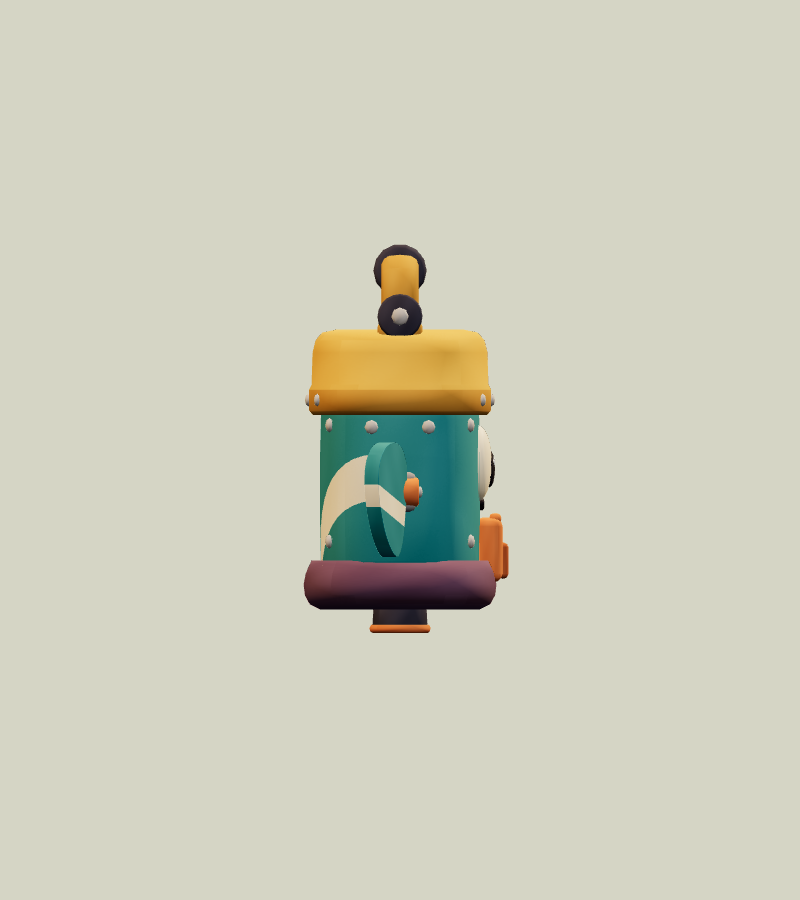
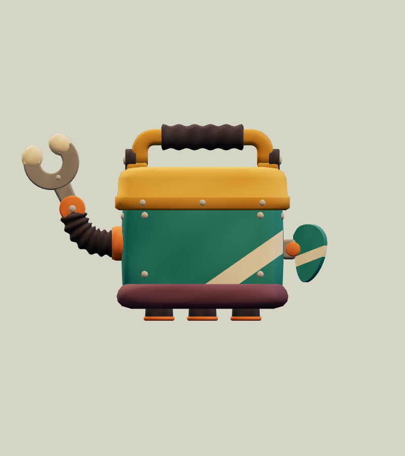
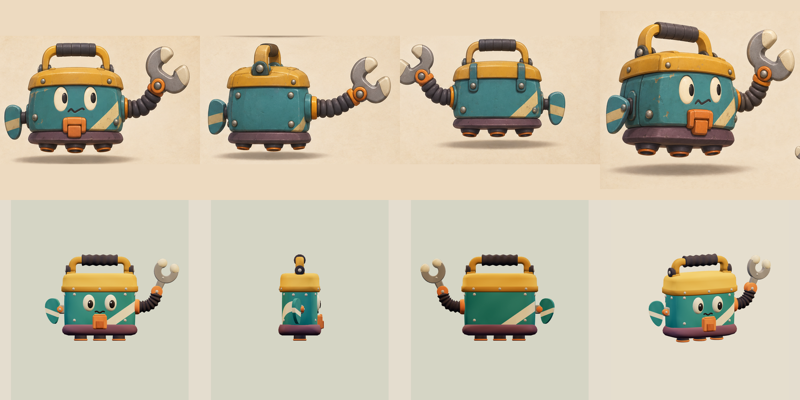
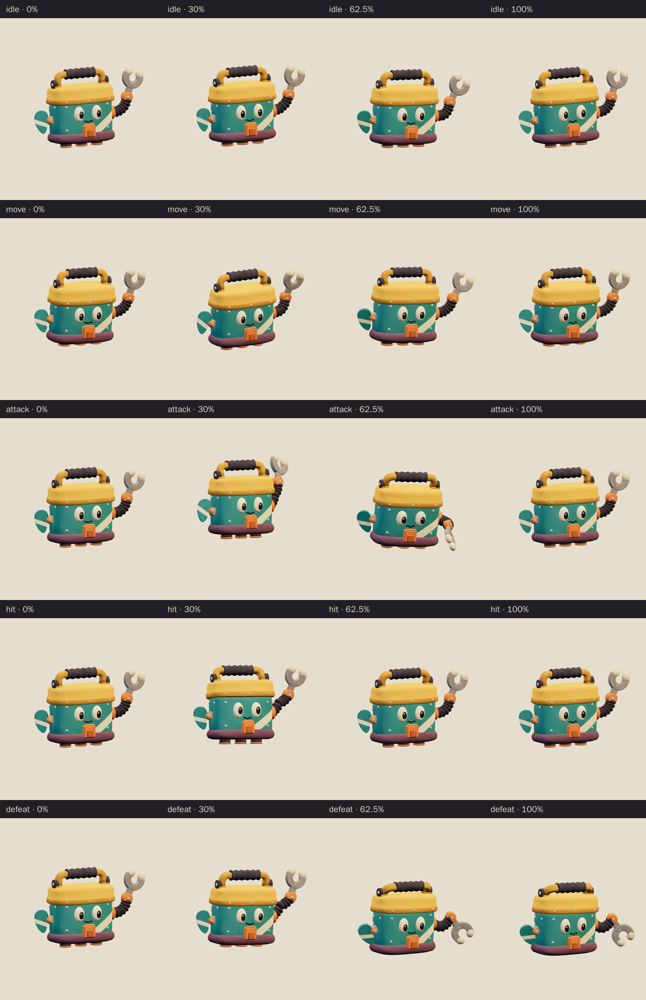
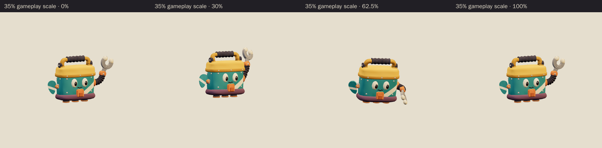

# Gadget Helper · v001

**Awaiting Tom's review · used in the family release.** This is the World A chapter 1 ordinary encounter candidate from [the locked era roster](../../../designs/026-personal-era-casts.md). The runaway floating toolbox carries an oversized wrench on a hose arm, a paddle hand and three small hover nozzles. Its teal box, ochre lid and handle, and cream stripe sit well beside the chapter's cat captain. The selected concept's front and back views put the wrench on its left and the paddle on its right.

[Concept prompt](../../media/gadget-helper/v001/prompt.txt) · [Concept source and selection notes](../../media/gadget-helper/v001/source.json) · [Model provenance](../../media/gadget-helper/v001/provenance.json)

<figure><figcaption>Selected construction concept</figcaption></figure>
<figure><figcaption>Exact v001 model</figcaption></figure>

<model-viewer src="../../media/gadget-helper/v001/gadget-helper.glb" poster="../../media/gadget-helper/v001/beauty.png" alt="Orbit the Gadget Helper and inspect its five animations" camera-controls touch-action="pan-y" data-quest-clips shadow-intensity="0.7" camera-orbit="155deg 75deg auto"></model-viewer>

[Download exact GLB](../../media/gadget-helper/v001/gadget-helper.glb) · [Editable Blender master](../../media/gadget-helper/v001/gadget-helper.blend) · [Artifact manifest](../../media/gadget-helper/v001/sha256-manifest.json)

<figure><figcaption>Front</figcaption></figure>
<figure><figcaption>Side</figcaption></figure>
<figure><figcaption>Back</figcaption></figure>

The Blender author compared the exact exported front, side, back and three-quarter views with the concept before delivering. The concept's middle view is a construction study rather than a true side view, so the brief set the depth instead: a 0.42 m body over a skirt about 0.5 m deep.

After that comparison, the author made these corrections:

- The first pass had 16,892 triangles; the hose, grip, eye and jaw detail was reduced to 14,574.
- The nozzle rims are thinner and orange, so the dark nozzles read as they do in the concept.
- The eyes, pupils and wrench jaws are larger, and the mouth is now a smooth wave.
- The box and lid corners are rounder, closer to the concept's pillowy shell.
- The grip and hose are closer to charcoal, and the skirt is a deeper plum.
- A source audit found the hose overlapping the box corner by 2.5 mm at the moment of contact. The wrist now swings wider and clears the corner by 2.9 mm.

The windup lifts the wrench 0.17 m and draws it 0.29 m back, but adds little outward reach. The concept's resting pose already holds the wrench out to the side. Earlier construction checkpoints are listed in the manifest.

| Exact exported model | Result |
| --- | --- |
| Size and placement | 1.586 m wide × 1.118 m tall × 0.538 m deep at rest. The body hovers 0.100 m above the floor over a floor-centered root; metre scale, Y-up, forward −Z. The glTF scene note still says 0.12 m; the measured gap is 0.100 m |
| Animated reach | Across all clips the model spans −1.099 to 0.658 m sideways, 0.004 to 1.231 m up and −0.788 to 0.388 m front to back. The exported culling bounds cover every pose |
| Geometry | 14,574 triangles; one skin with 10 joints and at most two influences per vertex; two opaque material primitives |
| Texture | One original embedded 1024 × 1024 atlas; no external resource or required decoder |
| Download | 1,031,204 bytes; below the 2 MiB candidate budget |
| GLB SHA-256 | `ff5d601b690541aec44e682835328ca55821762521412cd1e26f5c07cb6b6317` |
| Blender master SHA-256 | `f467492d4dd667a21a3d695925680ffed927b1457d138fe49536372b87011351` |

## Motion and checks

The viewer exposes `idle` (2.4 s), `move` (1.2 s), `attack` (2.0 s), `hit` (0.7 s) and `defeat` (2.4 s). In idle the toolbox bobs and rocks while its handle twitches. In move it leans forward, bobbing twice per loop as the paddle balances it. For the attack it winds the wrench up and back, holding that warning from 0.6 to 1.05 seconds. It then chops forward and down, making contact at **1.25 seconds** about 0.66 m in front of its root, before it recovers. Hit is a recoil and wobble in which the lid pops and the handle flips. Defeat is a surprised hop and a sputtering descent: the nozzles retract, the box settles onto its skirt and the handle, arm and paddle droop. The pose is held from 1.68 seconds. The clips leave the root stationary; gameplay controls travel and damage.

[Khronos validation](../../media/gadget-helper/v001/validation.json) reports zero errors, warnings, infos and hints, and all 17 budget and identity checks pass. [Three.js inspection](../../media/gadget-helper/v001/three-inspection.json) reimported the exact GLB and exercised the real enemy animation adapter. It sampled all 11,481 exported vertices at 530 animation steps and passed all 27 checks. They include a stationary root, fixed joint pivots, seamless idle and move loops, a held defeat pose and no floor penetration. The hover gap and the centred nozzle footprint were also checked. The [attachment audit](../../media/gadget-helper/v001/attachment-inspection.json) passed all 8 checks: the hose, wrench and paddle stay clear of the box, the handle stays above the lid, both hose ends stay seated and the pupils stay inside the eyes. [Chromium playback](../../media/gadget-helper/v001/browser-inspection.json) rendered changing frames for all five clips at normal and 35% scale with no page, console, HTTP or WebGL errors. [Author's visual notes](../../media/gadget-helper/v001/visual-review.json) and the [scene release](../../media/gadget-helper/v001/scene-release.json) record the corrections, preserved earlier masters and released Blender scene.

The catalog intake independently checked all 103 local artifact hashes against the manifest. It reran the Three.js inspection against the current enemy animation adapter and got identical bounds, contact and adapter results.

The browser evidence uses software Chromium. Physical iPad/iPhone Safari, device frame time and combat feel remain owner checks. This package contains visual animations only; it adds no sound.

## Provenance and release

Driving GPT-6 Astra generated and selected the original concept with OpenAI's built-in image tool before Codex reached its usage limit. It is a generated concept, not a Blender reference sheet. Claude Opus 5.5 (`claude-opus-5-5`, effort `xhigh`) authored the model, atlas, rig and clips through Blender under [WO111](../../../../.agents/work-orders/111-era-cast-art-lead.md), with an exclusive scene lease. Tom ruled on September 26 that Opus 5.5 continues this Blender work while Codex is unavailable. No family photograph, personal likeness, downloaded franchise model, logo or audio was used. The source scripts live in `scripts/assets/gadget-helper/v001/`; the manifest identifies the durable master and the matching authoring-service backup. Claude Opus 5.5 also completed this catalog intake without changing the model.

[PRD-004 Q-03](../../../prds/004-family-release.md#owner-decisions) permits this candidate in the family release before Tom's review. The PLAN-019 coordinator owns runtime registration and level placement; this version is not yet in a parody catalog. Tom's exact-version decision is **pending**. A rejection returns that slot to a placeholder or prior version; catalog inclusion and technical checks do not constitute approval.
