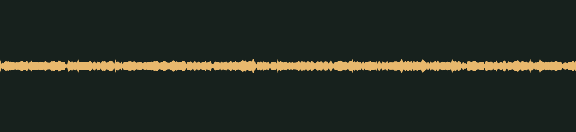

# Riding the breeze · v001

**Audio candidate · family world mechanics · not yet in the game · listening review pending.** A soft, steady wind for gliding, prepared as a seamless loop.

## Audition

<audio controls preload="none" aria-label="Audition glide-wind version one" loop>
  <source src="../../media/glide-wind/v001/cue.wav" type="audio/wav">
  <a href="../../media/glide-wind/v001/cue.wav">Download the processed cue</a>
</audio>

The player repeats the loop until you pause it.

[Processed cue](../../media/glide-wind/v001/cue.wav) · [Original eight-second take](../../media/glide-wind/v001/source.wav)

## Exact version

| Property | Measured result |
| --- | --- |
| Stable cue / version | `glide-wind` / `v001` |
| Duration | 1.60 seconds, seamless loop |
| Format | PCM signed 16-bit WAV, stereo, 44.1 kHz |
| Download size | 282,284 bytes |
| Peak / RMS | -18.0 / -30.238 dBFS |
| Clipped samples | 0 |
| Processed SHA-256 | `771b0b48ed90995151f5702dbe6bfc629055a845a1fee0d58216dbdb80c3d046` |
| Source SHA-256 | `c29b9905283c472418e4b8b33e4ba0791a822010b2a53a2f15ec89cfe8a0bb86` |

Processing takes 1.60 seconds beginning at 3.000 seconds. It folds the next 0.25 seconds of the take back over the start with an equal-power crossfade, so the last frame runs into the first exactly as the original take continued. There is no entrance or exit fade. The peak is normalized to -18 dBFS so the wind sits under the one-shot cues. At the wrap, the step from the last sample to the first (270) is smaller than the clip's 99th-percentile sample step (502), and the 50 ms around the seam measures +0.1 dB against the whole clip. The source is preserved separately. [Exact recipe](../../media/glide-wind/v001/processing.json), [measurements](../../media/glide-wind/v001/verification.json), and [reproducible processing script](../../../../scripts/assets/audio/process_cues.py).

## Source and checks

Generated on 2026-09-26 by a Claude Code subagent (Opus 5.5) from the workflow coordinator's cue brief, using the separate Stable Audio 3 Small-SFX CPU service (service version 0.2.0). This take used seed 225, eight steps and eight seconds. It contains no supplied recording or personal reference. The [provenance record](../../media/glide-wind/v001/provenance.json) retains the complete prompt, service/model revisions, every other attempt and the source terms recorded in [DESIGN-008](../../../designs/008-audio-pipeline.md). The source code, model and redistributed text component have separate terms; no broader license is asserted here.

The service and download SHA-256 checks passed, as did WAV decoding, the exact-duration, non-silence and zero-clipping checks, and both loop-seam checks. Re-running the processing script reproduced the same output. These measurements do not establish timbre or musical quality.

## Listen-proxy check

Nobody has listened to this take; the agent cannot hear audio. Instead, it measured the source's level in 20 ms windows, a rough autocorrelation pitch track, the zero-crossing rate and a four-band energy split, and chose the segment from those numbers. From 2.5 to 7.4 seconds the selected take holds within about ±1.5 dB, with no gusts. Two earlier takes were rejected because most of their energy sat below 300 Hz.

Energy split of the processed cue: 1.0% below 300 Hz, 17.5% at 300 Hz–1 kHz, 64.2% at 1–4 kHz and 17.3% above 4 kHz. These numbers hint at shape and brightness; they cannot say how the cue sounds.

## Coordinator and owner review

Review focus: Whether the loop stays calm and even when it repeats, and whether any seam or pulse is audible.

- **Coordinator technical intake:** Passed numerically; listening/creative selection pending.
- **Tom’s decision:** Pending, against the exact hash above.
- **Gameplay integration:** None yet. The game’s cue map does not reference this file; wiring it to the glide is a separate step. The inventory records it as a private candidate for the family worlds.

## Retained attempts

Two earlier takes were rejected during intake. In the first, about two thirds of the energy sat below 300 Hz: a low rumble rather than an airy whoosh, and likely to vanish on tablet and phone speakers. The second was lower still, about 81% below 300 Hz, and its level swelled rather than holding steady. The third prompt asked for a bright, breathy shhh with no low rumble and produced the candidate above.

- [Source attempt 1](../../media/glide-wind/v001/source-attempt-1.wav) (seed 205) with its [measurements](../../media/glide-wind/v001/source-attempt-1-verification.json)
- [Source attempt 2](../../media/glide-wind/v001/source-attempt-2.wav) (seed 215) with its [measurements](../../media/glide-wind/v001/source-attempt-2-verification.json)

The prompts, seeds and job IDs of every attempt are in the provenance record. These decisions rest on measurements, not on listening.
