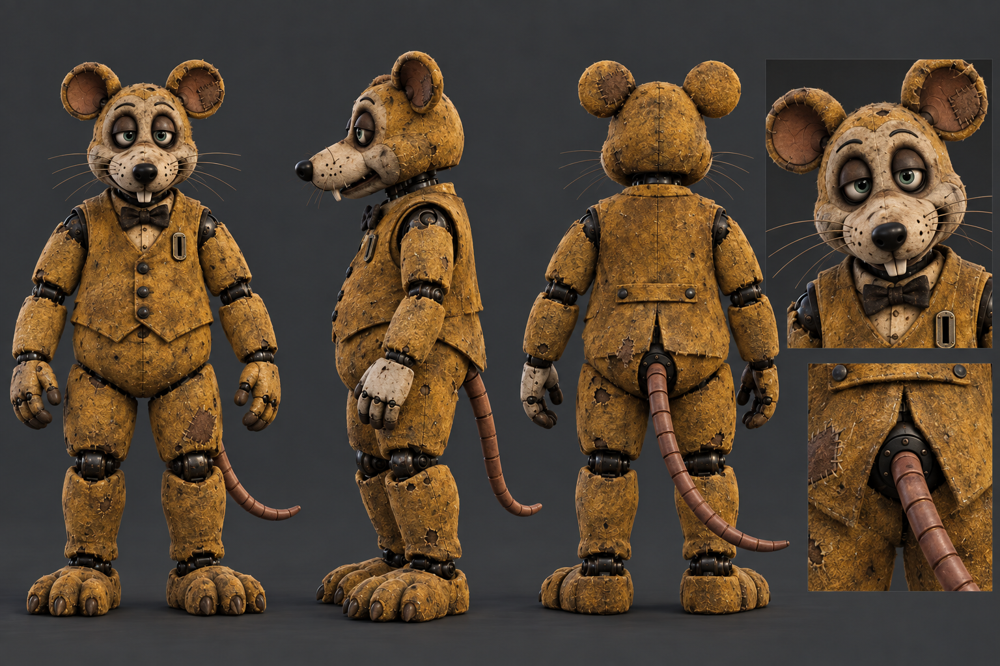
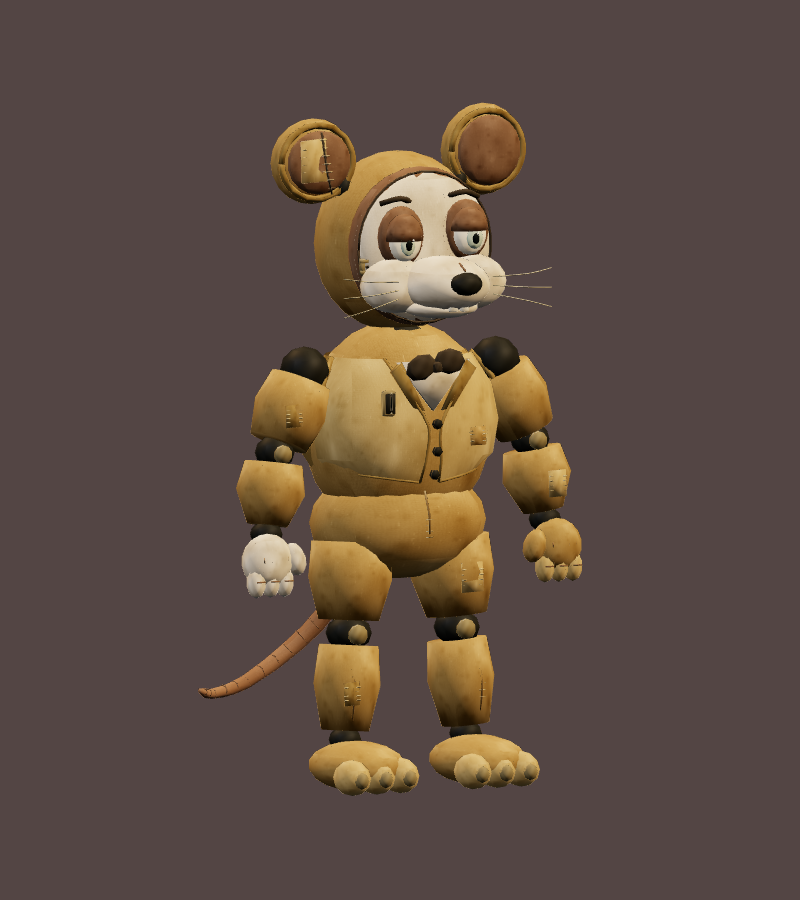
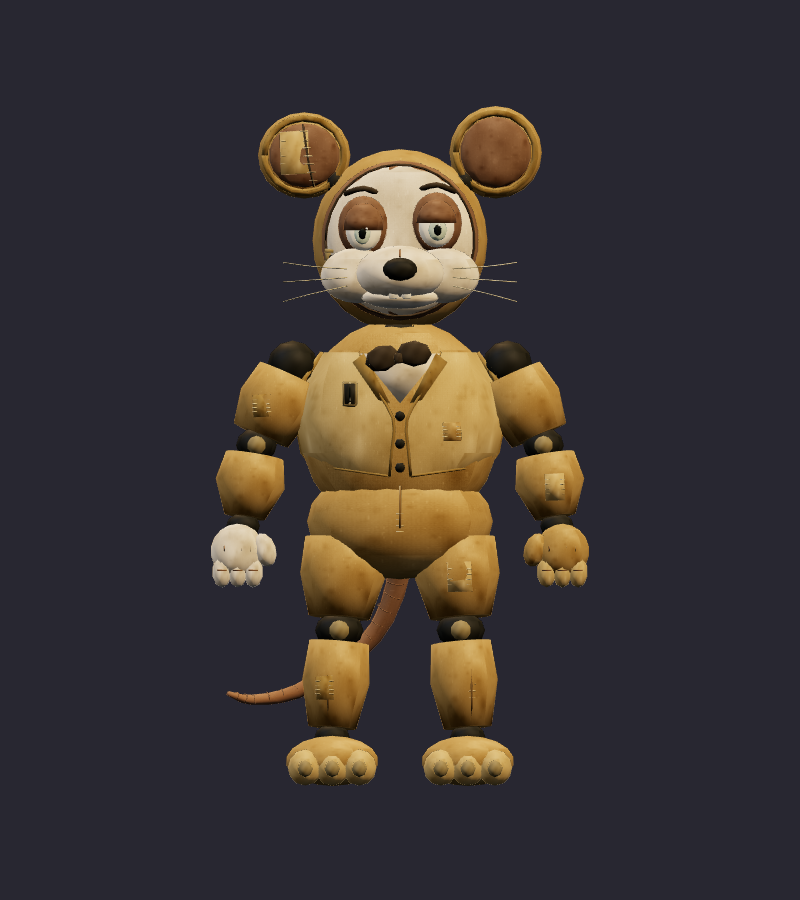
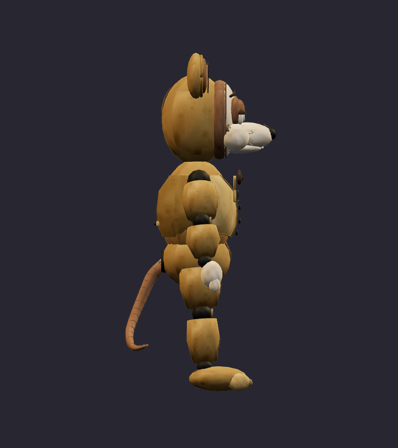
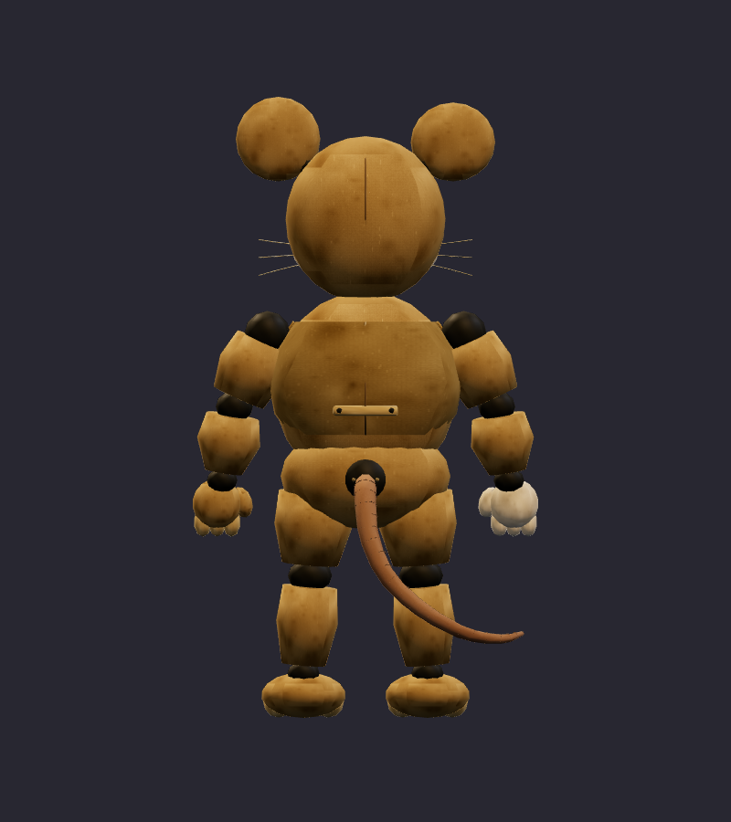
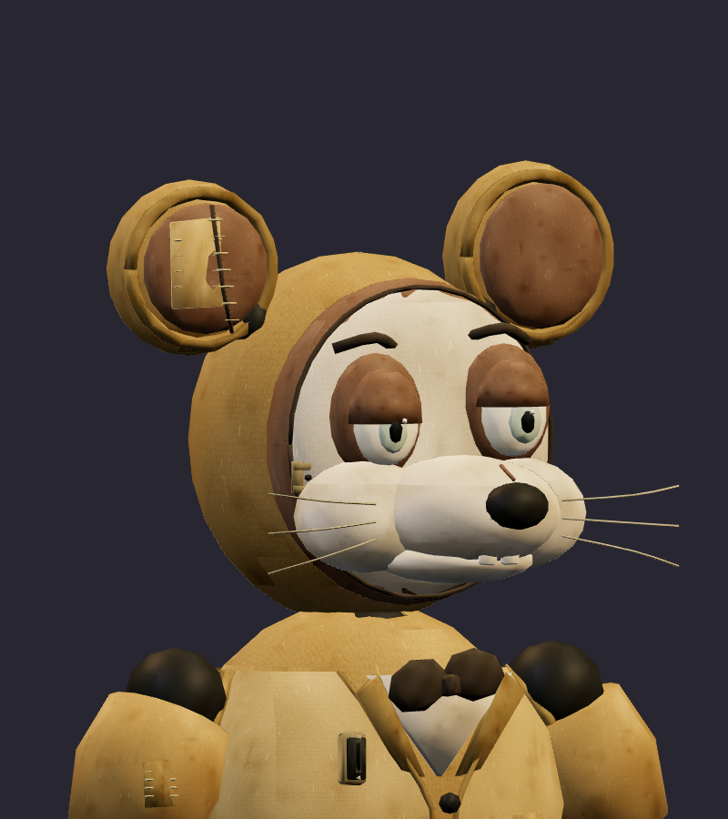
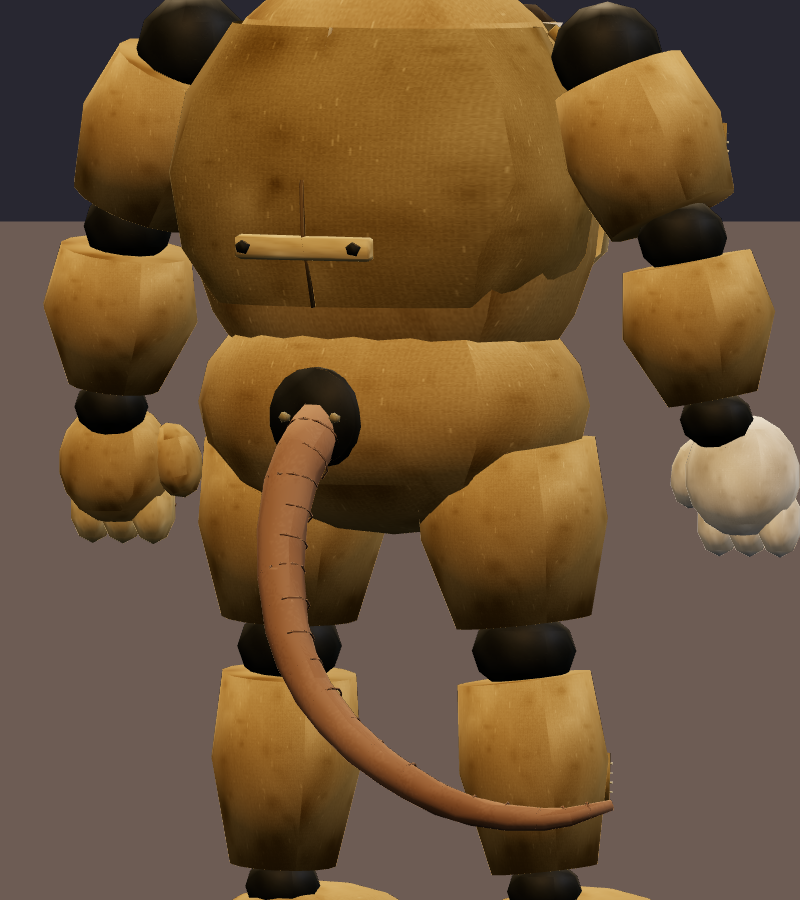
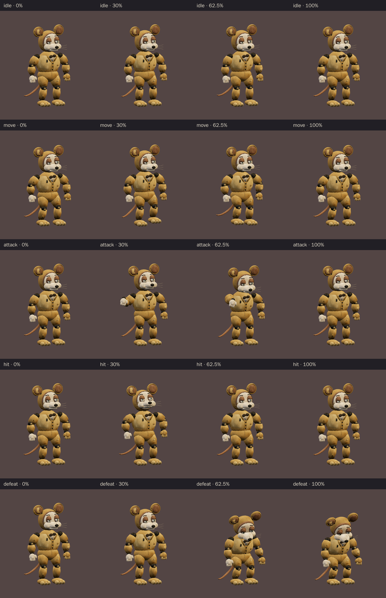
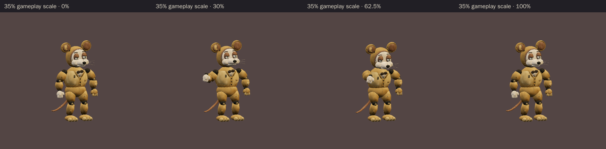

# Golden After-Hours Rat · v001 spare mascot

**Validated Blender model candidate · Private Rat Casino playtest noncombat stage cameo · Final device/art review pending.** This smaller mustard-gold spare rat supports the [corrected Rat Casino lineup](../rat-casino-ensemble/v003.md). The [selected front/side/back construction sheet](../../media/rat-casino-ensemble/v003/construction/golden-after-hours-rat.png) guides the worn shell and repair language; the exact v001 GLB is the reviewable model. Its compact 1.70 m silhouette, cream replacement faceplate and one pale paw distinguish it from the 2.15 m [Rat Pit Boss v002](../rat-pit-boss/v002.md). It has no lead rat's hat, die, cane or burgundy costume.

[Construction image prompt](../../media/rat-casino-ensemble/v003/construction/golden-after-hours-rat-prompt.txt) · [Image source and checksums](../../media/rat-casino-ensemble/v003/source.json) · [Model provenance](../../media/golden-after-hours-rat/v001/provenance.json)

<figure><figcaption>Selected v003 construction reference</figcaption></figure>
<figure><figcaption>Exact exported v001 model · studio candidate</figcaption></figure>

<model-viewer src="../../media/golden-after-hours-rat/v001/golden-after-hours-rat.glb" poster="../../media/golden-after-hours-rat/v001/beauty.png" alt="Orbit the worn Golden After-Hours Rat and inspect its five animations" camera-controls touch-action="pan-y" data-quest-clips shadow-intensity="0.7" camera-orbit="155deg 75deg auto"></model-viewer>

[Download exact GLB](../../media/golden-after-hours-rat/v001/golden-after-hours-rat.glb) · [Editable Blender master](../../media/golden-after-hours-rat/v001/golden-after-hours-rat.blend) · [Artifact manifest](../../media/golden-after-hours-rat/v001/sha256-manifest.json) · [Tool settings](../../media/golden-after-hours-rat/v001/tool-settings.json)

<figure><figcaption>Front</figcaption></figure>
<figure><figcaption>Side</figcaption></figure>
<figure><figcaption>Back</figcaption></figure>

<figure><figcaption>Faceplate and old repairs</figcaption></figure>
<figure><figcaption>Back hatch and tail base</figcaption></figure>

The lead reviewed an early export and asked the author to seat protruding ear trim, give the pale faceplate a visible but closed perimeter seam and discreet latch, and fade the broad yellow surfaces. Those corrections are present in this exact model. The faceplate stays attached, the eyes remain modest and tired, and the old-suit wear is matte rather than shiny. Tom liked the displayed exact cast and asked to move forward with the Rat Casino level; final device/art acceptance remains open.

| Exact exported model | Result |
| --- | --- |
| Size and placement | 0.945 m wide × 1.700 m tall including ears × 0.761 m deep; metre scale, Y-up, forward −Z, floor-centered |
| Geometry | 14,700 triangles; one skin with 27 named bones and at most two influences per vertex; two opaque material primitives |
| Texture | One original embedded 1024 × 1024 atlas; no external resource or required decoder |
| Download | 1,417,060 bytes; below the 2 MiB candidate budget |
| GLB SHA-256 | `b0ac1fd11f4df8039e69a9b303b1eb3e8342654b795b08db8fd8f68559b22184` |
| Blender master SHA-256 | `f08904c3ebe10813065e62f2d0d2d1f0072f39f889e696218f767960e72a46ae` |

## Motion and technical review

The viewer above exposes the exact `idle` (3.2 s), `move` (1.6 s), `attack` (2.0 s), `hit` (0.7 s) and `defeat` (2.4 s) clips. Idle and move loop; the other clips play once. During attack, the pale replacement paw rises outside the torso silhouette, holds a visible warning from 0.82 to 1.10 seconds, and makes one short shove at **1.25 seconds**. The repaired ear and closed faceplate lag slightly. Defeat settles by 1.767 seconds into a held, planted power-loss slump. Later gameplay owns any collision, damage or disappearance.

[Khronos validation](../../media/golden-after-hours-rat/v001/validation.json) reports zero errors and warnings. [Three.js inspection](../../media/golden-after-hours-rat/v001/three-inspection.json) reimported the exact GLB, exercised the real enemy animation adapter and sampled all 14,196 exported vertices at 602 animation steps. It found stationary root motion, attached faceplate/paw/tail pivots, at least 32.9 mm conservative distal-tail/body clearance and 22.2 mm paw/torso clearance, and no meaningful floor penetration beyond export rounding. [Chromium WebGL playback](../../media/golden-after-hours-rat/v001/browser-inspection.json) rendered changing frames for all five clips at normal and 35% scale with no page, console, HTTP or WebGL errors and no external requests. [Author's visual notes](../../media/golden-after-hours-rat/v001/visual-review.json) and [scene release](../../media/golden-after-hours-rat/v001/scene-release.json) record the corrections and safe Blender handoff.

The browser check used software Chromium. Physical iPad/iPhone Safari, device frame time and combat feel remain untested. This exact `v001` GLB is pinned as the **noncombat stage cameo in the private fictional Rat Casino playtest**, following Tom's September 23 “Looks great, let’s move forward” direction. Its SHA-256 is `b0ac1fd11f4df8039e69a9b303b1eb3e8342654b795b08db8fd8f68559b22184`. Final art acceptance follows the live level and device review.

A fresh Astra Blender author built it under [WO104](../../../../.agents/work-orders/104-golden-after-hours-rat-classic.md) from the selected original construction sheet. [Model provenance](../../media/golden-after-hours-rat/v001/provenance.json) records source hashes and the procedural atlas. Source scripts live in `scripts/assets/golden-after-hours-rat/v001/`; the manifest records matching local and Blender-service artifact hashes. No downloaded franchise model, texture, family photograph or personal likeness was used.
