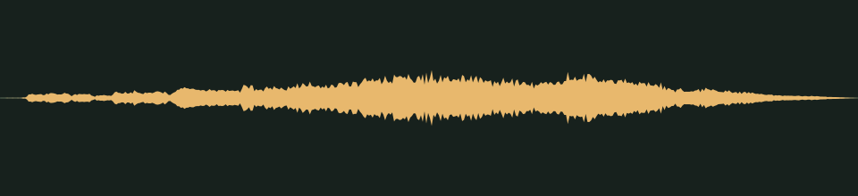

# A golden ticket · v001

**Audio candidate · family world mechanics · not yet in the game · listening review pending.** A short magical glockenspiel sparkle for collecting a golden ticket.

## Audition

<audio controls preload="none" aria-label="Audition golden-ticket-sparkle version one">
  <source src="../../media/golden-ticket-sparkle/v001/cue.wav" type="audio/wav">
  <a href="../../media/golden-ticket-sparkle/v001/cue.wav">Download the processed cue</a>
</audio>

[Processed cue](../../media/golden-ticket-sparkle/v001/cue.wav) · [Original five-second take](../../media/golden-ticket-sparkle/v001/source.wav)

## Exact version

| Property | Measured result |
| --- | --- |
| Stable cue / version | `golden-ticket-sparkle` / `v001` |
| Duration | 1.00 seconds |
| Format | PCM signed 16-bit WAV, stereo, 44.1 kHz |
| Download size | 176,444 bytes |
| Peak / RMS | -10.0 / -25.876 dBFS |
| Clipped samples | 0 |
| Processed SHA-256 | `6552e29f39594831ae26c43ed957ba8e47b53074ba762d50c7e1ab2d18d1ad60` |
| Source SHA-256 | `2a9287af3523531c2c4a99a06de8904aaacf9d965de6beaf974d142e3e44d885` |

Processing selects the segment beginning at 0.100 seconds, trims it to the stated duration, applies a 0.010-second entrance and 0.300-second exit fade, then normalizes its peak. It is a one-shot cue, not a loop. The source is preserved separately. [Exact recipe](../../media/golden-ticket-sparkle/v001/processing.json), [measurements](../../media/golden-ticket-sparkle/v001/verification.json), and [reproducible processing script](../../../../scripts/assets/audio/process_cues.py).

## Source and checks

Generated on 2026-09-26 by a Claude Code subagent (Opus 5.5) from the workflow coordinator's cue brief, using the separate Stable Audio 3 Small-SFX CPU service (service version 0.2.0). This take used seed 206, eight steps and five seconds. It contains no supplied recording or personal reference. The [provenance record](../../media/golden-ticket-sparkle/v001/provenance.json) retains the complete prompt, service/model revisions and the source terms recorded in [DESIGN-008](../../../designs/008-audio-pipeline.md). The source code, model and redistributed text component have separate terms; no broader license is asserted here.

The service and download SHA-256 checks passed, as did WAV decoding and the exact-duration, non-silence and zero-clipping checks. Re-running the processing script reproduced the same output. These measurements do not establish timbre or musical quality.

## Listen-proxy check

Nobody has listened to this take; the agent cannot hear audio. Instead, it measured the source's level in 20 ms windows, a rough autocorrelation pitch track, the zero-crossing rate and a four-band energy split, and chose the segment from those numbers. Small bell-like attacks arrive every 60–100 ms. They build from 0.12 seconds to a peak near 0.6 seconds, then shimmer and fade; the 0.3-second exit fade closes the flourish at 1.0 seconds. The pitch track is too unsteady to confirm an ascending run.

Energy split of the processed cue: 0.2% below 300 Hz, 1.4% at 300 Hz–1 kHz, 34.4% at 1–4 kHz and 64.0% above 4 kHz. These numbers hint at shape and brightness; they cannot say how the cue sounds.

## Coordinator and owner review

Review focus: Whether it sounds magical and celebratory, and whether the notes feel like a flourish rather than random twinkles.

- **Coordinator technical intake:** Passed numerically; listening/creative selection pending.
- **Tom’s decision:** Pending, against the exact hash above.
- **Gameplay integration:** None yet. The game’s cue map does not reference this file; wiring it to golden tickets is a separate step. The inventory records it as a private candidate for the family worlds.
