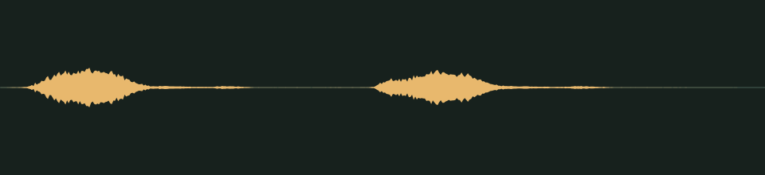

# Honk honk · v001

**Audio candidate · family world mechanics · not yet in the game · listening review pending.** A goofy, friendly double honk for the Honk Bus.

## Audition

<audio controls preload="none" aria-label="Audition honk-bus-honk version one">
  <source src="../../media/honk-bus-honk/v001/cue.wav" type="audio/wav">
  <a href="../../media/honk-bus-honk/v001/cue.wav">Download the processed cue</a>
</audio>

[Processed cue](../../media/honk-bus-honk/v001/cue.wav) · [Original five-second take](../../media/honk-bus-honk/v001/source.wav)

## Exact version

| Property | Measured result |
| --- | --- |
| Stable cue / version | `honk-bus-honk` / `v001` |
| Duration | 0.80 seconds |
| Format | PCM signed 16-bit WAV, stereo, 44.1 kHz |
| Download size | 141,164 bytes |
| Peak / RMS | -12.0 / -28.050 dBFS |
| Clipped samples | 0 |
| Processed SHA-256 | `9cf5a706227fa651a3b4890f439191b1c9bd49e67de14789badca06dcb914087` |
| Source SHA-256 | `bc02ca27820c7f365597ddaa05a0608060d87d18a64a1a9e507d2df4c0ffabe9` |

Processing selects the segment beginning at 3.450 seconds, trims it to the stated duration, applies a 0.010-second entrance and 0.120-second exit fade, then normalizes its peak. It is a one-shot cue, not a loop. The source is preserved separately. [Exact recipe](../../media/honk-bus-honk/v001/processing.json), [measurements](../../media/honk-bus-honk/v001/verification.json), and [reproducible processing script](../../../../scripts/assets/audio/process_cues.py).

## Source and checks

Generated on 2026-09-26 by a Claude Code subagent (Opus 5.5) from the workflow coordinator's cue brief, using the separate Stable Audio 3 Small-SFX CPU service (service version 0.2.0). This take used seed 217, eight steps and five seconds. It contains no supplied recording or personal reference. The [provenance record](../../media/honk-bus-honk/v001/provenance.json) retains the complete prompt, service/model revisions, every other attempt and the source terms recorded in [DESIGN-008](../../../designs/008-audio-pipeline.md). The source code, model and redistributed text component have separate terms; no broader license is asserted here.

The service and download SHA-256 checks passed, as did WAV decoding and the exact-duration, non-silence and zero-clipping checks. Re-running the processing script reproduced the same output. These measurements do not establish timbre or musical quality.

## Listen-proxy check

Nobody has listened to this take; the agent cannot hear audio. Instead, it measured the source's level in 20 ms windows, a rough autocorrelation pitch track, the zero-crossing rate and a four-band energy split, and chose the segment from those numbers. The selected take is a series of short honks near 480 Hz. The window starting at 3.45 seconds holds exactly two of them, at 0.02 and 0.38 seconds into the cue. Each lasts about 0.13 seconds, and the tail is clean by 0.62 seconds.

Energy split of the processed cue: 1.4% below 300 Hz, 20.8% at 300 Hz–1 kHz, 59.4% at 1–4 kHz and 18.4% above 4 kHz. These numbers hint at shape and brightness; they cannot say how the cue sounds.

## Coordinator and owner review

Review focus: Whether the honk is funny and warm rather than a real traffic horn, and whether the gap between the two honks feels right.

- **Coordinator technical intake:** Passed numerically; listening/creative selection pending.
- **Tom’s decision:** Pending, against the exact hash above.
- **Gameplay integration:** None yet. The game’s cue map does not reference this file; wiring it to the Honk Bus is a separate step. The inventory records it as a private candidate for the family worlds.

## Retained attempts

The first take held two sustained horn blasts of about 1.1 seconds each, a second apart, so no double honk fit the 0.8-second cue. A second prompt asked for two very short, quick honks and produced the candidate above.

- [Source attempt 1](../../media/honk-bus-honk/v001/source-attempt-1.wav) (seed 207) with its [measurements](../../media/honk-bus-honk/v001/source-attempt-1-verification.json)

The prompts, seeds and job IDs of every attempt are in the provenance record. These decisions rest on measurements, not on listening.
