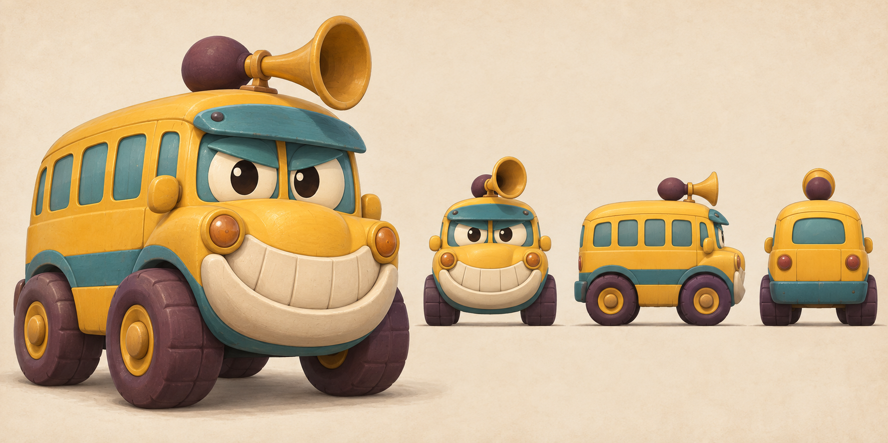
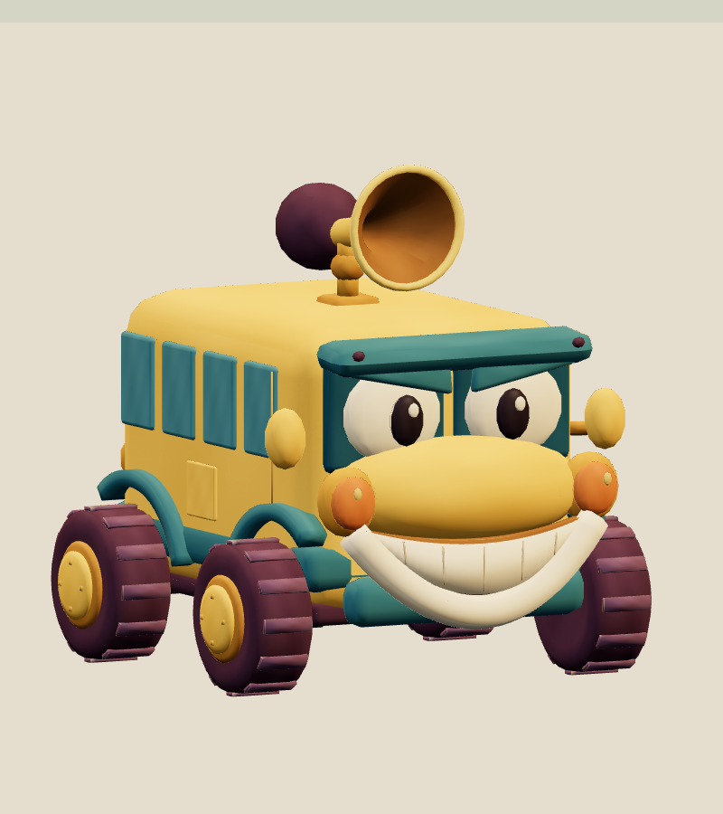
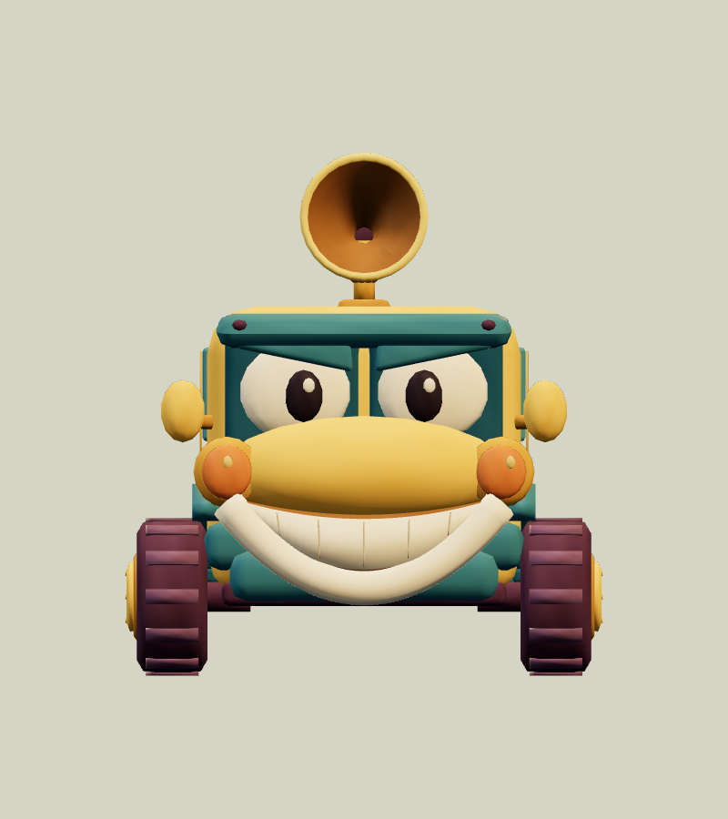
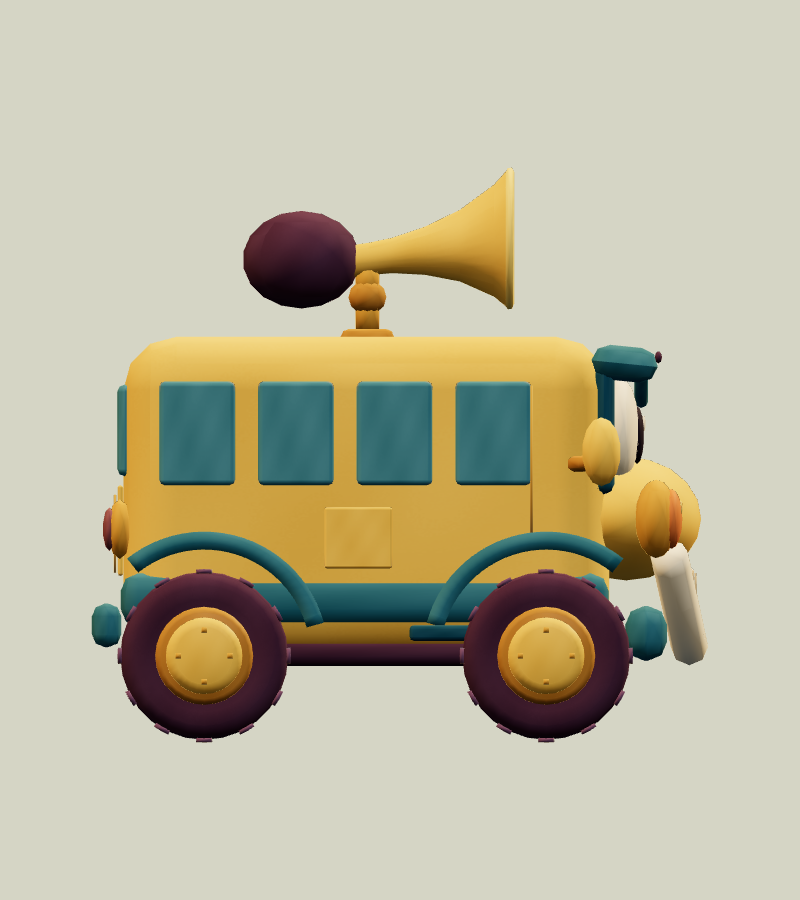
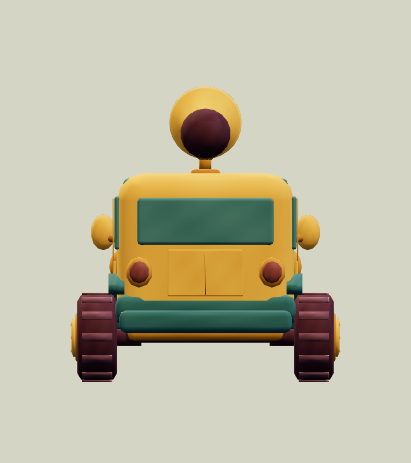
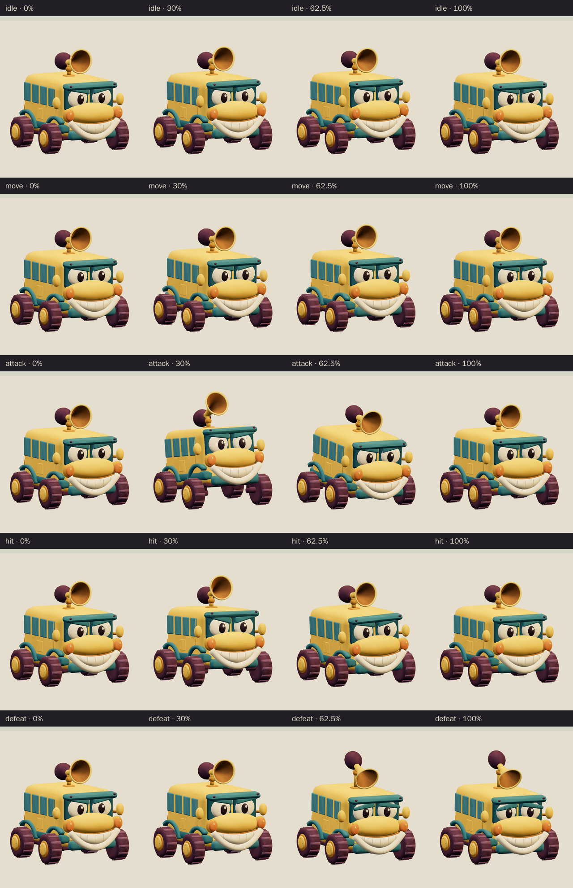
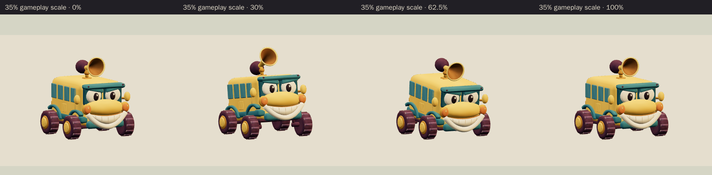

# Honk Bus · v001

**Awaiting Tom's review · used in the family release.** This cheerful-grumpy nursery bus is the World B chapter 1 boss candidate from [the locked era roster](../../../designs/026-personal-era-casts.md). Its honey-yellow body, huge plum tires, teal visor and cream bumper grin make a broad toy silhouette. The roof trumpet supplies its warning and comic honk.

[Concept prompt](../../media/honk-bus/v001/prompt.txt) · [Concept source and selection notes](../../media/honk-bus/v001/source.json) · [Model provenance](../../media/honk-bus/v001/provenance.json)

<figure><figcaption>Selected construction concept</figcaption></figure>
<figure><figcaption>Exact v001 model</figcaption></figure>

<model-viewer src="../../media/honk-bus/v001/honk-bus.glb" poster="../../media/honk-bus/v001/beauty.png" alt="Orbit the Honk Bus and inspect its five animations" camera-controls touch-action="pan-y" data-quest-clips shadow-intensity="0.7" camera-orbit="155deg 75deg auto"></model-viewer>

[Download exact GLB](../../media/honk-bus/v001/honk-bus.glb) · [Editable Blender master](../../media/honk-bus/v001/honk-bus.blend) · [Artifact manifest](../../media/honk-bus/v001/sha256-manifest.json)

<figure><figcaption>Front</figcaption></figure>
<figure><figcaption>Side</figcaption></figure>
<figure><figcaption>Back</figcaption></figure>

The model keeps the concept's short, chunky side view rather than the prompt's nominal 3.5 m length. The art lead reviewed the exact exported front, side and three-quarter views, including the held defeat. The lead's corrections are all present here:

- Thin rods along the roof edges were removed.
- The teal fenders now sit firmly on the body.
- The tire treads stay above the floor while the wheels turn.
- The horn's support stretches so the trumpet can droop in defeat without passing into the roof.
- In defeat, the eyelids lower and tilt into a sheepish look.

The eyes and windows are opaque painted panels, with no passengers or lettering. Earlier construction checkpoints are listed in the manifest.

| Exact exported model | Result |
| --- | --- |
| Size and placement | 2.097 m wide × 2.300 m tall × 2.465 m long at rest; the raised horn reaches 2.541 m during the attack. Metre scale, Y-up, forward −Z, floor-centered |
| Geometry | 14,642 triangles; one skin with 11 joints and at most two influences per vertex; two opaque material primitives |
| Texture | One original embedded 1024 × 1024 atlas; no external resource or required decoder |
| Download | 1,105,872 bytes; below the 2 MiB candidate budget |
| GLB SHA-256 | `0ea6f80966e4e11e7ec6251af9c371ad76f6a1a8f90aa67da27b7d5612b0a2ed` |
| Blender master SHA-256 | `645a6f63532559cdf648efa0b32ee8f46cc69cd50ff7f7eb4d86b8fbc87cde00` |

## Motion and checks

The viewer exposes `idle` (2.4 s), `move` (1.2 s), `attack` (2.0 s), `hit` (0.7 s) and `defeat` (2.4 s). In idle the bus bounces on its suspension; in move its wheels turn and the body bobs. For the attack it rocks back and raises the roof trumpet, holding that warning from 0.6 to 1.05 seconds. It then bounces forward in a big honk at **1.25 seconds** before settling. Hit is a surprised wobble. Defeat sinks the bus into a sheepish stall with a drooping horn and lowered brows, held from about 1.7 seconds. The wheels stay attached and the clips leave the root stationary; gameplay controls travel and damage.

[Khronos validation](../../media/honk-bus/v001/validation.json) reports zero errors and warnings. [Three.js inspection](../../media/honk-bus/v001/three-inspection.json) reimported the exact GLB and exercised the real enemy animation adapter. It sampled all 13,236 exported vertices at 530 animation steps and passed all 26 checks. It found stationary root tracks, fixed wheel and horn pivots, a held defeat pose and no floor penetration beyond export rounding. The horn stayed at least 3.2 cm above the roof. The [attachment audit](../../media/honk-bus/v001/attachment-inspection.json) kept every fender clear of its tire by at least 7.9 mm and every suspension strut connected. [Chromium playback](../../media/honk-bus/v001/browser-inspection.json) rendered changing frames for all five clips at normal and 35% scale with no page, console, HTTP or WebGL errors. [Author's visual notes](../../media/honk-bus/v001/visual-review.json) and the [scene release](../../media/honk-bus/v001/scene-release.json) record the corrections, preserved earlier masters and released Blender scene.

The catalog intake independently checked all 96 local artifact hashes against the manifest. It reran the Three.js inspection against the current enemy animation adapter and got identical bounds, contact and adapter results.

The browser evidence uses software Chromium. Physical iPad/iPhone Safari, device frame time and combat feel remain owner checks. This package contains visual animations only; the horn has no new audio file.

## Provenance and release

Driving Astra generated and selected the original concept with the built-in image tool. A fresh native Astra at `max` authored the model, atlas, rig and clips through Blender under [WO111](../../../../.agents/work-orders/111-era-cast-art-lead.md), with an exclusive scene lease. No family photograph, personal likeness, downloaded franchise model, logo or audio was used. The source scripts live in `scripts/assets/honk-bus/v001/`; the manifest identifies the durable master and matching authoring-service backup. Claude Opus 5.5 completed this catalog intake after the Codex lane reached its usage limit; it did not change the model.

[PRD-004 Q-03](../../../prds/004-family-release.md#owner-decisions) permits this candidate in the family release before Tom's review. The PLAN-019 cast integration registered this exact version as the gameplay boss `honk-bus@v001` in frozen `parody-catalog-v8` ([DESIGN-026](../../../designs/026-personal-era-casts.md#eligibility)); the family world generators place it in levels. Tom's exact-version decision is **pending**. A rejection returns that slot to a placeholder or prior version; catalog inclusion and technical checks do not constitute approval.
