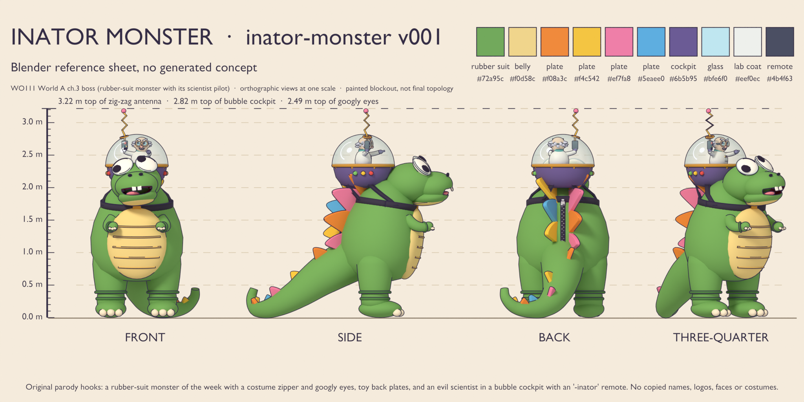
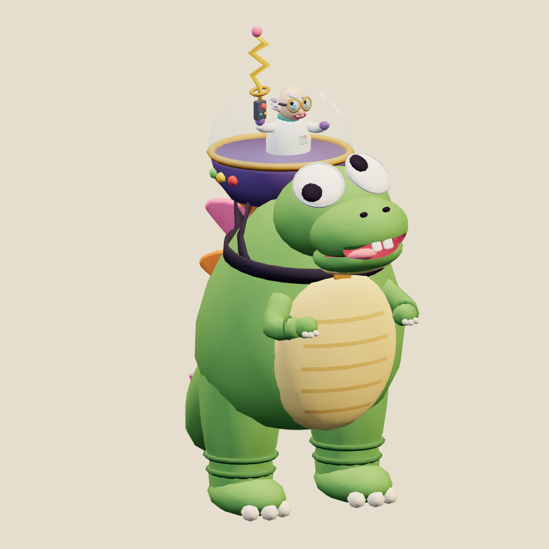
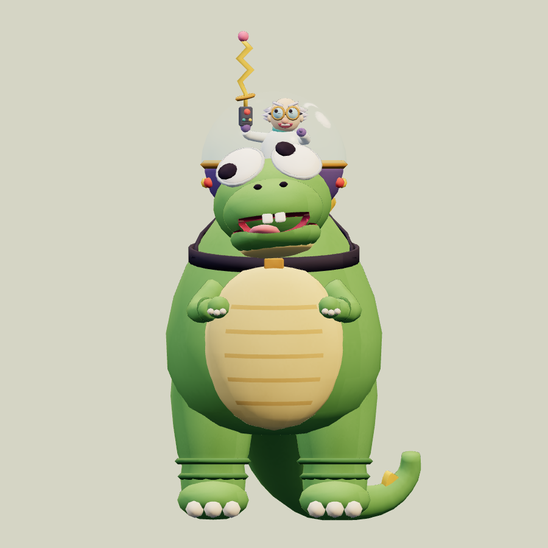
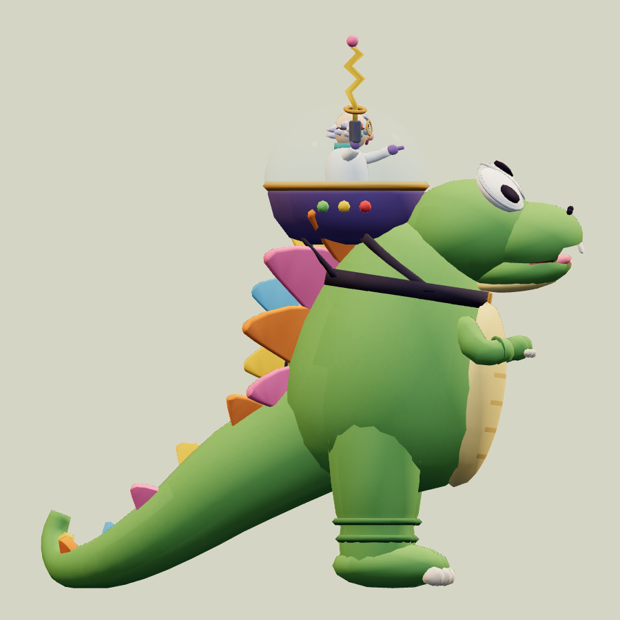
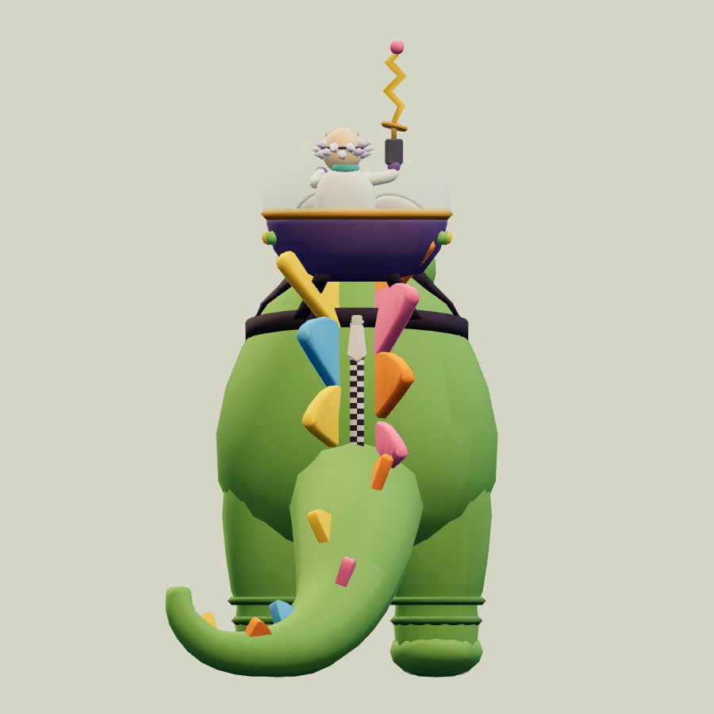
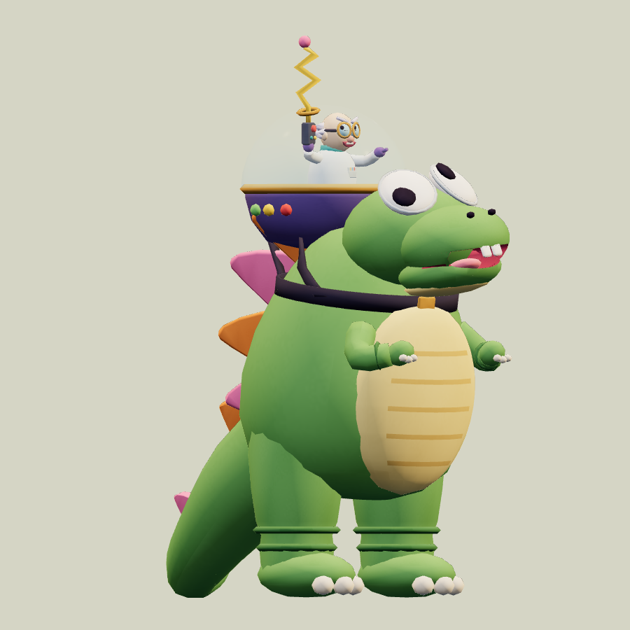
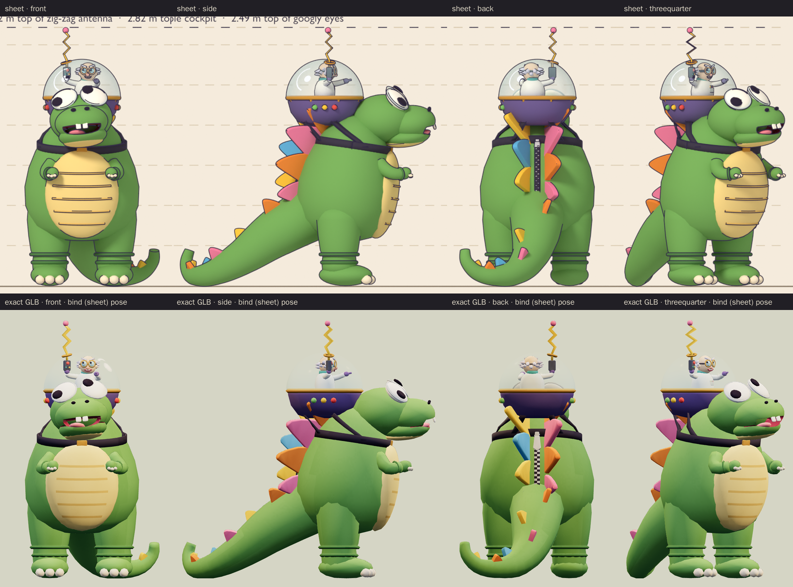
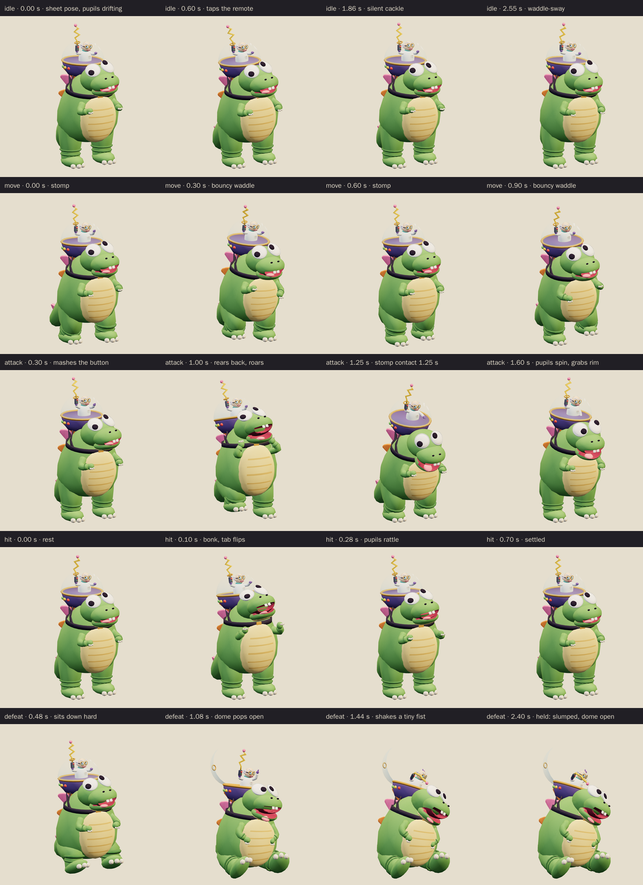
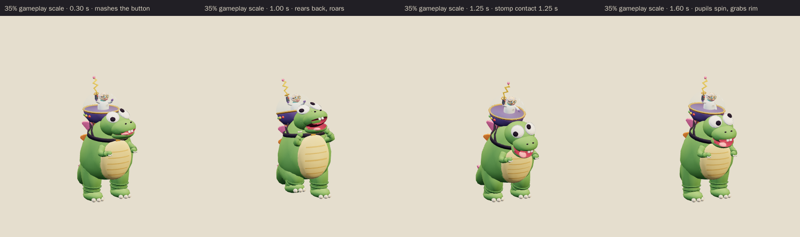

# Inator Monster · v001

**Awaiting Tom's review · used in the family release.** This giant rubber-suit monster and its pilot are the World A chapter 3 boss candidate from [the locked era roster](../../../designs/026-personal-era-casts.md), the Hero City chapter for ages 5 to 9. It is obviously a costume: glued-on googly eyes that point in different directions, baggy wrinkled ankles, toy-coloured back plates and a costume zipper down its back. A small cartoon evil scientist rides in a bubble cockpit strapped to its shoulders. He points "Attack!" with one hand and holds up his "-inator" remote with the other, and the remote's zig-zag antenna pokes out through a port in the glass. The scientist is the brains and the monster is the muscle. The family world template calls it The Monster-inator.

**Source: Blender reference sheet, no generated concept.** No image-generation model was used for this asset. Following [PRD-004 Q-07](../../../prds/004-family-release.md#owner-decisions), the author first rendered a painted Blender reference sheet from the written brief, and the coordinator approved it on September 26 before any detailing.

[Reference sheet notes](../../media/inator-monster/v001/reference-notes.md) · [Reference source record](../../media/inator-monster/v001/source.json) · [Model provenance](../../media/inator-monster/v001/provenance.json)

<figure><figcaption>Blender reference sheet, no generated concept</figcaption></figure>
<figure><figcaption>Exact v001 model</figcaption></figure>

<model-viewer src="../../media/inator-monster/v001/inator-monster.glb" poster="../../media/inator-monster/v001/beauty.png" alt="Orbit the Inator Monster and its scientist pilot and inspect the five animations" camera-controls touch-action="pan-y" data-quest-clips shadow-intensity="0.7" camera-orbit="155deg 75deg auto"></model-viewer>

[Download exact GLB](../../media/inator-monster/v001/inator-monster.glb) · [Editable Blender master](../../media/inator-monster/v001/inator-monster.blend) · [Reference blockout master](../../media/inator-monster/v001/inator-monster-blockout.blend) · [Artifact manifest](../../media/inator-monster/v001/sha256-manifest.json)

<figure><figcaption>Front</figcaption></figure>
<figure><figcaption>Side</figcaption></figure>
<figure><figcaption>Back</figcaption></figure>
<figure><figcaption>Three-quarter</figcaption></figure>

The comparison above shows the sheet and the exact export at matching angles and one metric scale. The bind pose is the sheet pose, and the export stills show it. The model follows the coordinator's sheet notes:

- It keeps the googly-eyed rubber-suit monster, the costume zipper, the toy back plates and the scientist in the bubble cockpit with the zig-zag "-inator" antenna.
- The pilot stays visible from the chase camera. Seen from 7.9 m out and 2.62 m up, at least part of his head shows from all six tested angles at rest. From the monster's right side, a third of the head sample points show; from the other five angles, all of them do. From behind, the camera looks over the tub and through the glass at his back.
- The attack is a stomp and roar while the scientist jabs the remote.
- The defeat slumps the monster down, and the cockpit dome pops open on its back hinge and stays open.

The author departed from the sheet in four deliberate ways:

- The painted window glint is fixed to the dome, at its upper front left, so it shows only from the front and left. The sheet's glint was a highlight that followed the camera.
- The eight small rivets on the cockpit rim are omitted. Their triangles went into smoother head forms.
- The belly scute bands keep the sheet's `#d9b466`. They look lighter than on the sheet, where ink outlines darkened them.
- The back of the monster's head tucks against the outside of the tub below the cockpit floor, as in the approved blockout. The attachment audit checks on every frame that the head never enters the cockpit.

The author also fixed these problems along the way:

- The glint first rendered as a full ring over the pilot. It is now a larger crescent at the upper front left, and the glass is more transparent (6% opaque at the top, 38% at the rim) because the dome first looked milky.
- The blockout's antenna port was 8 mm off the antenna rod; it is now centred on it.
- Close-ups showed facets on the head, so the head segment counts were raised. Dropping the rim rivets and trimming the ring counts on the tail, dome, belly, rim and torso paid for it.
- The zipper pull tab first sank into the bulging back. It now lies along the back and flips up on a hit.
- Tilting the head back for the roar hid the pilot from the front. The tilt is smaller now; the roar is in the open jaw.
- Keyframe interpolation dipped rolled feet up to 1.3 mm below the floor. The soles and tail now rest on a 6 mm contact plane, and a foot guard keeps a margin.
- The hit head-bonk and arm flail pushed the pilot through the glass. Both are softer now.

Both faces are silly rather than scary. The teeth are two square buck teeth, the claws are rounded cream nubs and the plate tips are rounded. There is no weapon, fire or laser, and nothing on the model carries lettering, a logo or a jingle. The remote is a generic chunky box with a big red button, two dials, a speaker grille and the antenna.

| Exact exported model | Result |
| --- | --- |
| Size and placement | 1.675 m wide × 3.217 m tall to the antenna ball × 3.181 m deep at rest, including the tail. The glass dome tops out at 2.82 m and the googly eyes at 2.49 m; the monster's own mass is 2.49 m tall, so only the dome and the thin antenna rise above it. The soles and the resting tail sit on a 6 mm contact plane. Across all clips the highest point is 3.265 m. Metre scale, Y-up, forward −Z, floor-centered |
| Geometry | 14,575 triangles (14,200 opaque and 375 glass); 7,545 Blender vertices, 12,546 after export; one skin with 41 joints for the monster and pilot together, at most four influences per vertex |
| Materials | Two: an opaque, double-sided painted material and an alpha-blended, single-sided glass for the dome. Both sample the same atlas |
| Texture | One original embedded 1024 × 1024 indexed-palette atlas (191,543 bytes); only its glass tiles are translucent. No external resource or required decoder |
| Download | 1,234,756 bytes; below the 2 MiB candidate budget |
| GLB SHA-256 | `215e6c5fad6db31c04eb4a5df5538a4fbc285aee00147294110b943166b82671` |
| Blender master SHA-256 | `72542af836a6f6ba7284fab4584f339646f69145c6e39b9fa9eff1ee17f00f96` |
| Reference sheet SHA-256 | `12bdf82a9f573692c05ac029d64dda3bc6d8b075c24ebabc10ddc9ea4be951b9` |

The brief asked for a 3.0 to 3.4 m boss, taller than the work order's usual 2 to 3 m. The coordinator approved the sheet at that height. If gameplay wants a smaller collision height, 2.49 m covers the monster itself.

## Motion and checks

The viewer exposes `idle` (3.0 s), `move` (1.2 s), `attack` (2.0 s), `hit` (0.7 s) and `defeat` (2.4 s):

- **Idle:** a costume waddle-sway with a lazy tail swish and drifting googly pupils. The scientist taps his remote twice, then does a silent shoulder-bob cackle.
- **Move:** a stompy, bouncy waddle. The tail sways, the plates bob and the jaw flaps, while the scientist points ahead.
- **Attack:** the scientist raises the remote and mashes the red button while the antenna wiggles. From 0.55 seconds the monster rears back roaring with its tiny arms up and its right foot lifted about 21 cm. It comes down in a belly-bounce stomp: the right foot hits the floor at **1.25 seconds** with the jaw wide open, as the scientist jabs the remote up. It then wobbles back, both pupils spin two full turns, and the scientist grabs the rim.
- **Hit:** a jolt. The googly pupils rattle, the zipper pull tab flips up, the scientist bonks his head on the glass and the dome wobbles.
- **Defeat:** the suit goes floppy and the monster sits down hard with its legs splayed, then slumps sideways with its tongue out and its pupils crossed. The cockpit dome pops open on its back hinge, the antenna droops into a limp squiggle, and the scientist shakes a tiny fist. The pose is held from 1.8 seconds.

The clips leave the root stationary; gameplay controls travel and damage.

[Khronos validation](../../media/inator-monster/v001/validation.json) reports zero errors, warnings, infos and hints, and all 21 contract checks pass. [Three.js inspection](../../media/inator-monster/v001/three-inspection.json) reimported the exact GLB and exercised the real enemy animation adapter. It sampled all 12,546 exported vertices at 565 animation steps and passed all 38 checks:

- The root stays still, and rotation-only joints keep their pivots.
- The idle and move loops are seamless, and the defeat pose holds.
- No clip goes below the floor; the lowest point is 1.3 mm above it.
- The culling envelope stored in the model covers every pose.
- The right foot lifts before the stomp and is on the floor at contact, with the jaw open and the remote jabbed.
- The antenna rod stays inside the brass port whenever the dome is closed, at most 24.5 mm off centre where 30 mm is allowed.
- The pilot's head is visible from all six chase-camera angles at rest and at contact. From the front it stays at least partly visible through the whole attack; at the 1.0 second rear-back peak, one of six head points shows.
- On a hit the tab flips, the head bonks and the pupils rattle. The held defeat is seated, with the dome open, the antenna drooped and the pupils crossed.

The [attachment audit](../../media/inator-monster/v001/attachment-inspection.json) ran on the live Blender scene that exported the GLB. It checked seven part pairs on every frame of every clip: the tail against each leg and the feet, the legs against each other, the head and the pilot against the glass, and the arms against the head. It found no overlaps, and the leg, tail, arm and antenna joints stayed connected. No head vertex entered the cockpit, and the pilot's head stayed inside the closed glass. [Chromium playback](../../media/inator-monster/v001/browser-inspection.json) rendered changing frames for all five clips at normal and 35% scale, drew both the opaque and glass parts, and rendered the chase-camera views. It had no page, console, HTTP or WebGL errors and no external requests. [Author's visual notes](../../media/inator-monster/v001/visual-review.json) and the [scene release](../../media/inator-monster/v001/scene-release.json) record the corrections and the released Blender scene.

The catalog intake checked all 157 local artifact hashes against the manifest. It reran the Three.js inspection against the current enemy animation adapter and got byte-identical results. Four small run logs from the sheet stage (in `source/`) are listed in the manifest but not published, because the repository ignores log files; they stay in the durable artifact directory.

Two runtime limitations affect this model in the game:

- The game draws enemy skinned meshes with a bounding sphere that three.js computes once, at the first rendered pose, and it does not yet apply the culling envelope the model exports. The intake measured this model against its first idle pose. During the defeat, the popped-open glass dome moves up to 1.05 m outside its sphere, so it could vanish near the screen edge; the body moves at most 0.11 m outside its own. The fix belongs in the runtime code and is tracked in [issue 103](https://github.com/thaynes43/haynes-quest/issues/103); the model needs no change.
- The game casts shadows from every mesh, so the glass dome casts a shadow too.

The browser evidence uses software Chromium. Physical iPad/iPhone Safari, device frame time and combat feel remain owner checks. This package contains visual animations only; there is no new audio file.

## Provenance and release

Claude Opus 5.5 (`claude-opus-5-5`, effort `xhigh`) authored both stages through Blender 4.5.13 under [WO111](../../../../.agents/work-orders/111-era-cast-art-lead.md), under Tom's September 26 ruling. It built the procedural blockout and rendered the reference sheet on the first Blender authoring service. After the coordinator approved the sheet, it built the final topology, atlas, 41-bone rig and all five clips on the second service, holding an exclusive scene lease from 18:03 to 18:52 UTC. No family photograph, personal likeness, downloaded franchise model, character design, logo, lettering, catchphrase or audio was used. The rubber-suit monster of the week, the dinosaur kaiju shape and the evil scientist riding his monster are genre jokes; the googly-eyed bean head, the zipper between staggered toy plates, the strapped-on cockpit tub and the scientist's look are original choices. The [sheet-stage records](../../media/inator-monster/v001/sheet-stage/README.md) keep the sheet's own lease, release and manifest. The source scripts live in `scripts/assets/inator-monster/v001/`.

[PRD-004 Q-03](../../../prds/004-family-release.md#owner-decisions) permits this candidate in the family release before Tom's review. For now, the current World A template `family-world-a@v2`, like the frozen v1, fills the chapter 3 boss slot with The Monster-inator as a project candidate with neutral placeholder art. The coordinator will register this exact version in a later parody catalog before it appears in levels. Tom's exact-version decision is **pending**. A rejection returns that slot to a placeholder or prior version; catalog inclusion and technical checks do not constitute approval.
