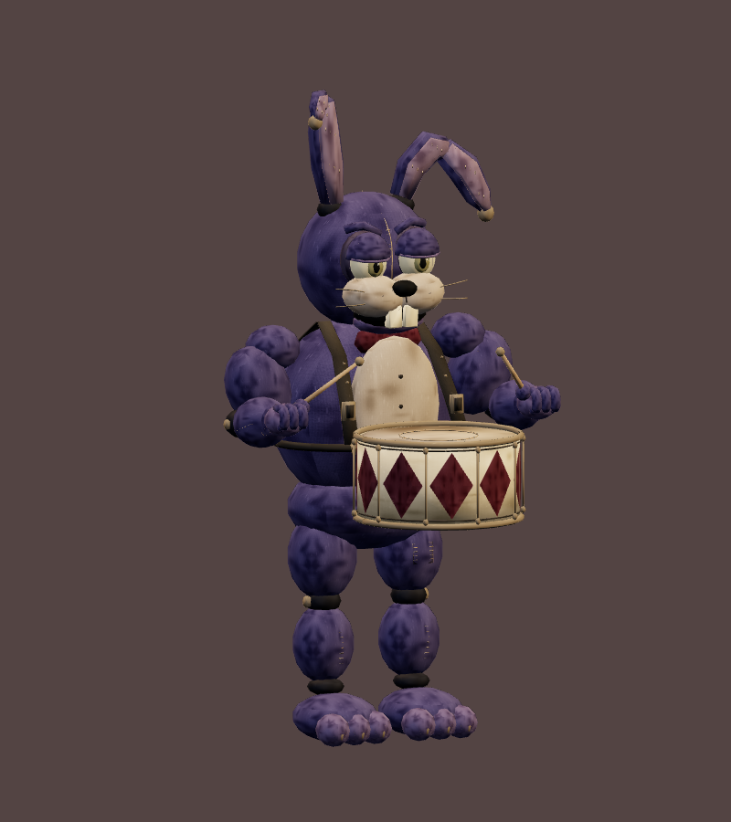
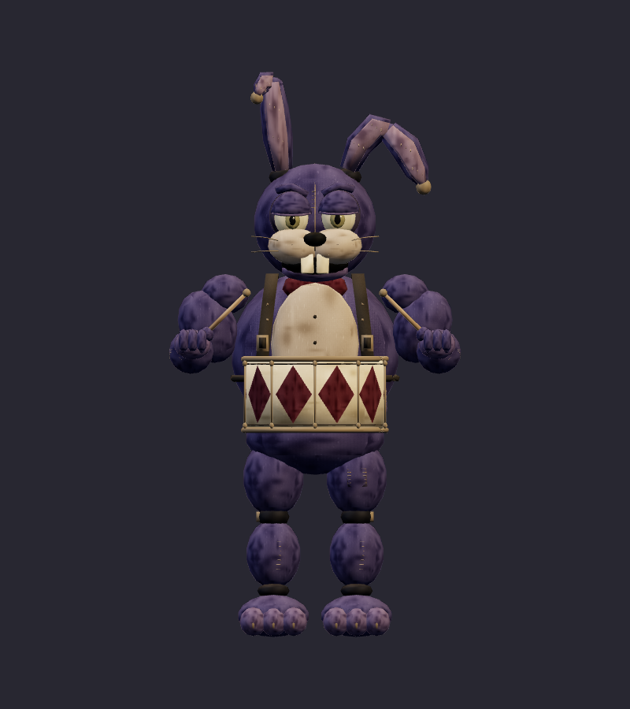
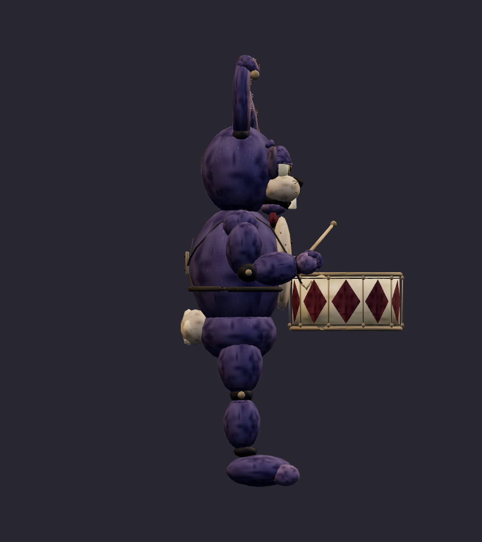
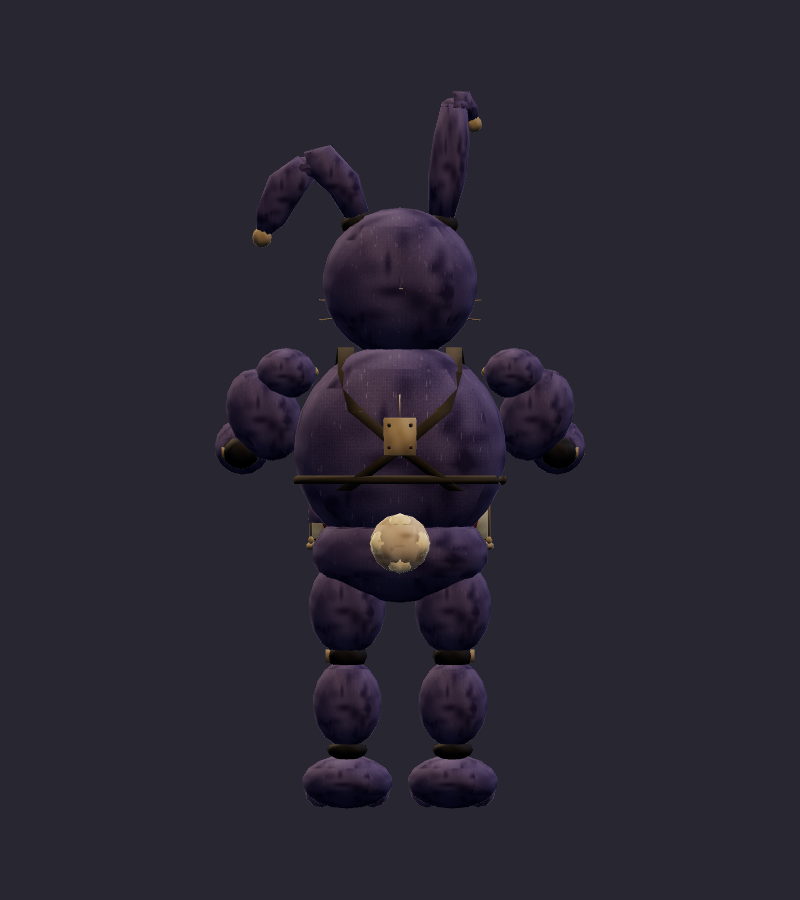
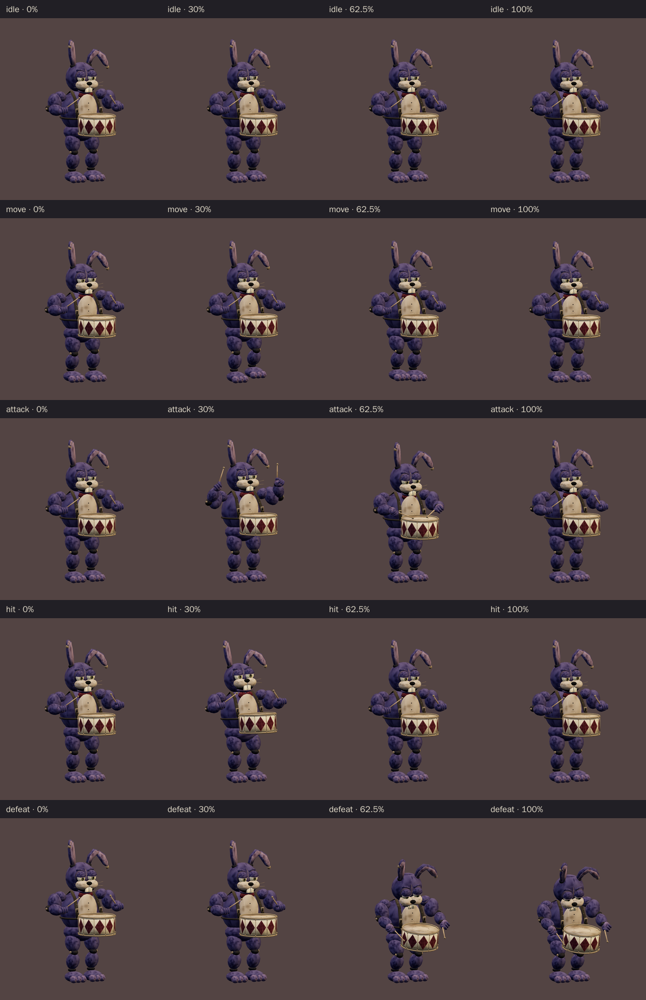
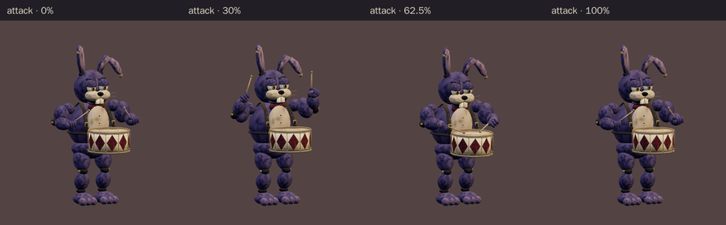

# Jackrabbit Drummer · v001 worn mascot

**Validated Blender model candidate · Private Rat Casino playtest second ordinary encounter · Final device/art review pending.** The jackrabbit is a supporting performer in the proposed six-character Rat Casino cast. His old snare and uneven ears identify him beside the central Rat Pit Boss. This v001 model follows the [corrected ensemble](../rat-casino-ensemble/v003.md) and the [patched indigo construction sheet](../../media/rat-casino-ensemble/v003/construction/jackrabbit-drummer.png). The earlier glossy rabbit study remains in the ensemble's superseded history.

[Construction image prompt](../../media/rat-casino-ensemble/v003/construction/jackrabbit-drummer-prompt.txt) · [Image source and checksums](../../media/rat-casino-ensemble/v003/source.json) · [Model provenance](../../media/jackrabbit-drummer/v001/provenance.json)

<figure><figcaption>Selected v003 construction reference</figcaption></figure>
<figure><figcaption>Exact exported v001 model · studio candidate</figcaption></figure>

<model-viewer src="../../media/jackrabbit-drummer/v001/jackrabbit-drummer.glb" poster="../../media/jackrabbit-drummer/v001/beauty.png" alt="Orbit the worn Jackrabbit Drummer and inspect his five animations" camera-controls touch-action="pan-y" data-quest-clips shadow-intensity="0.7" camera-orbit="155deg 75deg auto"></model-viewer>

[Download exact GLB](../../media/jackrabbit-drummer/v001/jackrabbit-drummer.glb) · [Editable Blender master](../../media/jackrabbit-drummer/v001/jackrabbit-drummer.blend) · [Artifact manifest](../../media/jackrabbit-drummer/v001/sha256-manifest.json)

<figure><figcaption>Front</figcaption></figure>
<figure><figcaption>Side</figcaption></figure>
<figure><figcaption>Back</figcaption></figure>

The broad indigo shell, heavy tired lids, blunt muzzle and buck teeth retain an old family-venue mascot feel. One ear now stays nearly upright while the other droops sharply; both read at small play distance. The lead also asked the author to close the first ear-fold gaps, make the rear harness continuous and curve the worn burgundy diamond marks onto the drum shell. The final GLB above includes those revisions. Tom liked the displayed exact cast and asked to move forward with the Rat Casino level; final device/art acceptance remains open.

| Exact exported model | Result |
| --- | --- |
| Size and placement | 1.960 m tall including highest ear; about 1.014 m wide and 1.013 m deep; metre scale, Y-up, forward −Z, floor-centered |
| Geometry | 14,700 triangles; two opaque material primitives; one skin, 28 pivots, up to four influences per vertex |
| Texture | One original embedded 1024 × 1024 atlas; no external resource or required glTF extension |
| Download | 1,435,260 bytes; below the 2 MiB candidate budget |
| GLB SHA-256 | `00096fb0bdef15c5b45a32a2265e2744d91c54b10004014de5e45e5682672da3` |
| Blender master SHA-256 | `9c2a45b5e91db402ffebc4d9171e0d7bed128312a20996f30652f7ba0ab57a0e` |

## Motion and technical review

The viewer above exposes all five exact clips. `idle` lasts 2.8 seconds and `move` 1.4 seconds; both loop. `attack` lasts 2.0 seconds: the sticks rise into a readable warning, then both touch the drum head at 1.25 seconds. `hit` lasts 0.7 seconds. `defeat` lasts 2.4 seconds and holds a slumped pose with the drum and sticks attached. The GLB supplies a gesture; later gameplay owns any sound, damage or hazard.

[Khronos validation](../../media/jackrabbit-drummer/v001/validation.json) reports zero errors and warnings. [Three.js inspection](../../media/jackrabbit-drummer/v001/three-inspection.json) reimported the exact GLB, exercised the actual enemy animation adapter and sampled every exported skin vertex at 60 Hz through all five clips. Bounds covered the moving ears, drum and sticks. The measured stick beads reach the drum head at the contact pose; attachments remain fixed and the floor check passes within its 0.01 mm tolerance. [Chromium WebGL playback](../../media/jackrabbit-drummer/v001/browser-inspection.json) rendered changing frames for every clip at normal and 35% scale with no page, console, HTTP or WebGL error and no external request. [Author's visual notes](../../media/jackrabbit-drummer/v001/visual-review.json) and [scene release](../../media/jackrabbit-drummer/v001/scene-release.json) record the revisions and safe handoff.

The browser check used software Chromium. Physical iPad/iPhone Safari, device frame time and combat feel remain untested. This exact `v001` GLB is pinned as the **second ordinary encounter in the private fictional Rat Casino playtest**, following Tom's September 23 “Looks great, let’s move forward” direction. Its SHA-256 is `00096fb0bdef15c5b45a32a2265e2744d91c54b10004014de5e45e5682672da3`. Final art acceptance follows the live level and device review.

A fresh Astra Blender author built the candidate under [WO101](../../../../.agents/work-orders/101-jackrabbit-drummer-classic.md) using the selected original ensemble and construction sheet. [Model provenance](../../media/jackrabbit-drummer/v001/provenance.json) records the inputs and original procedural atlas. Source scripts live in `scripts/assets/jackrabbit-drummer/v001/`; the manifest records matching local and Blender-service artifact hashes. No downloaded franchise model, texture, family photograph or personal likeness was used.
