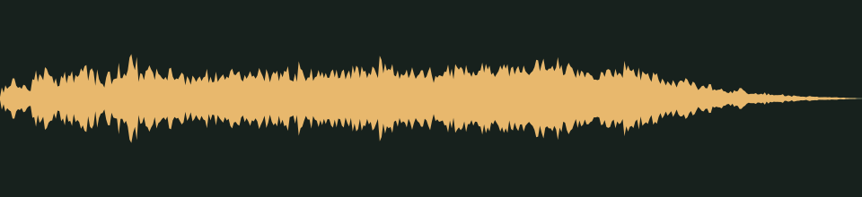

# It found you · v001

**Audio candidate · scary moments · in the family worlds’ scary chapters · listening review pending.** A sudden mechanical shriek over a metallic slam, for the moment an animatronic catches the player.

## Audition

This cue is meant to startle. Turn your volume down before the first listen.

<audio controls preload="none" aria-label="Audition jump-scare-sting version one">
  <source src="../../media/jump-scare-sting/v001/cue.wav" type="audio/wav">
  <a href="../../media/jump-scare-sting/v001/cue.wav">Download the processed cue</a>
</audio>

[Processed cue](../../media/jump-scare-sting/v001/cue.wav) · [Original five-second take](../../media/jump-scare-sting/v001/source.wav)

## Exact version

| Property | Measured result |
| --- | --- |
| Stable cue / version | `jump-scare-sting` / `v001` |
| Duration | 1.00 seconds |
| Format | PCM signed 16-bit WAV, stereo, 44.1 kHz |
| Download size | 176,444 bytes |
| Peak / RMS | -6.0 / -19.871 dBFS |
| Clipped samples | 0 |
| Processed SHA-256 | `cdc0b85cee5df4f9ffe68780c6916f58ce4bfda3678f1979102a698a9a8e81af` |
| Source SHA-256 | `7c1c219d813aa8b506c1b5a48fe22df6115e656601256b078fdfe12186ba80b9` |

Processing selects the segment beginning at 0.160 seconds, trims it to the stated duration, applies a 0.005-second entrance and 0.220-second exit fade, then normalizes its peak to -6 dBFS. That is louder than any other cue, because this one has to make you jump. It is a one-shot cue, not a loop. The source is preserved separately. [Exact recipe](../../media/jump-scare-sting/v001/processing.json), [measurements](../../media/jump-scare-sting/v001/verification.json), and [reproducible processing script](../../../../scripts/assets/audio/process_cues.py).

## Source and checks

Generated on 2026-09-26 by a Claude Code subagent (Opus 5.5) from the workflow coordinator's cue brief, using the separate Stable Audio 3 Small-SFX CPU service (service version 0.2.0). This take used seed 321, eight steps and five seconds. It contains no supplied recording or personal reference. The [provenance record](../../media/jump-scare-sting/v001/provenance.json) retains the complete prompt, service/model revisions, every other attempt and the source terms recorded in [DESIGN-008](../../../designs/008-audio-pipeline.md). The source code, model and redistributed text component have separate terms; no broader license is asserted here.

The service and download SHA-256 checks passed, as did WAV decoding and the exact-duration, non-silence and zero-clipping checks. Re-running the processing script reproduced the same output. These measurements do not establish timbre or musical quality.

## Listen-proxy check

Nobody has listened to this take; the agent cannot hear audio. Instead, it measured the source's level in 20 ms windows, a rough autocorrelation pitch track, the zero-crossing rate and a four-band energy split, and chose the segment from those numbers. The cue opens about 17 dB below its peak and reaches full level within 40 ms. It holds there until about 0.75 seconds, then falls by about 35 dB before the end. In the first 0.2 seconds about 80% of the energy sits below 300 Hz: the slam. From 0.2 to 0.75 seconds a third to a half of it moves to 1–4 kHz, with bright peaks between about 1.4 and 2.8 kHz: the shriek.

Energy split of the processed cue: 40.1% below 300 Hz, 6.5% at 300 Hz–1 kHz, 42.2% at 1–4 kHz and 11.2% above 4 kHz. These numbers hint at shape and brightness; they cannot say how the cue sounds. The prompt excluded voices and human screams, but only listening can confirm that nothing in it sounds like a person screaming.

## Coordinator and owner review

Review focus: Whether it startles hard enough, whether the slam lands at the very start, and whether it stays mechanical rather than sounding like a scream.

- **Coordinator technical intake:** Passed numerically; listening/creative selection pending.
- **Tom’s decision:** Pending, against the exact hash above.
- **Gameplay integration:** Plays with every [DESIGN-027](../../../designs/027-scare-pass.md) jump scare at scare level 2; `family-world-a@v4` sets Rat Casino After Hours (A4) to that level. Nobody has heard it in the game yet, and Tom’s exact-version review still decides final use. At gain 1.25 it peaks at -6 dBFS at the default master: about 4 dB above the loudest other one-shot and 3 dB under the limiter's threshold. It has the highest priority, so it can replace any other sound at the four-source cap. [DESIGN-008](../../../designs/008-audio-pipeline.md#scary-moments-cues) records the manifest; the inventory records it as a private candidate.

## Retained attempts

Two earlier takes were not selected. The first swells in over about half a second (about -41 dBFS at 0.1 seconds to -18 dBFS at 0.5 seconds) instead of striking at once, and its only low thump comes near 1.5 seconds, after the shriek. The second strikes instantly as a heavy slam but has almost no shriek: 84% of its first two seconds sits below 300 Hz and only about 7% at 1–4 kHz. The third prompt asked for the slam and the shriek together at the very first instant and produced the candidate above.

- [Source attempt 1](../../media/jump-scare-sting/v001/source-attempt-1.wav) (seed 301) with its [measurements](../../media/jump-scare-sting/v001/source-attempt-1-verification.json)
- [Source attempt 2](../../media/jump-scare-sting/v001/source-attempt-2.wav) (seed 311) with its [measurements](../../media/jump-scare-sting/v001/source-attempt-2-verification.json)

The prompts, seeds and job IDs of every attempt are in the provenance record. These decisions rest on measurements, not on listening.
