# Lab Robot Sentry · v001

**Awaiting Tom's exact-version review · DESIGN-029 action-worlds candidate.** This broad toy robot is a new ordinary enemy for the Hero City cast in [DESIGN-029](../../../designs/029-action-and-inhabited-worlds.md). It is the bigger, slower guard model of the scientist's [Lab Robot](../lab-robot/v001.md): it stomps after the player and clamps both pincers shut in front of its lens. Under [PRD-004 Q-03](../../../prds/004-family-release.md#owner-decisions) it may appear in the children's levels while labelled awaiting review here. Coordinator review and owner approval remain separate.

It is built from row 3 of the coordinator's construction reference:

- a rounded cream shell that is head and body in one, with teal side bands, a teal top visor and a teal bottom band, grey screws and a slatted back vent;
- one big round orange lens with a glint, set in a thick dark bezel and housing, and a springy antenna with a teal ball on top;
- plum shoulder spheres, chunky plum arms with teal joint discs, and big teal C-shaped pincers that open and clamp at the wrists;
- a dark grey pelvis, stocky plum legs with teal knee caps and ankle discs, and big plum boots with teal toe caps and dark soles.

**Source: coordinator-generated concept, built as an original Blender model.** The concept is build direction only; no image is projected or pasted onto the model. Every part is modelled geometry painted from one original 1024 × 1024 colour atlas. There are no copied meshes, logos or lettering, and no gore.

[Full concept sheet](../../media/action-minions-a/v001/concept.png) · [Model provenance](../../media/lab-robot-sentry/v001/provenance.json) · [Construction record](../../media/lab-robot-sentry/v001/construction.json)

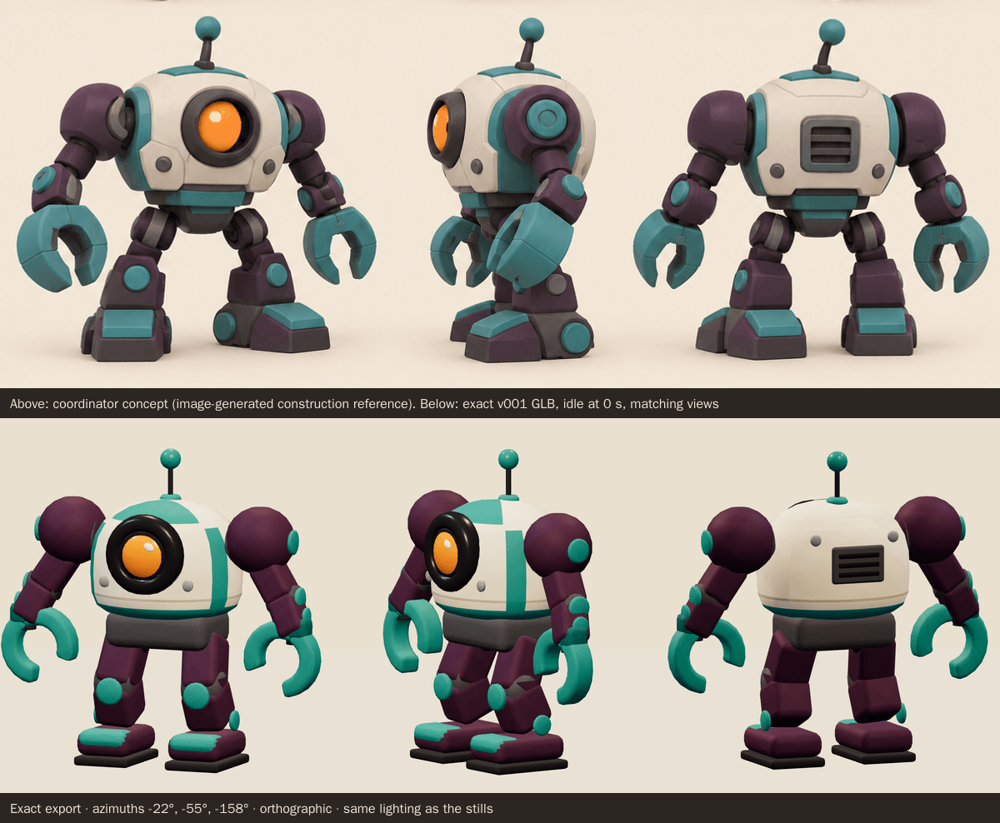

<model-viewer src="../../media/lab-robot-sentry/v001/lab-robot-sentry.glb" poster="../../media/lab-robot-sentry/v001/beauty.png" alt="Orbit the Lab Robot Sentry and inspect its five animations" camera-controls touch-action="pan-y" data-quest-clips shadow-intensity="0.7" camera-orbit="155deg 78deg auto"></model-viewer>

[Download exact GLB](../../media/lab-robot-sentry/v001/lab-robot-sentry.glb) · [Editable Blender master](../../media/lab-robot-sentry/v001/lab-robot-sentry.blend) · [Review video (WebM, 768 KiB)](../../media/lab-robot-sentry/v001/review.webm) · [Artifact manifest](../../media/lab-robot-sentry/v001/sha256-manifest.json)

<figure>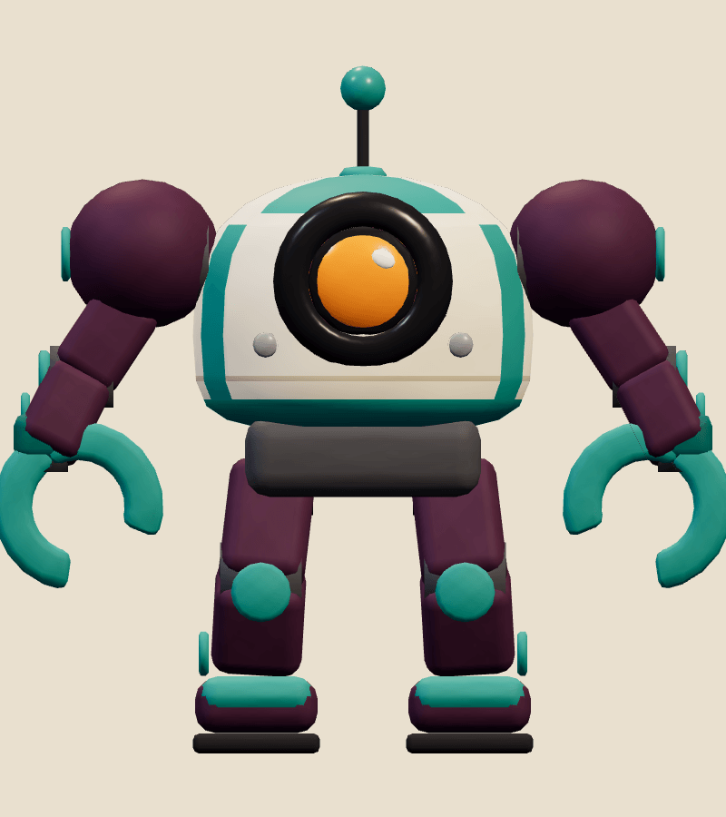<figcaption>Front</figcaption></figure>
<figure>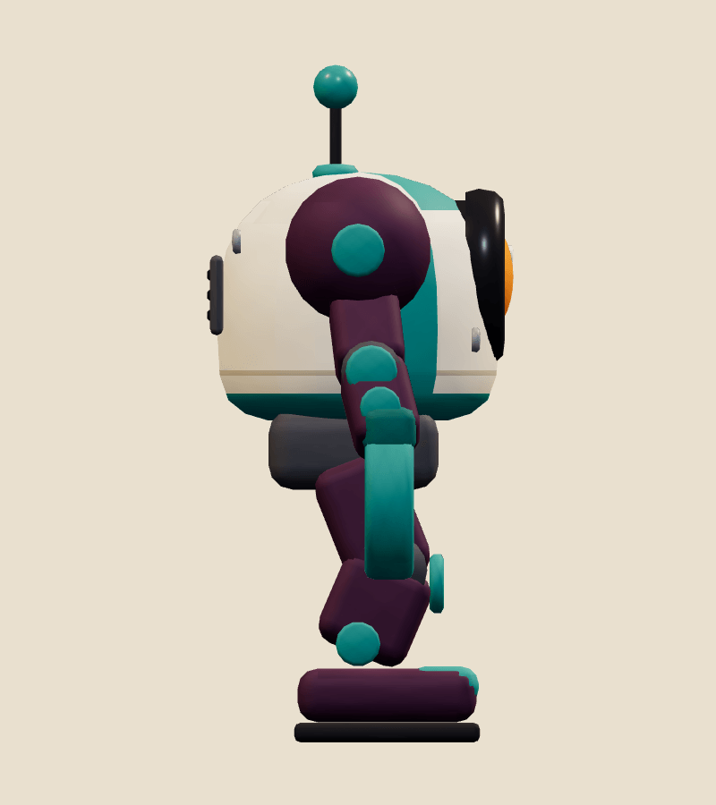<figcaption>Side</figcaption></figure>
<figure>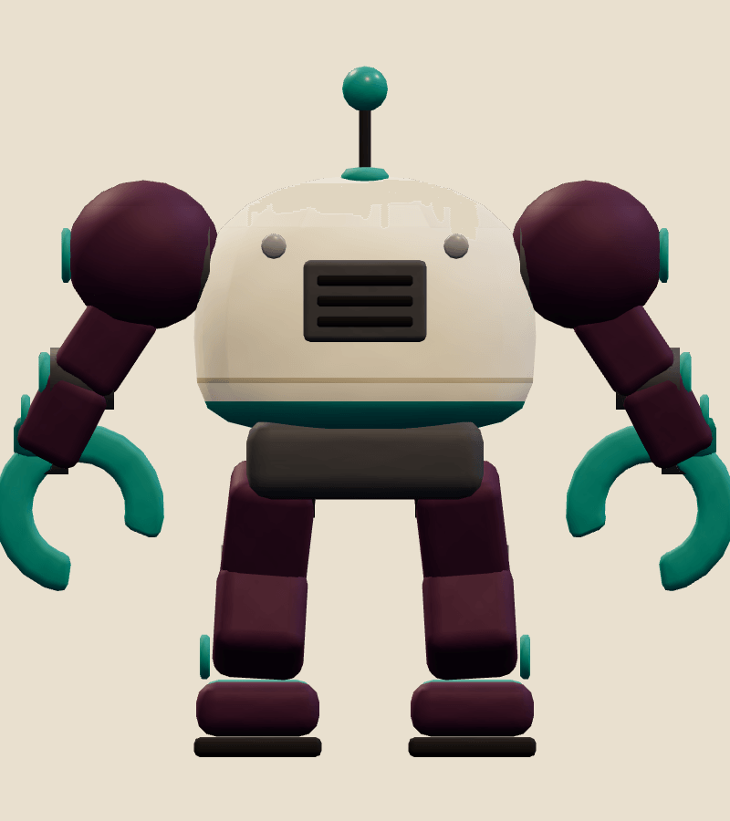<figcaption>Back</figcaption></figure>
<figure>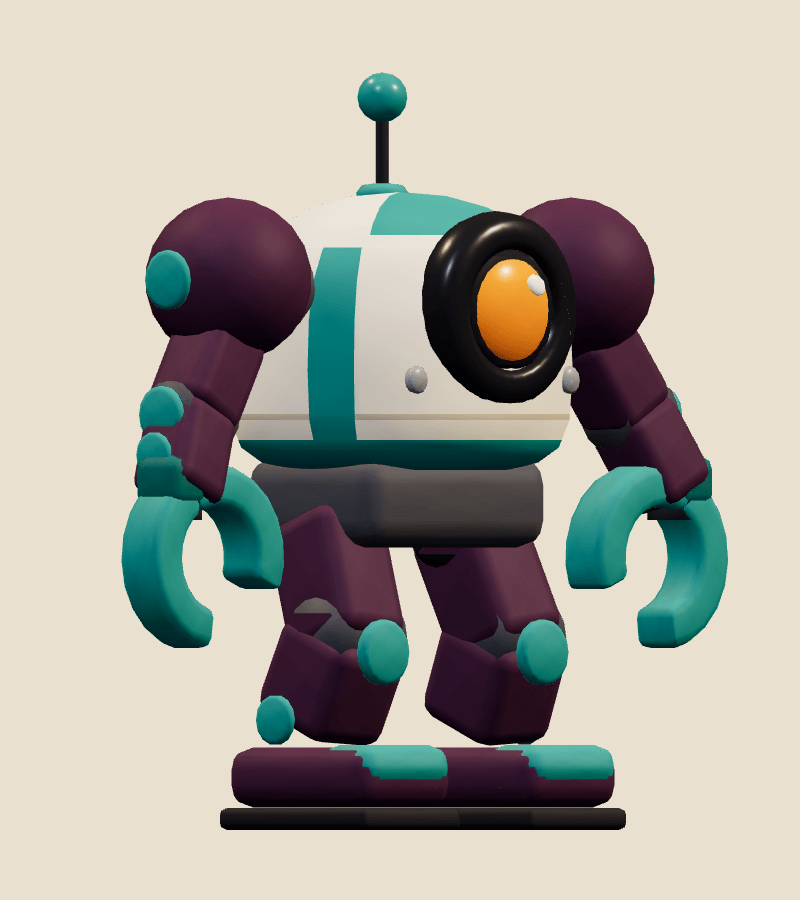<figcaption>Three-quarter</figcaption></figure>

| Exact exported model | Result |
| --- | --- |
| Size and placement | 1.515 m tall in the concept pose, 1.631 m wide and 0.684 m deep. Across all clips it spans -1.16 to 1.16 m across, up to 1.52 m high and -0.90 to 1.00 m front to back; nothing goes below the floor. Metre scale, Y-up, forward −Z, floor-centred stationary root, character right +X |
| Geometry | 11,154 triangles; one skin with 25 joints and at most 2 influences per vertex |
| Materials | 2 opaque materials sampling one atlas: Matte painted clay, Glossy toy accents; one draw primitive each |
| Texture | One original embedded 1024 × 1024 PNG atlas (112,522 bytes), painted procedurally in Blender Python; no external resource or required decoder |
| Download | 1,226,608 bytes; below the 2 MiB budget |
| GLB SHA-256 | `7d353adf7f8c8ab2795cfff3b66f2a665aa49a4396967f9621a46f6a1b18e2d0` |
| Blender master SHA-256 | `805ba795dfd3cc0ff3bf8bd889d5cf9632ad1414d2c9f2d4c9e1d73faddedd0b` |

## Motion and checks

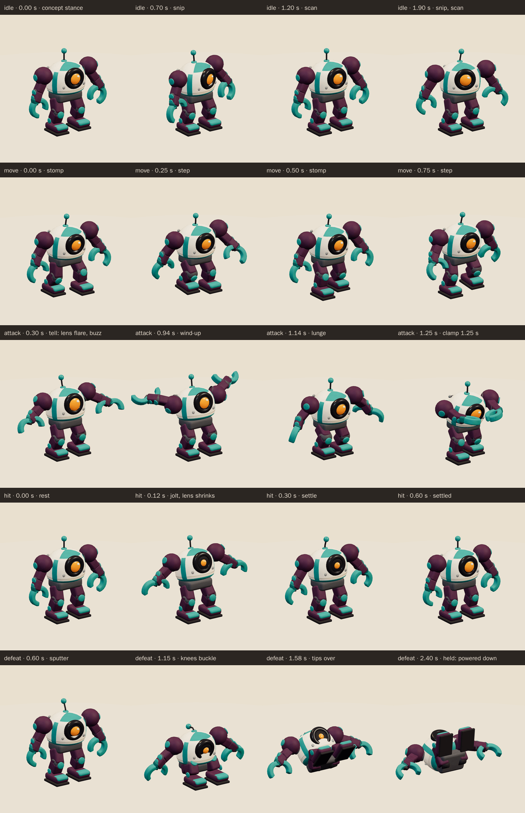

The viewer exposes `idle` (2.4 s), `move` (1 s), `attack` (2 s), `hit` (0.6 s), `defeat` (2.4 s):

- **Idle:** from the concept stance it bobs on its knees and scans left and right; the lens glances and pulses, the antenna wobbles on its spring and each pincer snips once.
- **Move:** a stompy march in place: each boot lifts, swings forward and plants while the other slides back. The pelvis bobs and sways, the shell counter-rolls, the arms swing, the pincers clack and the antenna bounces.
- **Attack:** the tell (to 0.45 s): the lens flares and flickers, the antenna buzzes, it crouches and spreads both pincers wide open. The wind-up (0.45–1.0 s) leans back with both pincers raised high behind its shell. Then it lunges a step forward and swings both pincers down together, clamping shut in front of its lens at **1.25 seconds**, before stepping back to the concept stance.
- **Hit:** it jolts back and the lens shrinks to a dot, the antenna whips, and the pincers snap open before it settles.
- **Defeat:** it sputters: the shell twitches, the lens flickers and dims and the antenna droops. Its knees buckle and it sits down hard, then tips over onto its back with both boots in the air and the pincers flopped open on the floor. The pose is held from 1.95 s with the lens shrunk and the antenna drooped.

The clips keep the root still; gameplay moves and turns the enemy. In the game, the wind-up plays the attack from its start to the 1.25 second contact at the enemy's wind-up speed, so the tell and the wind-up both show.

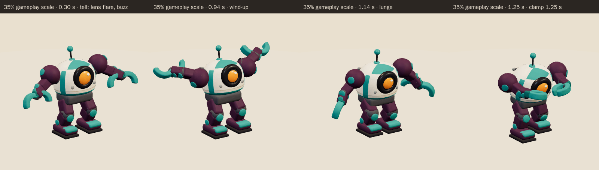

<figure>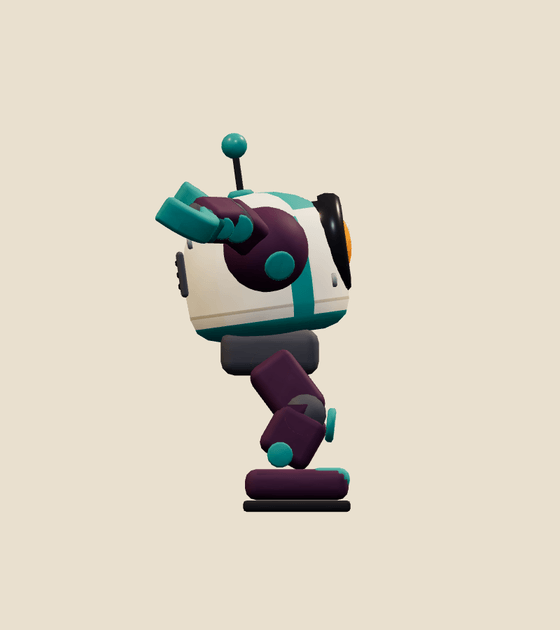<figcaption>Attack wind-up</figcaption></figure>
<figure>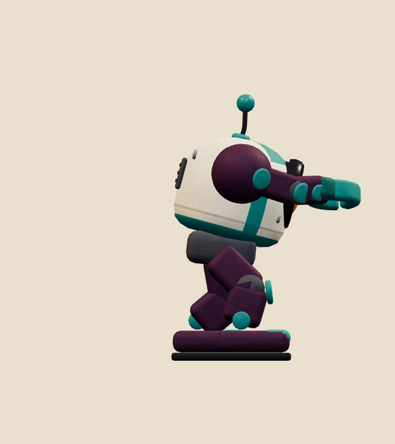<figcaption>Contact, 1.25 s</figcaption></figure>
<figure>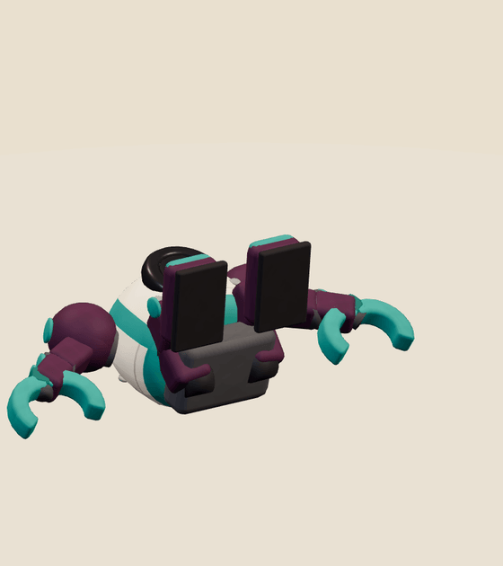<figcaption>Held defeat</figcaption></figure>
<figure>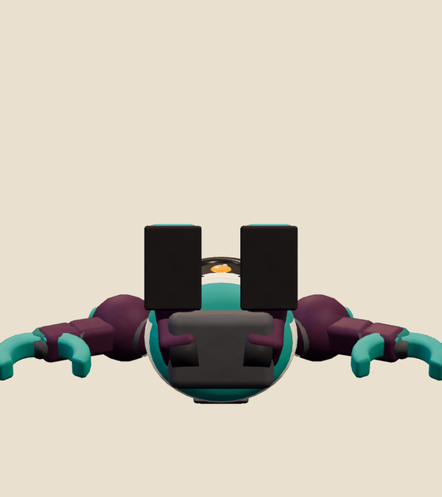<figcaption>Held defeat, front</figcaption></figure>

[Khronos validation](../../media/lab-robot-sentry/v001/validation.json) reports 0 errors, 0 warnings, 0 infos and 0 hints (gltf-validator 2.0.0-dev.3.10, run in the Blender pod on the exact bytes), and all 20 contract checks pass.

[Three.js inspection](../../media/lab-robot-sentry/v001/three-inspection.json) reimported the exact GLB with three r186 and the real `src/game/enemy-animation.ts` adapter. It sampled all 9,010 exported vertices at 60 Hz in every clip and passed all 35 checks:

- every track resolves below the scene root, the root never moves, and the weights are normalised with at most four influences;
- `idle` and `move` loop seamlessly, `defeat` holds its final pose, and no clip goes below the floor;
- the culling envelope stored in the model covers every pose;
- it stands 1.51 m tall on the floor, inside the 1.3–1.6 m band, and `idle` starts in the concept pose;
- the adapter's wind-up contact pose matches the clip at 1.25 s, the defeat vanishes, and clones animate independently;
- part clearance: pincers vs shell; pincers vs pelvis; forearms vs shell; boots vs shell; boots vs pelvis (rest-space part boxes; a proxy, not triangle collision);
- asset beats: idle starts in concept stance; pincers raised high in wind up; pincers open wide before strike; pincers clamp shut at contact; pincers meet in front at contact; pincers at chest height at contact; lens shrinks on hit; boot lifts in move; defeat lies on its back feet up; defeat lens dimmed.

[Chromium playback](../../media/lab-robot-sentry/v001/browser-inspection.json) (Chromium 153.0.8010.12, ANGLE SwiftShader) rendered changing frames for all five clips at full and 35% scale, played each clip in real time at both scales, and drew the character in two draw calls. There were no console, HTTP or WebGL errors and no external requests. The review video is rendered from the exact GLB at 30 fps. No physical-device test has been run.

The author departed from the concept in these deliberate ways:

- **Lens.** The model has no emissive glow; the lens is glossy orange and its pulses, flicker and dimming are scale changes inside a dark socket.
- **Panel detail.** The concept's panel seams and chips are reduced to one seam line, the teal bands and four screws; the pincers are smooth rounded C shapes.
- **Rigid parts.** It is a robot, so every part except the antenna stem is rigidly skinned to one joint, and the legs are two-bone IK chains that keep the boots planted.

The author also fixed these problems along the way:

- The first shell was a rounded cube; it was rebuilt as the concept's domed egg with an eye housing, and the teal bands were moved out to the side edges.
- The limb boxes first used a placeholder 1 m length, which put the shins 0.2 m under the floor; they now span their joints.
- The first strike swung one pincer overhead and flung the other sideways, because three arm rotations had inverted signs and the inward swing ran about the arm's own axis. Both pincers now meet in front of the lens at chest height and clamp to under half their open gap; this is checked.
- While sitting in `defeat`, the knees folded through the floor; the knee pole now turns upward as it sits.
- When the lens shrank, the shell showed through the bezel like a fried egg; a dark socket now sits behind the lens, and the lens shrinks toward its face.

## Catalog intake

- **Suggested placement:** World A chapter 3, Hero City (`rooftop`): a heavier guard beside the existing Lab Robot and Putty Grunt, under the Monster-inator. It shares the lab robot's era window and `ordinary-b` kind.
- **Suggested catalog entry:** `lab-robot-sentry@v001`, "Lab Robot Sentry", ordinary, `ordinary-b`, period `hero-city-v1`, window 2018-12-14 → 2026-12-31.
- **Scene motion:** `contactFraction: 0.625`, `height: 1.515000`.
- **Clip mapping:** idle → `idle`, chasing → `move`, wind-up and strike → `attack` (contact 1.25 s), HP drop → `hit`, defeated → `defeat` (held from 1.95 s).
