# Lab Robot · v001

**Awaiting Tom's review · used in the family release.** This runaway lab robot is the second ordinary enemy candidate for World A chapter 3 in [the locked era roster](../../../designs/026-personal-era-casts.md). That chapter is Hero City, the night-time rooftop chapter for ages 5 to 9, where the [Inator Monster](../inator-monster/v001.md) is the boss and the [Putty Grunt](../putty-grunt/v001.md) is the other ordinary enemy. The story is that the monster's scientist built this robot to fetch and carry in his tower. It pulled its own plug out of the wall and rolled off to cause trouble on the rooftops.

It looks like a vintage wind-up tin toy on tank treads:

- a pale tin dome head with one big camera-lens eye under a tilted plum eyelid, and a speaker-grille smile;
- a caged amber warning light on top of the head;
- a teal tin body whose chest panel has a big red self-destruct button;
- springy slinky arms that end in round brass pincers;
- the yanked-out power cord, which curls behind it like a tail with the plug on the end.

Hero City is spooky level 1 under Tom's September 26 ruling in [DESIGN-027](../../../designs/027-scare-pass.md). So a red core glows in the robot's pupil, and a red target glare locks over its eye before it attacks. Its attack spins the warning light, then lunges with the right pincer. When defeated, it bonks its own self-destruct button, throws sparks, pops its dome lid and slumps sideways, smoking. The family world template calls it the Lab Robot.

**Source: Blender reference sheet, no generated concept.** No image-generation model was used for this asset. Following [PRD-004 Q-07](../../../prds/004-family-release.md#owner-decisions), the author first rendered a painted Blender reference sheet from the written brief. The coordinator approved it on September 26 before any detailing. The sheet notes describe a kid-safe robot with no sparks, smoke or scary eye. The coordinator's approval notes, written under DESIGN-027, asked instead for the red-glowing eye and the sparking, smoking defeat on this page. Those notes replace only the sheet notes' kid-safe limits; the silhouette, colours, proportions, parody hooks and pose carry over from the sheet.

[Reference sheet notes](../../media/lab-robot/v001/reference-notes.md) · [Reference source record](../../media/lab-robot/v001/source.json) · [Model provenance](../../media/lab-robot/v001/provenance.json)

<figure>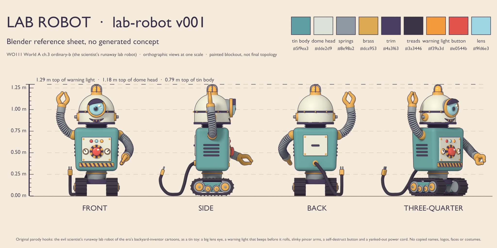<figcaption>Blender reference sheet, no generated concept</figcaption></figure>
<figure>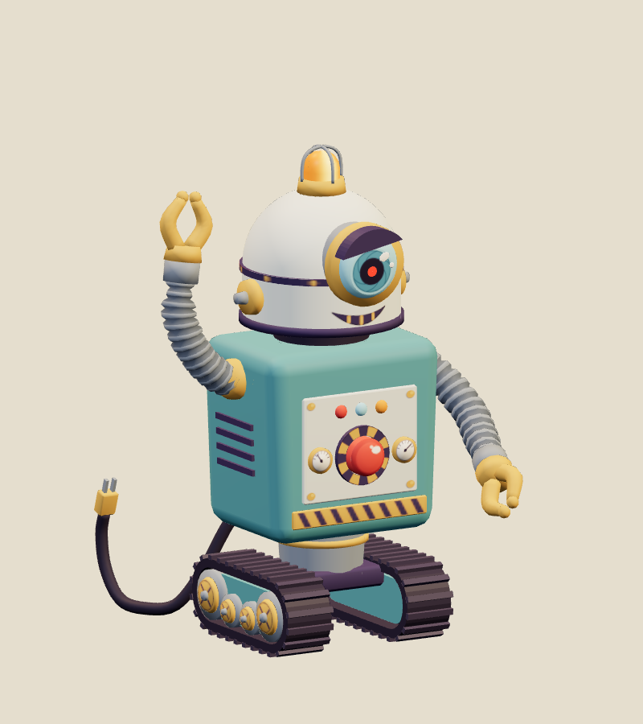<figcaption>Exact v001 model</figcaption></figure>

<model-viewer src="../../media/lab-robot/v001/lab-robot.glb" poster="../../media/lab-robot/v001/beauty.png" alt="Orbit the Lab Robot and inspect its five animations" camera-controls touch-action="pan-y" data-quest-clips shadow-intensity="0.7" camera-orbit="155deg 78deg auto"></model-viewer>

[Download exact GLB](../../media/lab-robot/v001/lab-robot.glb) · [Editable Blender master](../../media/lab-robot/v001/lab-robot.blend) · [Construction master](../../media/lab-robot/v001/lab-robot-construction.blend) · [Reference blockout master](../../media/lab-robot/v001/lab-robot-blockout.blend) · [Artifact manifest](../../media/lab-robot/v001/sha256-manifest.json)

<figure>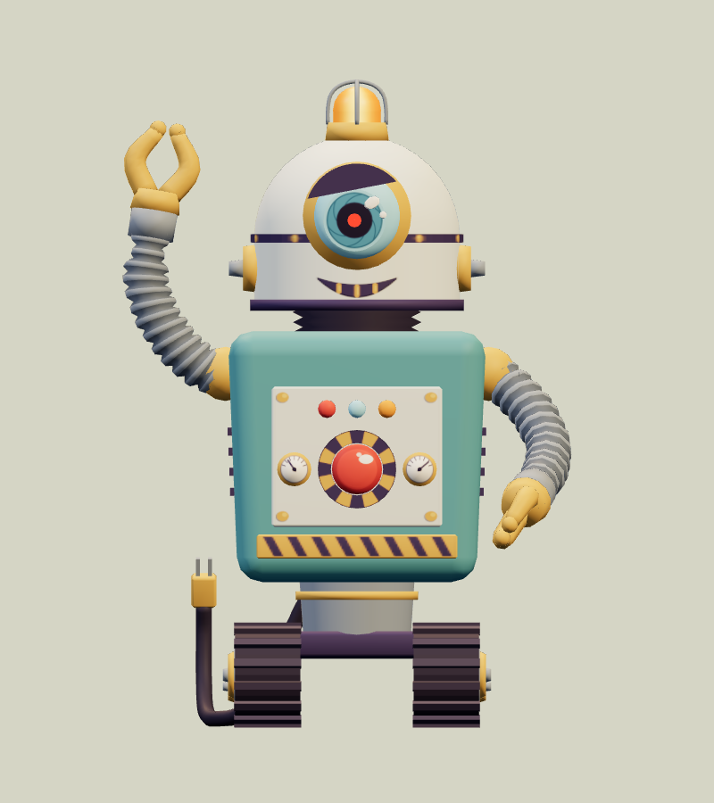<figcaption>Front</figcaption></figure>
<figure>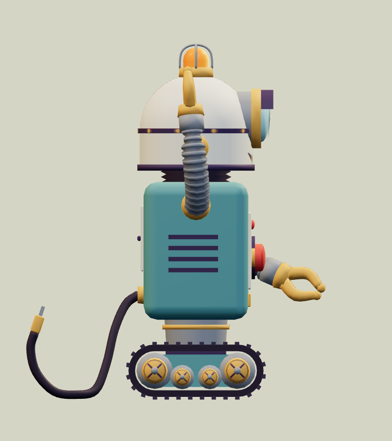<figcaption>Side</figcaption></figure>
<figure>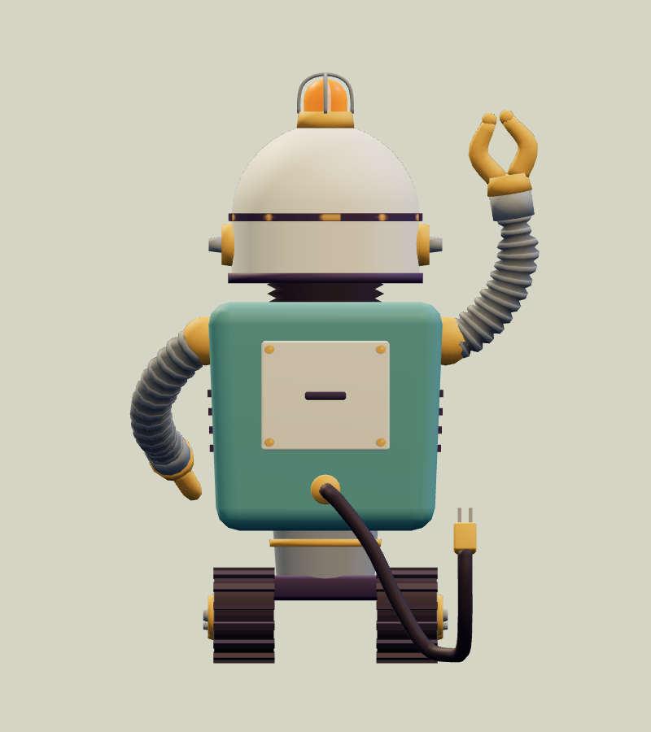<figcaption>Back</figcaption></figure>
<figure>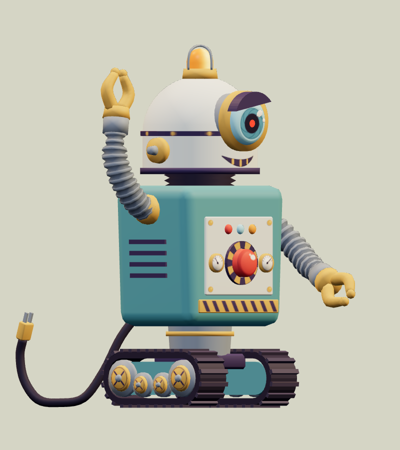<figcaption>Three-quarter</figcaption></figure>

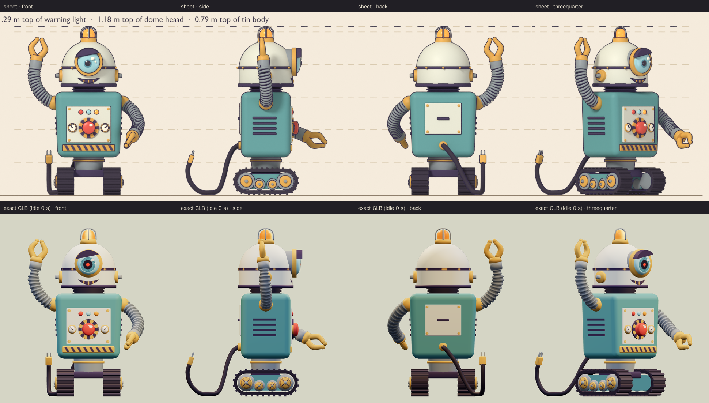

The comparison above shows the sheet and the exact export at matching angles and one metric scale. The export stills use the first frame of `idle`, which recreates the sheet pose: the raised right pincer open in its V, the left pincer reaching forward, the eyelid raised 11° on its left and the lens glancing low toward its right. Both pincer wrists are within a micrometre of the blockout. In that pose the model measures 0.894 m wide, 1.292 m tall and 1.086 m deep; the depth runs from the reaching pincer to the curled plug tail. The blockout stood 1.2925 m tall and the model 1.2919 m. The model follows the coordinator's notes:

- It keeps the big lens eye, the warning light, the slinky pincer arms, the self-destruct button, the yanked-out power cord and the tank treads.
- The rivets, hazard stripes, dials, louvers and grille bars are painted into the atlas; the lens barrel, eyelid, dome, warning light, pincers, button, treads, cord and plug stay as geometry.
- The atlas uses the sheet's colour values. The preview renders them slightly deeper than the sheet because it uses different tone mapping.

For spooky level 1, the robot is eerier than the sheet:

- A red core glows in the pupil, so in a dark room the lens stares back as a red dot.
- Before the attack, a red target glare opens over the iris.
- The defeat throws glowing sparks, pops the dome lid open on its back hinge and puffs smoke.

It has no teeth, blades, lasers, weapons or gore, the pincers keep their ball tips, and nothing on the model carries lettering or a logo.

<figure>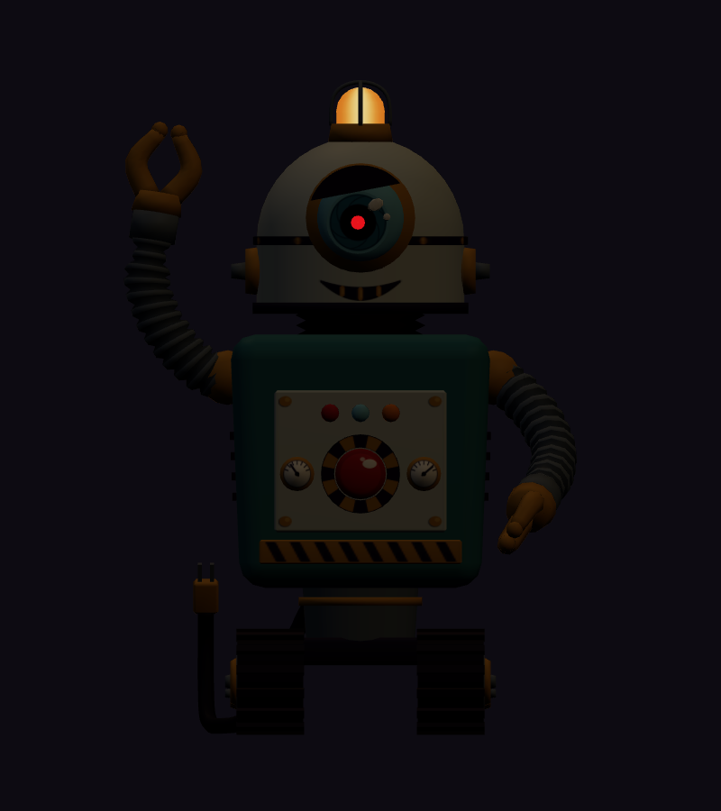<figcaption>Dark room, front</figcaption></figure>
<figure>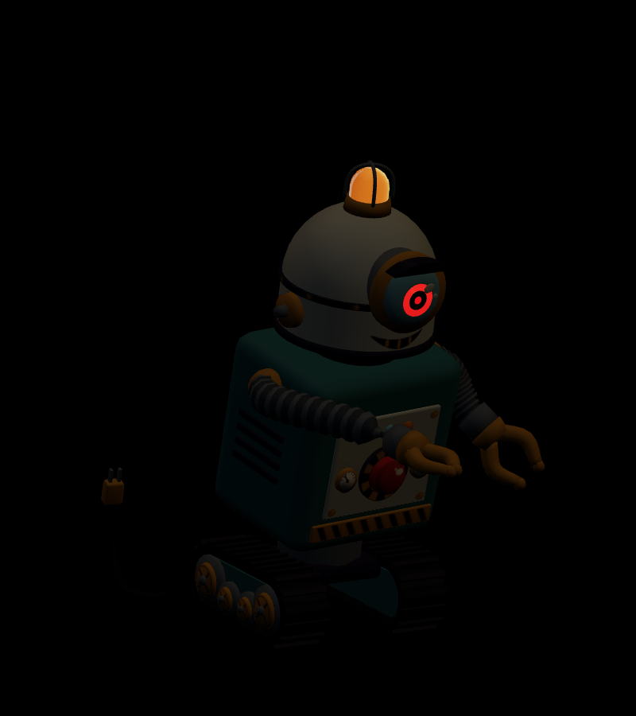<figcaption>Dark room, attack contact</figcaption></figure>
<figure>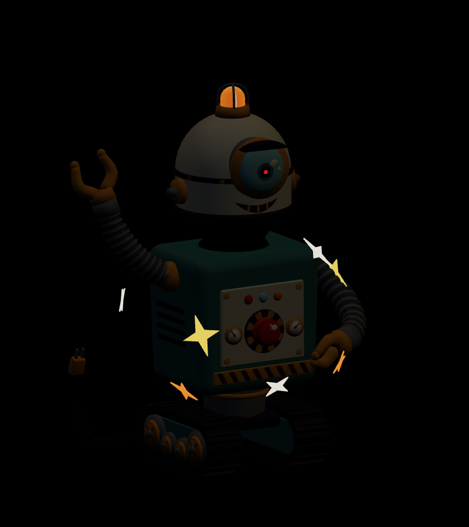<figcaption>Dark room, defeat sparks</figcaption></figure>
<figure>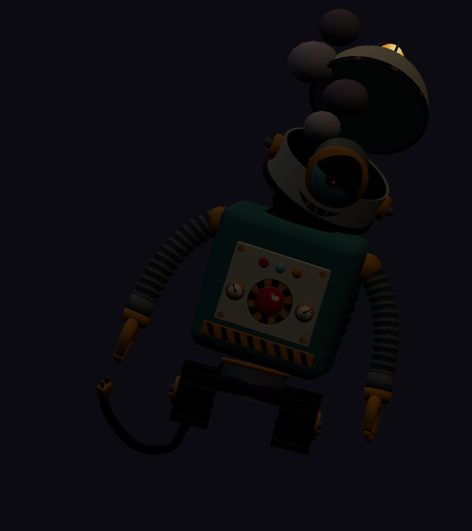<figcaption>Dark room, held defeat</figcaption></figure>

The dark-room renders, and a [three-quarter view](../../media/lab-robot/v001/dark-beauty.png), show what glows: the warning light, the pupil core, the attack's target glare and the defeat sparks. Because the glow is the atlas colour at full strength, those parts also glow in ordinary light, and the warning light and eye cannot dim in `idle`.

The author departed from the sheet and its notes in these deliberate ways:

- **Scare pass.** The sheet notes ruled out smoke, sparks and a scary eye. The coordinator's approval notes asked for them, so the model follows those notes.
- **Warning light spin.** The notes suggested a reflector fin inside the amber glass so a spin would show. The glass is opaque, since the model has only two materials, so the spin shows through a painted hot spot on the glowing amber dome and the turning cage wires. Its flashes are scale pulses.
- **Cord.** The cord binds along its sheet path instead of lying straight back, so the bind pose and the start of `idle` share it. Its curl wags about the floor, and the floor run stays put.
- **Eye.** The iris shell scales for focus and turns for glances. It is shaped for scales down to a small dot, so at full size its rim sits up to about 6 mm proud of the glass. The blink is a camera-shutter half blink: the lid drops to just below the pupil, because a full blink would leave the bezel.
- **Popped lid.** The lens straddles the seam between the head band and the dome, so it stays with the head band when the lid pops. The face stays readable in the held defeat.
- **Bind pose.** Both arms hang in a straight A-shape in the bind pose, and `idle` recreates the sheet pose. [Bind-pose stills](../../media/lab-robot/v001/rest-beauty.png) show the bind pose.

The author also fixed these problems along the way:

- The rivets and kick-plate stripes first came out blank because of a UV mapping bug.
- One lens glint sat hidden behind the iris.
- Emission washed the amber warning light and the red eye toward pale yellow and salmon. The glow colours are now painted darker, so they land near the sheet's amber and a clear red.
- The popped lid's underside rendered dark.
- The slinky chain collapsed through the shoulder mid-swing; arm poses now blend each joint by direction and distance round the shoulder.
- The first lunge ran along the body's front corner and swept the pincer across the lens; it now bows out from the shoulder.
- Tread lugs dipped 0.3 mm below the floor while the chassis rocked, and the cord tail dipped 2.4 cm below the floor in the defeat.
- The attack snap and the defeat hold first fell between 30 fps frames, so the jaws were only half shut at contact and the hold drifted.
- In the slump, the hanging arms passed into the body and the drooping head sank into it.
- The first sparks were too small to see at play distance; they are now 40% larger and spread 12% further.

| Exact exported model | Result |
| --- | --- |
| Size and placement | 1.2919 m tall to the warning-light cage, inside the WO111 ordinary band of 0.8–1.4 m. In the sheet pose at the start of `idle` it is 0.894 m wide, 1.292 m tall and 1.086 m deep; the A-pose bind pose is 1.199 m wide and 0.896 m deep. The tread lugs sit 0.3 mm above the floor. Across all clips the highest point is 1.582 m (the rising defeat smoke), the lunge reaches 0.927 m in front, and the lowest point is 0.015 mm above the floor. Metre scale, Y-up, forward −Z, floor-centered, with the raised pincer on its right (+X) |
| Geometry | 13,420 triangles: 12,904 matte and 516 glowing (the pupil core, the target glare, the warning light and eight defeat sparks); 7,351 Blender vertices, 14,475 after export; one skin with 46 joints and at most two influences per vertex |
| Materials | Two opaque materials: matte painted tin, brass, rubber and glass, and a glow material for the warning light, the red eye and the sparks. The glow material samples the same atlas for its colour and its emission, with an emissive factor of 1 and no extension; one draw primitive each |
| Texture | One original embedded 1024 × 1024 atlas (45,636 bytes), painted procedurally in Blender Python; no external resource or required decoder |
| Download | 1,506,604 bytes; below the 2 MiB candidate budget |
| GLB SHA-256 | `33be060d30dc50830380bab97021635a5e3b7a73f2208bfab1b1562075aeb76c` |
| Blender master SHA-256 | `94751fa7a568b5406dd5af8624b72f2e4d76e3b5931e9c338f3e1fa0c56a0e6a` |
| Reference sheet SHA-256 | `e8bbe412ab2f65ea08c05c5cc75a52db48e4e826f2dd39a2360e291e6a2ff259` |

## Motion and checks

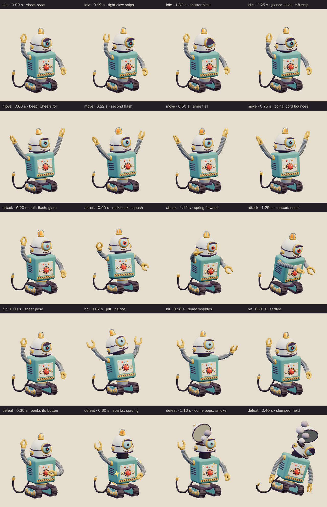

The viewer exposes `idle` (3.0 s), `move` (1.0 s), `attack` (2.0 s), `hit` (0.7 s) and `defeat` (2.4 s):

- **Idle:** from the sheet pose it bobs on its treads, wiggles at the waist and snips each pincer twice. The iris dilates, the eyelid blinks like a camera shutter, it glances aside and the plug tail wags.
- **Move:** the warning light flashes twice and spins while it rolls. The big wheels turn twice and the small ones three times per loop, so the loop is seamless. It leans back like a go-kart, flails and boings both arms, and the cord bounces.
- **Attack:** first the tell (to 0.45 s): the light flashes three times and spins, the eyelid snaps up, the iris narrows and the red target glare opens over it. The light turns three times in all. Then it rocks back on its treads, swivels, squashes the raised right arm short and snips twice (0.45–1.0 s). It rocks forward, the right arm springs forward and the pincer snaps shut by 1.22 s, holding through contact at **1.25 seconds**. There the pincer is 0.88 m in front of it at 0.60 m high, the arm is 0.553 m long (54% past its 0.36 m rest length), and the jaw gap has closed from 38.5 mm to 22.9 mm. Afterwards the arm boings back, the glare fades, it gives a proud head bob and it is back in the sheet pose at 2.0 s.
- **Hit:** it jolts back on its treads, the dome wobbles on the bellows, the iris shrinks to a dot, the eyelid pops open, the light flickers and the arms fling out before it settles.
- **Defeat:** its left pincer bonks the self-destruct button at 0.28 s. Glowing sparks crackle from 0.29 to 1.25 s while the head sproings up on the bellows and the light spins. Smoke puffs rise from 0.86 s, and the dome lid pops open on its back hinge at 0.92 s. It then slumps 14° sideways onto its left tread: the head droops on its spring, the arms hang limp, the eyelid is half shut and the tiny iris circles dizzily. The lid stays 69° open and the smoke keeps rising. The pose is held from 1.9 seconds.

The clips leave the root stationary; gameplay controls travel and damage. The chassis carries the rocking and the slump. In the game, the wind-up plays the attack from its start to the 1.25 second contact at the enemy's wind-up speed, so the tell, the rock back and the spring forward all play then.

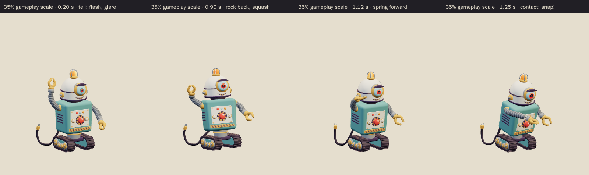

[Khronos validation](../../media/lab-robot/v001/validation.json) reports zero errors, warnings, infos and hints, and all 21 contract checks pass. [Three.js inspection](../../media/lab-robot/v001/three-inspection.json) reimported the exact GLB and exercised the real enemy animation adapter. It sampled all 14,475 exported vertices at 60 Hz across every clip and passed all 34 checks:

- The root stays still, every track resolves below the scene root, and the skin weights are normalized with at most two influences.
- The idle and move loops are seamless, and the defeat pose holds.
- No clip goes below the floor, and the culling envelope stored in the model covers every pose.
- Rotation-only joints keep fixed pivots, and the stretch bones of the arms, neck, waist and cord move only along their parent's axis.
- The robot stands 1.2–1.4 m tall on the floor, and the start of `idle` is the sheet pose.
- The adapter's wind-up contact pose matches the clip's 1.25 second pose, the defeat vanishes, and each clone animates independently.
- The glow material emits from the atlas, and the glare, sparks and smoke stay hidden outside their clips.
- The glare opens and the light spins in the attack, the pincer lunges forward and snaps shut at contact, the iris shrinks in the hit, and the defeat bonks the button, throws sparks, pops the dome and smokes.

The [attachment audit](../../media/lab-robot/v001/attachment-inspection.json) ran on the live Blender scene that exported the GLB and passed all 7 checks. It tested 33 part pairs on every frame of every clip, including the arms and pincers against the body, head, dome, chassis and each other; the cord against the treads, body and arms; and the head and dome against the body. It found no overlaps, the chain joints stayed on their parent's axis, and nothing went below the floor. Intended contacts, such as the arm roots in their sockets and the cord in its grommet, are not tested. [Chromium playback](../../media/lab-robot/v001/browser-inspection.json) rendered changing frames for all five clips at normal and 35% scale, drew the character in two draw calls and rendered the dark-room views, with no console, HTTP or WebGL errors and no external requests. [Author's visual notes](../../media/lab-robot/v001/visual-review.json) and the [scene release](../../media/lab-robot/v001/scene-release.json) record the corrections and the released Blender scene.

The catalog intake checked all 179 manifested artifact hashes; every manifested file is published. It reran the Three.js inspection against the current enemy animation adapter and got byte-identical results. The intake added this page's [source record](../../media/lab-robot/v001/source.json) and the [sheet-stage note](../../media/lab-robot/v001/sheet-stage/README.md), which are not in the author's manifest.

The asset intake found a runtime culling risk for this model: three.js computed each skinned primitive's culling sphere from its first rendered pose, before the runtime used the model's exported animation envelope. The intake measured this model against its first idle pose, sampling every vertex at 60 Hz:

- The glowing part is small at rest (a 0.40 m sphere round the head). The defeat sparks leave it by up to 0.55 m. In the held defeat the warning light, riding the popped lid, stays 0.37 m outside it.
- The matte part (a 0.78 m sphere) leaves its sphere by up to 0.30 m in the defeat, where the smoke puffs and the lid rise, and stays 0.27 m outside in the held pose. The lunging pincer leaves it by 0.17 m at contact and 0.20 m just after.

Near a screen edge, the sparks, the smoking lid or the pincer could previously drop out of view. The runtime now applies the exported envelope to every skinned primitive; the model itself is unchanged.

The browser evidence uses software Chromium. Physical iPad/iPhone Safari, device frame time and combat feel remain owner checks. This package contains visual animations only; the sheet notes' beep-beep warning cue belongs to the audio lane and has not been made.

## Provenance and release

Claude Opus 5.5 (`claude-opus-5-5`, effort `xhigh`) authored both stages through Blender 4.5.13 on the first Blender authoring service, under [WO111](../../../../.agents/work-orders/111-era-cast-art-lead.md) and Tom's September 26 rulings. It built the blockout and rendered the reference sheet from 18:12 to 18:36 UTC. After the coordinator approved the sheet, it built the final topology, the painted atlas and the 46-bone rig from an exclusive scene lease claimed at 22:46 UTC. Before modeling, it checked the approved blockout, sheet and notes against the durable manifest. It released the scene at 23:30 UTC after confirming that none of the 76 earlier family-era files on the service had changed. The second authoring service was not used. Both stages' claim checkpoints are preserved with the package.

No family photograph, personal likeness, downloaded franchise model, character design, logo, lettering, catchphrase or audio was used. The premise of a cartoon evil scientist's runaway lab robot, drawn as a vintage tin toy, comes from the era's backyard-inventor cartoons; the premise is the only borrowing. The domed head with one protruding lens barrel, the tilted eyelid, the grille smile, the caged warning light, the teal-and-tin colouring, the hazard-ring button, the slinky arms with ball-tipped pincers, the plum treads, the plug tail and its acting are original choices. The [sheet-stage records](../../media/lab-robot/v001/sheet-stage/README.md) keep the sheet's own lease, release and manifest. The source scripts live in `scripts/assets/lab-robot/v001/`.

[PRD-004 Q-03](../../../prds/004-family-release.md#owner-decisions) permits this candidate in the family release before Tom's review. For now, the current World A template `family-world-a@v4`, like the frozen v1 to v3, fills two of the four chapter 3 ordinary slots and the optional bonus slot with the Lab Robot as a project candidate with neutral placeholder art. v4 sets Hero City to scare level 1. The coordinator will register this exact version in a later parody catalog before it appears in levels. Tom's exact-version decision is **pending**. A rejection returns those slots to a placeholder or prior version; catalog inclusion and technical checks do not constitute approval.
