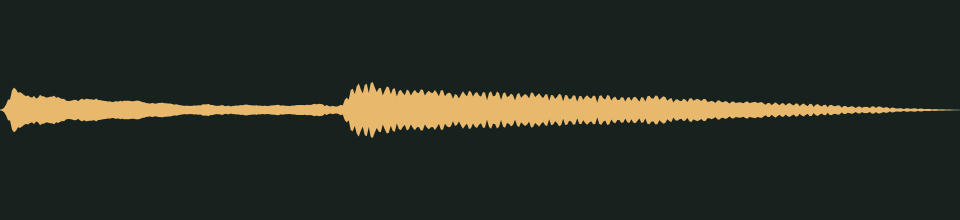

# The lift has arrived · v001

**Audio candidate · family world mechanics · not yet in the game · listening review pending.** A soft two-note toy elevator ding for a lift reaching its stop. The prompt asks for warm, rounded bell tones: a higher note, then a lower one.

## Audition

<audio controls preload="none" aria-label="Audition lift-arrival-chime version one">
  <source src="../../media/lift-arrival-chime/v001/cue.wav" type="audio/wav">
  <a href="../../media/lift-arrival-chime/v001/cue.wav">Download the processed cue</a>
</audio>

[Processed cue](../../media/lift-arrival-chime/v001/cue.wav) · [Original five-second take](../../media/lift-arrival-chime/v001/source.wav)

## Exact version

| Property | Measured result |
| --- | --- |
| Stable cue / version | `lift-arrival-chime` / `v001` |
| Duration | 0.80 seconds |
| Format | PCM signed 16-bit WAV, stereo, 44.1 kHz |
| Download size | 141,164 bytes |
| Peak / RMS | -11.0 / -23.376 dBFS |
| Clipped samples | 0 |
| Processed SHA-256 | `cc3bd16ca66ac18f1d33586de4771a069e611ac28de1e8650d1d21a48d71343e` |
| Source SHA-256 | `8d657a259ddccb7a540bde12b45d8d9040843c452cc26bfe37979d5e7dce7981` |

Processing selects the segment beginning at 0.100 seconds, trims it to the stated duration, applies a 0.010-second entrance and 0.250-second exit fade, then normalizes its peak. It is a one-shot cue, not a loop. The source is preserved separately. [Exact recipe](../../media/lift-arrival-chime/v001/processing.json), [measurements](../../media/lift-arrival-chime/v001/verification.json), and [reproducible processing script](../../../../scripts/assets/audio/process_cues.py).

## Source and checks

Generated on 2026-09-26 by a Claude Code subagent (Opus 5.5) from the workflow coordinator's cue brief, using the separate Stable Audio 3 Small-SFX CPU service (service version 0.2.0). This take used seed 212, eight steps and five seconds. It contains no supplied recording or personal reference. The [provenance record](../../media/lift-arrival-chime/v001/provenance.json) retains the complete prompt, service/model revisions, every other attempt and the source terms recorded in [DESIGN-008](../../../designs/008-audio-pipeline.md). The source code, model and redistributed text component have separate terms; no broader license is asserted here.

The service and download SHA-256 checks passed, as did WAV decoding and the exact-duration, non-silence and zero-clipping checks. Re-running the processing script reproduced the same output. These measurements do not establish timbre or musical quality.

## Listen-proxy check

Nobody has listened to this take; the agent cannot hear audio. Instead, it measured the source's level in 20 ms windows, a rough autocorrelation pitch track, the zero-crossing rate and a four-band energy split, and chose the segment from those numbers. The take holds two bell notes. The first begins at 0.11 seconds with a steady pitch near 790 Hz. The second enters at 0.38 seconds near 610 Hz and keeps ringing, so the 0.25-second exit fade shortens its ring.

Energy split of the processed cue: 3.3% below 300 Hz, 40.6% at 300 Hz–1 kHz, 49.4% at 1–4 kHz and 6.7% above 4 kHz. These numbers hint at shape and brightness; they cannot say how the cue sounds.

## Coordinator and owner review

Review focus: Whether the ding-dong sounds like a gentle arrival rather than a doorbell or an alarm.

- **Coordinator technical intake:** Passed numerically; listening/creative selection pending.
- **Tom’s decision:** Pending, against the exact hash above.
- **Gameplay integration:** None yet. The game’s cue map does not reference this file; wiring it to lifts is a separate step. The inventory records it as a private candidate for the family worlds.

## Retained attempts

The first take held one sustained bell note near 612 Hz and no second note, so technical intake rejected it. A second prompt asked explicitly for a higher note followed by a lower one, a quarter second apart, and produced the candidate above.

- [Source attempt 1](../../media/lift-arrival-chime/v001/source-attempt-1.wav) (seed 202) with its [measurements](../../media/lift-arrival-chime/v001/source-attempt-1-verification.json)

The prompts, seeds and job IDs of every attempt are in the provenance record. These decisions rest on measurements, not on listening.
