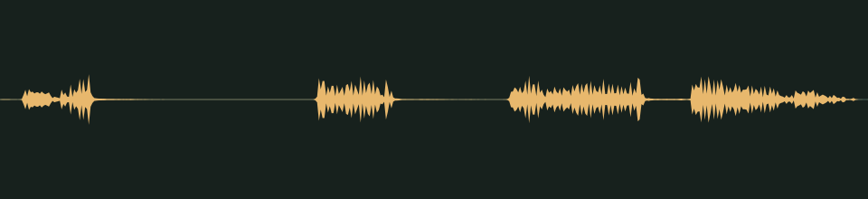

# Lights back on · v001

**Audio candidate · scary moments · not yet in the game · listening review pending.** Fluorescent tubes stuttering back to life after a blackout: two flickers, then a buzzing sizzle.

## Audition

<audio controls preload="none" aria-label="Audition light-buzz version one">
  <source src="../../media/light-buzz/v001/cue.wav" type="audio/wav">
  <a href="../../media/light-buzz/v001/cue.wav">Download the processed cue</a>
</audio>

[Processed cue](../../media/light-buzz/v001/cue.wav) · [Original five-second take](../../media/light-buzz/v001/source.wav)

## Exact version

| Property | Measured result |
| --- | --- |
| Stable cue / version | `light-buzz` / `v001` |
| Duration | 2.00 seconds |
| Format | PCM signed 16-bit WAV, stereo, 44.1 kHz |
| Download size | 352,844 bytes |
| Peak / RMS | -11.0 / -34.202 dBFS |
| Clipped samples | 0 |
| Processed SHA-256 | `2661589019ecf14ccc4a005df7b2225dee7efe4704fce1661383ac6e8d6c3e68` |
| Source SHA-256 | `1f675e50082348fdee02610e4ed077bf1b04eb8669de496d7a95b836c5a6552b` |

Processing selects the segment beginning at 0.980 seconds, trims it to the stated duration, applies a 0.005-second entrance and 0.300-second exit fade, then normalizes its peak. It is a one-shot cue, not a loop. The source is preserved separately. [Exact recipe](../../media/light-buzz/v001/processing.json), [measurements](../../media/light-buzz/v001/verification.json), and [reproducible processing script](../../../../scripts/assets/audio/process_cues.py).

## Source and checks

Generated on 2026-09-26 by a Claude Code subagent (Opus 5.5) from the workflow coordinator's cue brief, using the separate Stable Audio 3 Small-SFX CPU service (service version 0.2.0). This take used seed 313, eight steps and five seconds. It contains no supplied recording or personal reference. The [provenance record](../../media/light-buzz/v001/provenance.json) retains the complete prompt, service/model revisions, every other attempt and the source terms recorded in [DESIGN-008](../../../designs/008-audio-pipeline.md). The source code, model and redistributed text component have separate terms; no broader license is asserted here.

The service and download SHA-256 checks passed, as did WAV decoding and the exact-duration, non-silence and zero-clipping checks. Re-running the processing script reproduced the same output. These measurements do not establish timbre or musical quality.

## Listen-proxy check

Nobody has listened to this take; the agent cannot hear audio. Instead, it measured the source's level in 20 ms windows, a rough autocorrelation pitch track, the zero-crossing rate and a four-band energy split, and chose the segment from those numbers. The segment keeps the take's own arc. A first flicker runs from 0.04 to 0.22 seconds and ends in one sharp click at 0.2 seconds. After silence, a second flicker runs from 0.72 to 0.88 seconds. The buzz starts at 1.16 seconds, stutters once more between 1.48 and 1.56 seconds, and holds into the exit fade. The buzz is a bright sizzle centered near 5.7–6.1 kHz whose level pulses 100 times a second, the pattern of mains hum. The click sets the peak; the buzz itself sits about 20 dB lower.

Energy split of the processed cue: 0.6% below 300 Hz, 1.2% at 300 Hz–1 kHz, 23.2% at 1–4 kHz and 75.1% above 4 kHz. These numbers hint at shape and brightness; they cannot say how the cue sounds.

## Coordinator and owner review

Review focus: Whether it sounds like lights coming back rather than radio static, and whether the buzz is loud enough behind the click.

- **Coordinator technical intake:** Passed numerically; listening/creative selection pending.
- **Tom’s decision:** Pending, against the exact hash above.
- **Gameplay integration:** Registered in the game's scare cue manifest for [DESIGN-027](../../../designs/027-scare-pass.md) blackouts at scare level 2, where it brings the lights back. No game event plays it yet. At gain 1.4 the click peaks near -10.0 dBFS at the default master, with one instance at a time. [DESIGN-008](../../../designs/008-audio-pipeline.md#scary-moments-cues) records the manifest; the inventory records it as a private candidate.

## Retained attempts

Two other takes were not selected. The first has sharp clacks about 20 dB louder than the 100 Hz hum beneath them, so after leveling, the buzz would sit far under a string of isolated clicks. The third is a low drone with about 87% of its energy below 300 Hz, likely to vanish on tablet and phone speakers, and no flicker before it. The second take, above, was the only one with both the flicker and the buzz.

- [Source attempt 1](../../media/light-buzz/v001/source-attempt-1.wav) (seed 303) with its [measurements](../../media/light-buzz/v001/source-attempt-1-verification.json)
- [Source attempt 3](../../media/light-buzz/v001/source-attempt-3.wav) (seed 323) with its [measurements](../../media/light-buzz/v001/source-attempt-3-verification.json)

The prompts, seeds and job IDs of every attempt are in the provenance record. These decisions rest on measurements, not on listening.
