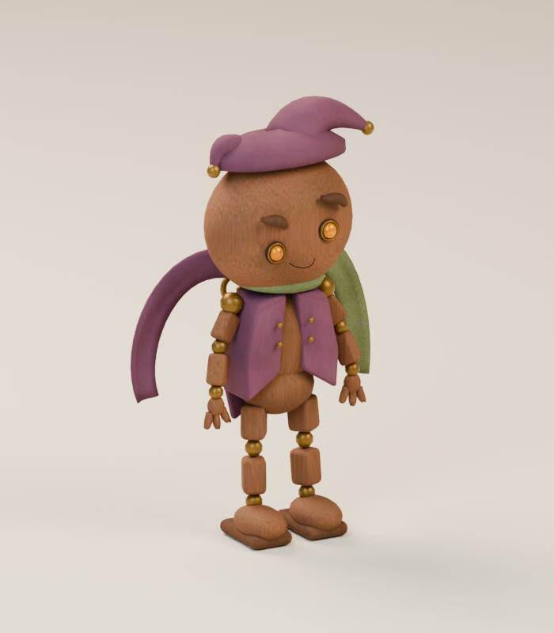
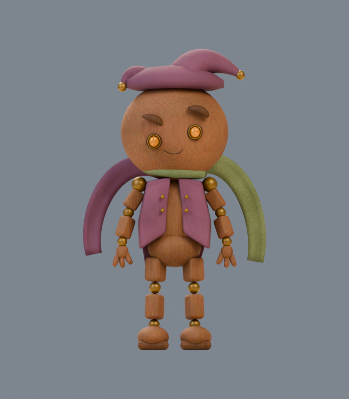
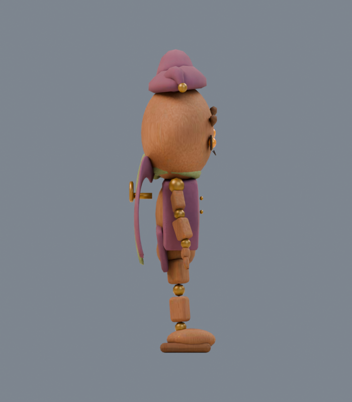
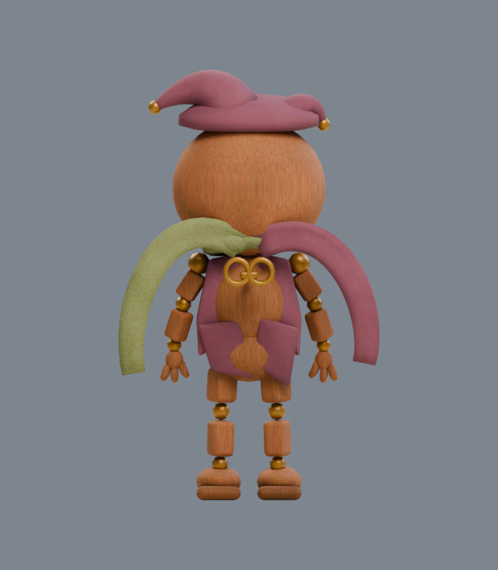

# Loop Dancer

**Friendly character.** A cheerful dancer who offers a little healing between obstacle challenges. Harming this character costs hearts and pauses its help; make amends to restore the friendship. This role is included in the PLAN006 playtest candidate. Final artwork review remains separate.

**loop-dancer · v001 · First-pass candidate · Tom’s review pending**

A winding-key puppet at the Ribbon Fair. Paired scarf tails and a rhythmic wind-up turn the period’s looping-dance influence into an original wooden character.

## Concept and exported model

<figure><figcaption>Selected construction reference.</figcaption></figure>
<figure><figcaption>Exact v001 GLB, re-imported for this render.</figcaption></figure>

The two arms, two legs, plum cap and vest, scarf anchors and back winding key follow the selected reference. The cap-to-brim gap was closed before final export. Cloth folds, carved details and joint hardware are simplified; the puppet remains visibly articulated.

<model-viewer src="../../media/loop-dancer/v001/loop-dancer.glb" poster="../../media/loop-dancer/v001/front.png" alt="Orbit the Loop Dancer candidate" camera-controls touch-action="pan-y" data-quest-clips shadow-intensity="0.7" camera-orbit="155deg 75deg auto"></model-viewer>

[Download model](../../media/loop-dancer/v001/loop-dancer.glb) · [Exact manifest](../../media/loop-dancer/v001/manifest.json) · [Concept prompt](../../media/loop-dancer/v001/prompt.txt)

<figure><figcaption>Front</figcaption></figure>
<figure><figcaption>Side</figcaption></figure>
<figure><figcaption>Back</figcaption></figure>

## Motion

<video controls playsinline preload="metadata" poster="../../media/loop-dancer/v001/motion-grid.png" aria-label="Loop Dancer animation reel"><source src="../../media/loop-dancer/v001/animations.mp4" type="video/mp4"><a href="../../media/loop-dancer/v001/animations.mp4">Download motion reel</a></video>

Choose **idle**, **move**, **attack**, **hit** or **defeat** beneath the viewer. Idle and movement repeat; other actions play once. The root stays fixed for the game controller. The contact pose occurs at 0.75 s of a 1.50 s attack. Defeat settles over two seconds, then the game holds the last pose before removal.

## Exact candidate

| Check | Result |
| --- | --- |
| Scale | 1.10 m; feet at ground level; meters, Y-up, forward −Z |
| Geometry | 14,848 triangles; six materials and six primitives |
| Texture | One embedded 1024-pixel original pigment atlas; no external resources or decoder |
| Download | 1,096,328 bytes |
| SHA-256 | `99e2ddac66bc2f63fa00e44b1b9b7513c083023d9926343bc67ce52ecfbf9e79` |

[Format validation](../../media/loop-dancer/v001/validation.json) · [Re-imported bounds and motion](../../media/loop-dancer/v001/export-inspection.json) · [Three.js deformation checks](../../media/loop-dancer/v001/three-inspection.json)

Software browser checks and physical iPhone/iPad performance are separate evidence. This exact model is used as a friendly character in the PLAN006 candidate; final artwork approval remains open.

## Source and review

A fresh native **GPT-6 Astra, max** author built this original model in Blender 4.5.13 LTS. The lead generated its fictional concept serially with the built-in image tool. No family references, downloaded textures or third-party meshes were used. Editable masters, construction source and pigment data remain on the dedicated authoring PVC, with exact paths and checksums in the manifest. [Work order and production evidence](../../../../.agents/work-orders/016-blender-era-2024-evidence.md).

Lead inspection selected the final model views for first-pass packaging after the corrections described above. The lead also inspected the five-clip motion sheet. Game-scale captures and the complete catalog delivery audit remain separately recorded checks.

**Tom’s decision:** Pending. Exact final-art approval remains open; the isolated playtest uses this candidate.
