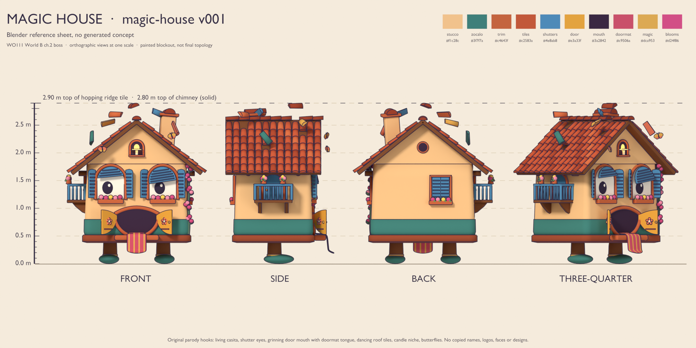
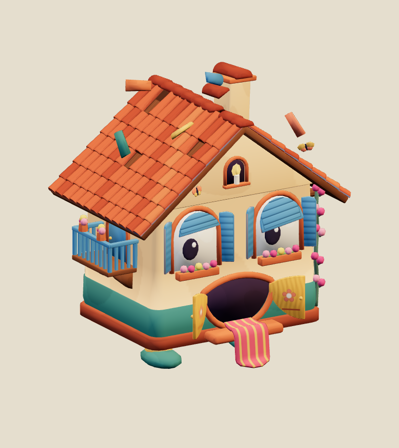
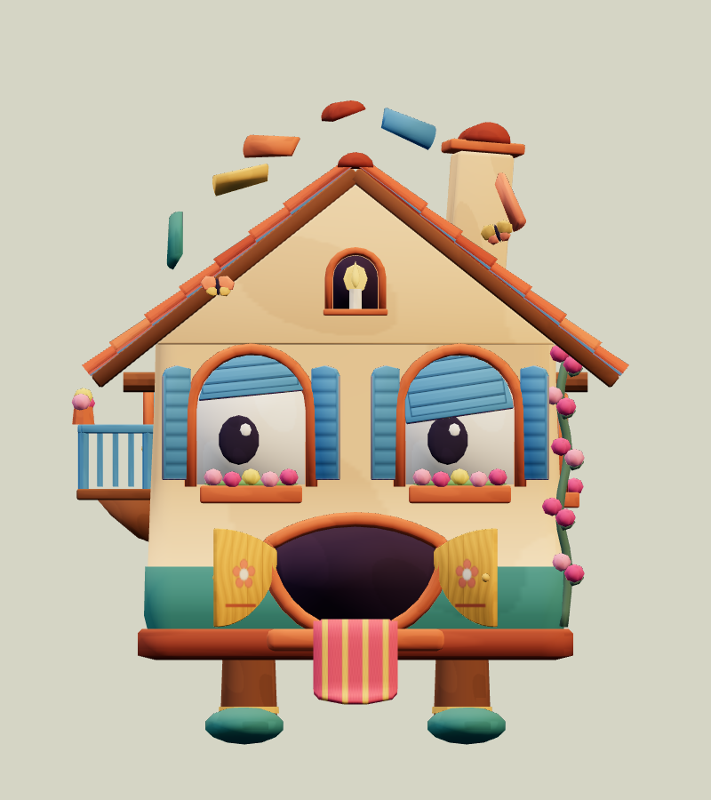
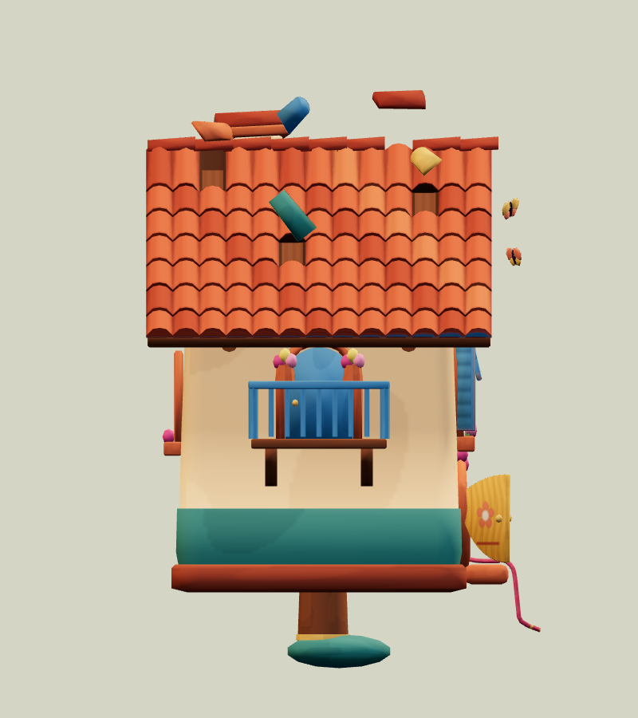
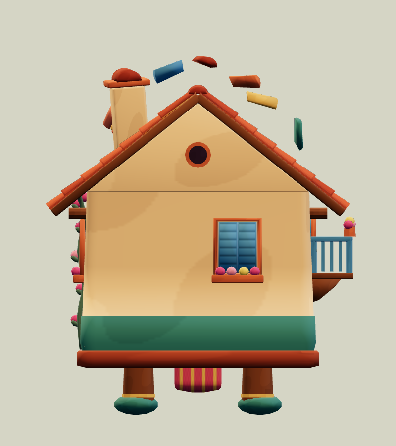
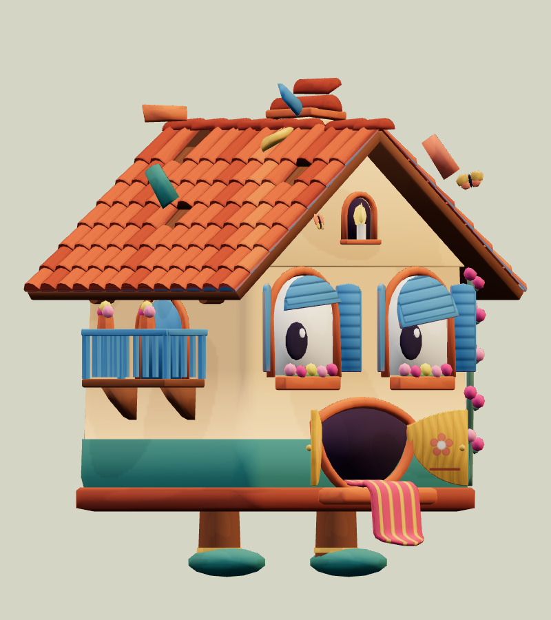
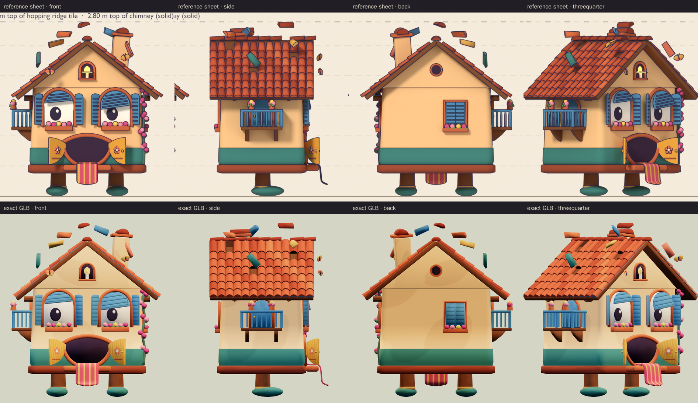
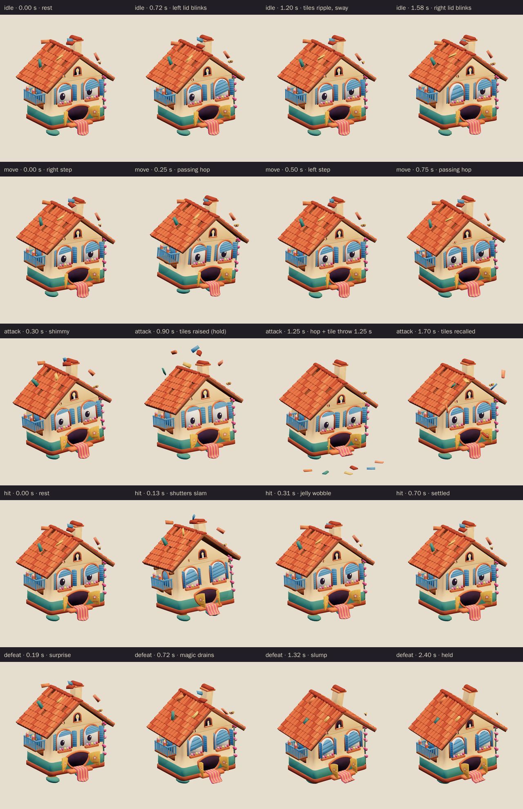
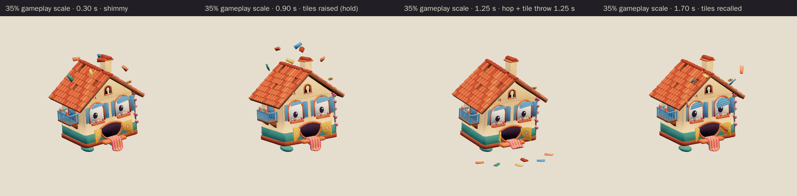

# Magic House · v001

**Awaiting Tom's review · used in the family release.** This cheeky living cottage is the World B chapter 2 boss candidate from [the locked era roster](../../../designs/026-personal-era-casts.md). Its arched windows are eyes with blue shutter lids, its double doorway is a grin with a striped doormat for a tongue, and it waddles about on two stubby timber-stump legs in teal clogs. Its roof tiles won't stay put: five barrel tiles and the ridge cap hover and twist above their empty slots. The World B chapter spec calls it The Dancing House.

**Source: Blender reference sheet, no generated concept.** No image-generation model was used for this asset. Following [PRD-004 Q-07](../../../prds/004-family-release.md#owner-decisions), the author first rendered a painted Blender reference sheet from the written brief, and the coordinator approved it on September 26 before any detailing.

[Reference sheet notes](../../media/magic-house/v001/reference-notes.md) · [Reference source record](../../media/magic-house/v001/source.json) · [Model provenance](../../media/magic-house/v001/provenance.json)

<figure><figcaption>Blender reference sheet, no generated concept</figcaption></figure>
<figure><figcaption>Exact v001 model</figcaption></figure>

<model-viewer src="../../media/magic-house/v001/magic-house.glb" poster="../../media/magic-house/v001/beauty.png" alt="Orbit the Magic House and inspect its five animations" camera-controls touch-action="pan-y" data-quest-clips shadow-intensity="0.7" camera-orbit="150deg 72deg auto"></model-viewer>

[Download exact GLB](../../media/magic-house/v001/magic-house.glb) · [Editable Blender master](../../media/magic-house/v001/magic-house.blend) · [Reference blockout master](../../media/magic-house/v001/magic-house-blockout.blend) · [Artifact manifest](../../media/magic-house/v001/sha256-manifest.json)

<figure><figcaption>Front</figcaption></figure>
<figure><figcaption>Side</figcaption></figure>
<figure><figcaption>Back</figcaption></figure>
<figure><figcaption>Three-quarter</figcaption></figure>

The comparison above shows the sheet and the exact export at matching angles and one metric scale. The model follows the coordinator's sheet notes:

- It keeps the shutter eyes, the door mouth with its doormat tongue, the hopping ridge tiles and the stump legs.
- The attack is a shimmy and hop that throws the tiles, and the defeat is a sheepish slump with the shutters closing.
- The sly, cheeky face is unchanged: the house's left lid is lowered with its inner edge down, its right lid is raised, and both pupils glance to its right.
- The candle niche, the two butterflies, the balcony and the bougainvillea stay as on the sheet.

The author departed from the sheet notes in three deliberate ways:

- The notes suggested a tongue sweep as the attack. The coordinator's tile throw replaced it, and the tongue now slaps forward as a secondary beat at contact.
- There is no jaw bone. The honey doors act as lips: they slam on a hit and pout in defeat. A moving lower lip would have passed through the floor slab.
- Both butterflies are kept, since the model is well inside the triangle budget.

The author also fixed these problems along the way:

- The blockout had 44,958 triangles; the model has 12,122. The tile rows, louvres, door flowers and doormat stripes are now painted into the atlas.
- The sky tile touched the chimney hat in the blockout. It now hovers 0.22 m clear; its empty slot is unchanged.
- The doormat's curl radius grew by 1 cm so it no longer touches the step.
- The blockout's candle flame was a flat 0.25 m disc because two lathe values were swapped. It is now the intended 0.125 m teardrop, and the glow was turned down so it no longer washes out to white.
- The first thrown tiles flew in straight lines and clipped the roof. They now arc over the eaves and come back on staggered paths.
- Closed lids keep their slant, and the roof tips forward in defeat without the gable showing through it.

The preview renders colours lighter and less saturated than the sheet because of its tone mapping, and the sheet also has ink outlines. The atlas uses the sheet's colour values exactly. The house has no teeth, claws or weapons, and the thrown tiles are skinned parts that always fly back to the roof.

| Exact exported model | Result |
| --- | --- |
| Size and placement | 2.51 m wide × 2.898 m tall to the hopping ridge tile (2.80 m to the solid chimney hat) × 1.98 m deep at rest, including the balcony and the doormat tongue; the clogs sit on the floor. During the attack the thrown tiles land up to 2.10 m in front and peak at 3.80 m. Metre scale, Y-up, forward −Z, floor-centered; the balcony side is +X |
| Geometry | 12,122 triangles; one skin with 32 joints and at most two influences per vertex; two opaque material primitives, one of them a candle glow that reuses the atlas |
| Texture | One original embedded 1024 × 1024 palette atlas; no external resource or required decoder |
| Download | 1,149,808 bytes; below the 2 MiB candidate budget |
| GLB SHA-256 | `13c83db22907a6e3996c26abf46f92dab9038392e69e2ec854299614b287c2dc` |
| Blender master SHA-256 | `243b36560389175f6d865d957e455d2a666bfb22f612c5b87327e2622f4e38d3` |
| Reference sheet SHA-256 | `378f1f5706b19f303e545854fc50df5d4e254930cf77c46d53a4dd08f41d3c20` |

## Motion and checks

The viewer exposes `idle` (2.4 s), `move` (1.0 s), `attack` (2.0 s), `hit` (0.7 s) and `defeat` (2.4 s):

- **Idle:** the hovering tiles bob in a ripple, the lids blink one after the other, the house sways on its stumps, the candle flickers and the butterflies flap.
- **Move:** a waddle-hop. Each clog lifts 10 cm in turn while the house bobs and rolls, the doors flap, the tongue swings and the tiles bounce.
- **Attack:** a shimmy, then the house crouches and leans back as all six tiles rise and spin, with its lids, doors and shutters flung wide. It holds that warning from 0.60 to 1.05 seconds, then hops. At **1.25 seconds** it lands, the tiles arc over the eaves to land flat in a fan 1.05–1.90 m in front, and the doormat tongue slaps forward. The tiles hop, slide and fly back to their slots by 1.90 seconds.
- **Hit:** the lids and shutters slam shut and spring open, the doors slam, the roof pops up 6 cm like a pot lid and the house wobbles like jelly.
- **Defeat:** a surprised pop, then the magic drains away. The tiles drop into their empty slots, the candle shrinks to an ember, the lids close into a sheepish squint and the shutters swing half shut. The doors pout, the house slumps on splayed stumps, and the roof tips forward like a floppy hat with the tongue flopped out. The pose is held from 1.80 seconds.

The clips leave the root stationary; gameplay controls travel and damage.

[Khronos validation](../../media/magic-house/v001/validation.json) reports zero errors, warnings, infos and hints. [Three.js inspection](../../media/magic-house/v001/three-inspection.json) reimported the exact GLB and exercised the real enemy animation adapter. It sampled all 12,233 exported vertices at 517 animation steps and passed all 35 checks:

- The root stays still, and rotation-only joints keep their pivots.
- The idle and move loops are seamless, and the defeat pose holds.
- No clip goes below the floor.
- The tiles rise and hold during the warning, the house is off the floor just before contact and lands at contact, the tiles are on the floor in front at 1.25 seconds, and they are back in place by 2.0 seconds.
- The shutters slam and the roof pops on hit. In the held defeat the tiles have dropped, the lids are closed, the candle is an ember and the house has slumped.

The [attachment audit](../../media/magic-house/v001/attachment-inspection.json) checked 32 part pairs on every frame of every clip, including each tile against the roof and every other tile, the tongue against the step and legs, and the lids against the shutters. It found no overlaps. The tiles resting back in their slots in the held defeat are an intended contact, reported but not counted, and the gable rises at most 2.4 cm into the 7 cm roof deck in any clip. [Chromium playback](../../media/magic-house/v001/browser-inspection.json) rendered changing frames for all five clips at normal and 35% scale with no page, console, HTTP or WebGL errors. [Author's visual notes](../../media/magic-house/v001/visual-review.json) and the [scene release](../../media/magic-house/v001/scene-release.json) record the corrections and the released Blender scene.

The catalog intake checked all 129 local artifact hashes against the manifest. It reran the Three.js inspection against the current enemy animation adapter and got byte-identical results.

In the game, the windup scrubs the attack clip up to the 1.25-second contact, so the shimmy, raise, hold and throw play at the windup's speed. Any damage area in front of the house is a gameplay decision for the integration. The browser evidence uses software Chromium. Physical iPad/iPhone Safari, device frame time and combat feel remain owner checks. This package contains visual animations only; it has no new audio file.

## Provenance and release

Claude Opus 5.5 (`claude-opus-5-5`, effort `xhigh`) authored both stages through Blender 4.5.13 under [WO111](../../../../.agents/work-orders/111-era-cast-art-lead.md), under Tom's September 26 ruling. It built the procedural blockout and rendered the reference sheet on the first Blender authoring service. After the coordinator approved the sheet, it built the final topology, atlas, 32-bone rig and all five clips on the second service, holding an exclusive scene lease from 15:05 to 15:51 UTC. No family photograph, personal likeness, downloaded franchise model, architecture, logo or audio was used. The [sheet-stage records](../../media/magic-house/v001/sheet-stage/README.md) keep the sheet's own lease, release and manifest. The source scripts live in `scripts/assets/magic-house/v001/`.

[PRD-004 Q-03](../../../prds/004-family-release.md#owner-decisions) permits this candidate in the family release before Tom's review. For now, the current World B template `family-world-b@v2`, like the frozen v1, fills the chapter 2 boss slot with The Dancing House as a project candidate with neutral placeholder art. The coordinator will register this exact version in a later parody catalog before it appears in levels. Tom's exact-version decision is **pending**. A rejection returns that slot to a placeholder or prior version; catalog inclusion and technical checks do not constitute approval.
