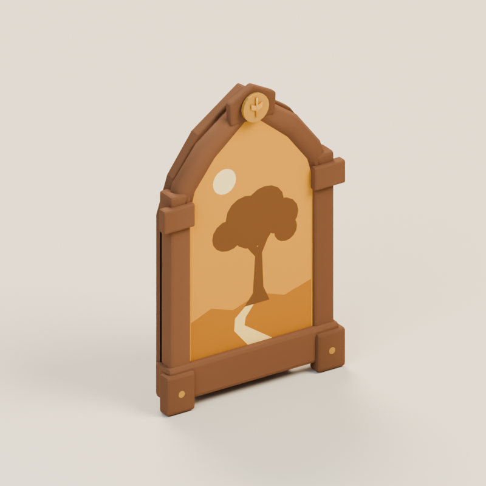
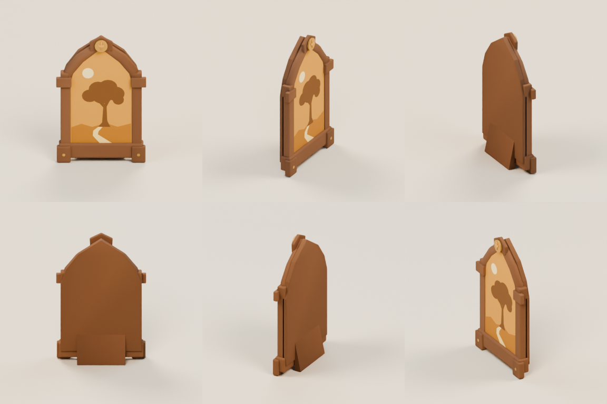
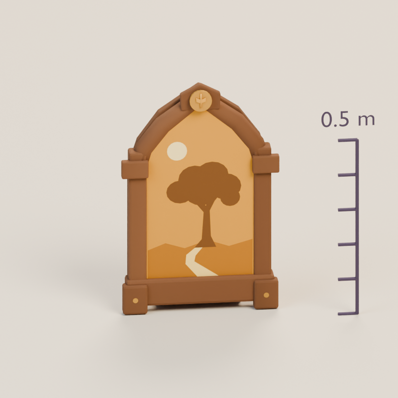

# A memory worth keeping

**memory-keepsake · v001 · Ready for Tom · Not approved for gameplay**

A walnut arch, a honey token and a small picture make each recovered memory feel like something kept with care.

## From illustration to model

<figure><figcaption>Selected source concept.</figcaption></figure>
<figure><figcaption>Exact exported GLB, re-imported for this view.</figcaption></figure>

The 0.65 m frame carries a clear fictional tree picture above its lower rail. The arch, side braces and rear wedge preserve the construction concept. The model simplifies carved wood grain and tiny fasteners into broad matte forms.

<model-viewer src="../../media/memory-keepsake/v001/memory-keepsake.glb" poster="../../media/memory-keepsake/v001/front.png" alt="Orbit the memory-keepsake candidate" camera-controls touch-action="pan-y" shadow-intensity="0.7" camera-orbit="155deg 70deg auto"></model-viewer>

[Download the GLB](../../media/memory-keepsake/v001/memory-keepsake.glb) · [Still fallback](../../media/memory-keepsake/v001/front.png)

[Front](../../media/memory-keepsake/v001/front.png) · [Side](../../media/memory-keepsake/v001/side.png) · [Back](../../media/memory-keepsake/v001/back.png) · [Top](../../media/memory-keepsake/v001/top.png)

## Construction and use

The flat, UV-mapped mesh and material named `PhotoSurface` can receive a replacement image without changing the frame. The current tree, moon and path are fictional vertex-colored artwork; a replacement photo material must ignore those candidate vertex colors. The author corrected inset-edge gaps and the horizontal UV orientation; a Three.js replacement-material assignment check passed. The front faces −Z. This capability is not connected to real photos or gameplay in this candidate.

## Technical record

| Check | Exact candidate |
| --- | --- |
| Geometry | 1,741 triangles; 3 materials |
| Size, width × height × depth | 0.420 × 0.650 × 0.100 m |
| Runtime bytes | 116,304 |
| Runtime SHA-256 | `059d92ca7bad6d1397e5fab9677a0ef0730fb45d54a4770b22675988a55fa137` |
| Coordinates | Y-up, meters, forward −Z; ground at Y=0 |
| Animation | Static prop; no clips or rig |

Khronos glTF Validator reports zero errors and warnings. The keepsake’s reserved UV channel produces one expected informational notice; the other props do not require that channel. Actual GLB re-import and Three.js loading/bounds checks passed. There are no external texture resources or required compression decoders. Chromium 153 loaded and visibly rendered the exact model in a 358 × 358 phone frame; its download matched the manifest hash. Physical iPhone/iPad Safari performance remains untested.

[Format validation](../../media/memory-keepsake/v001/validation.json) · [Re-import inspection](../../media/memory-keepsake/v001/reimport.json) · [Three.js checks](../../media/memory-keepsake/v001/three-inspection.json) · [Construction record](../../media/memory-keepsake/v001/construction.json)

## Source and coordinator intake

Original fictional construction by a fresh **GPT-6 Astra, max** author in **Blender 4.5.13 LTS**, through the dedicated service on September 11, 2026. The driving Astra lead generated and selected the source concepts serially. No private photograph, real-person likeness, third-party mesh or downloaded texture was used. A generator seed/model ID was not returned and is not claimed.

[Full-size concept](../../media/memory-keepsake/v001/concept.png) · [Retained prompt](../../media/memory-keepsake/v001/prompt.txt) · [Concept provenance](../../media/memory-keepsake/v001/concept-provenance.json) · [Exact asset manifest](../../media/memory-keepsake/v001/manifest.json) · [Authoring work order](../../../../.agents/work-orders/010-blender-clearing-kit.md)

Editable master: `haynes-quest/clearing-kit/v001/memory-keepsake/memory-keepsake.blend`, 209,594 bytes, SHA-256 `a9fbeead38391f6a0c39a0c7b7c6a5031ffccf9fc9bac965031d49b9ed39cf37`. Retrieve it from dev-env through the Blender service’s `/artifacts/haynes-quest/clearing-kit/v001/memory-keepsake/memory-keepsake.blend` route and verify the checksum. Masters remain on the dedicated authoring PVC.

The lead compared the selected concept with the exact exported beauty and six-angle sheet. The arch, token, braces and stable rear foot read clearly. The inset is much simpler than the illustration, and the plain rear board is visible when orbiting; these are retained first-pass limits.

[Complete browser audit](../../media/storybook-reference/v001/browser-intake/catalog-local-report.json) · [Independent master retrieval check](../../media/storybook-reference/v001/browser-intake/prop-master-check.json) · [Actual browser view](../../media/storybook-reference/v001/browser-intake/memory-keepsake-model-1-phone.png)

## Tom’s review

Review the frame silhouette, useful picture area and the balance between the honey token and the simple walnut finish.

- **Decision:** Pending.
- **Approved version/checksums:** None.
- **Integration:** Studio only. Gameplay uses temporary shapes. Changed geometry or materials require a new candidate version before approval or use.
